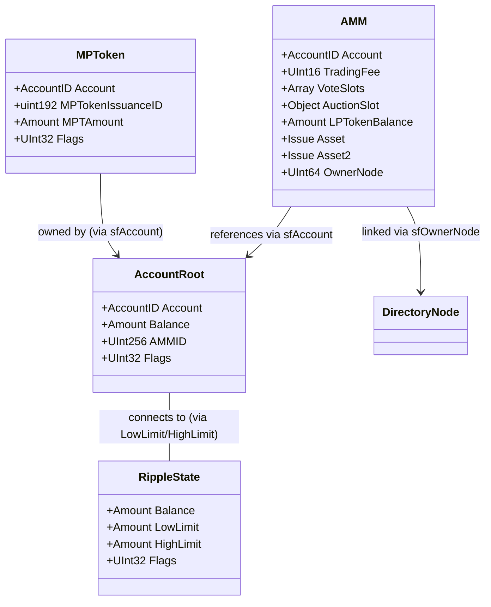

# Index

- [1. Introduction](#1-introduction)
    - [1.1. Liquidity Pool Mechanics](#11-liquidity-pool-mechanics)
        - [1.1.1. Weighted Geometric Mean](#111-weighted-geometric-mean)
        - [1.1.2. Slippage](#112-slippage)
        - [1.1.3. LP Tokens](#113-lp-tokens)
    - [1.2. Trading Fee](#12-trading-fee)
        - [1.2.1. Auction Slot](#121-auction-slot)
        - [1.2.2. Fee Voting](#122-fee-voting)
- [2. Ledger Entries](#2-ledger-entries)
    - [2.1. AMM Ledger Entry](#21-amm-ledger-entry)
        - [2.1.1. Object Identifier](#211-object-identifier)
        - [2.1.2. Fields](#212-fields)
            - [2.1.2.1. VoteSlots](#2121-voteslots)
            - [2.1.2.2. AuctionSlot](#2122-auctionslot)
        - [2.1.3. Pseudo-accounts](#213-pseudo-accounts)
            - [2.1.3.1. Account ID Generation](#2131-account-id-generation)
            - [2.1.3.3. Trust Line Flags](#2133-trust-line-flags)
        - [2.1.4. Reserves](#214-reserves)
    - [2.2. RippleState Ledger Entry](#22-ripplestate-ledger-entry)
    - [2.3. AccountRoot Ledger Entry](#23-accountroot-ledger-entry)
- [3. Transactions](#3-transactions)
    - [3.1. AMMCreate Transaction](#31-ammcreate-transaction)
        - [3.1.1. Failure Conditions](#311-failure-conditions)
        - [3.1.2. State Changes](#312-state-changes)
    - [3.2. AMMDeposit Transaction](#32-ammdeposit-transaction)
        - [3.2.1. Deposit Modes](#321-deposit-modes)
        - [3.2.2. Failure Conditions](#322-failure-conditions)
        - [3.2.3. State Changes](#323-state-changes)
    - [3.3. AMMWithdraw Transaction](#33-ammwithdraw-transaction)
        - [3.3.1. Withdrawal Modes](#331-withdrawal-modes)
        - [3.3.2. Failure Conditions](#332-failure-conditions)
        - [3.3.3. State Changes](#333-state-changes)
    - [3.4. AMMVote Transaction](#34-ammvote-transaction)
        - [3.4.1. Failure Conditions](#341-failure-conditions)
        - [3.4.2. State Changes](#342-state-changes)
    - [3.5. AMMBid Transaction](#35-ammbid-transaction)
        - [3.5.1. Failure Conditions](#351-failure-conditions)
        - [3.5.2. State Changes](#352-state-changes)
    - [3.6. AMMDelete Transaction](#36-ammdelete-transaction)
        - [3.6.1. Failure Conditions](#361-failure-conditions)
        - [3.6.2. State Changes](#362-state-changes)
    - [3.7. AMMClawback Transaction](#37-ammclawback-transaction)
        - [3.7.1. Failure Conditions](#371-failure-conditions)
        - [3.7.2. State Changes](#372-state-changes)

# 1. Introduction

The XRP Ledger decentralized exchange provides asset exchange liquidity through two mechanisms: [limit order books](../glossary.md#clob) and automated market makers (AMM). AMMs are liquidity pools that use algorithmic pricing to enable asset swaps without relying on discrete offers.

XRPL implements AMMs with the following characteristics:

- **Geometric mean market maker (GM3)**: Pools use a weighted geometric mean conservation function to algorithmically determine exchange rates based on pool balances and fees
- **Continuous auction mechanism**: AMM instances auction a 24-hour slot with discounted trading fees
- **Votable trading fee**: LP token holders vote on the trading fee charged by the AMM instance, weighted by their LP token balance
- **LOB integration**: The [Flow payment engine](../flow/README.md) processes AMM liquidity and order book offers together, consuming liquidity from both sources in quality order

An AMM instance is represented on-ledger by:
- An `AMM` ledger entry storing pool parameters, trading fee, vote slots, and auction slot state
- An `AccountRoot` ledger entry (pseudo-account) holding the pool's XRP balance
- `RippleState` trust lines for IOU balances and LP tokens
- `MPToken` ledger entries for MPT balances (when applicable)

The AMM manages a liquidity pool containing two assets (any combination of [XRP](../glossary.md#xrp), [IOUs](../glossary.md#iou), or [MPTs](../mpts/README.md)) and issues LP tokens representing proportional ownership of the pool.

AMMs integrate with the [BookStep](../flow/steps.md#5-bookstep) of the Flow engine. During payment execution or offer crossing, BookStep generates synthetic offers from the AMM based on the current pool state and compares their quality against order book offers. The callback in `revImp` or `fwdImp` consumes whichever source provides better quality, updating either the AMM pool balances (via `ammAccountHold`) or order book entries accordingly.

## 1.1. Liquidity Pool Mechanics

### 1.1.1. Weighted Geometric Mean

The AMM uses a conservation function based on weighted geometric mean:

```
C = Γ_A^W_A * Γ_B^W_B
```

Where:
- `Γ_A` = current balance of asset A in the AMM instance pool
- `Γ_B` = current balance of asset B in the AMM instance pool
- `W_A` = weight of asset A
- `W_B` = weight of asset B
- `C` = conservation function value

For XRPL AMMs, `W_A = W_B = 0.5` (equal weights).

The conservation function C remains constant during swaps (payments). Deposits and withdrawals change C as they add or remove liquidity from the pool.

When a trader swaps assets, they add one asset to the pool and remove the other, maintaining C (before accounting for trading fees).

For example, if a trader wants to buy asset A from the pool:
- They deposit asset B into the pool (increasing `Γ_B`)
- They receive asset A from the pool (decreasing `Γ_A`)
- The conservation function C remains constant (approximately, accounting for fees)
- Because `Γ_A` decreases while `Γ_B` increases, the ratio `Γ_B / Γ_A` increases
- This means the next trader will get fewer A assets per B asset (the price of A has increased)

### 1.1.2. Slippage

When swapping assets, the actual exchange rate differs from the spot price due to slippage. Note that "slippage" in XRPL terminology differs from the standard financial definition. Standard slippage refers to the difference between expected and execution price due to market movement or insufficient liquidity - an unintended outcome. In XRPL AMMs, slippage is the intentional and deterministic price degradation that results from the conservation function as larger trades shift the pool's asset ratio.

The **spot price** is the weighted ratio of pool balances representing the exchange rate for an infinitesimally small trade:

```
SpotPrice(A) = (Γ_B / W_B) / (Γ_A / W_A) * 1/(1-TFee)
```

For equal weights (W_A = W_B = 0.5), this simplifies to:

```
SpotPrice(A) = Γ_B / Γ_A * 1/(1-TFee)
```

The **actual exchange rate** of a trade is the ratio of assets actually exchanged:

```
ActualExchangeRate(A) = Δ_B / Δ_A
```

Where Δ_B is the amount of asset B swapped in and Δ_A is the amount of asset A received.

**Slippage** is the percentage change in the actual exchange rate relative to the pre-swap spot price. Larger swaps move the pool balances more significantly, resulting in progressively worse exchange rates.

See [Swap Formulas (helpers.md)](helpers.md#31-swap-formulas) for the detailed formulas that calculate swap amounts, and [Slippage and Quality Degradation (helpers.md)](helpers.md#313-slippage-and-quality-degradation) for more on slippage behavior.

### 1.1.3. LP Tokens

**Terminology:**

- **Liquidity Provider (LP)**: An account that has deposited assets into an AMM pool and holds LP tokens. Also called "LPs" collectively.
- **LP Tokens**: IOUs representing proportional ownership of an AMM pool's assets. LP tokens are issued by the AMM pseudo-account and tracked via trust lines. See [section 2.1.3](#213-pseudo-accounts) for details on LP token currency codes.
- **Issuing**: When an account deposits assets into the pool, the AMM increases the balance on the LP token trust line between the account and the AMM pseudo-account (the issuer). This increases the total LP token supply.
- **Redeeming**: When an LP withdraws assets from the pool, they redeem LP tokens by decreasing the balance on their LP token trust line with the AMM. This reduces the account's holdings and decreases the total LP token supply.
- **Outstanding LP Tokens**: The total number of LP tokens currently in circulation (held by all LPs), tracked in the AMM ledger entry's `LPTokenBalance` field.
- **LP Token Holdings**: The amount of LP tokens that a specific account holds, which determines their proportional share of the pool.

Liquidity providers deposit assets into the AMM pool and receive LP tokens in return. These LP tokens represent proportional ownership of the pool's assets and can later be redeemed to withdraw assets from the pool.

**Initial LP Token Calculation:**

When creating an AMM pool with initial deposits `A` and `B`:[^amm-lp-tokens-calc]

```
LPTokens = SQRT(A * B)
```

This formula uses the geometric mean of the pool balances to calculate the initial LP token supply.

**Subsequent Deposits (Issuing LP Tokens):**

When depositing both assets proportionally:

```
LPTokensIssued = (Δ_A / Γ_A) * TotalLPTokens

where Δ_A and Δ_B must satisfy: Δ_A / Γ_A = Δ_B / Γ_B
```

The system increases the LP token balance on the depositor's trust line with the AMM. The total outstanding LP tokens increase.

**Withdrawals (Redeeming LP Tokens):**

When withdrawing both assets proportionally:

```
Δ_A = (LPTokensRedeemed / TotalLPTokens) * Γ_A
Δ_B = (LPTokensRedeemed / TotalLPTokens) * Γ_B
```

The system reduces the balance on the LP's trust line with the AMM by the redeemed amount. The total outstanding LP tokens decrease by the amount redeemed.

**Example:**

If Alice creates an AMM with 100 EUR and 1000 USD:
- Initial LP tokens issued = SQRT(100 * 1000) = 316.227766... LP tokens
- Alice receives ~316.23 LP tokens representing 100% ownership
- Total outstanding LP tokens = 316.23
- If Bob later deposits 10 EUR and 100 USD (same ratio), he receives ~31.62 newly issued LP tokens
- Total outstanding LP tokens = ~347.85
- Alice holds ~316.23 LP tokens (~90.9% of the pool)
- Bob holds ~31.62 LP tokens (~9.1% of the pool)
- If Alice later redeems 100 LP tokens to withdraw assets, she receives both EUR and USD proportional to her redeemed LP tokens, and the balance on her LP token trust line decreases by 100
- Total outstanding LP tokens = ~247.85
- Alice now holds ~216.23 LP tokens (~87.2% of the pool)

**Single-Asset Deposits and Withdrawals:**

The formulas above apply to **proportional** deposits and withdrawals, where both pool assets are added or removed in the same ratio as the pool.

AMMs also support **single-asset** operations, where only one asset is deposited or withdrawn:

- **Single-Asset Deposits**: When depositing only one asset (e.g., only asset A into an A/B pool), only that asset's pool balance increases. This creates an imbalance in the pool ratio. The depositor receives fewer LP tokens than they would for a proportional deposit of the same value, because the trading fee is applied to account for the imbalance created.

- **Single-Asset Withdrawals**: When withdrawing only one asset, only that asset's pool balance decreases, creating an imbalance. The withdrawer must redeem more LP tokens than they would for a proportional withdrawal, with the trading fee applied to account for the imbalance.

The specific formulas for single-asset operations are more complex and involve the trading fee. See [Deposit Formulas](helpers.md#32-deposit-formulas) and [Withdrawal Formulas](helpers.md#33-withdrawal-formulas) for the mathematical details.

**Example: Proportional Deposit**

Alice creates an AMM with 100 USD and 100 EUR:
- Initial LP tokens: SQRT(100 * 100) = 100 LP tokens
- Bob later deposits 100 USD and 100 EUR (maintaining the 1:1 ratio)
- LP tokens received: (100 / 100) * 100 = 100 LP tokens
- Total LP tokens: 200

**Example: Single-Asset Deposit**

Alice creates an AMM with 100 USD and 100 EUR (with 0.3% trading fee):
- Initial LP tokens: SQRT(100 * 100) = 100 LP tokens
- Bob later deposits 100 USD only (no EUR)
- Using the single-asset deposit formula, Bob receives ~41.4 LP tokens
- Total LP tokens: ~141.4

### 1.2.1. Effective Price

For single-asset operations, users can specify an **effective price** to protect against unfavorable exchange rates:

- **Deposit Effective Price** = Asset Deposited / LP Tokens Issued
  - Example: Depositing 100 USD to receive 40 LP tokens = 2.5 USD per LP token
  - Users set a **maximum** effective price (won't pay more than X asset per LP token)
  - Used in [singleDepositEPrice](deposit.md#53-singledepositeprice-tflimitlptoken) mode

- **Withdrawal Effective Price** = LP Tokens Redeemed / Asset Withdrawn
  - Example: Redeeming 40 LP tokens to withdraw 100 USD = 2.5 USD per LP token
  - Users set a **minimum** effective price (won't accept less than X asset per LP token)
  - Used in [singleWithdrawEPrice](withdraw.md#53-singlewithdraweprice-tflimitlptoken) mode

## 1.2. Trading Fee

AMMs charge a trading fee on swaps, which is added to the pool and distributed proportionally to all LP token holders when they withdraw liquidity. The fee is expressed in fee units.

**Fee Range:**
- Minimum: 0 units (0%)
- Maximum: 1000 units (1% or 100 basis points)
- Fee units: 1 unit = 0.001% (or 1/10 of a basis point)
- Example: A fee of 30 units = 0.03% = 3 basis points

The trading fee can be set initially when creating the AMM and subsequently adjusted through the voting mechanism.

### 1.2.1. Auction Slot

The auction slot mechanism allows any LP token holder to bid for a 24-hour period of discounted trading fees. During this period, the slot holder pays only one-tenth of the regular trading fee when trading through the AMM. The slot holder can also authorize up to four additional accounts to share this discount.

The auction operates as a continuous bidding system where anyone can take over the slot at any time by outbidding the current holder. The minimum bid price decreases as the current holder uses more of their 24-hour slot time. When someone successfully outbids the current holder, the previous holder receives a refund proportional to their remaining unused time. The difference between the new bid and the refund is burned from the LP token supply, which increases the ownership percentage of all remaining LP token holders.

See [AMMBid Implementation Details](bidding.md) for comprehensive documentation on the auction mechanics, including price calculations, time-based refunds, and the LP token burning process.

### 1.2.2. Fee Voting

Liquidity providers can vote on the trading fee rate. 
Each vote is recorded in a **vote slot** - a data structure stored in the AMM ledger entry that tracks who voted, what fee they proposed, and their voting power. 
Voting power is determined by the number of LP tokens held: an account holding 30% of all LP tokens has 30% of the voting power. The AMM maintains up to 8 vote slots[^vote-max-slots], and the actual trading fee is calculated as the weighted average of all votes[^vote-weighted-average].

**Voting Mechanism:**

1. LP token holders submit `AMMVote` transactions with their preferred fee (0-1000)
2. The system calculates vote weights: `VoteWeight = (LPTokens / TotalLPTokens) * 100,000`
3. The weighted average determines the actual trading fee:
   ```
   TradingFee = SUM(Fee_i * LPTokens_i) / SUM(LPTokens_i)
   ```

**Vote Slot Management:**

- Maximum 8 vote slots (defined by `VOTE_MAX_SLOTS`)[^vote-max-slots]
- If all slots are full, new votes can replace the vote with the smallest LP token balance[^vote-min-tokens]
- If LP token balances are equal, the lower fee is replaced
- If both balance and fee are equal, the lexicographically smaller account ID is replaced
- Vote weights are automatically recalculated when LP token balances change

**Example:**

AMM has 3 voters:
- Alice: 100 LP tokens, votes 500 (0.5% fee)
- Bob: 50 LP tokens, votes 300 (0.3% fee)
- Carol: 50 LP tokens, votes 700 (0.7% fee)

Actual fee = (100*500 + 50*300 + 50*700) / (100 + 50 + 50) = 100,000 / 200 = 500 (0.5%)

# 2. Ledger Entries

The AMM system uses several ledger entry types to track state:


*Figure: Key ledger entries that represent an AMM instance* 

## 2.1. AMM Ledger Entry

The `AMM` ledger entry (type `ltAMM = 0x0079`)[^amm-ledger-entry] tracks the state of an AMM instance. Each AMM is uniquely identified by its asset pair[^amm-keylet].

### 2.1.1. Object Identifier

The key of the `AMM` object is the result of [SHA512-Half](https://xrpl.org/docs/references/protocol/data-types/basic-data-types#hashes) of the `AMM` space key (`0x0041`, uppercase `A`)[^amm-namespace] concatenated with the two assets' identifiers.

[^amm-namespace]: AMM namespace constant: [`Indexes.cpp`](https://github.com/gregtatcam/rippled/blob/a72c3438eb0591a76ac829305fcbcd0ed3b8c325/src/libxrpl/protocol/Indexes.cpp#L68)

The two assets are first ordered canonically (lexicographically) to ensure a unique, deterministic key regardless of the order in which assets are specified.

Each asset contributes its identifier to the hash:
- **XRP**: Issuer AccountID (all zeros) + Currency code (all zeros)
- **IOUs**: Issuer AccountID + Currency code 
- **MPTs**: MPTID

### 2.1.2. Fields

| Field | Type | Required                   | Description |
|-------|------|----------------------------|-------------|
| `Account` | AccountID | Yes                        | The Account ID of the AMM's pseudo-account |
| `TradingFee` | UInt16 | Defaults to 0 if not set   | The current trading fee in units of 1/100,000 (0 if not set) |
| `VoteSlots` | Array | Optional                   | Array of up to 8 `VoteEntry` objects containing fee votes |
| `AuctionSlot` | Object | Optional                   | Object containing auction slot information |
| `LPTokenBalance` | Amount | Yes                        | Total outstanding LP tokens for this AMM |
| `Asset` | Issue | Yes                        | One of the pool's two assets (the lesser by Issue comparison) |
| `Asset2` | Issue | Yes                        | The other pool asset (the greater by Issue comparison) |
| `OwnerNode` | UInt64 | Yes                        | Index of the owner directory page for this AMM |
| `PreviousTxnID` | Hash256 | Optional                   | Transaction hash that most recently modified this entry |
| `PreviousTxnLgrSeq` | UInt32 | Optional                   | Ledger sequence of the transaction that most recently modified this entry |

#### 2.1.2.1. VoteSlots

The `VoteSlots` field contains an array of `VoteEntry` inner objects. Each `VoteEntry` has:

| Field | Type | Description |
|-------|------|-------------|
| `Account` | AccountID | The account that cast this vote |
| `TradingFee` | UInt16 | The fee this account voted for (0-1000) |
| `VoteWeight` | UInt32 | Weight of this vote = `(LPTokens / TotalLPTokens) * 100,000` |

#### 2.1.2.2. AuctionSlot

The `AuctionSlot` field contains an inner object with:

| Field | Type | Description |
|-------|------|-------------|
| `Account` | AccountID | Current auction slot holder |
| `AuthAccounts` | Array | Optional array of up to 4 authorized accounts |
| `Expiration` | UInt32 | Unix timestamp when the slot expires (current time + 86,400 seconds) |
| `Price` | Amount | Price paid for the auction slot in LP tokens |
| `DiscountedFee` | UInt16 | Discounted fee for slot holder |


### 2.1.3. Pseudo-accounts

The AMM's `Account` field references a pseudo-account[^pseudo-account-creation] created specifically for this AMM. Each AMM instance creates a special pseudo-account to hold the pool's assets. This account:

- Has a disabled master key, allows default rippling and enables deposit authorization (so nobody can pay into the pseudo-account)[^disabled-master-key]
- Is identified by the `sfAMMID` field[^ammid-field] in its `AccountRoot` entry
- Has an Account ID deterministically generated[^pseudo-account-address] from the AMM ledger entry key
- Holds XRP balance if one of the pool assets is XRP
- Has trust lines for:
  - Each IOU in the pool
  - Each liquidity provider who holds LP tokens
- Has MPToken entries for MPT assets in the pool (if pool contains MPTs):
- Is automatically deleted when the AMM is deleted

[^pseudo-account-creation]: Pseudo-account creation for AMM: [`AMMCreate.cpp`](https://github.com/gregtatcam/rippled/blob/a72c3438eb0591a76ac829305fcbcd0ed3b8c325/src/xrpld/app/tx/detail/AMMCreate.cpp#L242)
[^disabled-master-key]: Master key disabled with lsfDisableMaster flag: [`View.cpp`](https://github.com/gregtatcam/rippled/blob/a72c3438eb0591a76ac829305fcbcd0ed3b8c325/src/libxrpl/ledger/View.cpp#L1174-L1175)
[^ammid-field]: AMMID field set in pseudo-account: [`AMMCreate.cpp`](https://github.com/gregtatcam/rippled/blob/a72c3438eb0591a76ac829305fcbcd0ed3b8c325/src/xrpld/app/tx/detail/AMMCreate.cpp#L242)
[^pseudo-account-address]: Pseudo-account address generation: [`View.cpp`](https://github.com/gregtatcam/rippled/blob/a72c3438eb0591a76ac829305fcbcd0ed3b8c325/src/libxrpl/ledger/View.cpp#L1076-L1090)
[^zero-credit-limit]: LP token trustline created with zero balance: [`AMMCreate.cpp`](https://github.com/gregtatcam/rippled/blob/a72c3438eb0591a76ac829305fcbcd0ed3b8c325/src/xrpld/app/tx/detail/AMMCreate.cpp#L260-L264)
[^mpt-amm-flag]: MPToken created with lsfMPTAMM flag: [`AMMCreate.cpp`](https://github.com/gregtatcam/rippled/blob/a72c3438eb0591a76ac829305fcbcd0ed3b8c325/src/xrpld/app/tx/detail/AMMCreate.cpp#L313)
[^mpt-authorized-flag]: MPToken authorized flag when RequireAuth is set: [`AMMCreate.cpp`](https://github.com/gregtatcam/rippled/blob/a72c3438eb0591a76ac829305fcbcd0ed3b8c325/src/xrpld/app/tx/detail/AMMCreate.cpp#L314-L322)

#### 2.1.3.1. Account ID Generation

The AMM pseudo-account ID, like any other pseudo-account ID, is generated using a collision-avoidance algorithm[^collision-avoidance-algo] that ensures no existing account has the same address. The generation process uses the `pseudoAccountAddress()` function with the following algorithm:

[^collision-avoidance-algo]: Collision-avoidance algorithm for pseudo-account address: [`View.cpp`](https://github.com/gregtatcam/rippled/blob/a72c3438eb0591a76ac829305fcbcd0ed3b8c325/src/libxrpl/ledger/View.cpp#L1076-L1090)

**Generation Process:**

1. **Input**: The AMM ledger entry key (derived from [object identifier](#211-object-identifier))
2. **Parent Hash**: The hash of the parent ledger (provides uniqueness per ledger)
3. **Iteration Loop**: Try up to 256 attempts (hardcoded as `maxAccountAttempts`)

**Collision avoidance**: Account IDs are 160-bit values derived from cryptographic hashes. While the probability of collision with an existing account is small, multiple attempts provide a safety mechanism to handle this theoretical edge case.

For each attempt `i` (0 to 255):

```
hash = SHA512-Half(i, parentLedgerHash, ammLedgerEntryKey)
accountID = RIPEMD160(hash)
```

4. **Collision Check**: Verify that no `AccountRoot` exists with this `accountID`
5. **Success**: If no collision, return the `accountID`
6. **Failure**: If all 256 attempts find collisions, return `beast::zero` (all zeros account ID)

**Failure Handling:**

If `pseudoAccountAddress()` returns `beast::zero` (indicating all 256 attempts failed):
- `createPseudoAccount()` returns `tecDUPLICATE`
- The AMMCreate transaction fails in `doApply`
- This scenario is extremely unlikely in practice

**Determinism:**

For a given asset pair and parent ledger hash, all nodes generate the same sequence of candidate account IDs:
- The iteration counter `i` is hashed along with fixed inputs (parent hash, AMM keylet)
- Each `i` produces a completely different candidate Account ID
- All nodes check the same candidates in the same order against their ledger state
- The first unused candidate found is selected consistently across all nodes
- This ensures reproducibility across nodes in consensus and predictable behavior in transaction replay

**Example:**

For an AMM with USD/XRP:
1. AMM keylet = `SHA512-Half(0x0079, USD_currency, USD_issuer, XRP_currency, XRP_issuer)`
2. Attempt 0: `hash = SHA512-Half(0, parentHash, ammKeylet)` -> Account ID candidate
3. If Account ID exists, try attempt 1: `hash = SHA512-Half(1, parentHash, ammKeylet)` -> New candidate
4. Continue until unused account ID found or 256 attempts exhausted

### 2.1.4. Reserves

The `AMM` ledger entry itself does not require an owner reserve. However:

- Creating an AMM requires a base transaction fee of one owner reserve (`view.fees().increment`)
- The AMM pseudo-account holds reserves if it has XRP
- LP token holders who have trust lines for LP tokens pay reserves according to normal trust line rules

## 2.2. RippleState Ledger Entry

AMMs create `RippleState` entries (trust lines) for:
- Each IOU asset in the pool
- The LP token issued by the AMM

These trust lines are:
- Marked with the `lsfAMMNode` flag[^ripplestate-amm-flag]
- Have zero credit limits (prevent unsolicited deposits)
- Do not have quality modifiers (QualityIn/QualityOut)[^ripplestate-no-quality]

[^ripplestate-amm-flag]: Trust line marked with lsfAMMNode flag: [`AMMCreate.cpp`](https://github.com/gregtatcam/rippled/blob/a72c3438eb0591a76ac829305fcbcd0ed3b8c325/src/xrpld/app/tx/detail/AMMCreate.cpp#L346-L348)
[^ripplestate-no-quality]: Quality modifiers only set if non-zero: [`View.cpp`](https://github.com/gregtatcam/rippled/blob/a72c3438eb0591a76ac829305fcbcd0ed3b8c325/src/libxrpl/ledger/View.cpp#L1478-L1484)

See [Trust Lines Documentation](../trust_lines/README.md#21-ripplestate-ledger-entry) for complete details on `RippleState` ledger entries.

## 2.3. MPToken Ledger Entry

When an AMM pool contains MPT assets, the AMM pseudo-account holds `MPToken` entries for each MPT in the pool. These MPToken entries:

- Are marked with the `lsfMPTAMM` flag[^mptoken-amm-flag] (distinguishing them from regular holder MPTokens)
- May have the `lsfMPTAuthorized` flag[^mptoken-authorized-flag] set if the MPTokenIssuance requires authorization (`lsfMPTRequireAuth`)
- Track the AMM's MPT balance via the `MPTAmount` field
- Are created when depositing MPT assets[^mptoken-creation]
- Do not count towards the AMM pseudo-account's `OwnerCount`[^mptoken-no-owner-count]

[^mptoken-amm-flag]: MPToken created with lsfMPTAMM flag: [`AMMCreate.cpp`](https://github.com/gregtatcam/rippled/blob/a72c3438eb0591a76ac829305fcbcd0ed3b8c325/src/xrpld/app/tx/detail/AMMCreate.cpp#L313)
[^mptoken-authorized-flag]: MPToken authorized flag when RequireAuth is set: [`AMMCreate.cpp`](https://github.com/gregtatcam/rippled/blob/a72c3438eb0591a76ac829305fcbcd0ed3b8c325/src/xrpld/app/tx/detail/AMMCreate.cpp#L314-L322)
[^mptoken-creation]: MPToken creation for AMM pseudo-account: [`AMMCreate.cpp`](https://github.com/gregtatcam/rippled/blob/a72c3438eb0591a76ac829305fcbcd0ed3b8c325/src/xrpld/app/tx/detail/AMMCreate.cpp#L324-L327)
[^mptoken-no-owner-count]: AMM owner count not adjusted for MPToken: [`AMMCreate.cpp`](https://github.com/gregtatcam/rippled/blob/a72c3438eb0591a76ac829305fcbcd0ed3b8c325/src/xrpld/app/tx/detail/AMMCreate.cpp#L328-L329)

See [MPTokens Documentation](../mpts/README.md) for complete details on `MPToken` ledger entries.

# 3. Transactions

## Common Error Codes from accountSend()

Several AMM transactions (`AMMCreate`, `AMMDeposit`, `AMMWithdraw`, `AMMBid`) use the `accountSend()` function to transfer assets between accounts. This function can return various error codes depending on the transfer type and ledger state. These errors may occur during the `doApply` phase of transaction execution:

**For XRP transfers:**
- `tecFAILED_PROCESSING` or `telFAILED_PROCESSING`: Sender has insufficient XRP balance to complete the transfer (after paying transaction fees and maintaining reserve requirements)[^xrp-insufficient-balance]
- With [fixAMMv1_1](https://xrpl.org/resources/known-amendments#fixammv1_1): `tecINTERNAL` if the transfer amount is negative[^xrp-negative-check]

[^xrp-insufficient-balance]: Insufficient XRP balance check: [`View.cpp`](https://github.com/gregtatcam/rippled/blob/a72c3438eb0591a76ac829305fcbcd0ed3b8c325/src/libxrpl/ledger/View.cpp#L1996-L2003)
[^xrp-negative-check]: Negative amount check with fixAMMv1_1: [`View.cpp`](https://github.com/gregtatcam/rippled/blob/a72c3438eb0591a76ac829305fcbcd0ed3b8c325/src/libxrpl/ledger/View.cpp#L1930-L1935)

**For IOU transfers:**
- Calls `rippleSendIOU()`[^iou-ripple-send] which then calls `rippleCreditIOU()`[^iou-ripple-credit] and may call `issueIOU()`[^iou-issue] or `redeemIOU()`[^iou-redeem]
- These functions can trigger trust line creation, which may fail with:
  - `tecDIR_FULL`: Owner directory is full when creating a new trust line[^iou-dir-full]
  - `tecNO_LINE_INSUF_RESERVE`: Insufficient XRP reserve to create the trust line[^iou-insuf-reserve]
  - `tecINTERNAL`: Trust line doesn't exist after transfer[^iou-no-line]
  - `tefINTERNAL`: Receiver account SLE does not exist during trust line creation[^iou-null-account]
  - `tecNO_TARGET`: Peer account doesn't exist when creating trust line[^iou-no-target]
- With [featureDeletableAccounts](https://xrpl.org/resources/known-amendments#deletableaccounts): Errors from `rippleCreditIOU()` are propagated instead of being ignored[^iou-deletable-accounts]. These include:
  - `tecDIR_FULL`: Owner directory is full when creating trust line (from `trustCreate()`)[^iou-dir-full]
  - `tefINTERNAL`: Receiver account SLE is null (from `trustCreate()`)[^iou-null-account]
  - `tecNO_TARGET`: Peer account doesn't exist when creating trust line (from `trustCreate()`)[^iou-no-target]
  - `tefBAD_LEDGER`: Directory removal failed when deleting trust line (from `trustDelete()`)[^iou-bad-ledger]

[^iou-ripple-send]: rippleSendIOU function: [`View.cpp`](https://github.com/gregtatcam/rippled/blob/a72c3438eb0591a76ac829305fcbcd0ed3b8c325/src/libxrpl/ledger/View.cpp#L1870-L1919)
[^iou-ripple-credit]: rippleCreditIOU function: [`View.cpp`](https://github.com/gregtatcam/rippled/blob/a72c3438eb0591a76ac829305fcbcd0ed3b8c325/src/libxrpl/ledger/View.cpp#L1716-L1864)
[^iou-issue]: issueIOU function: [`View.cpp`](https://github.com/gregtatcam/rippled/blob/a72c3438eb0591a76ac829305fcbcd0ed3b8c325/src/libxrpl/ledger/View.cpp#L2335-L2434)
[^iou-redeem]: redeemIOU function: [`View.cpp`](https://github.com/gregtatcam/rippled/blob/a72c3438eb0591a76ac829305fcbcd0ed3b8c325/src/libxrpl/ledger/View.cpp#L2436-L2509)
[^iou-dir-full]: Owner directory full check: [`View.cpp`](https://github.com/gregtatcam/rippled/blob/a72c3438eb0591a76ac829305fcbcd0ed3b8c325/src/libxrpl/ledger/View.cpp#L1439-L1448)
[^iou-insuf-reserve]: Insufficient reserve to create trust line: [`View.cpp`](https://github.com/gregtatcam/rippled/blob/a72c3438eb0591a76ac829305fcbcd0ed3b8c325/src/libxrpl/ledger/View.cpp#L1255-L1256)
[^iou-no-line]: Trust line doesn't exist after attempting redeem: [`View.cpp`](https://github.com/gregtatcam/rippled/blob/a72c3438eb0591a76ac829305fcbcd0ed3b8c325/src/libxrpl/ledger/View.cpp#L2499-L2508)
[^iou-null-account]: Receiver account SLE null check: [`View.cpp`](https://github.com/gregtatcam/rippled/blob/a72c3438eb0591a76ac829305fcbcd0ed3b8c325/src/libxrpl/ledger/View.cpp#L1842-L1844), [`View.cpp`](https://github.com/gregtatcam/rippled/blob/a72c3438eb0591a76ac829305fcbcd0ed3b8c325/src/libxrpl/ledger/View.cpp#L1454-L1455)
[^iou-no-target]: Peer account doesn't exist check: [`View.cpp`](https://github.com/gregtatcam/rippled/blob/a72c3438eb0591a76ac829305fcbcd0ed3b8c325/src/libxrpl/ledger/View.cpp#L1461-L1464)
[^iou-deletable-accounts]: featureDeletableAccounts error propagation: [`View.cpp`](https://github.com/gregtatcam/rippled/blob/a72c3438eb0591a76ac829305fcbcd0ed3b8c325/src/libxrpl/ledger/View.cpp#L1893-L1894)
[^iou-bad-ledger]: Directory removal failure in trustDelete: [`View.cpp`](https://github.com/gregtatcam/rippled/blob/a72c3438eb0591a76ac829305fcbcd0ed3b8c325/src/libxrpl/ledger/View.cpp#L1628-L1646)

**For MPT transfer:**
- `tecOBJECT_NOT_FOUND`: MPT issuance object doesn't exist[^mpt-object-not-found]
- `tecPATH_DRY`: Transfer would exceed `MaximumAmount` when issuer is sending MPTs[^mpt-path-dry-send][^mpt-path-dry-credit]
- `tecINSUFFICIENT_FUNDS`: Sender's MPToken balance is less than the transfer amount[^mpt-insufficient-funds]
- `tecNO_AUTH`:
  - Sender's MPToken ledger entry doesn't exist (not authorized to hold the MPT)[^mpt-sender-no-auth]
  - Receiver's MPToken ledger entry doesn't exist (not authorized to hold the MPT)[^mpt-receiver-no-auth]
- `tecINTERNAL`: Outstanding amount is less than the amount being redeemed when receiver is issuer[^mpt-internal]

[^mpt-object-not-found]: MPT issuance not found: [`View.cpp`](https://github.com/gregtatcam/rippled/blob/a72c3438eb0591a76ac829305fcbcd0ed3b8c325/src/libxrpl/ledger/View.cpp#L2169-L2171)
[^mpt-path-dry-send]: MPT transfer exceeds MaximumAmount (rippleSendMPT): [`View.cpp`](https://github.com/gregtatcam/rippled/blob/a72c3438eb0591a76ac829305fcbcd0ed3b8c325/src/libxrpl/ledger/View.cpp#L2187-L2189)
[^mpt-path-dry-credit]: MPT transfer exceeds MaximumAmount (rippleCreditMPT): [`View.cpp`](https://github.com/gregtatcam/rippled/blob/a72c3438eb0591a76ac829305fcbcd0ed3b8c325/src/libxrpl/ledger/View.cpp#L2091-L2093)
[^mpt-insufficient-funds]: Sender MPToken balance insufficient: [`View.cpp`](https://github.com/gregtatcam/rippled/blob/a72c3438eb0591a76ac829305fcbcd0ed3b8c325/src/libxrpl/ledger/View.cpp#L2103-L2105)
[^mpt-sender-no-auth]: Sender MPToken entry missing: [`View.cpp`](https://github.com/gregtatcam/rippled/blob/a72c3438eb0591a76ac829305fcbcd0ed3b8c325/src/libxrpl/ledger/View.cpp#L2115-L2116)
[^mpt-receiver-no-auth]: Receiver MPToken entry missing: [`View.cpp`](https://github.com/gregtatcam/rippled/blob/a72c3438eb0591a76ac829305fcbcd0ed3b8c325/src/libxrpl/ledger/View.cpp#L2143-L2144)
[^mpt-internal]: Outstanding amount less than redemption: [`View.cpp`](https://github.com/gregtatcam/rippled/blob/a72c3438eb0591a76ac829305fcbcd0ed3b8c325/src/libxrpl/ledger/View.cpp#L2126-L2127)
[^amm-ledger-entry]: AMM ledger entry type definition: [`ledger_entries.macro`](https://github.com/gregtatcam/rippled/blob/a72c3438eb0591a76ac829305fcbcd0ed3b8c325/include/xrpl/protocol/detail/ledger_entries.macro#L372-L383)
[^amm-keylet]: AMM keylet computation using asset pair: [`Indexes.cpp`](https://github.com/gregtatcam/rippled/blob/a72c3438eb0591a76ac829305fcbcd0ed3b8c325/src/libxrpl/protocol/Indexes.cpp#L451-L489)
[^amm-lpt-currency]: LP token currency code generation: [`AMMCore.cpp`](https://github.com/gregtatcam/rippled/blob/a72c3438eb0591a76ac829305fcbcd0ed3b8c325/src/libxrpl/protocol/AMMCore.cpp#L23-L46)
[^amm-lp-tokens-calc]: Initial LP token calculation: [`AMMHelpers.cpp`](https://github.com/gregtatcam/rippled/blob/a72c3438eb0591a76ac829305fcbcd0ed3b8c325/src/xrpld/app/misc/detail/AMMHelpers.cpp#L5-L17)
[^vote-max-slots]: Maximum vote slots constant: [`AMMCore.h`](https://github.com/gregtatcam/rippled/blob/a72c3438eb0591a76ac829305fcbcd0ed3b8c325/include/xrpl/protocol/AMMCore.h#L25)
[^vote-weighted-average]: Weighted average fee calculation: [`AMMVote.cpp`](https://github.com/gregtatcam/rippled/blob/a72c3438eb0591a76ac829305fcbcd0ed3b8c325/src/xrpld/app/tx/detail/AMMVote.cpp#L191-L193)
[^vote-min-tokens]: Vote slot replacement logic: [`AMMVote.cpp`](https://github.com/gregtatcam/rippled/blob/a72c3438eb0591a76ac829305fcbcd0ed3b8c325/src/xrpld/app/tx/detail/AMMVote.cpp#L125-L134)

**Note:** Most of these error conditions are checked during the `preclaim` phase (validation against the ledger view), so they are unlikely to occur during `doApply`. However, ledger state can change between validation and application (e.g., due to other transactions in the same ledger), making these errors theoretically possible.

## 3.1. AMMCreate Transaction

The `AMMCreate` transaction creates a new AMM instance for a token pair and provides initial liquidity.

| Field Name | Required? | Modifiable? | JSON Type | Internal Type | Default Value | Description                                                               |
|------------|:---------:|:-----------:|:---------:|:-------------:|:-------------:|:--------------------------------------------------------------------------|
| `TransactionType` | :heavy_check_mark: | `No` | `String` | `UInt16` | | Must be `"AMMCreate"`                                                     |
| `Account` | :heavy_check_mark: | `No` | `String` | `AccountID` | | Account creating the AMM instance                                         |
| `Amount` | :heavy_check_mark: | `No` | `String` or `Object` | `Amount` | | Amount of one asset to deposit (XRP as string, tokens as object)          |
| `Amount2` | :heavy_check_mark: | `No` | `String` or `Object` | `Amount` | | Amount of the other asset to deposit (XRP as string, tokens as object)    |
| `TradingFee` | :heavy_check_mark: | `No` | `Number` | `UInt16` | | Initial trading fee (0-1000, 1 = 0.001%)                                  |
| `Flags` | | `No` | `Number` | `UInt32` | `0` | Transaction flags (must be 0 for AMMCreate, only universal flags allowed) |

The two amounts can be in any order - the AMM will automatically order them as `Asset` and `Asset2` based on Issue comparison.

### 3.1.1. Failure Conditions

**Static validation**[^ammcreate-static-validation]

[^ammcreate-static-validation]: Static validation (preflight): [`AMMCreate.cpp`](https://github.com/gregtatcam/rippled/blob/a72c3438eb0591a76ac829305fcbcd0ed3b8c325/src/xrpld/app/tx/detail/AMMCreate.cpp#L18-L63)

- `temDISABLED`:
    - [AMM](https://xrpl.org/resources/known-amendments#amm) amendment is not enabled
    - either `Amount` or `Amount2` is an MPT but [MPTokensV2](https://xrpl.org/resources/known-amendments#mptokensv2) amendment is not enabled
- `temINVALID_FLAG`: one of the specified flags is not one of common transaction flags
- `temBAD_AMM_TOKENS`: `Amount` and `Amount2` have the same currency and issuer
- `temBAD_CURRENCY`: `Amount` or `Amount2` uses the disallowed 3-letter "XRP" currency code
- `temBAD_ISSUER`: `Amount` or `Amount2` is XRP (currency is all zeros) but has a non-zero issuer account
- `temBAD_AMOUNT`: either `Amount` or `Amount2` is zero, negative, or has invalid mantissa
- `temBAD_FEE`: `TradingFee` exceeds 1000

**Validation against the ledger view**[^ammcreate-preclaim-validation]

[^ammcreate-preclaim-validation]: Validation against ledger view (preclaim): [`AMMCreate.cpp`](https://github.com/gregtatcam/rippled/blob/a72c3438eb0591a76ac829305fcbcd0ed3b8c325/src/xrpld/app/tx/detail/AMMCreate.cpp#L73-L227)

- `tecDUPLICATE`: an AMM already exists for this token pair
- `tecNO_LINE`: `Amount` or `Amount2` issuer has `lsfRequireAuth` flag set, but account has no trust line with the issuer
- `tecNO_AUTH`:
  - For IOUs: `Amount` or `Amount2` issuer has `lsfRequireAuth` flag set, and the trust line exists but lacks authorization (missing `lsfLowAuth` or `lsfHighAuth` flag)
  - For MPTs: Signing account or AMM pseudo-account lacks required authorization for MPT with `lsfMPTRequireAuth` flag
- `tecFROZEN`: either asset is globally or individually frozen
- `terNO_RIPPLE`: either asset's issuer does not have DefaultRipple flag set (non-XRP assets only)
- `tecINSUF_RESERVE_LINE`: account has insufficient XRP to cover the LP token trust line reserve
- `tecUNFUNDED_AMM`: account has insufficient balance of either asset or it does not have the trust line
- `tecAMM_INVALID_TOKENS`: either `Amount` or `Amount2` is an LP token from another AMM. The code does not explicitly check for *another* AMM, but at this point, LP token from this AMM should not exist
- With [SingleAssetVault](https://xrpl.org/resources/known-amendments#singleassetvault):
  - `terADDRESS_COLLISION`: generated AMM account ID already exists
- Without [AMMClawback](https://xrpl.org/resources/known-amendments#ammclawback):
  - `tecINTERNAL`: `Amount` or `Amount2` issuer account does not exist in the ledger
  - `tecNO_PERMISSION`:
      - `Amount` or `Amount2` issuer has clawback enabled (`lsfAllowTrustLineClawback` flag is set for IOUs)
      - either `Amount` or `Amount2` is an MPT with `lsfMPTCanClawback` flag set
- MPT-specific validations (for either `Amount` or `Amount2` if MPT): Both assets are validated using [`checkMPTTxAllowed`](../mpts/README.md#362-checkmptxallowed). See [MPT Validation Functions](../mpts/README.md#36-mpt-validation-functions) for validation logic and error conditions.

**Validation during doApply**[^ammcreate-doapply-validation]

[^ammcreate-doapply-validation]: Validation during doApply: [`AMMCreate.cpp`](https://github.com/gregtatcam/rippled/blob/a72c3438eb0591a76ac829305fcbcd0ed3b8c325/src/xrpld/app/tx/detail/AMMCreate.cpp#L242-L335)

- `tecDUPLICATE`:
  - AMM pseudo-account ID generation failed (no valid account ID found after 256 attempts)
  - LP Token trust line already exists
- `tecDIR_FULL`: Owner directory is full when linking AMM object
- Propagate errors from `accountSend()` when transferring LP tokens and assets to/from AMM pseudo-account (see [Common Error Codes from accountSend()](#common-error-codes-from-accountsend))

### 3.1.2. State Changes[^ammcreate-state-changes]

[^ammcreate-state-changes]: State changes (doApply): [`AMMCreate.cpp`](https://github.com/gregtatcam/rippled/blob/a72c3438eb0591a76ac829305fcbcd0ed3b8c325/src/xrpld/app/tx/detail/AMMCreate.cpp#L242-L383)

- `AccountRoot` object is **created** for AMM pseudo-account:
    - `Account`: Generated pseudo-account ID (from collision-avoidance algorithm)
    - `Balance`: `STAmount{}` (zero XRP initially, then updated to `Amount` if `Amount` is XRP)
    - `Sequence`: 0 (with [SingleAssetVault](https://xrpl.org/resources/known-amendments#singleassetvault)), otherwise current ledger sequence
    - `Flags`: `lsfDisableMaster | lsfDefaultRipple | lsfDepositAuth`
    - `sfAMMID`: Set to `ammKeylet.key` (the AMM ledger entry key)

- `AMM` object is **created**:
    - `Account`: AMM pseudo-account ID
    - `LPTokenBalance`: `SQRT(Amount * Amount2)`
    - `Asset`: Lesser of the two assets by Issue comparison
    - `Asset2`: Greater of the two assets
    - `TradingFee`: As specified (if non-zero)
    - `OwnerNode`: Link to owner directory
    - `VoteSlots`: Array field with single `VoteEntry` inner object **created**:
        - `Account`: Creator account ID
        - `TradingFee`: Initial trading fee (if non-zero)
        - `VoteWeight`: 100,000 (= 100%, since creator owns all LP tokens initially)
    - `AuctionSlot`: Object field with an inner object **created**:
        - `Account`: Creator account ID
        - `Expiration`: Current time + 86,400 seconds (24 hours)
        - `Price`: 0 LP tokens
        - `DiscountedFee`: `TradingFee / 10` (if trading fee is non-zero)

- `RippleState` objects are **created** (for token assets):
    - For each non-XRP token asset: Trust line between AMM account and asset issuer
    - For LP tokens: Trust line between AMM account and creator
    - All trust lines:
        - Marked with `lsfAMMNode` flag
        - Have zero credit limits
        - Initial balances set to deposited/issued amounts

- `MPToken` objects are **created** (for MPT assets):
    - For each MPT asset: MPToken entry for the AMM pseudo-account
    - Flags:
        - `lsfMPTAMM`: Marks this as an AMM-owned MPToken entry
        - `lsfMPTAuthorized`: Set if the MPTokenIssuance has `lsfMPTRequireAuth` flag
    - Initial `MPTAmount` set to deposited amount
    - Linked to the AMM pseudo-account's owner directory

- `DirectoryNode` is **created** for AMM pseudo-account's owner directory:
    - Links the AMM ledger entry to the pseudo-account
    - The AMM entry's `OwnerNode` field is set to the directory page index
    - This directory will later also contain links to trust lines owned by the AMM account

- Order books are **registered** in [OrderBookDB](../path_finding/README.md#45-orderbookdb) (if not already present):
    - Asset->Asset2 trading direction registered
    - Asset2->Asset trading direction registered

## 3.2. AMMDeposit Transaction

The `AMMDeposit` transaction adds liquidity to an existing AMM pool. There are multiple deposit modes controlled by transaction flags.

**Fields:**

| Field Name        |     Required?      | Modifiable? |      JSON Type       | Internal Type | Default Value | Description                                                                |
|-------------------|:------------------:|:-----------:|:--------------------:|:-------------:|:-------------:|:---------------------------------------------------------------------------|
| `TransactionType` | :heavy_check_mark: |    `No`     |       `String`       |   `UInt16`    |               | Must be `"AMMDeposit"`                                                     |
| `Account`         | :heavy_check_mark: |    `No`     |       `String`       |  `AccountID`  |               | Account depositing liquidity                                               |
| `Asset`           | :heavy_check_mark: |    `No`     |       `Object`       |    `Issue`    |               | One of the pool's assets                                                   |
| `Asset2`          | :heavy_check_mark: |    `No`     |       `Object`       |    `Issue`    |               | The other pool asset                                                       |
| `Amount`          |                    |    `No`     | `String` or `Object` |   `Amount`    |               | Amount of one asset (interpretation depends on flags)                      |
| `Amount2`         |                    |    `No`     | `String` or `Object` |   `Amount`    |               | Amount of the other asset (interpretation depends on flags)                |
| `LPTokenOut`      |                    |    `No`     | `String` or `Object` |   `Amount`    |               | Amount of LP tokens to receive (interpretation depends on flags)           |
| `EPrice`          |                    |    `No`     | `String` or `Object` |   `Amount`    |               | Maximum effective price in same currency as `Amount` (tfLimitLPToken only) |
| `TradingFee`      |                    |    `No`     |       `Number`       |   `UInt16`    |               | Trading fee for empty pool deposits (tfTwoAssetIfEmpty only)               |
| `Flags`           |                    |    `No`     |       `Number`       |   `UInt32`    |      `0`      | Transaction flags specifying deposit mode                                  |

### 3.2.1. Deposit Modes

The AMMDeposit transaction supports six different deposit modes. See [AMMDeposit Implementation Details](deposit.md) for detailed documentation.

All deposit modes require the `Asset` and `Asset2` fields to identify which AMM pool to deposit into. The table below shows the additional fields required for each mode.

| Function                                                                             | Flag                | Flag Value   | Use Case                                                                                                                                                         | Assets | User Specifies                                                                      | System Calculates                                                                                        |
|--------------------------------------------------------------------------------------|---------------------|--------------|------------------------------------------------------------------------------------------------------------------------------------------------------------------|--------|-------------------------------------------------------------------------------------|----------------------------------------------------------------------------------------------------------|
| [equalDepositLimit](deposit.md#41-equaldepositlimit-tftwoasset)                      | `tfTwoAsset`        | `0x00100000` | Depositor specifies maximum amounts of both assets. System deposits both assets maintaining the pool's current ratio, maximizing deposit size within both limits | Both   | `Amount` (max), `Amount2` (max), Optional: `LPTokenOut` (min)                       | Actual `Amount` and `Amount2` to deposit (tries maximizing `Amount` first, then `Amount2` if that fails) |
| [equalDepositTokens](deposit.md#42-equaldeposittokens-tflptoken)                     | `tfLPToken`         | `0x00010000` | Depositor specifies exact LP tokens to receive. System calculates required amounts of both assets maintaining the pool's current ratio                           | Both   | `LPTokenOut` (exact). Optional: both `Amount` (min) and `Amount2` (min), or neither | Required `Amount` and `Amount2`                                                                          |
| [equalDepositInEmptyState](deposit.md#43-equaldepositinemptystate-tftwoassetifempty) | `tfTwoAssetIfEmpty` | `0x00800000` | Used when pool is empty (zero LP tokens and zero asset balances). Depositor deposits both assets to set new pool ratio and becomes initial LP token holder       | Both   | `Amount`, `Amount2`, Optional: `TradingFee`                                         | Initial `LPTokenOut` = sqrt(`Amount` * `Amount2`)                                                        |
| [singleDeposit](deposit.md#51-singledeposit-tfsingleasset)                           | `tfSingleAsset`     | `0x00080000` | Depositor specifies amount of single asset to deposit. System calculates how many LP tokens depositor receives                                                   | One    | `Amount`, Optional: `LPTokenOut` (min)                                              | `LPTokenOut` depositor receives                                                                          |
| [singleDepositTokens](deposit.md#52-singledeposittokens-tfoneassetlptoken)           | `tfOneAssetLPToken` | `0x00200000` | Depositor specifies exact LP tokens to receive in exchange for depositing single asset. System calculates required deposit amount                                | One    | `LPTokenOut` (exact), `Amount` (max)                                                | Required `Amount`                                                                                        |
| [singleDepositEPrice](deposit.md#53-singledepositeprice-tflimitlptoken)              | `tfLimitLPToken`    | `0x00400000` | Depositor sets maximum amount of single asset willing to pay per LP token received. System calculates optimal deposit amount                                     | One    | `Amount` (can be 0), `EPrice` (max)                                                 | Optimal `Amount` at `EPrice` limit                                                                       |

The deposit mode is determined by exactly one of these flags (enforced by checking `popcount(flags & tfDepositSubTx) == 1`). See the table above for flag values and usage details, and [AMMDeposit Implementation Details](deposit.md) for the implementation of each mode.

### 3.2.2. Failure Conditions

**Static validation**[^ammdeposit-static-validation]

[^ammdeposit-static-validation]: Static validation (preflight): [`checkExtraFeatures`](https://github.com/gregtatcam/rippled/blob/a72c3438eb0591a76ac829305fcbcd0ed3b8c325/src/xrpld/app/tx/detail/AMMDeposit.cpp#L15-L30), [`getFlagsMask`](https://github.com/gregtatcam/rippled/blob/a72c3438eb0591a76ac829305fcbcd0ed3b8c325/src/xrpld/app/tx/detail/AMMDeposit.cpp#L34-L38), [`preflight`](https://github.com/gregtatcam/rippled/blob/a72c3438eb0591a76ac829305fcbcd0ed3b8c325/src/xrpld/app/tx/detail/AMMDeposit.cpp#L41-L163)

- `temDISABLED`:
    - AMM amendment is not enabled
    - either `Asset` or `Asset2` is an MPT but [MPTokensV2](https://xrpl.org/resources/known-amendments#mptokensv2) amendment is not enabled
- `temINVALID_FLAG`: invalid flags (flags set that are not deposit mode flags)
- `temMALFORMED`:
  - Invalid flag combination (must have exactly one deposit mode flag set)
  - Required fields missing for chosen deposit mode
- `temBAD_AMM_TOKENS`:
  - `Amount` and `Amount2` are the same token (when both specified)
  - `LPTokenOut` is zero or negative
  - `Asset` and `Asset2` have the same currency and issuer
  - `Amount` or `Amount2` currency does not match either pool asset (`Asset` or `Asset2`)
  - `EPrice` currency does not match `Amount` currency
- `temBAD_CURRENCY`: `Amount`, `Amount2`, or `EPrice` uses the disallowed 3-letter "XRP" currency code (`0x5852500000000000`)
- `temBAD_ISSUER`: `Amount`, `Amount2`, or `EPrice` is XRP (currency is all zeros) but has a non-zero issuer account
- `temBAD_AMOUNT`: `Amount`, `Amount2`, or `EPrice` is zero, negative, or has invalid mantissa
- `temBAD_FEE`: `TradingFee` exceeds 1000

**Validation against the ledger view**[^ammdeposit-preclaim-validation]

[^ammdeposit-preclaim-validation]: Validation against ledger view (preclaim): [`AMMDeposit.cpp`](https://github.com/gregtatcam/rippled/blob/a72c3438eb0591a76ac829305fcbcd0ed3b8c325/src/xrpld/app/tx/detail/AMMDeposit.cpp#L166-L380)

- `terNO_AMM`: AMM ledger entry does not exist for specified asset pair
- `tecINTERNAL`: 
  - AMM account does not exist or pool balances cannot be retrieved (should not happen if AMM ledger entry exists)
  - (tfTwoAssetIfEmpty only) Pool has LP tokens but asset balances are not zero
  - pool balances are invalid (zero or negative)
- `tecAMM_NOT_EMPTY`: tfTwoAssetIfEmpty used but AMM is not empty
- `tecAMM_EMPTY`: AMM has zero LP tokens (for non-tfTwoAssetIfEmpty modes)
- With [AMMClawback](https://xrpl.org/resources/known-amendments#ammclawback):
  - `tecNO_LINE`: `Asset` or `Asset2` issuer has `lsfRequireAuth` flag set, but account has no trust line with the issuer
  - `tecNO_AUTH`: `Asset` or `Asset2` issuer has `lsfRequireAuth` flag set, and the trust line exists but lacks authorization (missing `lsfLowAuth` or `lsfHighAuth` flag)
  - `tecFROZEN`: `Asset` or `Asset2` is frozen (AMM account, currency, or depositor account is frozen)
- `tecUNFUNDED_AMM`:
  - account has insufficient token balance to deposit
  - account has insufficient XRP to deposit (and LP token trust line already exists)
- `tecINSUF_RESERVE_LINE`:
  - account has insufficient XRP to deposit and create LP token trust line (when account is not yet an LP)
  - non-LP account has insufficient reserve for LP token trust line
- `temBAD_AMM_TOKENS`: `LPTokenOut` issue (currency code + issuer) does not match the AMM's LP token issue
- MPT-specific validations (for either `Asset` or `Asset2` if MPT): Both assets are validated using [`checkMPTTxAllowed`](../mpts/README.md#362-checkmptxallowed). See [MPT Validation Functions](../mpts/README.md#36-mpt-validation-functions) for validation logic and error conditions.

**Validation during doApply**[^ammdeposit-doapply-validation]

[^ammdeposit-doapply-validation]: Validation during doApply: [`AMMDeposit.cpp`](https://github.com/gregtatcam/rippled/blob/a72c3438eb0591a76ac829305fcbcd0ed3b8c325/src/xrpld/app/tx/detail/AMMDeposit.cpp#L499-L1047)

- `tecINTERNAL`: AMM ledger entry does not exist (should not happen if preclaim succeeded)
- `temBAD_AMOUNT`: Deposit amount after adjustment/calculation is zero or negative. Deposit amounts are adjusted based on the deposit mode (e.g., proportional calculations for tfLPToken, pool ratio adjustments for tfTwoAsset, or LP token precision adjustments).
- `tecUNFUNDED_AMM`: Insufficient balance to deposit the final calculated amounts. This is re-checked during deposit execution (first check is in preclaim with transaction amounts, but final amounts may differ for certain deposit modes like tfLPToken).
- `tecAMM_FAILED`: Deposit constraints not satisfied. The interpretation of transaction fields as minimums or maximums depends on the deposit mode flag (see [Deposit Modes](#321-deposit-modes)):
  - tfLPToken mode: calculated asset deposits are less than `Amount` or `Amount2` (optional minimums)
  - tfSingleAsset or tfTwoAsset mode: calculated LP tokens are less than `LPTokenOut` (optional minimum)
  - tfTwoAsset mode: neither calculated deposit option satisfies both `Amount` and `Amount2` constraints (maximums)
  - tfOneAssetLPToken mode: calculated deposit amount exceeds `Amount` (maximum willing to deposit)
  - tfLimitLPToken mode: calculated deposit amount is invalid or effective price constraint cannot be satisfied with `EPrice` (maximum effective price)
- `tecAMM_INVALID_TOKENS`: Calculated LP tokens are zero or invalid. This can occur when:
  - LP token adjustments for precision result in zero tokens (with [fixAMMv1_3](https://xrpl.org/resources/known-amendments#fixammv1_3))
  - Deposit amount is too small relative to pool size, resulting in zero LP tokens after rounding
  - Occurs in any deposit mode where LP tokens are calculated (tfLPToken, tfSingleAsset, tfTwoAsset, tfOneAssetLPToken, tfLimitLPToken)
- Propagate errors from `accountSend()` when transferring assets to AMM account and LP tokens to depositor (see [Common Error Codes from accountSend()](#common-error-codes-from-accountsend))

### 3.2.3. State Changes

- `AMM` object is **modified**:
    - `LPTokenBalance`: Increased by deposited LP tokens
    - `VoteSlots`: (tfTwoAssetIfEmpty only) Reset with depositor's vote
    - `AuctionSlot`: (tfTwoAssetIfEmpty only) Depositor becomes slot holder with `Price` set to 0 and 24-hour expiration
    - `TradingFee`: (tfTwoAssetIfEmpty only) Updated if specified

- AMM pseudo-account balances are **modified**:
    - Asset deposits transferred from depositor to AMM pseudo-account
    - Balances updated in AMM pseudo-account's `AccountRoot` (for XRP), `RippleState` trust lines (for tokens), or `MPToken` entries (for MPTs)

- LP tokens are **issued**:
    - LP tokens sent from AMM pseudo-account to depositor
    - Trust line created if depositor doesn't have one
    - `RippleState` balance updated

- Depositor's `AccountRoot` is **modified**:
    - `OwnerCount`: Incremented if new LP token trust line created
    - `Balance`: Decreased by XRP deposited (if applicable)

## 3.3. AMMWithdraw Transaction

The `AMMWithdraw` transaction removes liquidity from an AMM pool by redeeming LP tokens.

**Fields:**

| Field Name        |     Required?      | Modifiable? |      JSON Type       | Internal Type | Default Value | Description                                                                |
|-------------------|:------------------:|:-----------:|:--------------------:|:-------------:|:-------------:|:---------------------------------------------------------------------------|
| `TransactionType` | :heavy_check_mark: |    `No`     |       `String`       |   `UInt16`    |               | Must be `"AMMWithdraw"`                                                    |
| `Account`         | :heavy_check_mark: |    `No`     |       `String`       |  `AccountID`  |               | Account withdrawing liquidity                                              |
| `Asset`           | :heavy_check_mark: |    `No`     |       `Object`       |    `Issue`    |               | One of the pool's assets                                                   |
| `Asset2`          | :heavy_check_mark: |    `No`     |       `Object`       |    `Issue`    |               | The other pool asset                                                       |
| `Amount`          |                    |    `No`     | `String` or `Object` |   `Amount`    |               | Amount of one asset (interpretation depends on flags)                      |
| `Amount2`         |                    |    `No`     | `String` or `Object` |   `Amount`    |               | Amount of the other asset (interpretation depends on flags)                |
| `LPTokenIn`       |                    |    `No`     | `String` or `Object` |   `Amount`    |               | Amount of LP tokens to redeem (interpretation depends on flags)            |
| `EPrice`          |                    |    `No`     | `String` or `Object` |   `Amount`    |               | Minimum effective price in same currency as `Amount` (tfLimitLPToken only) |
| `Flags`           |                    |    `No`     |       `Number`       |   `UInt32`    |      `0`      | Transaction flags specifying withdrawal mode                               |

### 3.3.1. Withdrawal Modes

The AMMWithdraw transaction supports seven different withdrawal modes. See [AMMWithdraw Implementation Details](withdraw.md) for detailed documentation.

All withdrawal modes require the `Asset` and `Asset2` fields to identify which AMM pool to withdraw from. The table below shows the additional fields required for each mode.

| Function                                                                                            | Flag                    | Flag Value   | Use Case                                                                                                                                                              | Assets | User Specifies                                                                      | System Calculates                                                                                                      |
|-----------------------------------------------------------------------------------------------------|-------------------------|--------------|-----------------------------------------------------------------------------------------------------------------------------------------------------------------------|--------|-------------------------------------------------------------------------------------|------------------------------------------------------------------------------------------------------------------------|
| [equalWithdrawTokens](withdraw.md#41-equalwithdrawtokens-tflptoken-tfwithdrawall)                   | `tfLPToken`             | `0x00010000` | Withdrawer specifies exact LP tokens to redeem. System withdraws both assets maintaining the pool's current ratio                                                     | Both   | `LPTokenIn` (exact)                                                                 | Required `Amount` and `Amount2` to withdraw                                                                            |
| [equalWithdrawTokens](withdraw.md#41-equalwithdrawtokens-tflptoken-tfwithdrawall)                   | `tfWithdrawAll`         | `0x00020000` | Withdrawer redeems all LP tokens held. System withdraws both assets proportionally based on entire LP token balance                                                   | Both   | None (redeems all LP tokens)                                                        | `Amount` and `Amount2` based on all LP tokens held                                                                     |
| [equalWithdrawLimit](withdraw.md#42-equalwithdrawlimit-tftwoasset)                                  | `tfTwoAsset`            | `0x00100000` | Withdrawer specifies maximum amounts of both assets. System withdraws both assets maintaining the pool's current ratio, maximizing withdrawal size within both limits | Both   | `Amount` (max), `Amount2` (max)                                                     | Actual `Amount` and `Amount2` to withdraw (tries maximizing `Amount` first, then `Amount2` if that fails), `LPTokenIn` |
| [singleWithdraw](withdraw.md#51-singlewithdraw-tfsingleasset)                                       | `tfSingleAsset`         | `0x00080000` | Withdrawer specifies amount of single asset to withdraw. System calculates how many LP tokens withdrawer must redeem                                                  | One    | `Amount`                                                                            | `LPTokenIn` withdrawer must redeem                                                                                     |
| [singleWithdrawTokens](withdraw.md#52-singlewithdrawtokens-tfoneassetlptoken-tfoneassetwithdrawall) | `tfOneAssetWithdrawAll` | `0x00040000` | Withdrawer redeems all LP tokens held in exchange for withdrawing single asset. System calculates withdrawal amount based on entire LP token balance                  | One    | `Amount` (required to specify which asset; value is min constraint or 0 for no min) | `Amount` to withdraw based on all LP tokens held                                                                       |
| [singleWithdrawTokens](withdraw.md#52-singlewithdrawtokens-tfoneassetlptoken-tfoneassetwithdrawall) | `tfOneAssetLPToken`     | `0x00200000` | Withdrawer specifies exact LP tokens to redeem in exchange for withdrawing single asset. System calculates withdrawal amount                                          | One    | `LPTokenIn` (exact), `Amount` (min or 0 for no min)                                 | Required `Amount`                                                                                                      |
| [singleWithdrawEPrice](withdraw.md#53-singlewithdraweprice-tflimitlptoken)                          | `tfLimitLPToken`        | `0x00400000` | Withdrawer sets minimum effective price (asset received per LP token redeemed). System calculates optimal withdrawal amount                                           | One    | `Amount` (min or 0 for no min), `EPrice` (min effective price)                      | Optimal `Amount` and `LPTokenIn` at `EPrice` limit                                                                     |

The withdrawal mode is determined by exactly one of these flags (enforced by checking `popcount(flags & tfWithdrawSubTx) == 1`). See the table above for flag values and usage details, and [AMMWithdraw Implementation Details](withdraw.md) for the implementation of each mode.

### 3.3.2. Failure Conditions

**Static validation**[^ammwithdraw-static-validation]

[^ammwithdraw-static-validation]: Static validation (preflight): [`checkExtraFeatures`](https://github.com/gregtatcam/rippled/blob/a72c3438eb0591a76ac829305fcbcd0ed3b8c325/src/xrpld/app/tx/detail/AMMWithdraw.cpp#L15-L30), [`getFlagsMask`](https://github.com/gregtatcam/rippled/blob/a72c3438eb0591a76ac829305fcbcd0ed3b8c325/src/xrpld/app/tx/detail/AMMWithdraw.cpp#L34-L37), [`preflight`](https://github.com/gregtatcam/rippled/blob/a72c3438eb0591a76ac829305fcbcd0ed3b8c325/src/xrpld/app/tx/detail/AMMWithdraw.cpp#L40-L151)

- `temDISABLED`:
    - AMM amendment not enabled
    - either `Asset` or `Asset2` is an MPT but [MPTokensV2](https://xrpl.org/resources/known-amendments#mptokensv2) amendment is not enabled
- `temINVALID_FLAG`: invalid flags (flags set that are not withdraw mode flags)
- `temMALFORMED`:
    - Invalid flag combination (must have exactly one withdrawal mode flag set)
    - Required fields missing for chosen withdrawal mode
- `temBAD_AMM_TOKENS`:
    - `Amount` and `Amount2` are the same token (when both specified)
    - `LPTokenIn` is zero or negative
    - `Asset` and `Asset2` have the same currency and issuer
    - `Amount` or `Amount2` currency does not match either pool asset (`Asset` or `Asset2`)
- `temBAD_CURRENCY`: `Amount`, `Amount2`, or `EPrice` uses the disallowed 3-letter "XRP" currency code (`0x5852500000000000`)
- `temBAD_ISSUER`: `Amount`, `Amount2`, or `EPrice` is XRP (currency is all zeros) but has a non-zero issuer account
- `temBAD_AMOUNT`: `Amount`, `Amount2`, or `EPrice` is zero, negative, or has invalid mantissa

**Note:** AMMWithdraw static validation differs from [AMMDeposit static validation](#322-failure-conditions) in the following ways:

- Does NOT validate that `EPrice` currency matches `Amount` currency (in deposit, EPrice = asset deposited / LP tokens received so it must match Amount currency; in withdraw, EPrice = LP tokens redeemed / asset received so it must match LP token issue, which is checked in preclaim against the AMM ledger entry, not in preflight)
- Does NOT validate `TradingFee` field (withdraw transactions don't have this field)
- `Amount` validation considers withdrawal mode flags (`tfOneAssetWithdrawAll` | `tfOneAssetLPToken`) in addition to `EPrice` presence

**Validation against the ledger view**[^ammwithdraw-preclaim-validation]

[^ammwithdraw-preclaim-validation]: Validation against ledger view (preclaim): [`AMMWithdraw.cpp`](https://github.com/gregtatcam/rippled/blob/a72c3438eb0591a76ac829305fcbcd0ed3b8c325/src/xrpld/app/tx/detail/AMMWithdraw.cpp#L165-L295)

- `terNO_AMM`: AMM ledger entry does not exist for specified asset pair
- `tecINTERNAL`:
    - AMM account does not exist or pool balances cannot be retrieved (should not happen if AMM ledger entry exists)
    - pool balances are invalid (zero or negative) 
- `tecAMM_EMPTY`: AMM has zero LP tokens outstanding
- `tecAMM_BALANCE`:
    - Withdrawal amount (`Amount` or `Amount2`) exceeds pool balance
    - Account has zero LP tokens
- With [AMMClawback](https://xrpl.org/resources/known-amendments#ammclawback):
    - `tecNO_LINE`: `Asset` or `Asset2` issuer has `lsfRequireAuth` flag set, but account has no trust line with the issuer
    - `tecNO_AUTH`: `Asset` or `Asset2` issuer has `lsfRequireAuth` flag set, and the trust line exists but lacks authorization (missing `lsfLowAuth` or `lsfHighAuth` flag)
    - `tecFROZEN`: `Asset` or `Asset2` is frozen (AMM account, currency, or withdrawer account is frozen)
- `temBAD_AMM_TOKENS`:
    - `LPTokenIn` issue (currency code + issuer) does not match the AMM's LP token issue
    - `EPrice` issue does not match the AMM's LP token issue
- `tecAMM_INVALID_TOKENS`: LP token redemption amount (`LPTokenIn`) exceeds account's LP token holdings
- MPT-specific validations (for either `Asset` or `Asset2` if MPT): Both assets are validated using [`checkMPTTxAllowed`](../mpts/README.md#362-checkmptxallowed). See [MPT Validation Functions](../mpts/README.md#36-mpt-validation-functions) for validation logic and error conditions.

**Validation during doApply**[^ammwithdraw-doapply-validation]

[^ammwithdraw-doapply-validation]: Validation during doApply: [`AMMWithdraw.cpp`](https://github.com/gregtatcam/rippled/blob/a72c3438eb0591a76ac829305fcbcd0ed3b8c325/src/xrpld/app/tx/detail/AMMWithdraw.cpp#L298-L421)

- With [fixAMMv1_1](https://xrpl.org/resources/known-amendments#fixammv1_1): `tecAMM_INVALID_TOKENS`: LP token balance adjustment failed. When the withdrawer is the only remaining LP, if their LP token balance differs from the AMM's `LPTokenBalance` by more than 0.1%, the withdrawal fails. If the difference is within 0.1%, the AMM's `LPTokenBalance` is adjusted to match the account's balance to allow full withdrawal despite rounding errors.
- `tecINTERNAL`: AMM ledger entry does not exist (should not happen if preclaim succeeded)
- `tecAMM_BALANCE`:
  - Withdrawing one side of the pool (one asset amount equals pool balance but the other doesn't)
  - Withdrawing all LP tokens but not all assets
  - Withdrawal amount exceeds current pool balance
- `tecAMM_FAILED`: Withdrawal constraints not satisfied (calculated withdrawal amounts don't meet minimum requirements specified in transaction fields)
- `tecAMM_INVALID_TOKENS`: Calculated LP tokens or withdrawal amounts are zero or invalid
- `tecINSUFFICIENT_RESERVE`: (With [fixAMMv1_2](https://xrpl.org/resources/known-amendments#fixammv1_2)) Insufficient XRP reserve to create trust line for withdrawn token that the account doesn't currently hold
- `tecINCOMPLETE`: Withdrawal empties the pool (all LP tokens redeemed) but AMM account deletion is incomplete due to too many trust lines to delete in a single transaction. The withdrawal succeeds, but the AMM account cleanup must be completed with subsequent AMMDelete transactions. Limited to deleting `maxDeletableAMMTrustLines` trust lines per transaction.
- Propagate errors from `accountSend()` when transferring assets from AMM account to withdrawer (see [Common Error Codes from accountSend()](#common-error-codes-from-accountsend))

### 3.3.3. State Changes

- `AMM` object is **modified**:
    - `LPTokenBalance`: Decreased by redeemed LP tokens
    - May be **deleted** if balance becomes zero (see AMMDelete)

- `AMM` object is **deleted** (if LPTokenBalance becomes zero and all trust lines can be deleted):
    - AMM pseudo-account deleted
    - All trust lines deleted (up to `maxDeletableAMMTrustLines` per transaction)
    - Owner directory entries removed
    - **Note:** If deletion is incomplete due to too many trust lines (`tecINCOMPLETE` returned), the AMM object and pseudo-account remain in the ledger with zero LP tokens. Subsequent `AMMDelete` transactions are needed to complete cleanup.

- AMM account balances are **modified**:
    - Assets transferred from AMM account to withdrawer
    - Balances updated in `AccountRoot` (XRP), `RippleState` (tokens), or `MPToken` entries (MPTs)

- LP tokens are **redeemed**:
    - LP tokens burned (trust line balance decreased)
    - Trust line may be deleted if balance becomes zero and all parameters are default

- Withdrawer's `AccountRoot` is **modified**:
    - `Balance`: Increased by XRP withdrawn (if applicable)
    - `OwnerCount`: Decremented if LP token trust line deleted
    - `OwnerCount`: Incremented if new trust line created for withdrawn token (with fixAMMv1_2)

- Vote slots may be **updated**:
    - Recalculated proportionally if LP token balances changed
    - Votes from accounts with zero LP tokens removed

## 3.4. AMMVote Transaction

The `AMMVote` transaction allows LP token holders to vote on the AMM's trading fee.

**Fields:**

| Field Name | Required? | Modifiable? | JSON Type | Internal Type | Default Value | Description |
|------------|:---------:|:-----------:|:---------:|:-------------:|:-------------:|:------------|
| `TransactionType` | :heavy_check_mark: | `No` | `String` | `UInt16` | | Must be `"AMMVote"` |
| `Account` | :heavy_check_mark: | `No` | `String` | `AccountID` | | Account casting the vote |
| `Asset` | :heavy_check_mark: | `No` | `Object` | `Issue` | | One of the pool's assets |
| `Asset2` | :heavy_check_mark: | `No` | `Object` | `Issue` | | The other pool asset |
| `TradingFee` | :heavy_check_mark: | `No` | `Number` | `UInt16` | | Proposed trading fee (0-1000, 1 = 0.001%) |
| `Flags` | | `No` | `Number` | `UInt32` | `0` | Transaction flags (must be 0 for AMMVote, only universal flags allowed) |

### 3.4.1. Failure Conditions

**Static validation**[^ammvote-static-validation]

[^ammvote-static-validation]: Static validation (preflight): [`checkExtraFeatures`](https://github.com/gregtatcam/rippled/blob/a72c3438eb0591a76ac829305fcbcd0ed3b8c325/src/xrpld/app/tx/detail/AMMVote.cpp#L12-L23), [`preflight`](https://github.com/gregtatcam/rippled/blob/a72c3438eb0591a76ac829305fcbcd0ed3b8c325/src/xrpld/app/tx/detail/AMMVote.cpp#L26-L41)

- `temDISABLED`:
    - AMM amendment not enabled
    - either `Asset` or `Asset2` is an MPT but [MPTokensV2](https://xrpl.org/resources/known-amendments#mptokensv2) amendment is not enabled
- `temINVALID_FLAG`: Invalid transaction flags (any flags set other than universal flags)
- `temBAD_AMM_TOKENS`: `Asset` and `Asset2` have the same currency and issuer
- `temBAD_CURRENCY`: `Asset` or `Asset2` uses the disallowed 3-letter "XRP" currency code
- `temBAD_ISSUER`: `Asset` or `Asset2` is XRP (currency is all zeros) but has a non-zero issuer account
- `temBAD_FEE`: `TradingFee` exceeds 1000

**Validation against the ledger view**[^ammvote-preclaim-validation]

[^ammvote-preclaim-validation]: Validation against ledger view (preclaim): [`AMMVote.cpp`](https://github.com/gregtatcam/rippled/blob/a72c3438eb0591a76ac829305fcbcd0ed3b8c325/src/xrpld/app/tx/detail/AMMVote.cpp#L44-L64)

- `terNO_AMM`: AMM ledger entry does not exist for specified asset pair
- `tecAMM_EMPTY`: AMM has zero LP tokens outstanding
- `tecAMM_INVALID_TOKENS`: Account holds zero LP tokens (not an LP)

**Validation during doApply**[^ammvote-doapply-validation]

[^ammvote-doapply-validation]: Validation during doApply: [`AMMVote.cpp`](https://github.com/gregtatcam/rippled/blob/a72c3438eb0591a76ac829305fcbcd0ed3b8c325/src/xrpld/app/tx/detail/AMMVote.cpp#L66-L218)

- `tecINTERNAL`: AMM ledger entry does not exist (should not happen if preclaim succeeded)

### 3.4.2. State Changes

- `AMM` object is **modified**:
    - `VoteSlots`: Updated with new/modified vote entry
        - Vote slots for accounts with zero LP tokens are **removed**
        - If account already has a vote: Update fee and recalculate weight
        - If account doesn't have a vote:
            - If fewer than 8 votes: Add new vote
            - If 8 votes exist: Replace vote with smallest LP balance (if new vote has more)
    - `TradingFee`: Recalculated as weighted average of all votes:
      ```
      TradingFee = SUM(VoteFee_i * LPTokens_i) / SUM(LPTokens_i)
      ```
      - If the calculated fee is non-zero, the `TradingFee` field is set
      - If the calculated fee is zero, the `TradingFee` field is removed (made absent)
    - `AuctionSlot.DiscountedFee`: Updated based on the new trading fee (if `AuctionSlot` exists)
      - If `TradingFee` is non-zero and `TradingFee / 10` is non-zero, set to `TradingFee / 10`
      - Otherwise, the `DiscountedFee` field is removed (made absent)

## 3.5. AMMBid Transaction

The `AMMBid` transaction allows LP token holders to bid for the AMM's 24-hour auction slot.

**Fields:**

| Field Name | Required? | Modifiable? | JSON Type | Internal Type | Default Value | Description |
|------------|:---------:|:-----------:|:---------:|:-------------:|:-------------:|:------------|
| `TransactionType` | :heavy_check_mark: | `No` | `String` | `UInt16` | | Must be `"AMMBid"` |
| `Account` | :heavy_check_mark: | `No` | `String` | `AccountID` | | Account bidding for the auction slot |
| `Asset` | :heavy_check_mark: | `No` | `Object` | `Issue` | | One of the pool's assets |
| `Asset2` | :heavy_check_mark: | `No` | `Object` | `Issue` | | The other pool asset |
| `BidMin` | | `No` | `String` or `Object` | `Amount` | | Minimum slot price willing to pay (in LP tokens) |
| `BidMax` | | `No` | `String` or `Object` | `Amount` | | Maximum slot price willing to pay (in LP tokens) |
| `AuthAccounts` | | `No` | `Array` | `Array` | | Array of up to 4 accounts to authorize for discounted fee |
| `Flags` | | `No` | `Number` | `UInt32` | `0` | Transaction flags (must be 0 for AMMBid, only universal flags allowed) |


See [Bidding documentation](bidding.md) for more details.

### 3.5.1. Failure Conditions

**Static validation**[^ammbid-static-validation]

[^ammbid-static-validation]: Static validation (preflight): [`checkExtraFeatures`](https://github.com/gregtatcam/rippled/blob/a72c3438eb0591a76ac829305fcbcd0ed3b8c325/src/xrpld/app/tx/detail/AMMBid.cpp#L15-L26), [`preflight`](https://github.com/gregtatcam/rippled/blob/a72c3438eb0591a76ac829305fcbcd0ed3b8c325/src/xrpld/app/tx/detail/AMMBid.cpp#L29-L81)

- `temDISABLED`:
    - AMM amendment not enabled
    - either `Asset` or `Asset2` is an MPT but [MPTokensV2](https://xrpl.org/resources/known-amendments#mptokensv2) amendment is not enabled
- `temINVALID_FLAG`: Invalid transaction flags (any flags set other than universal flags)
- `temBAD_AMM_TOKENS`: `Asset` and `Asset2` have the same currency and issuer
- `temBAD_CURRENCY`: `Asset`, `Asset2`, `BidMin`, or `BidMax` uses the disallowed 3-letter "XRP" currency code (`0x5852500000000000`)
- `temBAD_ISSUER`: `Asset`, `Asset2`, `BidMin`, or `BidMax` is XRP (currency is all zeros) but has a non-zero issuer account
- `temBAD_AMOUNT`: `BidMin` or `BidMax` is negative or zero
- `temMALFORMED`:
  - More than 4 accounts in `AuthAccounts`
  - (With [fixAMMv1_3](https://xrpl.org/resources/known-amendments#fixammv1_3)) `AuthAccounts` contains the bidder account or duplicate accounts

**Validation against the ledger view**[^ammbid-preclaim-validation]

[^ammbid-preclaim-validation]: Validation against ledger view (preclaim): [`AMMBid.cpp`](https://github.com/gregtatcam/rippled/blob/a72c3438eb0591a76ac829305fcbcd0ed3b8c325/src/xrpld/app/tx/detail/AMMBid.cpp#L84-L157)

- `terNO_AMM`: AMM ledger entry does not exist for specified asset pair
- `tecAMM_EMPTY`: AMM has zero LP tokens outstanding
- `terNO_ACCOUNT`: Any account in `AuthAccounts` does not exist
- `temBAD_AMM_TOKENS`: `BidMin` or `BidMax` issue (currency code + issuer) does not match the AMM's LP token issue
- `tecAMM_INVALID_TOKENS`:
  - Account holds zero LP tokens (not an LP)
  - `BidMin` or `BidMax` exceeds account's LP token holdings or AMM's total LP token balance
  - `BidMin` > `BidMax`

**Validation during doApply**[^ammbid-doapply-validation]

[^ammbid-doapply-validation]: Validation during doApply: [`AMMBid.cpp`](https://github.com/gregtatcam/rippled/blob/a72c3438eb0591a76ac829305fcbcd0ed3b8c325/src/xrpld/app/tx/detail/AMMBid.cpp#L160-L354)

- `tecAMM_FAILED`: Computed price exceeds `BidMax`
- `tecAMM_INVALID_TOKENS`: Pay price exceeds LP token holdings
- Propagate errors from `accountSend()` when transferring LP tokens between bidder, previous holder, and AMM account (see [Common Error Codes from accountSend()](#common-error-codes-from-accountsend))

### 3.5.2. State Changes

The AMMBid transaction executes through the `applyBid()` function, which determines the slot price based on whether someone currently owns the auction slot and how much time has elapsed. For an unowned or expired slot, the bidder pays only the minimum price. For an owned slot, the price includes a 5% markup with a decay function over the 24-hour period. The system refunds the previous slot holder proportionally to their remaining time and burns the difference (bid price minus refund). State changes only occur when the bid execution succeeds. If validation fails (e.g., computed price exceeds `BidMax`, insufficient LP tokens), no ledger modifications are made. See [Bidding documentation](bidding.md) for the complete bidding logic including price calculation, refund mechanism, and LP token burning.

- `AMM` object is **modified**:
    - `AuctionSlot`:
        - `Account`: Set to bidder
        - `Expiration`: Set to current time + 86,400 seconds
        - `Price`: Set to amount paid
        - `DiscountedFee`: Set to `TradingFee / 10`
        - `AuthAccounts`: Set to specified accounts (or cleared if not specified)
    - `LPTokenBalance`: Decreased by burned amount

- LP tokens are **burned**:
    - Bid amount (minus refund) burned from bidder's LP token balance
    - Reduces total LP token supply

- Previous slot holder receives **refund** (if slot not expired):
    - Refund = `(1 - fractionUsed) * PricePaid`
    - Sent as LP tokens from bidder to previous holder

## 3.6. AMMDelete Transaction

The `AMMDelete` transaction is used to clean up AMM instances that have been emptied (all LP tokens withdrawn). While the AMM can be automatically deleted when the last LP token is withdrawn, this transaction provides an explicit way to delete empty AMMs, especially useful when automatic deletion is incomplete.

**Fields:**

| Field Name | Required? | Modifiable? | JSON Type | Internal Type | Default Value | Description |
|------------|:---------:|:-----------:|:---------:|:-------------:|:-------------:|:------------|
| `TransactionType` | :heavy_check_mark: | `No` | `String` | `UInt16` | | Must be `"AMMDelete"` |
| `Account` | :heavy_check_mark: | `No` | `String` | `AccountID` | | Account deleting the AMM instance |
| `Asset` | :heavy_check_mark: | `No` | `Object` | `Issue` | | One of the pool's assets |
| `Asset2` | :heavy_check_mark: | `No` | `Object` | `Issue` | | The other pool asset |
| `Flags` | | `No` | `Number` | `UInt32` | `0` | Transaction flags (must be 0 for AMMDelete, only universal flags allowed) |

### 3.6.1. Failure Conditions

**Static validation**[^ammdelete-static-validation]

[^ammdelete-static-validation]: Static validation (preflight): [`checkExtraFeatures`](https://github.com/gregtatcam/rippled/blob/a72c3438eb0591a76ac829305fcbcd0ed3b8c325/src/xrpld/app/tx/detail/AMMDelete.cpp#L12-L23), [`preflight`](https://github.com/gregtatcam/rippled/blob/a72c3438eb0591a76ac829305fcbcd0ed3b8c325/src/xrpld/app/tx/detail/AMMDelete.cpp#L26-L29)

- `temDISABLED`:
    - AMM amendment not enabled
    - either `Asset` or `Asset2` is an MPT but [MPTokensV2](https://xrpl.org/resources/known-amendments#mptokensv2) amendment is not enabled
- `temINVALID_FLAG`: Invalid transaction flags (any flags set other than universal flags)

**Validation against the ledger view**[^ammdelete-preclaim-validation]

[^ammdelete-preclaim-validation]: Validation against ledger view (preclaim): [`AMMDelete.cpp`](https://github.com/gregtatcam/rippled/blob/a72c3438eb0591a76ac829305fcbcd0ed3b8c325/src/xrpld/app/tx/detail/AMMDelete.cpp#L32-L47)

- `terNO_AMM`: AMM ledger entry does not exist for specified asset pair
- `tecAMM_NOT_EMPTY`: AMM has non-zero LP tokens outstanding (AMM must be empty to delete)

**Validation during doApply**[^ammdelete-doapply-validation]

[^ammdelete-doapply-validation]: Validation during doApply: [`AMMUtils.cpp`](https://github.com/gregtatcam/rippled/blob/a72c3438eb0591a76ac829305fcbcd0ed3b8c325/src/xrpld/app/misc/detail/AMMUtils.cpp#L327-L388)

- `tecINTERNAL`:
  - AMM ledger entry does not exist (should not happen if preclaim succeeded)
  - AMM pseudo-account does not exist (should not happen if AMM entry exists)
  - Directory node has invalid index during trustline deletion
  - Non-trustline/non-MPToken ledger entry found in AMM owner directory (should only contain trust lines, MPTokens, and AMM entry)
  - Trustline has non-zero balance during deletion (all trust lines should have zero balance if AMM is empty)
  - Failed to remove AMM entry from owner directory
  - Cannot delete root directory node
- `tecINCOMPLETE`: Too many trust lines to delete in a single transaction (limited by `maxDeletableAMMTrustLines`). The transaction should be called again to continue deletion. This is not an error - it indicates partial success.
- Propagate errors from `deleteAMMTrustLine()` when deleting individual trust lines:
  - `tecINTERNAL`: Trust line SLE is null or has wrong type
  - `tefBAD_LEDGER`: Failed to remove directory link during trust line deletion

### 3.6.2. State Changes

The AMMDelete transaction cleans up an empty AMM instance. The deletion process may complete in a single transaction or require multiple transactions if there are many trust lines.

**Complete deletion (tesSUCCESS):**

- `RippleState` objects (trust lines) are **deleted**:
    - All trust lines associated with the AMM pseudo-account are removed
    - This includes LP token trust lines and IOU asset trust lines
    - Each trust line must have zero balance
    - Both sides of the trust line have their `OwnerCount` decremented
    - Directory entries for each trust line are removed from both accounts' owner directories
    - Limited to `maxDeletableAMMTrustLines` trust lines per transaction

- `MPToken` objects are **deleted** (if AMM uses MPT assets):
    - All MPToken entries associated with the AMM pseudo-account are removed
    - Each MPToken must have zero `MPTAmount` and zero `LockedAmount`
    - At most two MPToken objects (one per asset)
    - The issuer's `OwnerCount` is decremented for each deleted MPToken
    - Directory entries are removed from both the AMM pseudo-account's and issuer's owner directories
    - MPTokens are only deleted after all trust lines are deleted

- `AMM` object is **deleted**:
    - The AMM ledger entry is removed from the ledger
    - The entry is removed from the AMM pseudo-account's owner directory

- `AccountRoot` object (AMM pseudo-account) is **deleted**:
    - The AMM pseudo-account is removed from the ledger
    - Any remaining XRP balance should be zero (or minimal dust)
    - The account's owner directory is removed

- `DirectoryNode` objects are **deleted**:
    - The AMM pseudo-account's owner directory is removed
    - All directory links are cleaned up

**Partial deletion (tecINCOMPLETE):**

When there are too many trust lines to delete in a single transaction:

- `RippleState` objects are **partially deleted**:
    - Up to `maxDeletableAMMTrustLines` trust lines are deleted
    - Remaining trust lines stay in the ledger
    - Each deleted trust line decrements the counterparty account's `OwnerCount`

- `MPToken` objects **remain** in the ledger:
    - MPToken entries are not deleted during partial deletion
    - MPTokens are only deleted after all trust lines are deleted
    - This ensures AMM can be re-created with AMMDeposit if needed

- `AMM` object is **deleted unless** there are remaining trust lines or MPTokens:
    - When deletion is incomplete, the AMM object remains in the ledger
    - Still has `LPTokenBalance` of zero
    - Still references the pseudo-account

- `AccountRoot` object (AMM pseudo-account) is **deleted unless** there are remaining trust lines or MPTokens:
    - When deletion is incomplete, the pseudo-account remains in the ledger
    - Owner directory still contains remaining trust lines and MPTokens (if present)

- **Subsequent AMMDelete transactions** must be submitted:
    - Each transaction deletes up to `maxDeletableAMMTrustLines` more trust lines
    - Process continues until all trust lines are deleted
    - Final transaction completes the full deletion (returns tesSUCCESS)

**Note:** The `maxDeletableAMMTrustLines` limit exists to prevent transactions from consuming excessive resources. AMMs with many LPs (and therefore many LP token trust lines) will require multiple AMMDelete transactions to fully clean up.

The deletion process:
1. Verifies the AMM exists and is empty (zero LP tokens)
2. Deletes all trust lines associated with the AMM account
3. Removes the AMM from owner directories
4. Deletes the AMM pseudo-account
5. Deletes the AMM ledger entry

If there are too many trust lines to delete in a single transaction (limited by `maxDeletableAMMTrustLines`), the transaction returns `tecINCOMPLETE` and must be called again.

## 3.7. AMMClawback Transaction

The `AMMClawback` transaction allows asset issuers to claw back their issued assets from AMM liquidity pools by withdrawing them from a specific LP token holder's position. This transaction is only available when the [AMMClawback](https://xrpl.org/resources/known-amendments#ammclawback) amendment is enabled.

Unlike the regular [Clawback transaction](../trust_lines/README.md#321-clawback-transaction) which claws back trust line tokens and [MPTs](../mpts/README.md#35-clawback-transaction-with-mpts) from individual holder balances, `AMMClawback` targets assets held in AMM liquidity pools. The issuer specifies an LP token holder, and the transaction withdraws the issuer's assets from the pool proportionally to that holder's LP token position, burning the corresponding LP tokens.

**How it works:**

The issuer identifies a holder who possesses LP tokens for the AMM pool. The transaction executes a proportional withdrawal from the pool, with the mechanics varying based on whether an explicit amount is specified.

When no `Amount` is provided, the transaction burns all of the holder's LP tokens and withdraws both pool assets proportionally using the AMM's equal-withdrawal formula. The issuer's asset (`Asset`) is immediately clawed back - transferred from the pool to the issuer where it is effectively removed from circulation. The second asset (`Asset2`), if not issued by the same issuer or if the `tfClawTwoAssets` flag is not set, is transferred to the holder rather than being clawed back.

When an `Amount` is specified, the transaction calculates the fraction of the pool that corresponds to the requested amount of the issuer's asset. It determines the number of LP tokens required to withdraw that precise amount, accounting for the current pool ratio. If the calculated LP tokens exceed the holder's balance, the transaction instead burns all available LP tokens and withdraws proportionally. Otherwise, it burns only the calculated LP tokens and withdraws both assets proportionally from the pool.

If the `tfClawTwoAssets` flag is set - which requires the issuer to issue both pool assets - the second asset is also clawed back. Without this flag, the second asset remains with the holder, leaving them with that asset while the issuer's asset is removed from circulation. The withdrawal from the AMM pool ignores freeze and authorization restrictions (`fhIGNORE_FREEZE` and `ahIGNORE_AUTH`), ensuring clawback operations succeed even when assets are frozen or the holder lacks authorization. The subsequent transfer from holder to issuer uses standard clawback mechanics, which also bypasses authorization and freeze checks.

**Fields:**

| Field Name        |     Required?      | Modifiable? |         JSON Type          | Internal Type | Default Value | Description                                                                               |
|-------------------|:------------------:|:-----------:|:--------------------------:|:-------------:|:-------------:|:------------------------------------------------------------------------------------------|
| `TransactionType` | :heavy_check_mark: |    `No`     |          `String`          |   `UInt16`    |               | Must be `"AMMClawback"`                                                                   |
| `Account`         | :heavy_check_mark: |    `No`     |          `String`          |  `AccountID`  |               | Issuer account (must be issuer of `Asset`)                                                |
| `Asset`           | :heavy_check_mark: |    `No`     |          `Object`          |    `Issue`    |               | Asset to claw back (issuer must match `Account`)                                          |
| `Asset2`          | :heavy_check_mark: |    `No`     |          `Object`          |    `Issue`    |               | The other asset in the AMM pool                                                           |
| `Holder`          | :heavy_check_mark: |    `No`     |          `String`          |  `AccountID`  |               | LP token holder whose position is being clawed back                                       |
| `Amount`          |                    |    `No`     | `String - Currency Amount` |   `Amount`    |               | Specific amount of `Asset` to claw back (if omitted, claws back holder's entire position) |
| `Flags`           |                    |    `No`     |          `Number`          |   `UInt32`    |      `0`      | Transaction flags (see below)                                                             |

**Transaction Flags:**

| Flag Name         | Hex Value    | Description                                                                     |
|-------------------|--------------|---------------------------------------------------------------------------------|
| `tfClawTwoAssets` | `0x00000001` | Claw back both assets (only valid when issuer issues both `Asset` and `Asset2`) |

**Clawback mechanics:**

The transaction uses AMM withdrawal logic internally:
- Calculates proportional amounts using the preservation function
- Burns LP tokens from the holder
- Transfers withdrawn assets from AMM pool to issuer
- For trust line tokens: Assets are burned (balance adjusts on shared RippleState)
- For MPTs: Assets are burned (holder's `MPTAmount` decreases, issuance's `OutstandingAmount` decreases)

### 3.7.1. Failure Conditions

**Static validation**[^ammclawback-static-validation]

[^ammclawback-static-validation]: Static validation (preflight): [`checkExtraFeatures`](https://github.com/gregtatcam/rippled/blob/a72c3438eb0591a76ac829305fcbcd0ed3b8c325/src/xrpld/app/tx/detail/AMMClawback.cpp#L24-L38), [`getFlagsMask`](https://github.com/gregtatcam/rippled/blob/a72c3438eb0591a76ac829305fcbcd0ed3b8c325/src/xrpld/app/tx/detail/AMMClawback.cpp#L18-L21), [`preflight`](https://github.com/gregtatcam/rippled/blob/a72c3438eb0591a76ac829305fcbcd0ed3b8c325/src/xrpld/app/tx/detail/AMMClawback.cpp#L41-L88)

- `temDISABLED`:
    - [AMMClawback](https://xrpl.org/resources/known-amendments#ammclawback) amendment not enabled
    - Either `Asset` or `Asset2` is an MPT but [MPTokensV2](https://xrpl.org/resources/known-amendments#mptokensv2) amendment not enabled
- `temMALFORMED`:
    - `Account` equals `Holder` (cannot claw back from self)
    - `Asset` is XRP (XRP cannot be clawed back)
    - `Asset.issuer` does not match `Account` (issuer must match transaction sender)
- `temBAD_AMOUNT`:
    - `Amount` is specified but `Amount.asset` does not match `Asset`
    - `Amount` is zero or negative
- `temINVALID_FLAG`:
    - `tfClawTwoAssets` is set but `Asset.issuer` differs from `Asset2.issuer` (can only claw both assets if issuer issues both)
    - Invalid flags specified

**Validation against the ledger view**[^ammclawback-preclaim-validation]

[^ammclawback-preclaim-validation]: Validation against ledger view (preclaim): [`AMMClawback.cpp`](https://github.com/gregtatcam/rippled/blob/a72c3438eb0591a76ac829305fcbcd0ed3b8c325/src/xrpld/app/tx/detail/AMMClawback.cpp#L91-L149)

- `terNO_ACCOUNT`: Issuer account or holder account does not exist
- `terNO_AMM`: AMM pool does not exist for the specified asset pair
- `tecNO_PERMISSION`:
    - For trust line tokens (`Asset` is `Issue`):
        - Issuer does not have `lsfAllowTrustLineClawback` flag set
        - Issuer has `lsfNoFreeze` flag set
    - For MPTs (`Asset` is `MPTIssue`):
        - MPT issuance does not have `lsfMPTCanClawback` flag set
        - `Asset.issuer` does not match the MPT issuance's issuer
    - With `tfClawTwoAssets`: `Asset2` does not meet the clawback requirements above

**Validation during doApply**[^ammclawback-doapply-validation]

[^ammclawback-doapply-validation]: Validation during doApply: [`AMMClawback.cpp`](https://github.com/gregtatcam/rippled/blob/a72c3438eb0591a76ac829305fcbcd0ed3b8c325/src/xrpld/app/tx/detail/AMMClawback.cpp#L164-L284)

- `tecINTERNAL`:
    - AMM ledger entry does not exist
    - AMM pseudo-account does not exist
    - With [fixAMMClawbackRounding](https://xrpl.org/resources/known-amendments#fixammclawbackrounding): LP token balance verification encountered internal error when checking if holder is the only LP
- `tecAMM_BALANCE`: Holder has zero LP tokens (nothing to claw back)
- `tecAMM_INVALID_TOKENS`:
    - With [fixAMMClawbackRounding](https://xrpl.org/resources/known-amendments#fixammclawbackrounding): Holder is the only remaining LP and their LP token balance differs from the AMM's `LPTokenBalance` by more than 0.1%
    - Calculated LP token amount during withdrawal is zero or invalid
    - LP token balance adjustment failed during withdrawal
- Propagate errors from withdrawal logic (uses `AMMWithdraw::equalWithdrawTokens` or `equalWithdrawMatchingOneAmount`):
    - `tecAMM_FAILED`: Withdrawal constraints not satisfied
    - Other withdrawal-related errors (see [AMMWithdraw Failure Conditions](#332-failure-conditions))

### 3.7.2. State Changes

The `AMMClawback` transaction withdraws assets from an AMM pool by burning LP tokens from the holder's balance.

**LP Token Changes:**

- Holder's LP token balance is **decreased**:
    - LP tokens are burned (destroyed from circulation)
    - The amount burned equals either:
        - All of holder's LP tokens (if `Amount` not specified)
        - Proportional LP tokens to withdraw the specified `Amount`
    - If holder's LP token balance reaches zero and the trust line has no other non-default fields, the trust line may be deleted
    - Holder's `OwnerCount` may decrement if trust line is deleted

**AMM Ledger Entry Changes:**

- `AMM` object is **modified**:
    - `LPTokenBalance`: Decreased by the burned LP tokens
    - If `LPTokenBalance` reaches zero, the AMM may be automatically deleted (see [AMMDelete](#36-ammdelete-transaction))

**Pool Asset Changes:**

- AMM pseudo-account's asset balances are **decreased**:
    - For trust line tokens (`RippleState` balance adjusted)
    - For MPTs (`MPToken.MPTAmount` decreased)
    - For XRP (`AccountRoot.Balance` decreased)
    - Amounts withdrawn are proportional based on burned LP tokens and current pool balances

**Asset Distribution:**

- **`Asset` (always clawed back)**:
    - For trust line tokens: Transferred from holder to issuer via `rippleCredit`, adjusting the shared `RippleState` balance
    - For MPTs: Burned from holder's `MPToken` (decreases holder's `MPTAmount` and issuance's `OutstandingAmount`)

- **`Asset2` (conditionally clawed back)**:
    - **With `tfClawTwoAssets`**: Same treatment as `Asset` (transferred to issuer and burned)
    - **Without `tfClawTwoAssets`**: Remains with the holder (transferred from AMM pool to holder's balance)