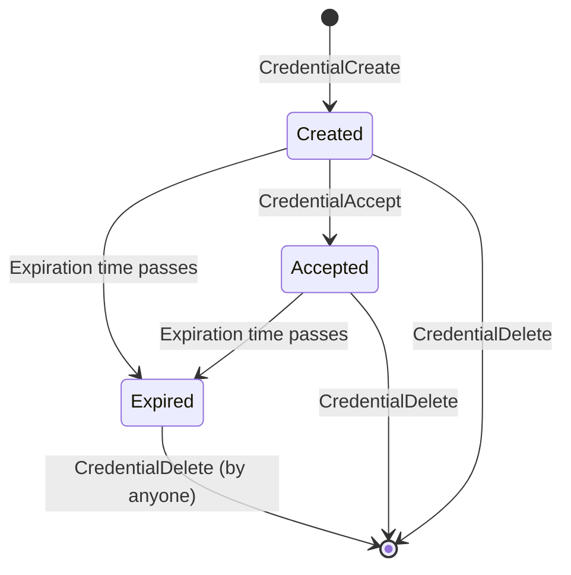

# Index

- [1. Introduction](#1-introduction)
    - [1.1. Key Concepts](#11-key-concepts)
    - [1.2. Credential Lifecycle](#12-credential-lifecycle)
    - [1.3. Use Cases](#13-use-cases)
- [2. Ledger Entries](#2-ledger-entries)
    - [2.1. Credential Ledger Entry](#21-credential-ledger-entry)
        - [2.1.1. Object Identifier](#211-object-identifier)
        - [2.1.2. Fields](#212-fields)
            - [2.1.2.1. Flags](#2121-flags)
        - [2.1.3. Pseudo-accounts](#213-pseudo-accounts)
        - [2.1.4. Ownership](#214-ownership)
        - [2.1.5. Reserves](#215-reserves)
- [3. Transactions](#3-transactions)
    - [3.1. CredentialCreate Transaction](#31-credentialcreate-transaction)
        - [3.1.1. Failure Conditions](#311-failure-conditions)
        - [3.1.2. State Changes](#312-state-changes)
    - [3.2. CredentialAccept Transaction](#32-credentialaccept-transaction)
        - [3.2.1. Failure Conditions](#321-failure-conditions)
        - [3.2.2. State Changes](#322-state-changes)
    - [3.3. CredentialDelete Transaction](#33-credentialdelete-transaction)
        - [3.3.1. Failure Conditions](#331-failure-conditions)
        - [3.3.2. State Changes](#332-state-changes)
- [4. Authorization Integration](#4-authorization-integration)
    - [4.1. DepositAuth Integration](#41-depositauth-integration)
    - [4.2. PermissionedDomain Integration](#42-permissioneddomain-integration)

# 1. Introduction

Credentials are a decentralized authorization mechanism on the XRP Ledger, borrowing concepts from the W3C Verifiable Credentials Data Model[^1], that allows accounts to create credentials for subjects (individuals, organizations, or devices) and use those credentials for access control. Once a credential is accepted and stored on the ledger, it can be autonomously verified by checking the ledger state without requiring interaction with the issuer.

For example, a trading venue creates a PermissionedDomain requiring an "accredited_investor" credential from a regulatory authority. When Alice wants to trade on this venue:
1. Alice obtains the credential: RegulatorAccountID sends a CredentialCreate transaction with Subject=AliceAccountID and CredentialType="accredited_investor"
2. Alice accepts it: AliceAccountID sends a CredentialAccept transaction
3. The credential ledger entry now exists with lsfAccepted flag set
4. When Alice submits an OfferCreate transaction on the permissioned domain, the ledger checks: Does a Credential exist where Subject=AliceAccountID, Issuer=RegulatorAccountID, CredentialType="accredited_investor", lsfAccepted=true, and not expired?
5. If yes, the transaction is authorized - all without any transaction from RegulatorAccountID

Credentials can also be used for DepositAuth (enabling payments from credential holders without individual preauthorization), self-issued authorization markers (issuer == subject), and tiered access control (different credential types representing different authorization levels from the same issuer).

[^1]: W3C Verifiable Credentials Data Model: https://www.w3.org/TR/vc-data-model-2.0/
[^2]: For self-issued credentials (issuer == subject), the credential appears in only one directory, so SubjectNode is not set. sfSubjectNode defined as soeOPTIONAL: [`ledger_entries.macro`](https://github.com/gregtatcam/rippled/blob/a72c3438eb0591a76ac829305fcbcd0ed3b8c325/include/xrpl/protocol/detail/ledger_entries.macro#L443). SubjectNode only set in the issuer != subject branch: [`Credentials.cpp`](https://github.com/gregtatcam/rippled/blob/a72c3438eb0591a76ac829305fcbcd0ed3b8c325/src/xrpld/app/tx/detail/Credentials.cpp#L156-L168)

## 1.1. Terminology and Concepts

**Issuer**: The account that creates and signs the credential. The issuer attests to some property or status of the subject. The issuer's identity determines the trust level of the credential.

**Subject**: The account that holds the credential. This is the entity the credential makes claims about. The subject must accept the credential before it becomes active (unless the subject is also the issuer).

**Credential Type**: A string identifier (max 64 bytes) that categorizes the credential. This allows different credential types from the same issuer (e.g., "kyc_basic", "kyc_advanced", "membership_gold"). Applications use the credential type to determine what authorization the credential provides.

**Acceptance**: Credentials must be explicitly accepted by the subject (via `CredentialAccept` transaction) before they can be used for authorization. This two-phase process (create then accept) ensures subjects control what credentials appear in their account and prevents unwanted credential issuance.

**Expiration**: Credentials can optionally have an expiration time. After expiration, the credential can no longer be used for authorization and can be deleted by anyone to recover ledger space.

## 1.2. Credential Lifecycle


Figure: Credential state machine


**1. Creation Phase (CredentialCreate)**:
- The issuer creates a credential for a subject
- The credential is stored in the issuer's owner directory
- Issuer's owner count increases by 1 (issuer pays the reserve)
- If issuer == subject:
  - Credential is immediately marked as accepted
  - Credential appears in only one directory (since issuer and subject are the same account)
- If issuer != subject:
  - Credential is also added to the subject's owner directory

**2. Acceptance Phase (CredentialAccept)**:
- The subject explicitly accepts the credential
- The `lsfAccepted` flag is set
- The credential ownership (who pays the reserve) transfers from the issuer to the subject:
  - Issuer's owner count decreases by 1 (freeing the issuer's reserve)
  - Subject's owner count increases by 1 (subject now pays the reserve)
  - The credential remains in both the issuer's and subject's owner directories
- The credential becomes active and can be used for authorization

**3. Usage Phase**:
- The credential can be referenced in transactions via the `CredentialIDs` field
- Used for DepositAuth authorization or PermissionedDomain access
- Remains valid until deleted or expired

**4. Expiration/Deletion Phase**:
- Credentials with an `Expiration` field become unusable after that time
- Expired credentials can be deleted by anyone
- Active credentials can be deleted by the issuer or subject at any time
- Deletion removes the credential from both owner directories

# 2. Ledger Entries


## 2.1. Credential Ledger Entry

The `Credential` ledger entry (type `ltCREDENTIAL = 0x0081`) represents a verifiable credential issued by one account to another. Each credential is uniquely identified by the combination of subject, issuer, and credential type.

### 2.1.1. Object Identifier

The key of the `Credential` object is the result of SHA512-Half of the following values concatenated in order:

- The `CREDENTIAL` space key `0x0044` (character 'D')
- The subject account ID (160 bits)
- The issuer account ID (160 bits)
- The credential type string (variable length, max 64 bytes)

This ensures each credential is uniquely identified by its (subject, issuer, type) triple. Multiple credentials can exist between the same subject and issuer as long as they have different credential types.


### 2.1.2. Fields

| Field               | Type      | Required | Description                                               |
|---------------------|-----------|----------|-----------------------------------------------------------|
| `Subject`           | AccountID | Yes      | The account holding this credential                       |
| `Issuer`            | AccountID | Yes      | The account that issued this credential                   |
| `CredentialType`    | Blob      | Yes      | Type identifier string (max 64 bytes)                     |
| `Expiration`        | UInt32    | Optional | Unix timestamp when credential expires                    |
| `URI`               | Blob      | Optional | Reference URI for credential metadata (max 256 bytes)     |
| `SubjectNode`       | UInt64    | Optional | Index of the subject's owner directory page (only present when issuer != subject)[^2] |
| `IssuerNode`        | UInt64    | Yes      | Index of the issuer's owner directory page                |
| `Flags`             | UInt32    | Optional | Credential flags (see below)                              |
| `PreviousTxnID`     | Hash256   | Yes      | Hash of the previous transaction that modified this entry |
| `PreviousTxnLgrSeq` | UInt32    | Yes      | Ledger sequence of the previous transaction               |

#### 2.1.2.1. Flags

The `Flags` field can contain the following values:

| Flag Name | Hex Value | Description |
|-----------|-----------|-------------|
| `lsfAccepted` | `0x00010000` | The subject has accepted this credential and it is now active |

**Flag Behavior**:
- When `lsfAccepted` is not set: The credential exists but has not been accepted by the subject. It cannot be used for authorization. It appears in both the issuer's and subject's owner directories, but only the issuer's owner count is incremented (the issuer pays the reserve).[^3]
- When `lsfAccepted` is set: The credential has been accepted and is active. It appears in both the issuer's and subject's owner directories and can be used for authorization.

[^3]: Credential added to both directories during creation: [`Credentials.cpp`](https://github.com/gregtatcam/rippled/blob/a72c3438eb0591a76ac829305fcbcd0ed3b8c325/src/xrpld/app/tx/detail/Credentials.cpp#L137-L169)
[^4]: Deletion authorization: [`Credentials.cpp`](https://github.com/gregtatcam/rippled/blob/a72c3438eb0591a76ac829305fcbcd0ed3b8c325/src/xrpld/app/tx/detail/Credentials.cpp#L244-L249)
- Self-issued credentials (issuer == subject) automatically have `lsfAccepted` set during creation.

### 2.1.3. Pseudo-accounts

Credential transactions (creating, accepting, or deleting credentials) do not create pseudo-accounts.

### 2.1.4. Ownership

Credentials can appear in up to two owner directories:

**Before Acceptance** (when issuer != subject):
- Appears in both the issuer's and subject's owner directories
- Issuer's owner count increases by 1

**After Acceptance**:
- Still appears in both the issuer's and subject's owner directories
- Ownership transfers: Issuer's owner count decreases by 1, subject's owner count increases by 1

**Self-Issued Credentials** (issuer == subject):
- Immediately accepted during creation
- Appears in a single owner directory (since issuer and subject are the same)
- Account's owner count increases by 1

### 2.1.5. Reserves

Credentials follow the standard XRP Ledger reserve requirements:

- **Owner Reserve**: Each credential requires one owner reserve from the account that owns it
- **Before Acceptance**: Issuer pays the reserve (since credential is in issuer's directory)
- **After Acceptance**: Subject pays the reserve (credential moved to subject's directory)
- **Self-Issued**: Account pays one reserve (not two, since there's only one directory entry)

The owner reserve is calculated as `incrementalReserve` (currently 2 XRP on Mainnet). When a credential is deleted, the reserve is freed and the owner count decreases.

# 3. Transactions

## 3.1. CredentialCreate Transaction

The `CredentialCreate` transaction creates a new credential from an issuer to a subject.

| Field Name        |     Required?      | JSON Type | Internal Type | Description                                                 |
|-------------------|:------------------:|:---------:|:-------------:|:------------------------------------------------------------|
| `TransactionType` | :heavy_check_mark: |  String   |    UInt16     | Must be `"CredentialCreate"`                                |
| `Account`         | :heavy_check_mark: |  String   |   AccountID   | The issuer account creating the credential                  |
| `Subject`         | :heavy_check_mark: |  String   |   AccountID   | The account that will hold the credential                   |
| `CredentialType`  | :heavy_check_mark: |  String   |     Blob      | Type identifier (max 64 bytes)                              |
| `Expiration`      |                    |  Number   |    UInt32     | Unix timestamp when credential expires                      |
| `URI`             |                    |  String   |     Blob      | Reference URI (max 256 bytes)                               |
| `Flags`           |                    |  Number   |    UInt32     | Transaction flags (must be 0, only universal flags allowed) |

### 3.1.1. Failure Conditions

**Static validation:**

- `temDISABLED`: featureCredentials not enabled
- `temMALFORMED`:
  - `Subject` is a zero AccountID
  - `CredentialType` is empty or exceeds 64 bytes
  - `URI` is empty or exceeds 256 bytes

**Validation against the ledger view:**

- `tecNO_TARGET`: Subject account does not exist
- `tecDUPLICATE`: A credential with this (subject, issuer, credentialType) triple already exists

**Validation during doApply**

- `tefINTERNAL`: Failed to create credential ledger entry or issuer account not found
- `tecEXPIRED`: `Expiration` field is set to a time in the past (before ledger close time)
- `tecINSUFFICIENT_RESERVE`: Issuer has insufficient XRP to pay the owner reserve
- `tecDIR_FULL`: Owner directory is full and cannot add new entry

### 3.1.2. State Changes

- `Credential` object is **created**:
    - `Subject`: Set to subject account ID
    - `Issuer`: Set to issuer account ID (transaction sender)
    - `CredentialType`: Set to specified type string
    - `Expiration`: Set to specified timestamp (if provided)
    - `URI`: Set to specified URI (if provided)
    - `SubjectNode`: Index in subject's owner directory
    - `IssuerNode`: Index in issuer's owner directory
    - `Flags`:
        - If issuer == subject: `lsfAccepted` is set immediately
        - If issuer != subject: No flags set (credential awaits acceptance)

- Issuer's `AccountRoot` is **modified**:
    - `OwnerCount`: Incremented by 1

- `DirectoryNode` entries are **created/modified**:
    - Credential added to issuer's owner directory (always)
    - If issuer == subject: Same directory entry (counted once)
    - If issuer != subject: Credential added to both issuer's and subject's owner directories

## 3.2. CredentialAccept Transaction

The `CredentialAccept` transaction allows a subject to accept a credential that has been issued to them.

| Field Name        |     Required?      | JSON Type | Internal Type | Description                                                 |
|-------------------|:------------------:|:---------:|:-------------:|:------------------------------------------------------------|
| `TransactionType` | :heavy_check_mark: |  String   |    UInt16     | Must be `"CredentialAccept"`                                |
| `Account`         | :heavy_check_mark: |  String   |   AccountID   | The subject account accepting the credential                |
| `Issuer`          | :heavy_check_mark: |  String   |   AccountID   | The issuer of the credential                                |
| `CredentialType`  | :heavy_check_mark: |  String   |     Blob      | Type identifier (max 64 bytes)                              |
| `Flags`           |                    |  Number   |    UInt32     | Transaction flags (must be 0, only universal flags allowed) |

### 3.2.1. Failure Conditions

**Static validation:**

- `temDISABLED`: featureCredentials not enabled
- `temINVALID_ACCOUNT_ID`: `Issuer` is a zero AccountID
- `temMALFORMED`: `CredentialType` is empty or exceeds 64 bytes

**Validation against the ledger view:**

- `tecNO_ISSUER`: Issuer account does not exist
- `tecNO_ENTRY`: Credential does not exist for this (subject=Account, issuer, credentialType) triple
- `tecDUPLICATE`: Credential already has `lsfAccepted` flag set

**Validation during doApply**

- `tefINTERNAL`: Subject or issuer account not found
- `tecINSUFFICIENT_RESERVE`: Subject has insufficient XRP to pay the owner reserve
- `tecEXPIRED`: Credential has expired (current ledger time > credential's `Expiration`)

### 3.2.2. State Changes

**If credential is not expired:**

- `Credential` object is **modified**:
    - `Flags`: `lsfAccepted` flag is set

- Issuer's `AccountRoot` is **modified**:
    - `OwnerCount`: Decremented by 1

- Subject's `AccountRoot` is **modified**:
    - `OwnerCount`: Incremented by 1

**If credential is expired:**

- `Credential` object is **deleted** (removed from ledger)
- State changes follow deletion rules (see [section 3.3.2](#332-state-changes))

## 3.3. CredentialDelete Transaction

The `CredentialDelete` transaction removes a credential from the ledger.

| Field Name        |     Required?      | JSON Type | Internal Type | Description                                                            |
|-------------------|:------------------:|:---------:|:-------------:|:-----------------------------------------------------------------------|
| `TransactionType` | :heavy_check_mark: |  String   |    UInt16     | Must be `"CredentialDelete"`                                           |
| `Account`         | :heavy_check_mark: |  String   |   AccountID   | The account deleting the credential                                    |
| `Subject`         |                    |  String   |   AccountID   | The subject of the credential (defaults to `Account` if not specified) |
| `Issuer`          |                    |  String   |   AccountID   | The issuer of the credential (defaults to `Account` if not specified)  |
| `CredentialType`  | :heavy_check_mark: |  String   |     Blob      | Type identifier (max 64 bytes)                                         |
| `Flags`           |                    |  Number   |    UInt32     | Transaction flags (must be 0, only universal flags allowed)            |

**Deletion Authorization**:
- The issuer can always delete any credential they issued
- The subject can always delete any credential they hold[^4]
- Anyone can delete an expired credential (when current time > `Expiration`)
- Others cannot delete active, non-expired credentials

**Field Defaults**:
- If only `Subject` is provided: `Issuer` defaults to `Account` (deletes credential where Account is issuer and specified account is subject)
- If only `Issuer` is provided: `Subject` defaults to `Account` (deletes credential where specified account is issuer and Account is subject)
- If both are provided: Uses those exact issuer and subject values
- At least one of `Subject` or `Issuer` must be provided (otherwise `temMALFORMED`)

### 3.3.1. Failure Conditions

**Static validation:**

- `temDISABLED`: featureCredentials not enabled
- `temMALFORMED`:
  - Neither `Subject` nor `Issuer` field is present
  - `CredentialType` is empty or exceeds 64 bytes
- `temINVALID_ACCOUNT_ID`: `Subject` or `Issuer` field is zero

**Validation against the ledger view:**

- `tecNO_ENTRY`: Credential does not exist for the specified (subject, issuer, credentialType) triple

**Validation during doApply**

- `tefINTERNAL`: Credential no longer exists
- `tecNO_PERMISSION`: `Account` is neither the issuer nor the subject, and the credential is not expired
- `tecNO_ENTRY`: Credential is null during deletion (from `deleteSLE`)
- `tecINTERNAL`: Account not found during directory removal (from `deleteSLE`)
- `tefBAD_LEDGER`: Failed to remove credential from owner directory (from `deleteSLE`)

### 3.3.2. State Changes

- `Credential` object is **deleted**:
    - Removed from ledger entirely

- Issuer's `AccountRoot` is **modified** (if credential was not yet accepted):
    - `OwnerCount`: Decremented by 1

- Subject's `AccountRoot` is **modified** (if credential was accepted):
    - `OwnerCount`: Decremented by 1

- `DirectoryNode` entries are **updated**:
    - Credential entry removed from issuer's owner directory (always)
    - Credential entry removed from subject's owner directory (if subject != issuer)

# 4. Authorization Integration

Credentials integrate with the XRP Ledger's authorization systems to enable credential-based access control.

## 4.1. DepositAuth Integration

Accounts with the `lsfDepositAuth` flag set require incoming payments to be authorized. Authorization can be granted in two ways: by pre-authorizing specific accounts, or by accepting credentials from trusted issuers. Credentials provide a scalable alternative to pre-authorizing individual accounts.

**The authorization mechanism works as follows**:

1. Destination account enables `lsfDepositAuth` flag
2. When a payment arrives, the ledger checks:
   - If sender == destination, allow (self-payment)
   - If sender is individually pre-authorized (`DepositPreauth` entry exists for sender's account), allow
   - Otherwise, if transaction includes `CredentialIDs` field, verify credentials against destination's accepted credential specifications
3. The destination creates a `DepositPreauth` ledger entry specifying trusted (issuer, credentialType) pairs
4. Senders who hold matching credentials include the credential hashes in the `CredentialIDs` field

**CredentialIDs Field**:

Transactions that move value (Payment, EscrowFinish, etc.) include an optional `CredentialIDs` field:

| Field Name | Required? | JSON Type | Internal Type | Description |
|------------|:---------:|:---------:|:-------------:|:------------|
| `CredentialIDs` | | Array | VECTOR256 | Array of credential object hashes (max 8) |

The sender includes the hashes of credentials they hold. During transaction processing, the ledger:
1. Checks if the destination has `lsfDepositAuth` enabled
2. If yes, verifies the sender is preauthorized OR holds a valid credential
3. Looks up each credential hash in `CredentialIDs`
4. Checks if any credential matches the destination's accepted credential specifications
5. Verifies the credential is not expired and has `lsfAccepted` flag set

**Example Flow**:

Setup:
- Bob has lsfDepositAuth enabled
- Bob creates DepositPreauth entry trusting Carol (KYC provider) for "verified_user" credential type
- Carol issues "verified_user" credential to Alice
- Alice accepts the credential

Payment:
1. Alice sends Payment to Bob
   - CredentialIDs: [hash of Alice's credential]
2. Ledger checks Bob has lsfDepositAuth = true
3. Ledger verifies Alice has no individual deposit preauth from Bob
4. Ledger checks CredentialIDs field
5. Ledger looks up credential, confirms:
   - Issuer = Carol
   - Type = "verified_user"
   - Subject = Alice
   - lsfAccepted = true
   - Not expired
6. Payment succeeds


## 4.2. PermissionedDomain Integration

Credentials can gate access to permissioned domains. Domain owners specify which credential types from which issuers are required to interact with the domain.

**PermissionedDomain Ledger Entry**:

Contains an `AcceptedCredentials` field - an array of credential specifications:

```
AcceptedCredentials: [
  {
    Issuer: <AccountID>,
    CredentialType: <string>
  },
  ...
]
```

**The domain access control mechanism works as follows**:

1. Domain owner creates a PermissionedDomain entry
2. Sets `AcceptedCredentials` to specify required credentials
3. Users attempting to interact with the domain must provide valid credentials
4. The ledger checks the user holds a credential matching any entry in `AcceptedCredentials`

**Example**:

Setup:
- Bob creates a PermissionedDomain for his trading venue
- Bob sets AcceptedCredentials: 

```json
  [
    { Issuer: Carol, CredentialType: "accredited_investor" }
  ]
```  
- Carol (regulatory authority) issues "accredited_investor" credential to Alice
- Alice accepts the credential

Offer Creation:
1. Alice submits an OfferCreate transaction with the `DomainID` field set to Bob's PermissionedDomain ID
2. Ledger checks Bob's PermissionedDomain has credential requirements
3. Ledger verifies Alice holds credential where:
   - Issuer = Carol
   - Type = "accredited_investor"
   - lsfAccepted = true
   - Not expired
4. OfferCreate transaction succeeds, placing Alice's offer in the domain's order book

This enables fine-grained access control where different domains can require different credentials, and issuers can manage authorization by issuing or revoking credentials without the domain owner's involvement.
