# Index

- [1. Introduction](#1-introduction)
  - [1.1. Strands and Steps](#11-strands-and-steps)
  - [1.2. Algorithm](#12-algorithm)
  - [1.3. Structure](#13-structure)
- [2. Terminology and Concepts](#2-terminology-and-concepts)
  - [2.1. Quality](#21-quality)
  - [2.2. Debt Direction (Redeeming vs Issuing)](#22-debt-direction-redeeming-vs-issuing)
- [3. Flow](#3-flow)
  - [3.1. flow Pseudo-Code](#31-flow-pseudo-code)
  - [3.2. AMMContext](#32-ammcontext)
  - [3.3. Domain Payments](#33-domain-payments)
- [4. Converting Paths to Strands (toStrands)](#4-converting-paths-to-strands-tostrands)
- [5. Path Normalization and Strand Creation (toStrand)](#5-path-normalization-and-strand-creation-tostrand)
  - [5.1. Path Normalization](#51-path-normalization)
  - [5.2. Path to Strand Conversion](#52-path-to-strand-conversion)
  - [5.3. Step Generation](#53-step-generation)
- [6. Iterative Strands Evaluation (strandsFlow)](#6-iterative-strands-evaluation-strandsflow)
  - [6.1. strandsFlow Pseudo-Code](#61-strandsflow-pseudo-code)
  - [6.2. qualityUpperBound](#62-qualityupperbound)
  - [6.3. limitOut](#63-limitout)
- [7. Single Strand Evaluation (strandFlow)](#7-single-strand-evaluation-strandflow)
  - [7.1. Method `fwd`](#71-method-fwd)
  - [7.2. Method `rev`](#72-method-rev)
  - [7.3. Reverse and Forward Passes](#73-reverse-and-forward-passes)
  - [7.4. strandFlow Pseudo-Code](#74-strandflow-pseudo-code)
- [8. Validation and Error Codes](#8-validation-and-error-codes)
  - [8.1. Path Conversion Errors](#81-path-conversion-errors)
  - [8.2. Flow Execution Errors](#82-flow-execution-errors)
    - [8.2.1. StrandFlow Errors](#821-strandflow-errors)
    - [8.2.2. Step Validation Errors](#822-step-validation-errors)
  - [8.3. MPT-Specific Validations](#83-mpt-specific-validations)

# 1. Introduction

**Flow** is `xrpld`'s **Payment Engine**. It is used to evaluate payment paths and execute payments.

> [!NOTE]
> The usual terminology is **Payment Engine** and **Flow** can be seen as an implementation of the **Payment Engine**. We choose to use term **Flow** here because **Payment Engine** is often colloquially used in wider context to include the wider payment system.

Flow operates on **paths** - potential routes for value to flow from source to destination. These paths are typically discovered by the [pathfinding algorithm](../path_finding/README.md), though they can also be explicitly provided by users or generated for offer crossing.

Flow takes a set of paths and converts them into **strands** - sequences of executable **steps** that move value from source to destination. Flow ranks these strands by [quality](../glossary.md#quality), with higher-quality strands prioritized.

During execution, Flow iteratively consumes liquidity from the best available strands, re-ranking them as their quality changes, until the payment amount is satisfied, all liquidity is exhausted, or an error prevents completion.

It supports both exact amount delivery and partial payments, handling all combinations of [XRP](../glossary.md#xrp), [MPT](../glossary.md#mpt) and [IOU](../glossary.md#iou) transfers while respecting quality limits and spending constraints.

## 1.1. Strands and Steps

A **strand** is the concrete, executable representation of one payment route. While [paths](../path_finding/README.md) describe where value can go (accounts and order books), strands describe how to actually move value through those locations.

Each **step** is a unit of routing logic. They execute the operations needed to move value along a payment route. Steps transfer IOUs between accounts through trust lines, convert currencies by consuming order book liquidity, or handle XRP/MPT transfers at the payment's source or destination.

- **[DirectStepI](steps.md#2-directstepi)** - Transfers tokens between accounts via trust lines
- **[XRPEndpointStep](steps.md#3-xrpendpointstep)** - Transfers XRP to/from source or destination
- **[MPTEndpointStep](steps.md#4-mptendpointstep)** - Transfers MPT to/from source or destination
- **[BookStep](steps.md#5-bookstep)** - Converts currencies through order books and AMM pools. (The example below uses `BookStepII`. `BookStep` actually comes in multiple variants, named by their input/output asset pair. Examples include `BookStepII`, `BookStepXI`, and `BookStepMX`, one per XRP/IOU/MPT combination.)

Once constructed, strands have no need for path elements anymore and they represent the complete list of steps required for a payment. However, one way to understand steps is as if they were connections between path elements. For example, this is how path elements (circles) will be spanned by strand steps (diamonds):

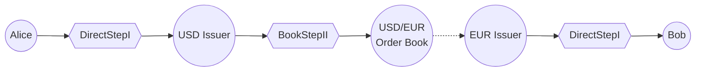
```mermaid
flowchart LR
    alice((Alice))
    usdIssuer((USD Issuer))
    book((USD/EUR<br/>Order Book))
    eurIssuer((EUR Issuer))
    bob((Bob))

    aliceToIssuer{{DirectStepI}}
    bookStep{{BookStepII}}
    issuerToBob{{DirectStepI}}

    alice --> aliceToIssuer
    aliceToIssuer --> usdIssuer
    usdIssuer --> bookStep
    bookStep --> book
    book -.-> eurIssuer
    eurIssuer --> issuerToBob
    issuerToBob --> bob
```
*Figure: Strand steps can be thought of as a connection between path elements* 

**Path elements** (circles): Alice, USD Issuer, USD/EUR Order Book, EUR Issuer, Bob

**Steps** (diamonds):
- **DirectStepI**: Alice -> USD Issuer
- **BookStepII**: USD/EUR conversion through order book - the book delivers directly to EUR Issuer (shown as dotted line, not a separate step)
- **DirectStepI**: EUR Issuer -> Bob

## 1.2. Algorithm

Flow executes payments by converting paths into executable strands and consuming liquidity from the best-quality strands until the payment is complete. We'll illustrate the algorithm using an example: Alice wants to send up to 300 USD and Bob should receive 250 EUR.

This example uses "quality", which is effectivelly the exchange rate including transfer rates and fees. Note that quality is stored as in/out, so lower values are better, but the codebase inverts its comparison operators to make "higher quality" mean "better deal". See [Quality Representation](#21-quality) for details on how this works and the potential confusion it introduces. Composite quality is the product of qualities for all steps along the strand[^composed-quality].

**Setup:**
- Alice has 1000 USD with USD Issuer
- Bob has trust line to EUR Issuer
- Available liquidity:
  - Path 1: USD->EUR via one order book (102 USD / 100 EUR). Quality is 1.02. 
  - Path 2: USD->XRP->EUR via two order books (100 USD / 100 drops and 106 drops / 100 EUR). Composite quality is 1.06.
  - Path 3: USD->MPT->EUR via two order books (104 USD / 100 MPT and 100 MPT / 100 EUR). Composite quality is 1.04.
  
- [Path finding](../path_finding/README.md) returns:
  - Path 1: `[USD/EUR order book]`
  - Path 2: `[USD/XRP order book, XRP/EUR order book]`
  - Path 3: `[USD/MPT order book, MPT/EUR order book]`

For this example, we will assume that Flow examines only those Paths, disregarding default path. 

**Step 1: Path Normalization**

Flow normalizes each path by adding the source and destination connections that path finding omitted.

Path finding omits these elements because its job is to discover **liquidity routes** through the network (which order books and intermediate accounts can convert currencies), not to construct complete executable paths. The source and destination connections are deterministic - they always follow the same pattern based on the payment parameters (source account, destination account, currencies, and issuers). Path finding searches to the **effective destination** (the issuer for token payments, or the destination account for XRP), not the final recipient. Flow's normalization logic adds the final hop from issuer to recipient when needed.

- **Path 1**: `[USD/EUR order book]`
  - Add source: Alice needs to send USD through USD Issuer to reach the order book
  - Add destination: EUR from the order book goes through EUR Issuer to reach Bob
  - **Normalized**: `[Alice, USD Issuer, USD/EUR book, EUR Issuer, Bob]`

- **Path 2**: `[USD/XRP order book, XRP/EUR order book]`
  - Add source: Alice sends USD through USD Issuer
  - Add destination: EUR goes through EUR Issuer to Bob
  - **Normalized**: `[Alice, USD Issuer, USD/XRP book, XRP/EUR book, EUR Issuer, Bob]`

- **Path 3**: `[USD/MPT order book, MPT/EUR order book]`
  - Add source: Alice sends USD through USD Issuer
  - Add destination: EUR goes through EUR Issuer to Bob
  - **Normalized**: `[Alice, USD Issuer, USD/MPT book, MPT/EUR book, EUR Issuer, Bob]`

**Step 2: Path to Strand Conversion**

Flow converts each normalized path into a strand by creating **steps that connect adjacent elements** in the path.

A path is a sequence of **locations** (accounts and order books), while a strand is a sequence of **actions** (steps) that move value between those locations. Each step connects two adjacent elements:
- **DirectStep**: Connects two accounts via a trust line (e.g., Alice -> USD Issuer)
- **BookStep**: Connects through an order book to convert currencies (e.g., USD -> EUR)
- **XRPEndpointStep**: Transfers XRP directly to/from the source or destination account)
- **MPTEndpointStep**: Transfers MPT directly to/from the source or destination account

- **Normalized Path 1** -> **Strand 1**:
  - `[DirectStep: Alice->USD Issuer with USD]`
  - `[BookStep: USD/EUR]`
  - `[DirectStep: EUR Issuer->Bob with EUR]`

- **Normalized Path 2** -> **Strand 2**:
  - `[DirectStep: Alice->USD Issuer with USD]`
  - `[BookStep: USD->XRP]`
  - `[BookStep: XRP->EUR]`
  - `[DirectStep: EUR Issuer->Bob with EUR]`

- **Normalized Path 3** -> **Strand 3**:
  - `[DirectStep: Alice->USD Issuer with USD]`
  - `[BookStep: USD->MPT]`
  - `[BookStep: MPT->EUR]`
  - `[DirectStep: EUR Issuer->Bob with EUR]`

**Step 3: Step Validation**

Flow validates each step in every strand using the step's `check()` method to ensure it is valid. For example, that required accounts exist, no loops are present, and authorization requirements are met. Each step type has different validation requirements. See [steps documentation: check implementation](steps.md#215-check-implementation-base-class) for details.

For this example, all steps pass validation. If any step failed validation, the entire strand would be discarded.

**Step 4: Iterative Strand Evaluation**

Each strand is evaluated using a **two-pass method**:

Payments specify a desired output amount to deliver to the destination. To determine how much input that requires, the engine must work backward from the destination through each step. But during this backward walk, a step may discover it cannot deliver the full requested amount. The steps already computed (those closer to the destination) assumed the full amount would flow and made state changes accordingly, so those must be discarded. After re-executing the bottleneck step with the reduced amount, a forward walk recalculates the actual outputs for the remaining steps downstream.

The **reverse pass** works backwards from destination to source, calculating how much input is needed to deliver the desired output. If any step cannot provide the requested output (becoming a "limiting step"), the pass clears the sandbox (discarding all state changes), re-executes that limiting step with clean state, and then continues the reverse pass backwards through the remaining steps (those before the limiting step) using the limiting step's actual (reduced) output.

The **forward pass** executes if a limiting step was found. It runs forward from the step after the limiting step to the destination, recalculating outputs based on the actual available liquidity from the limiting step. This ensures steps after the limiting step have correct values with limited input.

If the first step, during the reverse pass consumes more than how much the strand is allowed to spend, it is reexecuted in the forward direction since the limit is coming from the input side.

In each iteration, the quality of a strand is computed. The quality is presented from the point of view of user "taking". So, if taker needs to pay 90 EUR to get 100 USD, the quality is 0.9, which is better. If the taker needs to pay 110 EUR to get 100 USD, the quality is 1.1, which is worse.

*Iteration 1:*
- Rank strands by quality: Strand 1 (1.02) is better than Strand 3 (1.04), which is better than Strand 2 (1.06).
- Select Strand 1 (best quality for the taker) to evaluate.
- The last step will provide full liquidity - Issuer can send all 250 EUR to Bob.
- The BookStep however can only provide 100 EUR for 102 USD. This is a limiting step. 
- The first step requires USD Issuer to transfer 102 USD from Alice to BookStep.
- Strand 1 delivers 100 EUR at cost of 102 USD (hit liquidity limit)
- Update: Delivered 100 EUR total, 150 EUR remaining

*Iteration 2:*
- Remaining strands: Strand 3 (1.04), Strand 2 (1.06)
- Rank strands by quality: Strand 3 (1.04) is better than Strand 2 (1.06).
- Select Strand 3 (best quality) to evaluate.
- The last step will provide full liquidity - Issuer can deliver the requested 150 EUR to Bob.
- The second BookStep, however, can only provide 100 EUR for 100 of its input currency - this becomes the limiting step.
- The first BookStep upstream must supply 104 USD to produce those 100 intermediary units (quality 1.04).
- Strand 3 delivers 100 EUR at a cost of 104 USD (hit liquidity limit).
- Update: Delivered 100 EUR more, 50 EUR remaining.

*Iteration 3:*
- Rank strands by quality: only Strand 2 remains active.
- Select Strand 2 (only strand) to evaluate.
- The last step (Direct to Bob) can deliver the full 50 EUR to Bob.
- The BookStep (XRP -> EUR) provides 50 EUR out for 53 drops in (quality 1.06). No step is limiting - the strand has sufficient capacity.
- The previous BookStep (USD -> XRP) and Direct step each supply 53 of their respective inputs to feed the path.
- Strand 2 delivers 50 EUR at a cost of 53 USD (quality 1.06).
- Update: Delivered final 50 EUR, payment complete.

All 250 EUR were delivered, for a total cost of 259 USD.

**Step 5: Return Results**

Flow returns:
- Result code: `tesSUCCESS`
- Actual amount in: 259 USD (102 + 104 + 53)
- Actual amount out: 250 EUR (100 + 100 + 50)
- Effective quality: 1.036

## 1.3. Structure

`xrpld` implements the payment engine using the following structure:

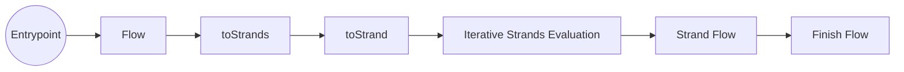
```mermaid
flowchart LR
    payment((Entrypoint))
    flow[Flow]
    toStrands[toStrands]
    toStrand[toStrand]
    strandsFlow[Iterative Strands Evaluation]
    strandFlow[Strand Flow]
    finishFlow[Finish Flow]
    
    payment --> flow
    
    flow --> toStrands
    toStrands --> toStrand
    toStrand --> strandsFlow
    strandsFlow --> strandFlow
    strandFlow --> finishFlow
```
*Figure: Overview of sequence of steps in the Payment Engine*

- **[Flow](#3-flow)** (`flow`) is an entry point function that starts the payment engine. This function accepts the paths that will eventually become strands and be evaluated. In `xrpld` this is implemented as `flow()` in `Flow.cpp` in the paths module[^flow-entrypoint] and in this document we refer to it as `flow`. It is called by one of:
  - [Payment transaction](../payments/README.md)
  - [OfferCreate transaction](../offers/README.md) crossing
  - RPC [path finding](../path_finding/README.md) endpoints
  - CheckCash transaction
  - XChainBridge
- **[toStrands](#4-converting-paths-to-strands-tostrands)** is a function that converts a set of paths into strands, by calling `toStrand` on each one.
- **[toStrand](#5-path-normalization-and-strand-creation-tostrand)** converts a single path to a strand through [path normalization](#51-path-normalization), [path to strand conversion](#52-path-to-strand-conversion), and [step generation](#53-step-generation)
- **[Iterative Strands Evaluation](#6-iterative-strands-evaluation-strandsflow)** is another function called `flow` (accepting a vector of `strands` as parameter) implemented in `StrandFlow.h`[^strandsflow-entrypoint]. In this document we refer to it as `strandsFlow`. It orchestrates evaluating each strand and deciding which of them to use.
- **[Strand Flow](#7-single-strand-evaluation-strandflow)** (another function called `flow`, accepting a single `strand` as parameter) is implemented in `StrandFlow.h` in the paths/detail module[^strandflow-entrypoint]. In this document we refer to it as `strandFlow`. It evaluates a strand using the [two-pass method](#73-reverse-and-forward-passes).
- **Finish Flow** (`finishFlow` function) cleans up after the execution is complete.

[^flow-entrypoint]: Flow entry point implementation: [`Flow.cpp`](https://github.com/XRPLF/rippled/blob/3.2.0/src/libxrpl/tx/paths/Flow.cpp#L45)
[^strandsflow-entrypoint]: Iterative Strands Evaluation implementation: [`StrandFlow.h`](https://github.com/XRPLF/rippled/blob/3.2.0/include/xrpl/tx/paths/detail/StrandFlow.h#L556)
[^strandflow-entrypoint]: Strand Flow implementation: [`StrandFlow.h`](https://github.com/XRPLF/rippled/blob/3.2.0/include/xrpl/tx/paths/detail/StrandFlow.h#L82)
[^tostrands]: toStrands implementation: [`PaySteps.cpp`](https://github.com/XRPLF/rippled/blob/3.2.0/src/libxrpl/tx/paths/PaySteps.cpp#L574)
[^quality-rate]: Quality stored as normalize(input / output) via `getRate`: [`STAmount.cpp`](https://github.com/XRPLF/rippled/blob/3.2.0/src/libxrpl/protocol/STAmount.cpp#L460-L481), [`Quality.cpp`](https://github.com/XRPLF/rippled/blob/3.2.0/src/libxrpl/protocol/Quality.cpp#L17-L18)
[^quality-comparison]: Inverted comparison operators (lower stored value = higher quality): [`Quality.h`](https://github.com/XRPLF/rippled/blob/3.2.0/include/xrpl/protocol/Quality.h#L216-L230)
[^quality-increment]: Increment decreases stored value (higher quality), decrement increases it (lower quality): [`Quality.cpp`](https://github.com/XRPLF/rippled/blob/3.2.0/src/libxrpl/protocol/Quality.cpp#L21-L53)
[^quality-no-improvement]: Quality anti-improvement check in `qualitiesSrcRedeems`: [`DirectStep.cpp`](https://github.com/XRPLF/rippled/blob/3.2.0/src/libxrpl/tx/paths/DirectStep.cpp#L738-L749)
[^composed-quality]: `composedQuality` multiplies step rates: [`Quality.cpp`](https://github.com/XRPLF/rippled/blob/3.2.0/src/libxrpl/protocol/Quality.cpp#L114-L131)

**Step Implementations:**

Each step type inherits from the `Step` interface through a `StepImp` template base class and implements methods for reverse pass calculation (`revImp`), forward pass calculation (`fwdImp`), quality estimation (`qualityUpperBound`), and validation (`check`) - see [step methods documentation](steps.md#13-methods) for details. The `revImp`/`fwdImp`/`qualityUpperBound` methods back the `Step` virtual interface. `check` does not. It is a separate method defined on each concrete step type, including its payment and offer-crossing variants. Each step type is implemented as a base class with derived classes for payments and offer crossing. Payment variants enforce trust line limits and the offer owner pays transfer fees. Offer crossing variants waive trust line limits for the destination step and the taker pays transfer fees.

# 2. Terminology and Concepts

**Strand** - A sequence of steps that represents an executable payment route. See [section 1.1](#11-strands-and-steps).

**Step** - An atomic operation that transfers or converts value between two adjacent path elements. See [section 1.1](#11-strands-and-steps).

**Path** - A sequence of path elements (accounts and order books) discovered by [path finding](../path_finding/README.md) that describes a potential route for value to flow.

**Path Element** - A building block in a path.

**Path Normalization** - The process of adding source and destination connections to paths returned by path finding. See [section 5.1](#51-path-normalization).

**Limiting Step** - A step that restricts how much value can flow through a strand due to constraints like insufficient [trust line](../glossary.md#trust-line) credit, limited order book liquidity, or low account balance.

**Default Path** - The direct route between source and destination that Flow always attempts (unless disabled by `tfNoRippleDirect` flag). See [path finding: default paths](../path_finding/README.md#24-default-paths).

**Partial Payment** - A payment mode where delivering less than the full requested amount is acceptable. Enabled by the `tfPartialPayment` flag on [Payment transactions](../payments/README.md).

**Offer Crossing** - The process by which an [OfferCreate transaction](../offers/README.md) consumes existing offers from the order book, using the Flow engine to execute the exchange.

## 2.1. Quality

Quality represents the exchange rate for a payment step or strand, calculated as the ratio of input amount to output amount. Lower quality values are better, meaning less input is required to produce the same output. For example, a quality of 1.05 means 105 units of input produce 100 units of output. A quality of exactly 1.0 (represented in the codebase as the constant `QUALITY_ONE = 1,000,000,000`) means parity: one unit of input per unit of output.

> [!NOTE]
> **Quality Representation in the Codebase:** Quality is stored as the ratio of input to output (in/out).[^quality-rate] A quality value of 1.02 means the taker pays 1.02 units per unit received. Lower quality values represent better deals.
>
> This creates a potential source of confusion: colloquially, "higher quality" means a better deal, but a better deal corresponds to a *lower* quality value. The codebase resolves this by inverting the comparison operators in the `Quality` class[^quality-comparison]. Comparing two qualities returns true for "greater than" when the left side has a lower stored value, because a lower ratio represents a better deal. Similarly, the increment operator advances to the next higher quality by *decreasing* the stored value, and the decrement operator does the opposite.[^quality-increment]
>
> Throughout this document, "better quality" and "higher quality" mean a lower in/out ratio (less input per unit of output).

Quality is determined by the following factors:

**Order book offer exchange rates**: The ratio at which offers in the order book exchange currencies. An offer of `takerGets = 105 USD` and `takerPays = 100 EUR` provides quality of ~0.95. Different offers have different exchange rates, and the order book is sorted by quality with the best offers consumed first. CLOB (Central Limit Order Book) offers have **fixed quality** that doesn't change as liquidity is consumed.

**AMM pool exchange rates**: Unlike CLOB offers, AMM pools have **dynamic quality** that degrades as more liquidity is consumed from the pool. For example, consuming 10 tokens might have quality of 1.00, but consuming 100 tokens from the same pool might degrade to quality of 1.05 due to the slippage curve. This dynamic quality requires special handling in the payment engine - see [limitOut](#63-limitout) for how the engine optimizes single-path AMM payments with quality limits. AMM pools also charge trading fees that further affect quality.

**Transfer fees**: Fees set on an issuer's account (via the `TransferRate` field) that are charged when value flows through their account as an intermediary in a trust line payment. When an issuer has a 2% transfer fee, moving 100 units of their issued currency through them as an intermediary requires 102 units of input, degrading quality by the fee percentage. Transfer fees do NOT apply to direct issuer<->holder transfers, only to holder<->holder transfers that pass through the issuer. For MPTs, transfer fees are set on the MPT issuance itself. See [DirectStepI quality](steps.md#221-quality-implementation) and [MPTEndpointStep quality](steps.md#43-qualityupperbound-implementation) for implementation details.

**QualityIn and QualityOut**: Trust line settings that adjust the effective value of tokens when [rippling](../glossary.md#rippling) through an account. Both are stored as ratios relative to `QUALITY_ONE` (1,000,000,000); a value of 0 or `QUALITY_ONE` means face value (no adjustment). QualityIn controls how the destination values incoming tokens: a value below `QUALITY_ONE` (e.g. 990,000,000, ratio 0.99) means each token is counted at less than face value (here, 99%), so more tokens must be sent to deliver the same effective value downstream. QualityOut controls the cost of sending: a value above `QUALITY_ONE` (e.g. 1,010,000,000, ratio 1.01) means 1% more tokens must be sent per unit of value. Together, these settings allow intermediary accounts to charge a spread when value ripples through them. QualityIn applies only when the source of the step is issuing, and QualityOut applies only when the source is redeeming. Additionally, QualityIn is clamped to `QUALITY_ONE` on the last step of a strand, so the final recipient does not benefit from a favorable QualityIn setting. See [DirectStepI quality implementation](steps.md#221-quality-implementation) for details.

When the source of a DirectStepI is redeeming, the engine ensures that quality does not improve as value flows through an intermediate account. If the previous step's destination has a QualityIn that exceeds the current step's source QualityOut, the source QualityOut is raised to match.[^quality-no-improvement] To see why this is necessary, consider a USD payment path Alice -> Bob -> Charlie, where Charlie is the issuer. The Bob -> Charlie DirectStep is redeeming. Bob has the following trust line settings:

- Bob's trust line from Alice has QualityIn = 1.05
- Bob's trust line to Charlie has QualityOut = 1.02

The composed rate through Bob is `out = in × QualityIn / QualityOut`. Without anti-improvement, if Alice sends 100 USD into Bob: out = 100 × 1.05 / 1.02 = 102.94 USD, value increases just by flowing through Bob.

With the anti-improvement check, because the Bob -> Charlie step is redeeming, the engine enforces QualityOut >= previous step's QualityIn. QualityOut is raised to 1.05: out = 100 × 1.05 / 1.05 = 100 USD. Value does not improve as it passes through Bob.

Each step type calculates quality differently:

| Step Type | Payment Quality Factors | Offer Crossing Quality Factors |
|-----------|------------------------|-------------------------------|
| **XRPEndpointStep** | Always `QUALITY_ONE` (1:1)[^xrp-quality] | Same[^xrp-quality-oc] |
| **MPTEndpointStep** | Transfer rate only (applies only when issuing and previous step redeems)[^mpt-quality-issues] | Always `QUALITY_ONE`: during offer crossing, the previous step is always a BookStep that issues[^mpt-oc-prev-issues], so the transfer rate condition is never met |
| **DirectStepI** | Trust line QualityIn/QualityOut[^direct-quality-payment] + issuer transfer rate (transfer rate applies only when issuing and previous step redeems)[^direct-quality-issues] | Always `QUALITY_ONE`: trust line quality settings are ignored[^direct-quality-oc] and the previous step is always a BookStep that issues[^direct-oc-prev-issues], so the transfer rate condition is also never met |
| **BookStep** | Order book exchange rate + input transfer fee (when previous step redeems)[^book-quality-payment]. Output transfer fee does not apply for payments (`ownerPaysTransferFee` is false)[^book-owner-pays] | CLOB and multi-path AMM: no transfer fee adjustment[^book-quality-oc]. Single-path AMM (requires `fixAMMv1_1`): input transfer fee only (when previous step redeems)[^book-quality-oc-amm] |

See the [steps documentation](steps.md) for detailed quality calculations.

[^xrp-quality]: XRPEndpointStep always returns `Quality{STAmount::kURateOne}`: [`XRPEndpointStep.cpp`](https://github.com/XRPLF/rippled/blob/3.2.0/src/libxrpl/tx/paths/XRPEndpointStep.cpp#L253-L257)
[^xrp-quality-oc]: `qualityUpperBound` is in the base template `XRPEndpointStep<TDerived>` with no override in the offer crossing variant `XRPEndpointOfferCrossingStep`: [`XRPEndpointStep.cpp`](https://github.com/XRPLF/rippled/blob/3.2.0/src/libxrpl/tx/paths/XRPEndpointStep.cpp#L190-L241)
[^mpt-quality-issues]: MPTEndpointStep applies transfer rate in `qualitiesSrcIssues` only when `redeems(prevStepDebtDirection)`: [`MPTEndpointStep.cpp`](https://github.com/XRPLF/rippled/blob/3.2.0/src/libxrpl/tx/paths/MPTEndpointStep.cpp#L750-L768)
[^mpt-oc-prev-issues]: MPTEndpointOfferCrossingStep asserts previous step always issues: [`MPTEndpointStep.cpp`](https://github.com/XRPLF/rippled/blob/3.2.0/src/libxrpl/tx/paths/MPTEndpointStep.cpp#L299-L310)
[^direct-quality-payment]: DirectIPaymentStep reads QualityIn/QualityOut from trust line fields: [`DirectStep.cpp`](https://github.com/XRPLF/rippled/blob/3.2.0/src/libxrpl/tx/paths/DirectStep.cpp#L341-L380)
[^direct-quality-issues]: DirectStepI applies transfer rate in `qualitiesSrcIssues` only when `redeems(prevStepDebtDirection)`: [`DirectStep.cpp`](https://github.com/XRPLF/rippled/blob/3.2.0/src/libxrpl/tx/paths/DirectStep.cpp#L752-L771)
[^direct-quality-oc]: DirectIOfferCrossingStep ignores trust line quality fields, always returns `QUALITY_ONE`: [`DirectStep.cpp`](https://github.com/XRPLF/rippled/blob/3.2.0/src/libxrpl/tx/paths/DirectStep.cpp#L382-L388)
[^direct-oc-prev-issues]: DirectIOfferCrossingStep asserts previous step always issues: [`DirectStep.cpp`](https://github.com/XRPLF/rippled/blob/3.2.0/src/libxrpl/tx/paths/DirectStep.cpp#L296-L307)
[^book-quality-payment]: BookPaymentStep `adjustQualityWithFees` applies input transfer fee when `redeems(prevStepDir)`: [`BookStep.cpp`](https://github.com/XRPLF/rippled/blob/3.2.0/src/libxrpl/tx/paths/BookStep.cpp#L338-L362)
[^book-owner-pays]: Output transfer fee requires `ownerPaysTransferFee_`, which is only true for offer crossing: [`BookStep.cpp`](https://github.com/XRPLF/rippled/blob/3.2.0/src/libxrpl/tx/paths/BookStep.cpp#L356-L358)
[^book-quality-oc]: BookOfferCrossingStep returns unmodified offer quality for CLOB and multi-path AMM: [`BookStep.cpp`](https://github.com/XRPLF/rippled/blob/3.2.0/src/libxrpl/tx/paths/BookStep.cpp#L510-L546)
[^book-quality-oc-amm]: Single-path AMM input transfer fee during offer crossing requires `fixAMMv1_1`: [`BookStep.cpp`](https://github.com/XRPLF/rippled/blob/3.2.0/src/libxrpl/tx/paths/BookStep.cpp#L529-L545)

The engine uses quality in two phases. Before executing a strand, it computes an estimated quality upper bound (the product of step quality estimates) to sort strands from best to worst and to filter out strands that fall below the `limitQuality` threshold. After executing a strand, it computes the actual quality from the execution results (actual input / actual output) and checks it against `limitQuality` again. The estimate and actual quality can differ because offers may be unfunded, balances may have changed, or rounding may have occurred. See [qualityUpperBound](#62-qualityupperbound) for details on strand sorting and filtering.

## 2.2. Debt Direction (Redeeming vs Issuing)

Every step must know whether its source account is **redeeming** or **issuing**[^debt-direction-enum] relative to its destination. 

Debt direction controls which quality adjustments and fees apply to a step. The same step between the same two accounts can produce different exchange rates depending on which direction the debt is moving. Transfer fees, QualityIn/QualityOut, and the anti-improvement constraint each apply only in one debt direction, not the other.

A step also needs to know the **previous step's** debt direction. Certain fees are charged when the current step is issuing but the previous step was redeeming. Each step therefore propagates its debt direction to the next step via `qualityUpperBound` and the `revImp`/`fwdImp` methods. 

See [step quality implementation](steps.md) for how each factor is conditionally applied based on debt direction and how debt direction is determined[^debt-direction-direct].

[^debt-direction-enum]: `DebtDirection` enum definition: [`Steps.h`](https://github.com/XRPLF/rippled/blob/3.2.0/include/xrpl/tx/paths/detail/Steps.h#L21)
[^debt-direction-direct]: DirectStepI determines debt direction via `accountHolds`: [`DirectStep.cpp`](https://github.com/XRPLF/rippled/blob/3.2.0/src/libxrpl/tx/paths/DirectStep.cpp#L497-L498)

# 3. Flow

The `flow` function[^flow-entrypoint] is the entry point to the payment execution engine. It accepts the following parameters:

> [!NOTE]
> Parameter names and definitions are simplified to provide an overview. They do not map 1:1 to the C++ implementation, but are intended to make the pseudocode in later sections easier to follow.

| Parameter              | Description                                                                                                                       | Required             |
|------------------------|-----------------------------------------------------------------------------------------------------------------------------------|----------------------|
| `sb`                   | [PaymentSandbox](../transactions/README.md#5-ledger-views-and-sandboxes) - Ledger state view for reading balances and trust lines | ✅                    |
| `deliver`              | Amount to deliver to destination                                                                                                  | ✅                    |
| `src`                  | Source account                                                                                                                    | ✅                    |
| `dst`                  | Destination account                                                                                                               | ✅                    |
| `paths`                | User-provided paths to evaluate                                                                                                   | ✅ (but can be empty) |
| `defaultPaths`         | Whether to add default direct path                                                                                                | ✅                    |
| `partialPayment`       | Allow partial delivery                                                                                                            | ✅                    |
| `ownerPaysTransferFee` | Whether offer owner pays transfer fees. For regular payments this is false, for offer crossings this is true.                     | ✅                    |
| `offerCrossing`        | Enum: No (if regular payment), Yes (if regular offer crossing), Sell (if Sell offer)                                              | ✅                    |
| `limitQuality`         | Worst acceptable quality threshold                                                                                                | ❌                    |
| `sendMax`              | Maximum amount sender willing to spend                                                                                            | ❌                    |
| `domainID`             | Domain for permissioned DEX                                                                                                       | ❌                    |

The `flow` function orchestrates payment execution by converting paths into strands and evaluating them to find the best liquidity. It executes the following operations in order:

1. Creates an [`AMMContext`](#32-ammcontext) object initialized with `multiPath = false`
2. Calls [`toStrands()`](#4-converting-paths-to-strands-tostrands) to convert the provided paths (and optionally the default path) into executable strands
3. Sets `ammContext.multiPath = true` if `strands.size() > 1` (more than one strand exists)
4. Calls [`strandsFlow()`](#6-iterative-strands-evaluation-strandsflow) to iteratively evaluate strands, consuming liquidity from the best-quality strands until the payment is satisfied or all liquidity is exhausted
5. Calls `finishFlow()` to package the results and clean up state
6. Returns the transaction result code, actual amount in, actual amount out, and any offers to remove

**Engine state.** The pseudocode in this and later sections (`flow`, `strandsFlow`, `strandFlow`) refers to a shared set of state rather than threading every value through each function signature:

```python
# Engine state, shared across flow -> strandsFlow -> strandFlow
sb:         PaymentSandbox     # working ledger view; writes are buffered and committed only if the payment succeeds
deliver:    Amount            # amount + asset the destination must receive
sendMax:    Optional[Amount]  # cap on what the source will spend (may be absent)
ammContext: AMMContext        # AMM bookkeeping: single/multi-path flag + 30-iteration cap
strands:    list[Strand]      # executable routes built from the input paths
```

## 3.1. flow Pseudo-Code

```python
def flow():
    # Work out which assets move. The destination receives deliver's asset. The
    # source spends sendMax's asset. For an IOU with no sendMax, the source
    # spends its own issuance of that currency.
    src_asset, dst_asset = determine_assets()

    # Start AMM bookkeeping assuming a single route.
    ammContext = single_path_context()

    # PLAN: turn paths into executable strands. Routing only. The amount is not
    # needed yet, just the asset to deliver.
    strands = toStrands(dst_asset)
    if not strands:
        return failure_reason          # deliver nothing

    # Record whether more than one route survived. This affects AMM offer sizing.
    ammContext.multiPath = (len(strands) > 1)

    # EXECUTE: consume liquidity from the best strands until satisfied.
    result = strandsFlow()

    # COMMIT: on success apply sb's buffered writes, then report.
    return finishFlow(result)
```

## 3.2. AMMContext

The `AMMContext` class tracks AMM-specific state throughout payment execution to manage how AMM synthetic offers are sized and consumed across iterations. Unlike CLOB offers which are consumed and removed, AMM pools generate synthetic offers that can be repeatedly consumed in multiple iterations. The context coordinates this by tracking whether multiple paths exist (affecting offer sizing strategy) and limiting the number of iterations where AMM offers can be consumed (preventing excessive iteration).

A single instance is created at the start of the `flow()` function and passed to all subsequent functions, allowing BookSteps to query the context and adjust their AMM offer generation strategy accordingly. See [BookStep implementation](steps.md#43-bookstep) for details on how BookSteps use this context.

**Key fields:**

| Field        | Type      | Description                                                                  |
|--------------|-----------|------------------------------------------------------------------------------|
| `accountID_` | AccountID | Transaction sender account                                                   |
| `multiPath_` | bool      | Whether payment has multiple strands (set to `true` if `strands.size() > 1`) |
| `ammUsed_`   | bool      | Whether AMM offer was consumed in current iteration                          |
| `ammIters_`  | uint16    | Counter of iterations where AMM was consumed (max 30)                        |

**Multi-path detection:**

The `multiPath_` flag is set based on the number of strands after `toStrands()` completes:

```cpp
ammContext.setMultiPath(strands.size() > 1);
```

This flag determines which of the two AMM offer sizing strategies is used. See [BookStep: Offer Generation Strategies](steps.md#543-offer-generation-strategies) for details. This is only the initial value: `strandsFlow` re-computes `multiPath_` on each iteration from the count of currently-active (non-dry) strands[^multipath-reset], so the flag reflects live liquidity rather than just the post-`toStrands()` total.

[^multipath-reset]: `strandsFlow` re-sets multiPath each iteration from the active-strand count: [`StrandFlow.h`](https://github.com/XRPLF/rippled/blob/3.2.0/include/xrpl/tx/paths/detail/StrandFlow.h#L640)

AMM offers can be consumed in at most 30 iterations (`kMaxIterations = 30`). The `ammIters_` counter increments each time an AMM offer is consumed. Once `ammIters_ >= 30`, `maxItersReached()` returns true and no more AMM offers are generated.

## 3.3. Domain Payments

When a payment or offer crossing includes a `domainID` parameter, the Flow engine restricts liquidity consumption to the specified permissioned domain's order book. The `domainID` parameter is provided when:
- A Payment transaction specifies the `DomainID` field
- An OfferCreate transaction specifies the `DomainID` field and crosses existing offers

**Access Verification**: Before the Flow engine executes, domain access is verified during transaction preclaim. For Payment transactions, both the sender (Account) and receiver (Destination) must be "in domain"[^domain-access-payment] - either the domain owner or hold a valid accepted credential that matches one of the domain's AcceptedCredentials entries. For OfferCreate transactions, the offer creator needs to be in domain.[^domain-access-offer] If verification fails, the transaction fails with `tecNO_PERMISSION` before Flow begins execution.

[^domain-access-payment]: Payment domain access verification: [`Payment.cpp:392-399`](https://github.com/XRPLF/rippled/blob/3.2.0/src/libxrpl/tx/transactors/payment/Payment.cpp#L392-L399)
[^domain-access-offer]: OfferCreate domain access verification: [`OfferCreate.cpp:241-245`](https://github.com/XRPLF/rippled/blob/3.2.0/src/libxrpl/tx/transactors/dex/OfferCreate.cpp#L241-L245)

Domain membership is verified using the `accountInDomain()` function, which:
1. Checks if the account is the domain owner (immediate access)
2. Otherwise, iterates through the domain's AcceptedCredentials array (max 10 entries) looking for a matching credential where:
   - Subject = account
   - Issuer and CredentialType match an entry in AcceptedCredentials
   - lsfAccepted flag is set
   - Credential is not expired (checked against parentCloseTime)

See [Domain Access Control](../permissioned_domains/README.md#4-access-control) for implementation details.

This verification ensures that when Flow executes with `domainID`, all participants have already been authorized.

Once domain access is verified and Flow begins execution, it has two key implications:

**Order Book Isolation**: BookSteps are constructed with the domain ID, which affects order book directory lookup. The book directory hash includes the domain ID: `hash(BOOK_NAMESPACE, asset_in, asset_out, domainID)`. This ensures that only offers within the specified domain can be discovered and consumed.

Domain payments and offer crossing cannot consume AMM liquidity. The BookStep still builds its AMM liquidity object regardless of domain; what is suppressed is AMM *consumption*, short-circuited in `tryAMM`, which returns early when the book is domain-scoped (`if (book_.domain)`). An AMM offer can still contribute to a strand's quality *estimate* (`qualityUpperBound`/`tip` do not check the domain); only consumption is blocked.

For example:

1. Domain Payment or Offer Crossing (domainID set):
- Flow engine creates BookSteps with domainID
- BookSteps look up domain-specific order book directories
- Only domain offers and hybrid offers (in domain book) can be consumed
- AMM liquidity is not consumed (suppressed in `tryAMM`; it may still factor into quality estimation)

2. Open Payment or Offer Crossing (domainID not set):
- Flow engine creates BookSteps without domainID
- BookSteps look up standard order book directories
- Open offers, hybrid offers (in open book), and AMM can be consumed

See [PermissionedDomains documentation](../permissioned_domains/README.md) for details on domain creation and access control.

# 4. Converting Paths to Strands (toStrands)

`toStrands`[^tostrands] converts a collection of paths into executable strands. The inputs are almost the same as in `flow`.

This is a planning phase of a payment, so `toStrands` does not care about the delivery amount and only works on ReadView [ledger view](../transactions/README.md#5-ledger-views-and-sandboxes). It is only concerned with the asset that needs to be delivered, which is what `flow` passes to it. The amount doesn't matter because `toStrands` only converts paths to strands and filters out invalid ones - it doesn't calculate capacity. The actual capacity calculation ("how much can this strand deliver?") happens later in `strandsFlow` and `strandFlow`.

`toStrands` creates strand for the default path (unless a flag that prevents it was added) and user-provided paths. If the strand is malformed, which amounts to unexpected behavior, toStrands immediately returns.
If the strand fails for a legitimate reason, for example if it is dry (no liquidity), it is simply skipped and the next path is evaluated.
Otherwise, the strand is added to a collection storing strands.

If there are any valid strands, they are returned. If there are no valid strands, the function returns the reason why the last strand has failed. 

Please note that the following diagram simplifies the function. `xrpld` implementation gives special consideration to the default path and then loops over user-provided paths. This does not change functionality from what is described here.

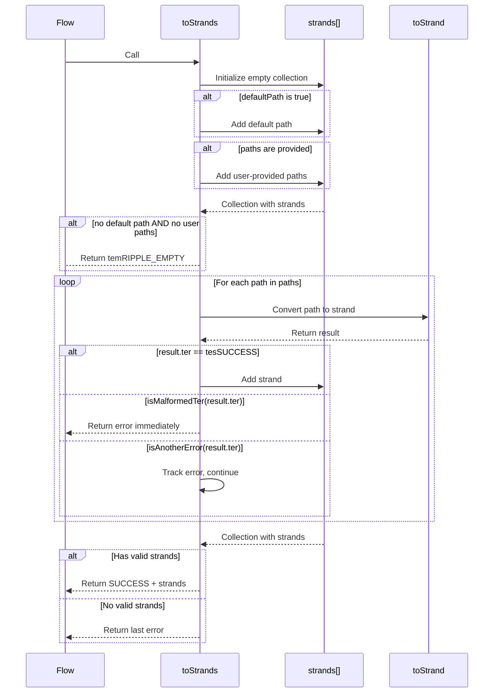
```mermaid
sequenceDiagram
    participant Caller as Flow
    participant toStrands
    participant Strands as strands[]
    participant toStrand
    
    Caller->>toStrands: Call
    toStrands->>Strands: Initialize empty collection
    alt defaultPath is true
        toStrands->>Strands: Add default path
    end
    alt paths are provided
        toStrands->>Strands: Add user-provided paths
    end
    Strands-->>toStrands: Collection with strands
    alt no default path AND no user paths
        toStrands-->Caller: Return temRIPPLE_EMPTY
    end        
    loop For each path in paths
        toStrands->>toStrand: Convert path to strand
        toStrand-->>toStrands: Return result
        alt result.ter == tesSUCCESS
            toStrands->>Strands: Add strand
        else isMalformedTer(result.ter)
            toStrands-->>Caller: Return error immediately
        else isAnotherError(result.ter)
            toStrands->>toStrands: Track error, continue
        end
    end
    Strands-->>toStrands: Collection with strands

    alt Has valid strands
        toStrands-->>Caller: Return SUCCESS + strands
    else No valid strands
        toStrands-->>Caller: Return last error
    end
```

# 5. Path Normalization and Strand Creation (toStrand)

`toStrand`[^tostrand] first normalizes the path and then converts a single path into a strand (sequence of steps).

[^tostrand]: toStrand implementation: [`PaySteps.cpp`](https://github.com/XRPLF/rippled/blob/3.2.0/src/libxrpl/tx/paths/PaySteps.cpp#L170)

**Paths and Path Elements:**

A **path** is a sequence of **path elements** that describe a route through which value can flow. For complete details on path element structure and types, see [Path Elements](../path_finding/README.md#32-path-elements).

`toStrand`'s inputs are similar to `toStrands`, except that instead of passing in multiple paths and `defaultPath` boolean, `toStrands` provides only one path to `toStrand`.

| Parameter              | Description                                                                                      | Required             |
|------------------------|--------------------------------------------------------------------------------------------------|----------------------|
| `view`                 | Read-only view of the ledger state, provides access to account balances, trust lines, and offers | ✅                    |
| `src`                  | Source account ID                                                                                | ✅                    |
| `dst`                  | Destination account ID                                                                           | ✅                    |
| `deliver`              | The asset that should be delivered to the destination                                            | ✅                    |
| `limitQuality`         | The worst acceptable quality from a single strand                                                | ❌                    |
| `sendMaxAsset`         | Maximum user is willing to spend - specifies the asset being spent (if different from deliver)   | ❌                    |
| `path`                 | User-provided payment path - sequence of accounts and/or currency/issuer pairs to route through  | ✅ (but can be empty) |
| `ownerPaysTransferFee` | If true, the offer owner pays transfer fees; if false, the taker pays                            | ✅                    |
| `offerCrossing`        | Enum indicating if this is offer crossing (no/yes/sell)                                          | ✅                    |
| `ammContext`           | Context for Automated Market Maker (AMM) related operations                                      | ❌                    |
| `domainID`             | Domain identifier for the transaction                                                            | ❌                    |

## 5.1. Path Normalization

Before normalization begins, the payment parameters are validated[^payment-validation] to ensure source and destination accounts are valid, assets are consistent, and issuers are properly specified. Then each path element is validated to ensure it is well-formed[^path-validation]. This validation checks that path element field combinations are valid, asset types are used correctly, and MPT-specific constraints are satisfied (MPTs have restrictions on what path elements can follow them since they don't support rippling).

After validation, `toStrand` normalizes the path[^path-normalization] before converting path elements to strand steps.

[^payment-validation]: Payment parameter validation: [`PaySteps.cpp`](https://github.com/XRPLF/rippled/blob/3.2.0/src/libxrpl/tx/paths/PaySteps.cpp#L184-L190)
[^path-validation]: Path element validation: [`PaySteps.cpp`](https://github.com/XRPLF/rippled/blob/3.2.0/src/libxrpl/tx/paths/PaySteps.cpp#L197-L238)
[^path-normalization]: Path normalization implementation: [`PaySteps.cpp`](https://github.com/XRPLF/rippled/blob/3.2.0/src/libxrpl/tx/paths/PaySteps.cpp#L257-L321)

The path is composed of path elements, and normalizing a path means that path elements that are not explicitly defined but are necessary are added to the path.

The normalization process constructs a complete path by adding implied elements in the following order:

1. **Add source element**[^source-element]:
    - Type: `account | issuer | currency` (for Issue) or `account | issuer | MPT` (for MPTIssue)
    - Account: `src`
    - Currency/MPT: `sendMax` if specified, otherwise `deliver`
    - Issuer:
      - For **Issue**: `src`
      - For **MPTIssue**: actual MPT issuer from MPTID

2. **Add SendMax issuer**[^sendmax-issuer]:
    - Type: `account`
    - Account: `sendMax.issuer`
    - Condition: `sendMax` is specified AND `sendMax.issuer` differs from `src` AND the user-provided path does not already start with `sendMax.issuer` as its first account element. This prevents duplicate path elements when users explicitly include the sendMax issuer as the first step in their path.

3. **Add user-provided path elements**[^user-path-elements] (if any exist)

4. **Add delivery currency/MPT conversion**[^delivery-conversion]:
    - Type: `offer` (currency/MPT + issuer)
    - Currency/MPT: `deliver`
    - Issuer: `deliver.issuer` (for Issue) or MPT issuer from MPTID (for MPTIssue)
    - Condition: The last asset in the normalized path differs from `deliver` OR (`offerCrossing` is true AND the last issuer differs from `deliver.issuer`)

5. **Add delivery issuer account**[^delivery-issuer]:
    - Type: `account`
    - Account: `deliver.issuer` (extracted from Issue.account for Issue, or from MPTID for MPTIssue)
    - Condition: The last element in normPath is NOT an account with `deliver.issuer` AND `dst` differs from `deliver.issuer`

6. **Add destination account**[^destination-account]:
    - Type: `account`
    - Account: `dst`
    - Condition: The last element in normPath is NOT an account with `dst`

[^source-element]: https://github.com/XRPLF/rippled/blob/3.2.0/src/libxrpl/tx/paths/PaySteps.cpp#L262-L273
[^sendmax-issuer]: https://github.com/XRPLF/rippled/blob/3.2.0/src/libxrpl/tx/paths/PaySteps.cpp#L275-L284
[^user-path-elements]: https://github.com/XRPLF/rippled/blob/3.2.0/src/libxrpl/tx/paths/PaySteps.cpp#L286-L287
[^delivery-conversion]: https://github.com/XRPLF/rippled/blob/3.2.0/src/libxrpl/tx/paths/PaySteps.cpp#L289-L301
[^delivery-issuer]: https://github.com/XRPLF/rippled/blob/3.2.0/src/libxrpl/tx/paths/PaySteps.cpp#L308-L313
[^destination-account]: https://github.com/XRPLF/rippled/blob/3.2.0/src/libxrpl/tx/paths/PaySteps.cpp#L315-L320

Take for an example a payment in which Alice wants to deliver 100 MPT to Bob and spend USD (IOU) issued by Issuer for it. 

The default path (empty before normalization) will be normalized to:

- Type=0x31: Account: Alice, currency: USD, issuer: Alice 
- Type=0x01: Account: Issuer
- Type=0x60: Order book: USD/MPT
- Type=0x01: Account: Issuer
- Type=0x01: Account: Bob

Here are some example normalization scenarios:

| Scenario     | Path from Path Finding / OfferCreate | Normalized Path Structure                                                                                            |
|--------------|--------------------------------------|----------------------------------------------------------------------------------------------------------------------|
| Issuing IOU  | `[]`                                 | `[Issuer (0x31, currency set to IOU and issuer to self), Alice (0x01)]`                                              |
| IOU to IOU   | `[]`                                 | `[Alice (0x31, with currency set to IOU and issuer to self), Issuer (0x01), Bob (0x01)]`                             |
| XRP to Token | `[XRP/USD offer]`                    | `[Alice (0x31, with issuer set to 0 and currency to XRP), XRP/USD order book (0x30), USD Issuer (0x01), Bob (0x01)]` |
| IOU to XRP   | `[USD/XRP offer]`                    | `[Alice (0x31), USD Issuer, USD/XRP offer (0x30), XRP (0x01, account 0), Bob (0x01)]`                                |
| IOU to MPT   | `[USD/MPT offer]`                    | `[Alice (0x31), USD Issuer, USD/MPT offer (0x60), MPT issuer (0x01), Bob (0x01)]`                                    |
| Issuing MPT  | `[]`                                 | `[Issuer (0x61), Alice (0x01)]`                                                                                      |


## 5.2. Path to Strand Conversion

The conversion process iterates through adjacent pairs of path elements in the normalized path, generating executable steps[^path-to-strand]. Path elements do not map one-to-one to steps; a single pair may generate multiple steps when intermediate issuer hops are required.

[^path-to-strand]: Path to strand conversion implementation: [`PaySteps.cpp`](https://github.com/XRPLF/rippled/blob/3.2.0/src/libxrpl/tx/paths/PaySteps.cpp#L323-L570)

**Core Algorithm:**

1. **Initialize current asset** (`curAsset`)[^curasset-init]:
   - If sending XRP: Set to XRP
   - For IOUs: Set to `Asset(currency, src)`
   - For MPTs: Set to the MPTIssue

[^curasset-init]: curAsset initialization: [`PaySteps.cpp`](https://github.com/XRPLF/rippled/blob/3.2.0/src/libxrpl/tx/paths/PaySteps.cpp#L240-L250)

2. **Iterate through path element pairs** (current and next)[^path-element-iteration] and for each adjacent pair of path elements, the algorithm:
   - Tracks the current asset being transferred by updating `curAsset` based on the current element's fields
   - Injects implied intermediate steps when necessary
   - Calls [`toStep()`](#53-step-generation) to generate the primary step that transfers value between the pair
   - Accumulates all generated steps into the final strand

[^path-element-iteration]: Path element pair iteration: [`PaySteps.cpp`](https://github.com/XRPLF/rippled/blob/3.2.0/src/libxrpl/tx/paths/PaySteps.cpp#L363-L506)

**Implied Step Injection:**

In certain cases, additional steps must be inserted instead of calling `toStep()`:

- **Offer -> Account (XRP output)**[^xrp-endpoint-inject]: When an offer outputs XRP and the next element is an account: if this is the last pair, insert `XRPEndpointStep(next)`; otherwise return `temBAD_PATH` since XRP can only appear at strand endpoints
- **Offer -> Account (IOU output, next is not issuer)**[^direct-step-inject]: When an offer outputs an IOU and the next account is not the issuer, insert `DirectStepI(issuer -> next)` and skip `toStep()` call

[^xrp-endpoint-inject]: XRP endpoint injection: [`PaySteps.cpp`](https://github.com/XRPLF/rippled/blob/3.2.0/src/libxrpl/tx/paths/PaySteps.cpp#L464-L471)
[^direct-step-inject]: Direct step injection after offer: [`PaySteps.cpp`](https://github.com/XRPLF/rippled/blob/3.2.0/src/libxrpl/tx/paths/PaySteps.cpp#L475-L482)

### 5.2.1. Strand Validation Context

The validation context (`StrandContext`)[^strandcontext] serves two purposes during strand construction:

[^strandcontext]: StrandContext struct definition: [`Steps.h`](https://github.com/XRPLF/rippled/blob/3.2.0/include/xrpl/tx/paths/detail/Steps.h#L517)
[^seenassets]: seenDirectAssets and seenBookOuts initialization: [`PaySteps.cpp`](https://github.com/XRPLF/rippled/blob/3.2.0/src/libxrpl/tx/paths/PaySteps.cpp#L338-L343)

1. **Provides execution parameters**: Carries the ledger view, source/destination accounts, quality limits, flags (ownerPaysTransferFee, offerCrossing, etc.), AMM context, the delivered asset (`strandDeliver`), and the order-book domain (`domainID`) needed for step construction and validation

2. **Detects invalid loops**: Tracks which assets have been used[^seenassets] to prevent the same account from appearing multiple times in the same asset and role within a single strand

The context is created at the start of path-to-strand conversion and passed to each step's [`check()`](#533-step-validation-check) method during validation.

**Loop Detection**: The context tracks assets in two collections to prevent counting the same liquidity twice:

**`seenDirectAssets`**: A two-element array of asset sets that tracks assets used in direct transfers and endpoint steps:
- `seenDirectAssets[0]`: Tracks assets where the account acts as the **source** of the asset within a step. For DirectStepI transferring from Alice to Bob, this records the (currency, Alice) pair since Alice is the source account in that step
- `seenDirectAssets[1]`: Tracks assets where the account acts as the **destination** of the asset within a step. For the same DirectStepI, this records the (currency, Bob) pair since Bob is the destination account in that step

This two-index separation allows the same asset to appear legitimately in both roles within a single strand. Consider a holder-to-holder MPT transfer where Alice sends MPT to Bob:

```
Alice (holder) -> Issuer (destination of first step) -> Issuer (source of second step) -> Bob (holder)
```

The issuer appears twice but in different roles. Note that `MPTEndpointStep` keys loop detection by **position** (`isFirst` records into `seenDirectAssets[0]`, `isLast` into `seenDirectAssets[1]`) using the bare MPTIssue, rather than by source/destination role the way `DirectStepI` does:
1. First MPTEndpointStep (`isFirst`): Issuer is the **destination** (Alice redeems MPT to issuer, decreasing OutstandingAmount) - recorded in `seenDirectAssets[0]`
2. Last MPTEndpointStep (`isLast`): Issuer is the **source** (issuer issues MPT to Bob, increasing OutstandingAmount) - recorded in `seenDirectAssets[1]`

This is valid because the issuer acts as an intermediary, receiving tokens in one step and sending them in another. The two indices prevent invalid loops (issuer as source twice, or destination twice) while allowing valid intermediary routing.

**`seenBookOuts`**: A single asset set tracking output assets from order book conversions (BookStep). Each BookStep records its output asset to ensure the same order book doesn't appear multiple times in a strand.

When a step's `check()` method validates, it verifies its asset hasn't been seen before in the appropriate context. If the asset was already present (`.insert().second` returns false), validation fails with `temBAD_PATH_LOOP`.

## 5.3. Step Generation

After path normalization and the main conversion loop (which handles implied steps), the `toStep` function[^tostep] is called for each adjacent pair of path elements to create the appropriate step type. This function acts as a factory that examines the characteristics of the two elements in the pair and selects the correct step implementation.

[^tostep]: toStep implementation: [`PaySteps.cpp`](https://github.com/XRPLF/rippled/blob/3.2.0/src/libxrpl/tx/paths/PaySteps.cpp#L66)

The choice of step type depends on three key factors:
- **Position in strand**: Whether the strand has no steps yet (`ctx.isFirst`, set via `strand.empty()`[^isfirst]) or this is the last element pair in the normalized path (`ctx.isLast`), which affects how XRP is handled
- **Currency types**: Whether the currencies involved are XRP, Token (issued currency), or MPT (multi-purpose token)
- **Element types**: Whether each element in the pair is an Account or an Order Book

**Step selection rules:**

When XRP appears at the beginning or end of a path, `XRPEndpointStep` is created to directly credit or debit the account's XRP balance. In the middle of a path, XRP flows through order books using regular `BookStep` variants.

Account-to-account pairs (both elements in the pair are accounts) create `DirectStepI` when `curAsset` is an IOU. When `curAsset` is an MPT, it creates `MPTEndpointStep`. Unlike trust lines, which can appear in the middle of the strand, MPTs do not support [rippling](../glossary.md#rippling) through intermediary accounts, so they have to be either at the start or the end of the strand and the `BookStep` is directly connected to `MPTEndpointStep`. 

When the second element in the pair is an order book, `toStep` creates `BookStep` variants based on the input and output currency types. There are multiple BookStep combinations covering all pairings of XRP, IOU, and MPT (except XRP->XRP, which is invalid and returns `temBAD_PATH`).

**Step selection rules are:**
- First element in the pair is an account with XRP currency (and this is the first pair in the path) -> `XRPEndpointStep` (source)[^first-xrp]
- First element in the pair is the XRP account (account ID 0) and this is the last pair in the path -> `XRPEndpointStep` (destination)[^last-xrp]
- Both elements in the pair are accounts[^account-account]:
  - If `curAsset` is IOU: `DirectStepI` (trust line transfer)[^directstepi]
  - If `curAsset` is MPT: `MPTEndpointStep`[^mptendpointstep]
- First element in the pair is an order book, second element is an account -> UNREACHABLE (should be handled by [implied step injection logic](#52-path-to-strand-conversion))[^offer-account]
- Second element in the pair is an order book -> `BookStep` variant[^offer-element]:
  - IOU -> XRP: `BookStepIX`[^bookstep-ix]
  - XRP -> IOU: `BookStepXI`[^bookstep-xi]
  - IOU -> IOU: `BookStepII`[^bookstep-ii]
  - MPT -> XRP: `BookStepMX`[^bookstep-mx]
  - XRP -> MPT: `BookStepXM`[^bookstep-xm]
  - MPT -> MPT: `BookStepMM`[^bookstep-mm]
  - MPT -> IOU: `BookStepMI`[^bookstep-mi]
  - IOU -> MPT: `BookStepIM`[^bookstep-im]
  - XRP -> XRP: Error (`temBAD_PATH`)[^bookstep-xrp-xrp]

[^isfirst]: isFirst initialization: [`PaySteps.cpp`](https://github.com/XRPLF/rippled/blob/3.2.0/src/libxrpl/tx/paths/PaySteps.cpp#L709)
[^first-xrp]: First XRP element check: [`PaySteps.cpp`](https://github.com/XRPLF/rippled/blob/3.2.0/src/libxrpl/tx/paths/PaySteps.cpp#L74-L78)
[^last-xrp]: Last XRP element check: [`PaySteps.cpp`](https://github.com/XRPLF/rippled/blob/3.2.0/src/libxrpl/tx/paths/PaySteps.cpp#L80-L81)
[^account-account]: Account to account check: [`PaySteps.cpp`](https://github.com/XRPLF/rippled/blob/3.2.0/src/libxrpl/tx/paths/PaySteps.cpp#L98-L108)
[^directstepi]: DirectStepI creation: [`PaySteps.cpp`](https://github.com/XRPLF/rippled/blob/3.2.0/src/libxrpl/tx/paths/PaySteps.cpp#L105-L107)
[^mptendpointstep]: MPTEndpointStep creation: [`PaySteps.cpp`](https://github.com/XRPLF/rippled/blob/3.2.0/src/libxrpl/tx/paths/PaySteps.cpp#L101-L104)
[^offer-account]: Offer to account unreachable: [`PaySteps.cpp`](https://github.com/XRPLF/rippled/blob/3.2.0/src/libxrpl/tx/paths/PaySteps.cpp#L110-L118)
[^offer-element]: Offer element assertion: [`PaySteps.cpp`](https://github.com/XRPLF/rippled/blob/3.2.0/src/libxrpl/tx/paths/PaySteps.cpp#L136)
[^bookstep-ix]: BookStepIX creation: [`PaySteps.cpp`](https://github.com/XRPLF/rippled/blob/3.2.0/src/libxrpl/tx/paths/PaySteps.cpp#L142)
[^bookstep-xi]: BookStepXI creation: [`PaySteps.cpp`](https://github.com/XRPLF/rippled/blob/3.2.0/src/libxrpl/tx/paths/PaySteps.cpp#L149)
[^bookstep-ii]: BookStepII creation: [`PaySteps.cpp`](https://github.com/XRPLF/rippled/blob/3.2.0/src/libxrpl/tx/paths/PaySteps.cpp#L164)
[^bookstep-mx]: BookStepMX creation: [`PaySteps.cpp`](https://github.com/XRPLF/rippled/blob/3.2.0/src/libxrpl/tx/paths/PaySteps.cpp#L141)
[^bookstep-xm]: BookStepXM creation: [`PaySteps.cpp`](https://github.com/XRPLF/rippled/blob/3.2.0/src/libxrpl/tx/paths/PaySteps.cpp#L148)
[^bookstep-mm]: BookStepMM creation: [`PaySteps.cpp`](https://github.com/XRPLF/rippled/blob/3.2.0/src/libxrpl/tx/paths/PaySteps.cpp#L158)
[^bookstep-mi]: BookStepMI creation: [`PaySteps.cpp`](https://github.com/XRPLF/rippled/blob/3.2.0/src/libxrpl/tx/paths/PaySteps.cpp#L156)
[^bookstep-im]: BookStepIM creation: [`PaySteps.cpp`](https://github.com/XRPLF/rippled/blob/3.2.0/src/libxrpl/tx/paths/PaySteps.cpp#L162)
[^bookstep-xrp-xrp]: XRP to XRP error: [`PaySteps.cpp`](https://github.com/XRPLF/rippled/blob/3.2.0/src/libxrpl/tx/paths/PaySteps.cpp#L130-L134)

**Example: IOU to different IOU Payment with MPT bridge**

For example, Alice sends USD and the payment is converted through two order books (USD to MPT, then MPT to EUR) before Bob receives EUR. The normalized path would look like:
```
[0] Type=0x31: Account=Alice, Currency=USD, Issuer=Alice
[1] Type=0x01: Account=Issuer
[2] Type=0x60: Issuer=Issuer, MPT=000005FF73F0 (order book element)
[3] Type=0x30: Currency=EUR, Issuer=Issuer (order book element)
[4] Type=0x01: Account=Issuer
[5] Type=0x01: Account=Bob
```

`toStrand` iterates over each cur -> next pair. Initially: `curAsset = Issue(USD, Alice)`.

**Pair [0]->[1]**: Account(Alice, USD, Alice) -> Account(Issuer)
- Update curAsset: element [0] is Account with Currency = USD -> `curAsset = Alice/USD`
- Call `toStep([0], [1], Issue(USD, Alice))`
- Creates: `DirectStepI(Alice -> Issuer)`

**Pair [1]->[2]**: Account(Issuer) -> Offer(Issuer, MPT)
- Update curAsset: element [1] is Account -> issuer becomes Issuer -> `curAsset = Issuer/USD`
- Call `toStep([1], [2], Issue(USD, Issuer))`
- Creates: `BookStepIM(USD/Issuer -> MPT)`

**Pair [2]->[3]**: Offer(Issuer, MPT) -> Offer(EUR, Issuer)
- Update curAsset: element [2] has MPT -> `curAsset = 000005FF73F0/MPT`
- Call `toStep([2], [3], MPT(000005FF73F0))`
- Creates: `BookStepMI(MPT -> EUR/Issuer)`

**Pair [3]->[4]**: Offer(EUR, Issuer) -> Account(Issuer)
- Update curAsset: element [3] is Offer with Currency(EUR) -> MPT->IOU transition -> `curAsset = Issuer/EUR`
- Offer->Account case: output issuer (Issuer) equals account (Issuer) -> no implied step needed
- **No step created** (continue, skip toStep)

**Pair [4]->[5]**: Account(Issuer) -> Account(Bob)
- Update curAsset: element [4] is Account -> `curAsset = Issuer/EUR` (unchanged)
- Call `toStep([4], [5], Issue(EUR, Issuer))`
- Creates: `DirectStepI(Issuer -> Bob)`

**Resulting Strand:**
1. DirectStepI: Alice -> Issuer (USD)
2. BookStepIM: USD/Issuer -> MPT
3. BookStepMI: MPT -> EUR/Issuer
4. DirectStepI: Issuer -> Bob (EUR)

**Example: MPT to Different MPT Payment with MPT bridge**

For example, Alice wants to send MPT/B to Bob and pay for it using MPT/A. There is an `MPT/A / MPT/B` offer in the order book. The normalized path looks like:

```
[0] Type=0x61: Account: Alice, Issuer: Issuer, MPT: MPT/A
[1] Type=0x01: Account: Issuer
[2] Type=0x60: Issuer: Issuer, MPT: MPT/B (order book element)
[3] Type=0x01: Account: Issuer
[4] Type=0x01: Account: Bob
```

`toStrand` iterates over each cur -> next pair. Initially: `curAsset = MPTIssue(MPT/A)`.

**Pair [0]->[1]**: Account(Alice, MPT/A, Issuer) -> Account(Issuer)
- Update curAsset: element [0] is Account with MPT = MPT/A -> `curAsset = MPT/A`
- Call `toStep([0], [1], MPTIssue(MPT/A))`
- Creates: `MPTEndpointStep(Alice -> Issuer)`

**Pair [1]->[2]**: Account(Issuer) -> Offer(Issuer, MPT/B)
- Update curAsset: element [1] is Account -> `curAsset = MPT/A` (unchanged)
- Call `toStep([1], [2], MPTIssue(MPT/A))`
- Creates: `BookStepMM(MPT/A -> MPT/B)`

**Pair [2]->[3]**: Offer(Issuer, MPT/B) -> Account(Issuer)
- Update curAsset: element [2] has MPT = MPT/B -> `curAsset = MPT/B`
- Offer->Account case: output issuer (Issuer) equals account (Issuer) -> no implied step needed
- **No step created** (continue, skip toStep)

**Pair [3]->[4]**: Account(Issuer) -> Account(Bob)
- Update curAsset: element [3] is Account -> `curAsset = MPT/B` (unchanged)
- Call `toStep([3], [4], MPTIssue(MPT/B))`
- Creates: `MPTEndpointStep(Issuer -> Bob)`

**Resulting Strand:**
1. MPTEndpointStep: Alice -> Issuer (MPT/A)
2. BookStepMM: MPT/A -> MPT/B
3. MPTEndpointStep: Issuer -> Bob (MPT/B)


### 5.3.1. Step Generation Pseudo-Code

**Asset Representation**

During path-to-strand conversion, the algorithm tracks the current asset flowing through the path using `curAsset`, which is a variant that can hold either:

- **Issue**: Represents XRP or IOU (issued currency). Has two separate fields:
  - `currency`: The IOU currency code (or special XRP currency code)
  - `account`: The issuer's account ID (for IOUs) or special zero account (for XRP)

  These fields are independently mutable - a path element might update just the currency, just the issuer, or both.

- **MPTIssue**: Represents MPT (multi-purpose token). Has a single field:
  - `mptID`: The MPT identifier with the issuer embedded within it

  The issuer is immutable once the MPT is created, so the entire `mptID` must be replaced when switching between different MPTs.

```python
# Local state for path -> strand conversion (toStrand)
normPath: list[PathElement]   # path with implied source/dest/issuer hops added (see 5.1)
curAsset: Issue | MPTIssue    # the asset currently flowing; updated as we walk the path
result:   list[Step]          # the strand being built
# loop-guard sets (seenDirectAssets, seenBookOuts) travel in StrandContext (see 5.2.1)

def toStrand():
    validate_path_elements()          # reject malformed elements early, returns temBAD_PATH
    normPath = normalize(path)        # add implied source, destination, issuer hops (5.1)

    # Asset leaving the source. It is sendMax's asset if given, otherwise the
    # deliver asset, resolved to XRP, the source's own IOU issuance, or the MPT.
    curAsset = starting_asset()

    # Walk adjacent element pairs. A step is built for `next`, so when `cur` is an
    # offer and `next` is an account the offer's step already exists and is skipped.
    for cur, next in adjacent_pairs(normPath):
        curAsset = advance_asset(curAsset, cur)

        if cur.is_offer() and next.is_account():
            # The offer already produced its step. The only case left is an offer
            # paying out to a non-issuer account (the closing hop). Add a closing
            # DirectStepI, or an XRPEndpointStep when the asset is XRP.
            add_closing_step_if_needed(curAsset, next)
            continue

        result.append(toStep(cur, next, curAsset))   # build the step for this pair (5.3.2)

    check_strand(result)              # sanity-check connectivity and final asset
    return result


def advance_asset(curAsset, cur):
    # Switch from MPT to Currency if needed
    if curAsset is MPT and cur.has_currency():
        curAsset = empty_issue()
    # Update curAsset account (only for Issue, not MPTIssue)
    if curAsset is Issue:
        if cur.is_account():
            curAsset.issuer = cur.account
        elif cur.has_issuer():
            curAsset.issuer = cur.issuer
    # Update curAsset currency/MPT
    if cur.has_currency():
        curAsset.currency = cur.currency    # XRP currency also clears the issuer
    elif cur.has_mpt():
        curAsset = cur.mpt                  # whole MPT replaced, its issuer is fixed
    return curAsset
```

> The implementation also contains two implied-step branches for `account->account` and `account->offer` pairs. The xrpld developers determined these are unreachable: `curAsset`'s issuer is always set to `cur`'s account just before the check, so their guards are always false. They are omitted here. See [`PaySteps.cpp:423-456`](https://github.com/XRPLF/rippled/blob/3.2.0/src/libxrpl/tx/paths/PaySteps.cpp#L423-L456).

### 5.3.2. toStep Pseudo-Code

```python
# toStep is a factory: given an adjacent pair (e1, e2) and the flowing asset,
# it picks and builds the right Step subclass.
def toStep(e1, e2, curAsset):
    # XRP at a strand endpoint becomes an XRPEndpointStep (source or destination).
    if is_first and e1 is an XRP account:
        return XRPEndpointStep(source = e1)
    if is_last and e1 is an XRP account and e2 is an account:
        return XRPEndpointStep(dest = e2)

    # Account to account moves one asset directly between two accounts.
    if e1 is an account and e2 is an account:
        if curAsset is MPT:
            return MPTEndpointStep(e1, e2, curAsset)
        return DirectStepI(e1, e2, curAsset)      # IOU over a trust line

    # An offer paired with an account is resolved by the caller, so it never
    # reaches here.
    if e1 is an offer and e2 is an account:
        unreachable()

    # Otherwise e2 is an order book. Build the BookStep variant that matches the
    # (input asset, output asset) types. XRP paired with XRP is rejected. The full
    # variant list is in the BookStep selection table above (section 5.3).
    out_asset, out_issuer = book_output(e2, curAsset)
    if curAsset is XRP and out_asset is XRP:
        return temBAD_PATH
    return make_book_step(curAsset, out_asset, out_issuer)
```

### 5.3.3. Step Validation (`check`)

After each step is created by its factory function (`make_DirectStepI`, `make_BookStepII`, etc.), the step is immediately validated using its `check()` method before being added to the strand.

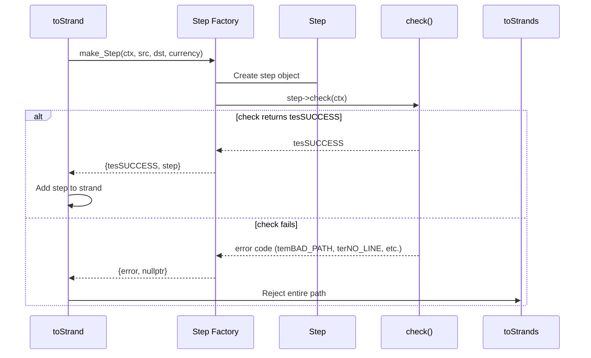
```mermaid
sequenceDiagram
    participant toStrand
    participant Factory as Step Factory
    participant Step
    participant check as check()

    toStrand->>Factory: make_Step(ctx, src, dst, currency)
    Factory->Step: Create step object
    Factory->>check: step->check(ctx)
    alt check returns tesSUCCESS
        check-->>Factory: tesSUCCESS
        Factory-->>toStrand: {tesSUCCESS, step}
        toStrand->>toStrand: Add step to strand
    else check fails
        check-->>Factory: error code (temBAD_PATH, terNO_LINE, etc.)
        Factory-->>toStrand: {error, nullptr}
        toStrand->>toStrands: Reject entire path
    end
```
*Figure: Step factory and calling **check()** for validation*

If `check()` fails, the entire path is rejected and `toStrand` returns an error code to `toStrands`.

Each step type has specific validation requirements detailed in the [Steps documentation](steps.md).

# 6. Iterative Strands Evaluation (strandsFlow)

> Iterative Strands Evaluation is a function called `flow` in `xrpld`[^strandsflow]. Here we call it `strandsFlow` to differentiate between the primary `flow` function and `strandFlow` function which executes a single strand.

[^strandsflow]: strandsFlow implementation: [`StrandFlow.h`](https://github.com/XRPLF/rippled/blob/3.2.0/include/xrpl/tx/paths/detail/StrandFlow.h#L556)

So far, the Flow engine has been constructing a possible set of steps that a payment can take. `Iterative Strands Evaluation` is interested in executing those strands to see if they have enough liquidity, and which ones produce the best quality.
It executes a payment across multiple strands using iterative liquidity consumption, with all changes tracked in a PaymentSandbox (in-memory ledger view) that can be committed or discarded.

The inputs to this function are: 

| Parameter | Description                                                                | Required                    |
|-----------|----------------------------------------------------------------------------|-----------------------------|
| `baseView` | [PaymentSandbox](../transactions/README.md#5-ledger-views-and-sandboxes) with current trust lines and balances - base state before payment execution | ✅                    |
| `strands` | Vector of strands to use for payment - each strand is a sequence of steps  | ✅                    |
| `outReq` | Requested output amount to deliver (templated type: XRPAmount or IOUAmount) | ✅                    |
| `partialPayment` | If true, allow delivering less than full amount; if false, must deliver exact amount or fail | ✅                    |
| `offerCrossing` | Enum indicating if this is offer crossing (no/yes/sell) | ✅                    |
| `limitQuality` | Minimum quality threshold - strands below this quality are excluded        | ❌                    |
| `sendMaxST` | Maximum amount sender is willing to spend (STAmount format)                | ❌                    |
| `ammContext` | Context for tracking AMM (Automated Market Maker) offer iterations         | ✅                     |

The strands `flow` function iterates through multiple liquidity passes, consuming liquidity from the available strands in each pass. Each pass selects and executes the best-quality (lowest exchange rate) strand from those remaining. 
The iteration continues until the payment is complete, liquidity at appropriate quality has been exhausted or one of iteration limits has been exceeded. 

Each iteration performs:

1. **Check iteration limit**: If the number of iterations has reached the maximum (1000), exit with error (telFAILED_PROCESSING).

2. **Sort remaining strands** by quality. The remaining strands are those passed to this function and not yet fully consumed or permanently discarded in previous iterations.

3. **AMM optimization** (when applicable): If only one strand remains with a `limitQuality` requirement, calculate the maximum output amount that maintains acceptable average quality. AMM pools degrade in quality as liquidity is consumed, so this pre-calculation ensures the requested amount won't violate the quality threshold.

4. **Evaluate each strand** in quality order:
    - If the strand's quality is below `limitQuality` (when defined), permanently remove it from consideration
    - If the strand is dry (no liquidity available), reject it and continue to the next strand
    - Otherwise, execute the strand:
        - Consume liquidity from the strand
        - Update `remainingOut` (recomputed as `outReq - sum(deliveredOut)`, summed smallest-to-largest for precision, not decremented in place)
        - Update `remainingIn` likewise (`sendMax - sum(consumedIn)`, if `sendMax` is defined)
        - If the strand still has liquidity available after consumption, add it to the queue for the next iteration
        - Add all subsequent unevaluated strands to the queue for the next iteration
        - Continue to the next iteration (do not evaluate remaining strands in this iteration)

5. **Termination check**: Exit the outer loop if any of the following conditions are met:
   - No strand was successfully used in this iteration (no best strand found)
   - The full requested output amount has been delivered (remainingOut <= 0)
   - The maximum input amount has been exhausted (remainingIn <= 0, when sendMax is defined)
   - The maximum number of offers to consider has been reached (offersConsidered >= 1500)


Throughout the strand evaluation, `strandsFlow` collects offers that are unusable and need to be removed (unfunded or expired offers). These offers are removed via `offerDelete()` calls on the [PaymentSandbox](../transactions/README.md#5-ledger-views-and-sandboxes) - a writable ledger view (an in-memory layer that tracks modifications before committing them to the actual ledger). If the payment succeeds, the PaymentSandbox is applied and the offer deletions propagate to the ledger. If the payment fails, the PaymentSandbox is discarded, but `strandsFlow` returns all collected `offersToRemove` to its caller, who is responsible for cleaning them up even on failure.

**Final Validation:**

After the iteration loop completes, `strandsFlow` calculates the total amounts consumed and delivered by summing all individual iteration results (smallest to largest for precision). It then validates the results (assuming the `fixFillOrKill` amendment is enabled, which is the current behavior):

- **Sanity check**: If `actualOut > outReq`, this indicates a rounding error and returns `tefEXCEPTION`
- **Partial payment validation**: If the full `outReq` was not delivered:
  - For regular payments with `partialPayment=false`, returns `tecPATH_PARTIAL` (payment failed)
  - For offer crossing with `FillOrKill` flag:
    - Without `tfSell`: Must deliver full `TakerPays` (outReq), otherwise returns `tecPATH_PARTIAL`
    - With `tfSell`: Must consume full `TakerGets` (remainingIn must be zero), otherwise returns `tecPATH_PARTIAL`
  - For partial payments, if `actualOut` is zero, returns `tecPATH_DRY` (no liquidity found)
  - Otherwise, the partial payment succeeds with whatever was delivered

If all validations pass, returns success with the actual amounts consumed/delivered and the PaymentSandbox containing all ledger modifications.

**Example: Cross currency payment with three strands**

Alice wants to send 100 EUR (IOU) to Bob using her USD (IOU). Her SendMax is 1000 USD and she does not set a quality limit. 

Liquidity is provided by:
- **AMM Pool**: 100 USD <-> 100 EUR (0.3% fee)
- **CLOB Offer**: takerPays=20 USD, takerGets=20 XRP
- **CLOB Offer**: takerPays=18 XRP, takerGets=20 EUR
- **CLOB Offer**: takerPays=20 USD, takerGets=20 ICC
- **CLOB Offer**: takerPays=24 ICC, takerGets=20 EUR

Available strands are: 

1. Strand 0 (XRP):
   - DirectStepI: Alice -> Issuer (USD)
   - BookStep: USD/Issuer -> XRP
   - BookStep: XRP -> EUR/Issuer
   - DirectStepI: Issuer -> Bob (EUR)
2. Strand 1 (AMM):
   - DirectStepI: Alice -> Issuer (USD)
   - BookStep: USD/Issuer -> EUR/Issuer 
   - DirectStepI: Issuer -> Bob (EUR)
3. Strand 2 (ICC):
   - DirectStepI: Alice -> Issuer (USD)
   - BookStep: USD/Issuer -> ICC/Issuer
   - BookStep: ICC/Issuer -> EUR/Issuer
   - DirectStepI: Issuer -> Bob (EUR)

*Iteration 0*

- Remaining out: 100 EUR, remaining in: 1000 USD
- Ranking:
    - XRP strand, quality: 0.9 (best)
    - AMM strand, quality: ~1.003
    - ICC strand, quality: 1.2
- Selected: XRP strand
- Consumed: 18 USD -> 20 EUR

*Iteration 1-12*

- Remaining out: 80 EUR -> .. -> 74.219 EUR, remaining in: 982 USD -> 975.845 USD
- Ranking:
  - AMM strand, quality: ~1.003 .. ~1.175
  - ICC strand, quality: 1.2
- Selected: AMM strand
- AMM uses **Multi-Path Mode** ([steps.md section 5.4.3.2](steps.md#5432-multi-path-mode-fibonacci-sequence-sizing)) with Fibonacci sequence sizing because multiple strands are available. Offers start tiny (0.025% of pool) and grow exponentially, allowing the AMM to win iterations at competitive quality while quality degrades along the slippage curve.
- AMM iterations: 
    - Iteration 1: multiplier=1, consumed 0.025 USD -> 0.0249 EUR
    - Iteration 2: multiplier=1, consumed 0.025 USD -> 0.0249 EUR
    - Iteration 3: multiplier=2, consumed 0.050 USD -> 0.0498 EUR
    - Iteration 4: multiplier=3, consumed 0.075 USD -> 0.0748 EUR
    - Iteration 5: multiplier=5, consumed 0.126 USD -> 0.125 EUR
    - Iteration 6: multiplier=8, consumed 0.202 USD -> 0.199 EUR
    - Iteration 7: multiplier=13, consumed 0.330 USD -> 0.324 EUR
    - Iteration 8: multiplier=21, consumed 0.537 USD -> 0.523 EUR
    - Iteration 9: multiplier=34, consumed 0.881 USD -> 0.847 EUR
    - Iteration 10: multiplier=55, consumed 1.458 USD -> 1.371 EUR
    - Iteration 11: multiplier=89, consumed 2.448 USD -> 2.218 EUR
    - Iteration 12: multiplier=144, consumed 4.216 USD -> 3.588 EUR

*Iteration 13*

- Remaining: ~70.631 EUR
- Ranking:
    - AMM strand, quality: ~1.305
    - ICC strand, quality: 1.2
- Selected: ICC strand
- Consumed: 20 USD -> 16.667 EUR

*Iteration 14*

- Remaining: ~53.964 EUR
- Ranking:
    - AMM strand (only strand remaining). During ranking, Multi-Path mode is used for calculating, because at this point it's not clear that there will be only one strand remaining.
- Selected: AMM strand
- AMM switches to **Single-Path Mode** ([steps.md section 5.4.3.3](steps.md#5433-single-path-mode-clob-matching-sizing)) because only one strand remains. The AMM consumes a large portion of the pool to complete the payment, resulting in significant quality degradation (quality ~3.019 vs ~1.305 in multi-path mode).
- Consumed: ~162.925 USD -> ~53.964 EUR

Payment was completed: Alice delivered 100 EUR to Bob, while paying ~211.296 USD. 

**Example: Cross currency payment with three strands and quality limit**

Now, let us consider the same setup as before but this time, SendMax is 250 USD and the payment has a flag of `tfLimitQuality`. This means that the effective quality limit per-strand is 2.5.

Up to including iteration 13, the payment will behave exactly the same. However, iteration 14 will be different.

The code will, like in the previous example, first rank the strands using multi-path AMM logic. However, we do have limit quality and AMM optimization will be invoked.

New output limit for this step will be set to ~46.350 EUR. Since partial payments are not provided, that is less than the required 53.964, so the payment would fail.


## 6.1. strandsFlow Pseudo-Code

Please note that the following pseudocode is a simplified version of the logic. It represents `activeStrands` at a high level, as re-ranking the surviving strands and re-queuing them, while abstracting the exact mechanics of the `ActiveStrands` class.

```python
# Local state for iterative evaluation (strandsFlow)
sb:            PaymentSandbox      # writable layer over baseView for this whole evaluation
remainingOut:  Amount             # how much is still to be delivered
remainingIn:   Optional[Amount]   # how much the source may still spend (from sendMax)
activeStrands: list[Strand]       # strands still worth trying, re-ranked each pass
savedIns, savedOuts: list[Amount] # per-pass amounts, summed smallest-first for precision

def strandsFlow():
    sb = PaymentSandbox(baseView)
    remainingOut = outReq
    remainingIn = sendMax                 # None when no sendMax was given

    # Each pass consumes liquidity from the single best strand. Loop until the
    # output is delivered, the sendMax is spent, or no strand can deliver more.
    while remainingOut > 0 and (remainingIn is None or remainingIn > 0):
        if passes >= 1000:                # safety cap
            return telFAILED_PROCESSING

        # Better quality strands will be first
        activeStrands = rank_by_quality(activeStrands, limitQuality)
        ammContext.multiPath = (len(activeStrands) > 1)

        # AMM optimization: When only one strand with limitQuality exists, calculate the maximum
        # output that maintains acceptable average quality. AMM pools degrade in quality as
        # liquidity is consumed, so we pre-calculate how much we can safely request without
        # violating the quality threshold (limitOut, section 6.3).
        target_out = remainingOut
        if len(activeStrands) == 1 and limitQuality:
            target_out = limitOut(sb, activeStrands[0], remainingOut, limitQuality)

        # Walk strands best-first and take the first acceptable one.
        best = None
        for strand in activeStrands:
            # Clear AMM liquidity flag before evaluating each strand
            ammContext.clear()
            # If we are crossing offers, and limitQuality is defined, there is no leeway given.
            # Do not consider any strand that has a lower quality.
            if offerCrossing and limitQuality and qualityUpperBound(strand) < limitQuality:
                continue
            f = strandFlow(strand, remainingIn, target_out)   # evaluate one strand (section 7)
            record_dead_offers(f)
            if not f.success or f.out == 0:
                continue                  # strand is dry or failed
            # Reject the path if quality is below the limit quality. If we did reduce remaining
            # out, we give quality some slack.
            if limitQuality and quality(f) < limitQuality and not amm_slack(f):
                continue
            best = f
            # The strand still has liquidity available, so we add it to strands to still consider
            # in another iteration
            if f still has liquidity:
                requeue(strand)
            requeue(strands after this one)
            break

        if best:
            best.sandbox.apply(sb)        # commit this pass into sb
            ammContext.update()
            savedOuts.add(best.out); savedIns.add(best.in)
            remainingOut = outReq - sum(savedOuts)
            remainingIn = sendMax - sum(savedIns)     # when sendMax is set
        remove_dead_offers(sb)

        # Break out of while (outer) loop if we did not find a good strand or we used too many offers
        if best is None or offers_considered >= 1500:
            break

    # Sum amounts from smallest to largest for better precision (avoids rounding errors)
    actualOut = sum(savedOuts)
    actualIn = sum(savedIns)
    return finalize_result(actualIn, actualOut)


# finalize_result picks the return code from how much was delivered:
#   delivered == requested                        -> success (commit sb)
#   delivered  > requested                        -> tefEXCEPTION (rounding sanity check)
#   delivered  < requested and not partialPayment -> tecPATH_PARTIAL
#   delivered == 0 and partialPayment             -> tecPATH_DRY
# Sell-mode offer crossing adds a fill-or-kill check on leftover sendMax (omitted here).
```

## 6.2. qualityUpperBound

The [`StrandFlow::qualityUpperBound`](https://github.com/XRPLF/rippled/blob/3.2.0/include/xrpl/tx/paths/detail/StrandFlow.h#L325-L343) function computes the composite quality of a strand. It is used in two places during `strandsFlow` execution:

1. **Sorting**: At the start of each `strandsFlow` iteration (the outer loop that continues until all liquidity is consumed or the payment is satisfied) to rank remaining strands by quality[^sorting-code]
2. **Filtering**: In the inner loop that evaluates strands in quality order within each iteration, to reject strands below the `limitQuality` threshold[^filtering-code]

[^sorting-code]: See [`qualityUpperBound` call in `ActiveStrands::activateNext` in StrandFlow.h](https://github.com/XRPLF/rippled/blob/3.2.0/include/xrpl/tx/paths/detail/StrandFlow.h#L463)
[^filtering-code]: See [`qualityUpperBound` call in `flow` function in StrandFlow.h](https://github.com/XRPLF/rippled/blob/3.2.0/include/xrpl/tx/paths/detail/StrandFlow.h#L671) 

**Quality Calculation:**

A strand's quality upper bound is the **composite quality of all steps in the strand**, calculated as:

$$Q_{strand} = \prod_{i=1}^{n} q_i$$

where $q_i$ is the quality of step $i$. (Individual step quality calculation is discussed in the [Steps documentation](steps.md).)

**Quality Filtering:**

During sorting, if `limitQuality` is provided and a strand's composite quality is worse than `limitQuality`, the strand is permanently removed from consideration.

**Dynamic Quality Changes:**

Strands are re-sorted in every iteration because their quality can change after partial consumption:

- **Account state transitions**: An account can transition from redeeming to issuing as balances change
- **AMM liquidity effects**: Automated Market Maker quality changes as liquidity is consumed
- **Order book updates**: When an offer is consumed, the order book's quality changes to reflect the next best offer

There is no guarantee that this quality will actually be achieved. For example, an offer may be unfunded in which case the strand may not achieve this quality. 

## 6.3. limitOut

The [`limitOut`](https://github.com/XRPLF/rippled/blob/3.2.0/include/xrpl/tx/paths/detail/StrandFlow.h#L355-L414) function calculates the maximum output amount for a strand containing AMM liquidity that maintains a specified quality threshold. This is an AMM-specific optimization applied only when:[^limitout-call]
- There is a single strand available
- A `limitQuality` threshold is specified
- The strand contains at least one AMM step (a `BookStep` with AMM liquidity)

[^limitout-call]: See [`limitOut` call in `flow` function in StrandFlow.h](https://github.com/XRPLF/rippled/blob/3.2.0/include/xrpl/tx/paths/detail/StrandFlow.h#L647)

Unlike CLOB offers which have fixed quality, AMM pools exhibit dynamic quality that degrades as more liquidity is consumed. AMMs use a constant product invariant: `poolGets * poolPays = (poolGets + in * cfee) * (poolPays - out)`. Solving for `in` and substituting into `q = out / in` gives:

$$q(out) = cfee \times \frac{poolPays - out}{poolGets} = \frac{-cfee}{poolGets} \times out + \frac{cfee \times poolPays}{poolGets}$$

Quality degrades as more output is consumed. Reducing the output increases quality, which is why `limitOut` can find the exact output where quality equals `limitQuality`.

The function will loop over steps in strands and get the quality function for each step. Steps like `XRPEndpointStep`, `MPTEndpointStep` and `DirectStepI` will have a constant quality function.[^constant-quality] A `BookStep` with `AMM` offer will have a dynamic quality function.[^dynamic-quality]

All quality functions are combined and a composed quality function is created which will not be constant if at least one quality within it is not constant.[^isconst]

If the composite quality function is constant (all steps have fixed quality), then the strand's quality won't change regardless of the amount consumed. In this case, `limitOut` returns the original `remainingOut` unchanged since the optimization doesn't apply. The strand will either meet the quality threshold for the full amount or fail entirely.

When the composite quality function is non-constant (contains at least one AMM step), `limitOut` uses [`qualityFunction.outFromAvgQ(limitQuality)`][outfromavgq] to mathematically solve for the maximum output amount where the average quality equals `limitQuality`.

Quality functions represent average quality as a linear function of output: `q(out) = m * out + b`. The parameters `m` and `b` differ based on the liquidity source:

**For AMM steps:**
- `m` (slope) = [`-cfee / amounts.in`][amm-m] - captures how quality degrades as more is consumed from the AMM pool, where `amounts.in` is `poolGets` and [`cfee = 1 - tfee`][cfee] is the fee multiplier
- `b` (intercept) = [`amounts.out * cfee / amounts.in`][amm-b] - represents the initial quality when no liquidity has been consumed, derived from `poolPays / poolGets`, adjusted by the fee multiplier

**For CLOB offers:**
- `m` = [`0`][clob-m] - no quality degradation (fixed quality)
- `b` = [`1 / quality.rate()`][clob-b] - the offer's fixed quality

When multiple steps are combined, their quality functions are composed to create a strand-level quality function.

The `outFromAvgQ` function inverts this relationship to solve for output: `out = (1/quality.rate() - b) / m`.

A special case is handled when there is no positive `out` for the desired `limitQuality`, when `outFromAvgQ` returns a null result to indicate this is the case.

[amm-m]: https://github.com/XRPLF/rippled/blob/3.2.0/include/xrpl/protocol/QualityFunction.h#L78
[amm-b]: https://github.com/XRPLF/rippled/blob/3.2.0/include/xrpl/protocol/QualityFunction.h#L79
[cfee]: https://github.com/XRPLF/rippled/blob/3.2.0/include/xrpl/protocol/AMMCore.h#L87-L90
[clob-m]: https://github.com/XRPLF/rippled/blob/3.2.0/src/libxrpl/protocol/QualityFunction.cpp#L14
[clob-b]: https://github.com/XRPLF/rippled/blob/3.2.0/src/libxrpl/protocol/QualityFunction.cpp#L18
[outfromavgq]: https://github.com/XRPLF/rippled/blob/3.2.0/src/libxrpl/protocol/QualityFunction.cpp#L31-L42
[^constant-quality]: See default `Step::getQualityFunc` implementation which returns `CLOBLikeTag` in [Steps.h](https://github.com/XRPLF/rippled/blob/3.2.0/include/xrpl/tx/paths/detail/Steps.h#L289-L295)
[^dynamic-quality]: See `BookStep::getQualityFunc` implementation which checks `isConst()` and returns AMM quality function in [BookStep.cpp](https://github.com/XRPLF/rippled/blob/3.2.0/src/libxrpl/tx/paths/BookStep.cpp#L590-L621), and `AMMOffer::getQualityFunc` in [AMMOffer.cpp](https://github.com/XRPLF/rippled/blob/3.2.0/src/libxrpl/tx/paths/AMMOffer.cpp#L124-L129), which returns the dynamic `AMMTag` quality function only in single-path mode (in multi-path mode it returns a constant `CLOBLikeTag` function)
[^isconst]: Quality functions constructed with `CLOBLikeTag` are constant (return `true` for `isConst()`), while those constructed with `AMMTag` are non-constant. See [QualityFunction.h](https://github.com/XRPLF/rippled/blob/3.2.0/include/xrpl/protocol/QualityFunction.h#L57-L60) 

# 7. Single Strand Evaluation (strandFlow)

> Single Strand Evaluation is a function called `flow` in `xrpld`[^strandflow-impl]. Here we call it `strandFlow` to differentiate between the primary `flow` function and `strandsFlow` function which evaluates a vector of strands

`Single Strand Evaluation` returns how much of the `out` output parameter a strand can produce without violating `maxIn` constraint.

[^strandflow-impl]: See `flow` function (single strand evaluation) in [StrandFlow.h:82-281](https://github.com/XRPLF/rippled/blob/3.2.0/include/xrpl/tx/paths/detail/StrandFlow.h#L82-L281) 

The inputs to this function are:

| Parameter       | Description                                                                                                                                       | Required                    |
|-----------------|---------------------------------------------------------------------------------------------------------------------------------------------------|-----------------------------|
| `baseView`      | [PaymentSandbox](../transactions/README.md#5-ledger-views-and-sandboxes) with current trust lines and balances, in the state that strandsFlow provides after it has potentially already parsed some strands | ✅                    |
| `strand`        | Vector of steps that constitute this strand                                                                                                       | ✅                    |
| `maxIn`         | Maximum input amount that can be consumed                                                                                                         | ❌                    |
| `out`           | Desired output amount                                                                                                                             | ✅                    |

The function evaluates each of the steps in the strand. Each step can be evaluated in two ways: 
 - The forward method answers: for given input, how much output can this step produce? 
 - The reverse method answers: how much input is required for the desired output?

The base `Step` class defines common `fwd` and `rev` interfaces, which delegate to step-specific `fwdImp` and `revImp` implementations. Each concrete step class ([DirectStepI](steps.md#2-directstepi), [BookStep](steps.md#5-bookstep), [XRPEndpointStep](steps.md#3-xrpendpointstep) and [MPTEndpointStep](steps.md#4-mptendpointstep)) implements `fwdImp` and `revImp` with its own liquidity calculation logic. For details on how each step type implements these methods, see the [Steps documentation](steps.md).

**Dual Ledger Views:**

Both `fwd` and `rev` methods accept two separate ledger views:
- **`sb`** (PaymentSandbox): Tracks balance changes as the strand executes (updated with each step, and reset when a limiting step is found)
- **`afView`** ("all funds view", ApplyView): Preserves account balances from the start of the current evaluation phase (reset along with `sb` when an output-limiting step is found, kept intact for maxIn-limiting steps), used to determine if an offer becomes unfunded or is found unfunded based on the original balances before this evaluation phase

## 7.1. Method `fwd`

The `fwd` method (calling `fwdImp` in a derived step) recalculates amounts based on the given input and simulates the transfer by updating the payment sandbox, applying the minimum of the forward calculation and the cached reverse pass values to prevent over-delivery - see [fwdImp documentation](steps.md#fwdimp-forward-pass) for details.

Each step type has its own implementation with different liquidity calculation logic:

- **[DirectStepI fwdImp](steps.md#212-fwdimp-implementation)**
- **[XRPEndpointStep fwdImp](steps.md#32-fwdimp-implementation)**
- **[MPTEndpointStep fwdImp](steps.md#42-fwdimp-implementation)**
- **[BookStep fwdImp](steps.md#52-fwdimp-implementation)**

`fwd` accepts:

| Parameter  | Description                             | Required                    |
|------------|-----------------------------------------|-----------------------------|
| `sb`       | Mutable [PaymentSandbox](../transactions/README.md#5-ledger-views-and-sandboxes) tracking current balance changes, updated by the function | ✅                    |
| `afView`   | Mutable [ApplyView](../transactions/README.md#5-ledger-views-and-sandboxes) with original balances, updated by the function | ✅                    |
| `ofrsToRm` | Mutable ofrsToRemove, which will be updated | ✅                    |
| `in`       | The **input** amount                    | ✅                    |

It returns, in our pseudocode:

| Value | Description                           |
|-------|---------------------------------------|
| `in`  | How much input was actually consumed  |
| `out` | How much output was produced |

## 7.2. Method `rev`

The `rev` method (calling `revImp` in a derived step) calculates the required input given a desired output amount and simulates the transfer by updating the payment sandbox - see [revImp documentation](steps.md#revimp-reverse-pass) for details. Each step type has its own implementation:

- **[DirectStepI revImp](steps.md#211-revimp-implementation)**
- **[XRPEndpointStep revImp](steps.md#31-revimp-implementation)**
- **[MPTEndpointStep revImp](steps.md#41-revimp-implementation)**
- **[BookStep revImp](steps.md#51-revimp-implementation)**

Like `fwd`, the implementations differ between payments and offer crossing contexts based on transfer fee responsibility and trust line limit handling.

`rev` accepts:

| Parameter | Description                                     | Required                    |
|--------|-------------------------------------------------|-----------------------------|
| `sb`   | Mutable [PaymentSandbox](../transactions/README.md#5-ledger-views-and-sandboxes) tracking current balance changes, updated by the function | ✅                    |
| `afView` | Mutable [ApplyView](../transactions/README.md#5-ledger-views-and-sandboxes) with original balances, updated by the function      | ✅                    |
| `ofrsToRm` | Mutable ofrsToRemove, which will be updated     | ✅                    |
| `out`  | The **desired output** amount                   | ✅                    |

It returns, in our pseudocode:

| Value | Description                                      |
|-------|--------------------------------------------------|
| `in`  | The input amount needed to produce actual output |
| `out` | The actual output                                |

## 7.3. Reverse and Forward Passes

Evaluating steps in isolation is insufficient. `strandFlow` must determine the effective inputs and outputs for the entire sequence of steps. Each step can compute its capacity, but only when given specific input or output amounts - a step cannot independently determine how much it should process without knowing the requirements of adjacent steps. To solve this, Flow uses a two-pass evaluation strategy. 
The reverse pass works backwards from the destination to calculate possible and required inputs and execute the payment.
The forward pass runs when the reverse pass found a limiting step before the last step, whether the limit came from `maxIn`/SendMax on the first step or from liquidity/quality on any intermediate step. It then computes the actual output for the inputs the reverse pass settled on.

**Reverse Pass:**

The engine starts at the destination and walks backward through the strand. For each step (from last to first):

1. Ask: "Given required output `X`, what is your maximum deliverable output `Y`, and what input `Z` does it require?"
2. The step responds with its actual output capability `Y` (where `Y <= X`) and required input `Z`
3. Use `Z` as the required output for the previous step

This backward traversal identifies **limiting steps** - steps where either:
- Required input exceeds `maxIn` (first step only), or
- Actual output `Y` is less than required output `X`

When a **maxIn-limiting** step is found (first step only, required input exceeds `maxIn`):
- Clear the payment sandbox (`sb`) to reset any state changes
- Re-execute the step in the forward direction with `maxIn` as input
- Verify the re-execution consumes exactly `maxIn`

When an **output-limiting** step is found (actual output less than requested):
- Clear both the payment sandbox (`sb`) and all funds view (`afView`)
- Re-execute the step in the reverse direction with the reduced output
- Verify the re-execution produces consistent results

**Forward Pass:**

Starting from the first step after the earliest limiting step, execute each remaining step forward using the actual output of the previous step as input. This applies the liquidity consumption determined in the reverse pass.

**Example:**

Consider a payment where Alice wants to deliver `10 EUR` to Bob but will pay at most `12 USD` (`sendMax`) in a partial payment. The first strand evaluated must satisfy the full input and output amounts.

The strand contains three steps:
- DirectStepI: Alice delivers USD to issuer
- BookStep: Converts USD to EUR via order book
- DirectStepI: Issuer delivers EUR to Bob

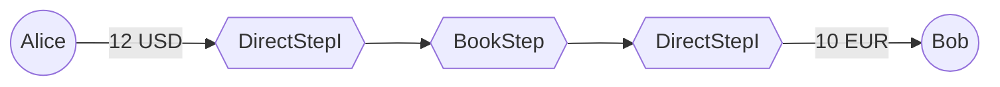
```mermaid
flowchart LR
    alice((Alice))
    aliceToIssuer{{DirectStepI}}
    issuerToOfferToIssuer{{BookStep}}
    issuerToBob{{DirectStepI}}
    bob((Bob))
    alice -- 12 USD --> aliceToIssuer --> issuerToOfferToIssuer --> issuerToBob -- 10 EUR --> bob
```

We first examine the last step, using `rev` method and requiring output of 10 EUR. The step returns 10 EUR as input and 10 EUR as output, meaning it can provide full liquidity.

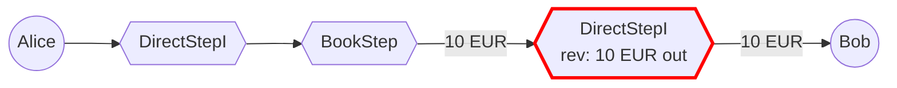
```mermaid
flowchart LR
    alice((Alice))
    aliceToIssuer{{DirectStepI}}
    issuerToOfferToIssuer{{BookStep}}
    issuerToBob{{DirectStepI<br>rev: 10 EUR out}}
    bob((Bob))
    alice --> aliceToIssuer --> issuerToOfferToIssuer -- 10 EUR --> issuerToBob -- 10 EUR --> bob
    
    style issuerToBob stroke:red,stroke-width:3px

```

Since we know we require 10 EUR for the last step, we call BookStep's `rev` method with 10 EUR as desired output.
The BookStep **can only provide 8 EUR** as the output, and it is asking for 12 USD.

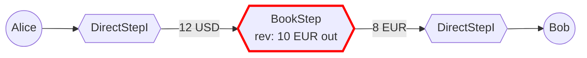
```mermaid
flowchart LR
    alice((Alice))
    aliceToIssuer{{DirectStepI}}
    issuerToOfferToIssuer{{BookStep<br>rev: 10 EUR out}}
    issuerToBob{{DirectStepI}}
    bob((Bob))
    alice --> aliceToIssuer -- 12 USD --> issuerToOfferToIssuer -- 8 EUR --> issuerToBob --> bob
    
    
    style issuerToOfferToIssuer stroke:red,stroke-width:3px
```

We clear any transactions we had in the [PaymentSandbox](../transactions/README.md#5-ledger-views-and-sandboxes) and reexecute the transaction in the reverse direction. This ensures that the quality or liquidity that our initial request might have affected is reset in the offer book.

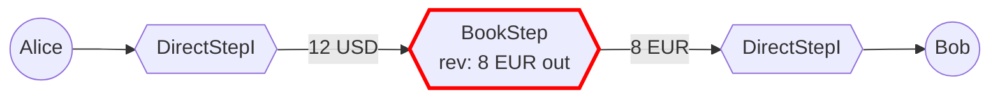
```mermaid
flowchart LR
    alice((Alice))
    aliceToIssuer{{DirectStepI}}
    issuerToOfferToIssuer{{BookStep<br>rev: 8 EUR out}}
    issuerToBob{{DirectStepI}}
    bob((Bob))
    alice --> aliceToIssuer -- 12 USD --> issuerToOfferToIssuer -- 8 EUR --> issuerToBob --> bob
    
    style issuerToOfferToIssuer stroke:red,stroke-width:3px
```

Now we know that the first step will require 12 USD output. We call its `rev` method with 12 USD desired output. However, this issuer charges a fee, so they require a 14 USD input!

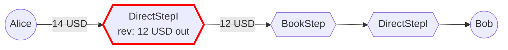
```mermaid
flowchart LR
    alice((Alice))
    aliceToIssuer{{DirectStepI<br>rev: 12 USD out}}
    issuerToOfferToIssuer{{BookStep}}
    issuerToBob{{DirectStepI}}
    bob((Bob))
    alice -- 14 USD --> aliceToIssuer -- 12 USD --> issuerToOfferToIssuer --> issuerToBob --> bob
    
    style aliceToIssuer stroke:red,stroke-width:3px
```

Alice is only willing to spend up to 12 USD. We reexecute the step in the forward direction, setting the input to 12 USD and clearing the payment sandbox so liquidity in the following steps is reset.

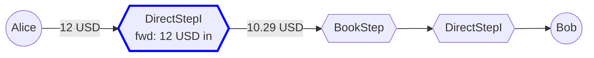
```mermaid
flowchart LR
    alice((Alice))
    aliceToIssuer{{DirectStepI<br>fwd: 12 USD in}}
    issuerToOfferToIssuer{{BookStep}}
    issuerToBob{{DirectStepI}}
    bob((Bob))
    alice -- 12 USD --> aliceToIssuer -- 10.29 USD --> issuerToOfferToIssuer --> issuerToBob --> bob
    
    style aliceToIssuer stroke:blue,stroke-width:3px
```

With this, **the reverse pass is completed.** `xrpld` will reexecute the first step in forwards direction in the scenario above as part of the reverse pass. However, we have noted that the limiting step was the first DirectStepI. In the forward pass, we will start from the first step after the limiting step - so we would start at BookStep. If the USD issuer was willing to pass through 12 USD at 1:1 rate, then the limiting step would have been the last one that failed - BookStep, so the forward pass would start at the second DirectStepI.

As the forward pass starts, we go to BookStep. The input is 10.29 USD and we are interested to see the output, which is 6.86 EUR.
It is no surprise that the BookStep can provide this liquidity, since in the reverse pass it provided even more.

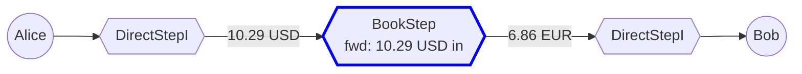
```mermaid
flowchart LR
    alice((Alice))
    aliceToIssuer{{DirectStepI}}
    issuerToOfferToIssuer{{BookStep<br>fwd: 10.29 USD in}}
    issuerToBob{{DirectStepI}}
    bob((Bob))
    alice --> aliceToIssuer -- 10.29 USD --> issuerToOfferToIssuer -- 6.86 EUR --> issuerToBob --> bob

    style issuerToOfferToIssuer stroke:blue,stroke-width:3px
```

The output of BookStep, 6.86 EUR, will be the input of the second DirectStepI:

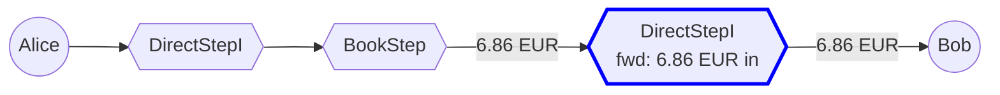
```mermaid
flowchart LR
    alice((Alice))
    aliceToIssuer{{DirectStepI}}
    issuerToOfferToIssuer{{BookStep}}
    issuerToBob{{DirectStepI<br>fwd: 6.86 EUR in}}
    bob((Bob))
    alice --> aliceToIssuer --> issuerToOfferToIssuer -- 6.86 EUR --> issuerToBob -- 6.86 EUR --> bob
    
    style issuerToBob stroke:blue,stroke-width:3px
```

At this point, we can conclude that the strand can deliver 6.86 EUR to Bob in exchange for 12 USD from Alice.

## 7.4. strandFlow Pseudo-Code

```python
# Local state for single-strand evaluation (strandFlow)
sb:           PaymentSandbox   # buffered ledger changes for this strand
afView:       PaymentSandbox   # "all funds" snapshot of balances at the start (detects unfunded offers)
limitingStep: int             # index of the step that capped the flow (none until found)

def strandFlow(strand, maxIn, out):
    if strand is empty or is a direct XRP->XRP transfer:
        return failure

    # REVERSE pass: walk steps last -> first, asking each how much input it needs
    # to produce the output the next step wants. See section 7.3.
    stepOut = out
    for step in reversed(strand):
        step_in, step_out = step.rev(sb, afView, stepOut)
        if step_out == 0:
            return failure                  # strand is dry

        if step is the first step and maxIn and step_in > maxIn:
            # Input side is the bottleneck. Reset state and re-run this step
            # forward, capped at maxIn. This becomes the limiting step.
            reset(sb)
            limitingStep = index(step)
            step_in, step_out = step.fwd(sb, afView, maxIn)
            if step_out == 0:
                return failure
            # This is a sanity check that should never fail. It verifies that when the limiting
            # step is re-executed in a "cleaner" environment (with the sandbox reset), it can
            # still produce the same result.
            if step_in != maxIn:
                return failure
        elif step_out < stepOut:
            # This step cannot deliver the full requested output. Reset state and
            # re-run it in reverse for what it can actually deliver. It is the
            # limiting step.
            reset(sb, afView)
            limitingStep = index(step)
            stepOut = step_out
            step_in, step_out = step.rev(sb, afView, stepOut)
            if step_out == 0:
                return failure
            # This is a sanity check that should never fail. It verifies that when the limiting
            # step is re-executed in a "cleaner" environment (with the sandbox reset), it can
            # still produce the same result.
            if step_out != stepOut:
                return failure

        stepOut = step_in                   # the previous step must produce this

    # FORWARD pass: from the step after the limiting step to the last, recompute
    # actual outputs now that the limited input is known. See section 7.3.
    stepIn = limited_output_of(limitingStep)
    for step in strand[limitingStep + 1:]:
        step_in, step_out = step.fwd(sb, afView, stepIn)
        if step_out == 0:
            return failure                  # rounding drove output to zero
        if step_in != stepIn:
            return failure                  # limits already found; should not re-limit
        stepIn = step_out

    return success(
        in = strand.first.cachedIn(),
        out = strand.last.cachedOut(),
        inactive = any(step.inactive() for step in strand),  # dry / too many offers
        sandbox = sb)
```

# 8. Validation and Error Codes

The Flow engine performs validation during two main phases: path conversion and execution. Various error codes can be returned at different stages.

## 8.1. Path Conversion Errors[^path-conversion-errors]

[^path-conversion-errors]: Path conversion errors (toStrands): [`PaySteps.cpp`](https://github.com/XRPLF/rippled/blob/3.2.0/src/libxrpl/tx/paths/PaySteps.cpp#L574-L684)

These errors occur in `toStrands` when converting the provided paths into strands:

- `temRIPPLE_EMPTY`: No paths provided and direct ripple path not allowed
- `temBAD_PATH`: Malformed path elements in the provided `Paths` field
- `tefEXCEPTION`: Internal error during path-to-strand conversion

## 8.2. Flow Execution Errors

These errors occur during payment execution from different sources:

### 8.2.1. StrandFlow Errors[^strandflow-errors]

[^strandflow-errors]: StrandFlow errors: [`StrandFlow.h`](https://github.com/XRPLF/rippled/blob/3.2.0/include/xrpl/tx/paths/detail/StrandFlow.h#L635-L820)

Errors returned by the main flow execution logic:

- `telFAILED_PROCESSING`: Exceeded maximum iteration limit (1000 tries) while searching for liquidity across strands
- `tefEXCEPTION`: Internal rounding error where actual output exceeds requested amount
- `tecPATH_PARTIAL`: Payment failed because the payment would require spending more than SendMax allows, or with partial payments allowed, the deliverable amount is less than DeliverMin
- `tecPATH_DRY`: No liquidity found (zero output) when partial payment is allowed. Also used when RippleCalc converts retry error codes to `tecPATH_DRY` to claim the transaction fee and discourage users from submitting payments with poorly specified paths

### 8.2.2. Step Validation Errors[^step-errors]

[^step-errors]: Step validation errors: [`DirectStep.cpp`](https://github.com/XRPLF/rippled/blob/3.2.0/src/libxrpl/tx/paths/DirectStep.cpp), [`BookStep.cpp`](https://github.com/XRPLF/rippled/blob/3.2.0/src/libxrpl/tx/paths/BookStep.cpp), [`XRPEndpointStep.cpp`](https://github.com/XRPLF/rippled/blob/3.2.0/src/libxrpl/tx/paths/XRPEndpointStep.cpp), [`MPTEndpointStep.cpp`](https://github.com/XRPLF/rippled/blob/3.2.0/src/libxrpl/tx/paths/MPTEndpointStep.cpp)

Errors returned by individual step implementations during strand construction or execution:

- `temBAD_PATH_LOOP`: Loop detection in account, book, or XRP endpoint steps fires during strand construction
- `terNO_ACCOUNT`: Required account is missing while building direct or XRP endpoint steps
- `terNO_LINE`: The needed trust line is absent or frozen, including AMM freeze checks
- `terNO_AUTH`: The issuer required authorization and the trust line lacks it (in DirectStep)
- `terNO_RIPPLE`: No-ripple flag blocks the path
- `tecNO_ISSUER`: An offer book step references an issuer that no longer exists
- `tecLOCKED`: MPT validation failure (see section 8.3)
- `tecNO_PERMISSION`: MPT validation failure (see section 8.3)
- `tecOBJECT_NOT_FOUND`: MPT validation failure (see section 8.3)
- `tecINTERNAL` (raised by `RippleCalc.cpp` / `AMMHelpers.cpp`, not the step files):
  - AMM freeze lookup fails since there is no AMM ledger item
  - Exception thrown during flow execution

## 8.3. MPT-Specific Validations[^mpt-validations]

[^mpt-validations]: MPT validations in Flow steps: [`BookStep.cpp`](https://github.com/XRPLF/rippled/blob/3.2.0/src/libxrpl/tx/paths/BookStep.cpp#L744-L747), [`MPTEndpointStep.cpp`](https://github.com/XRPLF/rippled/blob/3.2.0/src/libxrpl/tx/paths/MPTEndpointStep.cpp#L374-L375)

When a cross-currency payment path includes MPT assets (with [MPTokensV2](https://xrpl.org/resources/known-amendments#mptokensv2) amendment enabled), the Flow engine validates MPTs using [`canTrade`](../mpts/README.md#361-cantrade). See [MPT Validation Functions](../mpts/README.md#36-mpt-validation-functions) for details on validation logic and error conditions.
