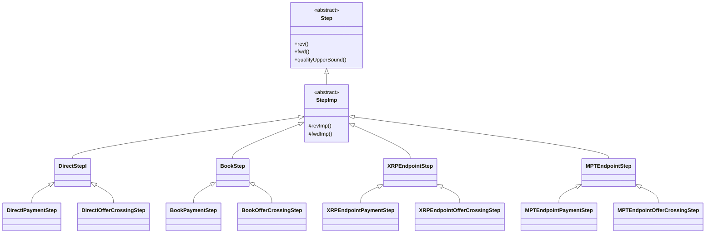

# Index

- [1. Introduction](#1-rippled-strand-steps)
    - [1.1. Step Catalog](#11-step-catalog)
    - [1.2. Class Relationships](#12-class-relationships)
    - [1.3. Methods](#13-methods)
- [2. DirectStepI](#2-directstepi)
    - [2.1. Common Implementation](#21-common-implementation)
        - [2.1.1. `revImp` Implementation](#211-revimp-implementation)
            - [2.1.1.1. `revImp` Pseudo-Code](#2111-revimp-pseudo-code)
        - [2.1.2. `fwdImp` (Forward Pass) Implementation](#212-fwdimp-implementation)
            - [2.1.2.1. `fwdImp` Pseudo-Code](#2121-fwdimp-pseudo-code)
        - [2.1.3. Quality Functions](#213-quality-functions)
            - [2.1.3.1. Quality Functions Pseudo-Code](#2131-quality-functions-pseudo-code)
        - [2.1.4. `qualityUpperBound` Implementation](#214-qualityupperbound-implementation)
            - [2.1.4.1. `qualityUpperBound` Pseudo-Code](#2141-qualityupperbound-pseudo-code)
        - [2.1.5. `check` Implementation (Base Class)](#215-check-implementation)
    - [2.2. DirectIPaymentStep (Payment-Specific Implementation)](#22-directipaymentstep-payment-specific-implementation)
        - [2.2.1. `quality` Implementation](#221-quality-implementation)
            - [2.2.1.1. `quality` Pseudo-Code](#2211-quality-pseudo-code)
        - [2.2.2. `maxFlow` Implementation](#222-maxflow-implementation)
            - [2.2.2.1. `maxFlow` Pseudo-Code](#2221-maxflow-pseudo-code)
        - [2.2.3. `check` Implementation](#223-check-implementation)
    - [2.3. DirectIOfferCrossingStep (Offer Crossing-Specific Implementation)](#23-directioffercrossingstep-offer-crossing-specific-implementation)
        - [2.3.1. `quality` Implementation](#231-quality-implementation)
        - [2.3.2. `maxFlow` Implementation](#232-maxflow-implementation)
        - [2.3.3. `check` Implementation](#233-check-implementation)
- [3. XRPEndpointStep](#3-xrpendpointstep)
    - [3.1. `revImp` Implementation](#31-revimp-implementation)
        - [3.1.1. `revImp` Pseudo-Code](#311-revimp-pseudo-code)
    - [3.2. `fwdImp` Implementation](#32-fwdimp-implementation)
        - [3.2.1. `fwdImp` Pseudo-Code](#321-fwdimp-pseudo-code)
    - [3.3. `qualityUpperBound` Implementation](#33-qualityupperbound-implementation)
        - [3.3.1. `qualityUpperBound` Pseudo-Code](#331-qualityupperbound-pseudo-code)
    - [3.4. `check` Implementation](#34-check-implementation)
- [4. MPTEndpointStep](#4-mptendpointstep)
    - [4.1. `revImp` Implementation](#41-revimp-implementation)
       - [4.1.1. `revImp` Pseudo-Code](#411-revimp-pseudo-code)
    - [4.2. `fwdImp` Implementation](#42-fwdimp-implementation)
       - [4.2.1. `fwdImp` Pseudo-Code](#421-fwdimp-pseudo-code)
    - [4.3. `qualityUpperBound` Implementation](#43-qualityupperbound-implementation)
      - [4.3.1. `qualityUpperBound` Pseudo-Code](#431-qualityupperbound-pseudo-code)
    - [4.4. `check` Implementation](#44-check-implementation)
- [5. BookStep](#5-bookstep)
    - [5.1. `revImp` Implementation](#51-revimp-implementation)
        - [5.1.1. `revImp` Pseudo-Code](#511-revimp-pseudo-code)
    - [5.2. `fwdImp` Implementation](#52-fwdimp-implementation)
        - [5.2.1. `fwdImp` Pseudo-Code](#521-fwdimp-pseudo-code)
    - [5.3. `forEachOffer`](#53-foreachoffer)
        - [5.3.1. `forEachOffer` Pseudo-Code](#531-foreachoffer-pseudo-code)
        - [5.3.2. Transfer Rate Helper Functions](#532-transfer-rate-helper-functions)
            - [5.3.2.1. `getOfrInRate` Pseudo-Code](#5321-getofrinrate-pseudo-code)
            - [5.3.2.2. `getOfrOutRate` Pseudo-Code](#5322-getofroutrate-pseudo-code)
    - [5.4. AMM Integration](#54-amm-integration)
        - [5.4.1. Integration with BookStep](#541-integration-with-bookstep)
        - [5.4.2. Spot Price Quality and CLOB Comparison](#542-spot-price-quality-and-clob-comparison)
        - [5.4.3. Offer Generation Strategies](#543-offer-generation-strategies)
            - [5.4.3.1. `getOffer` Pseudo-Code](#5431-getoffer-pseudo-code)
            - [5.4.3.2. Multi-Path Mode: Fibonacci Sequence Sizing](#5432-multi-path-mode-fibonacci-sequence-sizing)
            - [5.4.3.3. Single-Path Mode: CLOB-Matching Sizing](#5433-single-path-mode-clob-matching-sizing)
    - [5.5. `qualityUpperBound` Implementation](#55-qualityupperbound-implementation)
        - [5.5.1. `qualityUpperBound` Method](#551-qualityupperbound-method)
            - [5.5.1.1. `qualityUpperBound` Pseudo-Code](#5511-qualityupperbound-pseudo-code)
        - [5.5.2. `tipOfferQuality` Helper Function](#552-tipofferquality-helper-function)
            - [5.5.2.1. `tipOfferQuality` Pseudo-Code](#5521-tipofferquality-pseudo-code)
        - [5.5.3. `adjustQualityWithFees` - BookPaymentStep Implementation](#553-adjustqualitywithfees---bookpaymentstep-implementation)
            - [5.5.3.1. `adjustQualityWithFees` Pseudo-Code](#5531-adjustqualitywithfees-pseudo-code)
        - [5.5.4. `adjustQualityWithFees` - BookOfferCrossingStep Implementation](#554-adjustqualitywithfees---bookoffercrossingstep-implementation)
            - [5.5.4.1. `adjustQualityWithFees` Pseudo-Code](#5541-adjustqualitywithfees-pseudo-code)
    - [5.6. `check` Implementation](#56-check-implementation)

# 1. Introduction

The [payment engine](README.md) in `rippled` uses **[Strands](README.md#11-strands-and-steps)** (sequences of steps) to move value from source to destination. Each **step** in a strand transfers value between accounts and order books.

The **fundamental types** of steps in `rippled`:

1. **DirectStepI** - [IOU](../glossary.md#iou) transfer between accounts via trust line
2. **BookStep** - Asset conversion through order books and [AMM](../glossary.md#amm) pools
3. **XRPEndpointStep** - Strand endpoint for [XRP](../glossary.md#xrp) (first or last step only)
4. **MPTEndpointStep** - Strand endpoint for [MPT](../glossary.md#mpt) (first or last step only)

**How Steps Fit in the Flow Process:**

During [path to strand conversion](README.md#52-path-to-strand-conversion), Flow examines each pair of adjacent path elements to determine what type of step connects them. The [toStep function](README.md#53-step-generation) examines element characteristics (accounts vs order books, currency types, position in strand) and calls the appropriate factory function.

- `make_DirectStepI`[^make-directstepi] for account-to-account IOU transfers
- `make_BookStepII`[^make-bookstepii], `make_BookStepIX`[^make-bookstepix], `make_BookStepXI`[^make-bookstepxi], `make_BookStepMM`[^make-bookstepmm], `make_BookStepMX`[^make-bookstepmx], `make_BookStepXM`[^make-bookstepxm], `make_BookStepMI`[^make-bookstepmi], `make_BookStepIM`[^make-bookstepim] for order book conversions
- `make_XRPEndpointStep`[^make-xrpendpointstep] for XRP source/destination steps
- `make_MPTEndpointStep`[^make-mptendpointstep] for MPT source/destination steps

Steps handle different asset type combinations - XRP, IOU and MPT. In `rippled`, these are represented by different types (`XRPAmount`, `IOUAmount`, `MPTAmount`) with different arithmetic and precision characteristics.

**BookStep** uses template parameters to handle multiple asset type combinations. The factory functions (`make_BookStepII`, `make_BookStepIX`, etc.) instantiate the same `BookStep` template with the appropriate type parameters based on the input and output asset types.

Flow executes in one of two contexts, determined by the transaction type that invokes it:

- **[Payment](../payments/README.md)**: Triggered by Payment transactions (and similar operations like check cashing or cross-chain transfers). Flow moves value from a source account to a destination account, potentially through multiple intermediate steps.

- **[Offer Crossing](../offers/README.md)**: Triggered when creating or modifying offers (OfferCreate/OfferCancel transactions). When a new offer is placed, it may immediately match against existing offers in the order book, causing Flow to execute the exchange.

The context affects step behavior throughout the flow process. Steps receive the context through the `offerCrossing` field in `StrandContext`, which factory functions use to instantiate either payment-specific or offer-crossing-specific implementations (e.g., `DirectIPaymentStep` vs `DirectIOfferCrossingStep`).

## 1.1. Step Catalog

| Alias                        | Concrete class (definition)    | Input       | Output      | Factory                 |
|------------------------------|--------------------------------|-------------|-------------|-------------------------|
| DirectStepI (payment)        | `DirectIPaymentStep`[^directipaymentstep]           | `IOUAmount`[^iouamount] | `IOUAmount` | `make_DirectStepI`[^make-directstepi]      |
| DirectStepI (offer crossing) | `DirectIOfferCrossingStep`[^directioffercrossingstep]     | `IOUAmount` | `IOUAmount` | `make_DirectStepI`      |
| BookStepII (payment)         | `BookPaymentStep`[^bookpaymentstep]              | `IOUAmount` | `IOUAmount` | `make_BookStepII`[^make-bookstepii]       |
| BookStepII (offer crossing)  | `BookOfferCrossingStep`[^bookoffercrossingstep]        | `IOUAmount` | `IOUAmount` | `make_BookStepII`       |
| BookStepIX (payment)         | `BookPaymentStep`              | `IOUAmount` | `XRPAmount`[^xrpamount] | `make_BookStepIX`[^make-bookstepix]       |
| BookStepIX (offer crossing)  | `BookOfferCrossingStep`        | `IOUAmount` | `XRPAmount` | `make_BookStepIX`       |
| BookStepXI (payment)         | `BookPaymentStep`              | `XRPAmount` | `IOUAmount` | `make_BookStepXI`[^make-bookstepxi]       |
| BookStepXI (offer crossing)  | `BookOfferCrossingStep`        | `XRPAmount` | `IOUAmount` | `make_BookStepXI`       |
| BookStepMM (payment)         | `BookPaymentStep`              | `MPTAmount`[^mptamount] | `MPTAmount` | `make_BookStepMM`[^make-bookstepmm]       |
| BookStepMM (offer crossing)  | `BookOfferCrossingStep`        | `MPTAmount` | `MPTAmount` | `make_BookStepMM`       |
| BookStepMX (payment)         | `BookPaymentStep`              | `MPTAmount` | `XRPAmount` | `make_BookStepMX`[^make-bookstepmx]       |
| BookStepMX (offer crossing)  | `BookOfferCrossingStep`        | `MPTAmount` | `XRPAmount` | `make_BookStepMX`       |
| BookStepXM (payment)         | `BookPaymentStep`              | `XRPAmount` | `MPTAmount` | `make_BookStepXM`[^make-bookstepxm]       |
| BookStepXM (offer crossing)  | `BookOfferCrossingStep`        | `XRPAmount` | `MPTAmount` | `make_BookStepXM`       |
| BookStepMI (payment)         | `BookPaymentStep`              | `MPTAmount` | `IOUAmount` | `make_BookStepMI`[^make-bookstepmi]       |
| BookStepMI (offer crossing)  | `BookOfferCrossingStep`        | `MPTAmount` | `IOUAmount` | `make_BookStepMI`       |
| BookStepIM (payment)         | `BookPaymentStep`              | `IOUAmount` | `MPTAmount` | `make_BookStepIM`[^make-bookstepim]       |
| BookStepIM (offer crossing)  | `BookOfferCrossingStep`        | `IOUAmount` | `MPTAmount` | `make_BookStepIM`       |
| XRPEndpoint (payment)        | `XRPEndpointPaymentStep`[^xrpendpointpaymentstep]       | `XRPAmount` | `XRPAmount` | `make_XRPEndpointStep`[^make-xrpendpointstep]  |
| XRPEndpoint (offer crossing) | `XRPEndpointOfferCrossingStep`[^xrpendpointoffercrossingstep] | `XRPAmount` | `XRPAmount` | `make_XRPEndpointStep`  |
| MPTEndpoint (payment)        | `MPTEndpointPaymentStep`[^mptendpointpaymentstep]       | `MPTAmount` | `MPTAmount` | `make_MPTEndpointStep`[^make-mptendpointstep]  |
| MPTEndpoint (offer crossing) | `MPTEndpointOfferCrossingStep`[^mptendpointoffercrossingstep] | `MPTAmount` | `MPTAmount` | `make_MPTEndpointStep`  |

[^directipaymentstep]: [`DirectStep.cpp`](https://github.com/gregtatcam/rippled/blob/a72c3438eb0591a76ac829305fcbcd0ed3b8c325/src/xrpld/app/paths/detail/DirectStep.cpp#L215-L256)
[^directioffercrossingstep]: [`DirectStep.cpp`](https://github.com/gregtatcam/rippled/blob/a72c3438eb0591a76ac829305fcbcd0ed3b8c325/src/xrpld/app/paths/detail/DirectStep.cpp#L259-L307)
[^bookpaymentstep]: [`BookStep.cpp`](https://github.com/gregtatcam/rippled/blob/a72c3438eb0591a76ac829305fcbcd0ed3b8c325/src/xrpld/app/paths/detail/BookStep.cpp#L250-L339)
[^bookoffercrossingstep]: [`BookStep.cpp`](https://github.com/gregtatcam/rippled/blob/a72c3438eb0591a76ac829305fcbcd0ed3b8c325/src/xrpld/app/paths/detail/BookStep.cpp#L343-L537)
[^xrpendpointpaymentstep]: [`XRPEndpointStep.cpp`](https://github.com/gregtatcam/rippled/blob/a72c3438eb0591a76ac829305fcbcd0ed3b8c325/src/xrpld/app/paths/detail/XRPEndpointStep.cpp#L152-L169)
[^xrpendpointoffercrossingstep]: [`XRPEndpointStep.cpp`](https://github.com/gregtatcam/rippled/blob/a72c3438eb0591a76ac829305fcbcd0ed3b8c325/src/xrpld/app/paths/detail/XRPEndpointStep.cpp#L172-L225)
[^mptendpointpaymentstep]: [`MPTEndpointStep.cpp`](https://github.com/gregtatcam/rippled/blob/a72c3438eb0591a76ac829305fcbcd0ed3b8c325/src/xrpld/app/paths/detail/MPTEndpointStep.cpp#L247-L278)
[^mptendpointoffercrossingstep]: [`MPTEndpointStep.cpp`](https://github.com/gregtatcam/rippled/blob/a72c3438eb0591a76ac829305fcbcd0ed3b8c325/src/xrpld/app/paths/detail/MPTEndpointStep.cpp#L281-L316)
[^iouamount]: [`IOUAmount.h`](https://github.com/gregtatcam/rippled/blob/a72c3438eb0591a76ac829305fcbcd0ed3b8c325/include/xrpl/protocol/IOUAmount.h#L25-L88)
[^xrpamount]: [`XRPAmount.h`](https://github.com/gregtatcam/rippled/blob/a72c3438eb0591a76ac829305fcbcd0ed3b8c325/include/xrpl/protocol/XRPAmount.h#L20-L292)
[^mptamount]: [`MPTAmount.h`](https://github.com/gregtatcam/rippled/blob/a72c3438eb0591a76ac829305fcbcd0ed3b8c325/include/xrpl/protocol/MPTAmount.h#L17-L169)
[^make-directstepi]: [`DirectStep.cpp`](https://github.com/gregtatcam/rippled/blob/a72c3438eb0591a76ac829305fcbcd0ed3b8c325/src/xrpld/app/paths/detail/DirectStep.cpp#L950-L977)
[^make-bookstepii]: [`BookStep.cpp`](https://github.com/gregtatcam/rippled/blob/a72c3438eb0591a76ac829305fcbcd0ed3b8c325/src/xrpld/app/paths/detail/BookStep.cpp#L1498-L1502)
[^make-bookstepix]: [`BookStep.cpp`](https://github.com/gregtatcam/rippled/blob/a72c3438eb0591a76ac829305fcbcd0ed3b8c325/src/xrpld/app/paths/detail/BookStep.cpp#L1504-L1508)
[^make-bookstepxi]: [`BookStep.cpp`](https://github.com/gregtatcam/rippled/blob/a72c3438eb0591a76ac829305fcbcd0ed3b8c325/src/xrpld/app/paths/detail/BookStep.cpp#L1510-L1514)
[^make-bookstepmm]: [`BookStep.cpp`](https://github.com/gregtatcam/rippled/blob/a72c3438eb0591a76ac829305fcbcd0ed3b8c325/src/xrpld/app/paths/detail/BookStep.cpp#L1517-L1524)
[^make-bookstepmx]: [`BookStep.cpp`](https://github.com/gregtatcam/rippled/blob/a72c3438eb0591a76ac829305fcbcd0ed3b8c325/src/xrpld/app/paths/detail/BookStep.cpp#L1538-L1542)
[^make-bookstepxm]: [`BookStep.cpp`](https://github.com/gregtatcam/rippled/blob/a72c3438eb0591a76ac829305fcbcd0ed3b8c325/src/xrpld/app/paths/detail/BookStep.cpp#L1544-L1548)
[^make-bookstepmi]: [`BookStep.cpp`](https://github.com/gregtatcam/rippled/blob/a72c3438eb0591a76ac829305fcbcd0ed3b8c325/src/xrpld/app/paths/detail/BookStep.cpp#L1526-L1530)
[^make-bookstepim]: [`BookStep.cpp`](https://github.com/gregtatcam/rippled/blob/a72c3438eb0591a76ac829305fcbcd0ed3b8c325/src/xrpld/app/paths/detail/BookStep.cpp#L1532-L1536)
[^make-xrpendpointstep]: [`XRPEndpointStep.cpp`](https://github.com/gregtatcam/rippled/blob/a72c3438eb0591a76ac829305fcbcd0ed3b8c325/src/xrpld/app/paths/detail/XRPEndpointStep.cpp#L390-L412)
[^make-mptendpointstep]: [`MPTEndpointStep.cpp`](https://github.com/gregtatcam/rippled/blob/a72c3438eb0591a76ac829305fcbcd0ed3b8c325/src/xrpld/app/paths/detail/MPTEndpointStep.cpp#L958-L985)

## 1.2. Class Relationships



`StepImp` is a CRTP (Curiously Recurring Template Pattern) base class template that implements the polymorphic `rev()` and `fwd()` interface methods by dispatching to type-specific `revImp()` and `fwdImp()` implementations in the derived classes.

## 1.3. Methods

The key methods implemented by each step class and used during [strand evaluation](README.md#7-single-strand-evaluation-strandflow) are:

### `revImp` (Reverse Pass)

The reverse pass calculates required inputs given a desired output and simulates the transfer by updating the payment sandbox. When the Flow engine needs to deliver a specific amount to the destination, it calls `revImp` on each step in the strand, working backwards from the destination. Each step determines available liquidity, applies quality adjustments and transfer fees, executes the transfer on the sandbox, caches the calculated amounts, and returns the actual input and output amounts. If the step cannot provide the full requested output due to liquidity constraints, it becomes a limiting step and returns reduced amounts. 

### `fwdImp` (Forward Pass)

When the reverse pass encounters a limiting step, the Flow engine calls `fwdImp` on each step after the limiting step, working forwards from the limiting step toward the destination. The step recalculates available liquidity, applies quality adjustments and transfer fees based on the input amount, executes the transfer on the sandbox, and updates the cache to the minimum of the forward calculation and the cached reverse pass values. This limiting mechanism ensures the forward pass never delivers more than the reverse pass calculated, preventing over-delivery due to rounding differences. The step returns the cached input and output amounts.

### `qualityUpperBound`

The `qualityUpperBound` method estimates a step's exchange rate without executing it. Each step implements this method to return its quality based on current ledger state. During [iterative strand evaluation](README.md#62-qualityupperbound), the Flow engine's `qualityUpperBound` function (in StrandFlow.h) calls each step's `qualityUpperBound` method and combines them to calculate the composite strand quality, allowing it to sort strands and prioritize better paths first. The actual quality achieved during execution may be worse (due to rounding or liquidity constraints) but should never be significantly better, making this a safe upper bound for ranking strands.

### `check`

The `check` method validates step requirements before the strand executes. If `check` returns an error, the entire strand is rejected before any liquidity evaluation occurs.

# 2. DirectStepI

DirectStepI handles [IOU](../glossary.md#iou) transfers along a single trust line between two accounts without currency conversion. The step manages the transfer while accounting for trust line quality settings, transfer fees, credit limits, and debt direction. The step must determine whether the source is issuing new IOUs to the destination or whether the source is redeeming IOUs back to the destination, as this affects which fees and quality adjustments apply.

The `DirectStepI<TDerived>` template base class provides common implementation for `revImp`, `fwdImp`, `qualityUpperBound`, and base `check` validation. The concrete derived classes (`DirectIPaymentStep` and `DirectIOfferCrossingStep`) provide specialized implementations for `quality`, `maxFlow`, and context-specific `check` validation.

## 2.1. Common Implementation

### 2.1.1. `revImp` Implementation

Given a requested output amount, this function[^directstepi-revimp]:
1. Determines the maximum available liquidity on the trust line (`maxSrcToDst`) and the debt direction via [`maxFlow`](#222-maxflow-implementation) (payment - enforces trust line limits) or [`maxFlow`](#232-maxflow-implementation) (offer crossing - may exceed limits for destination step)
2. Calculates quality adjustments from both source and destination accounts via [`qualities`](#213-quality-functions) which calls [`quality`](#221-quality-implementation) (payment - respects QualityIn/QualityOut in certain conditions) or [`quality`](#231-quality-implementation) (offer crossing - always returns QUALITY_ONE)
3. Computes how much must flow on the trust line to produce the desired output, accounting for destination quality
4. Calculates the required input amount, accounting for source quality and transfer fees
5. Makes the payment by calling `rippleCredit` to update the trust line in the sandbox
6. Returns the actual input required and output delivered

#### 2.1.1.1. `revImp` Pseudo-Code

```python
def revImp(sb, out: IOUAmount) -> (in: IOUAmount, out: IOUAmount):
    cache_.reset()

    maxSrcToDst, srcDebtDir = maxFlow(sb, out)

    # srcQOut stands for Source Quality Out
    #   - the quality the source applies for sending funds
    # dstQIn stands for Destination Quality In
    #   - the quality the destination applies for receiving funds
    # Each quality can be a discount or a premium.
    srcQOut, dstQIn = qualities(sb, srcDebtDir, StrandDirection::reverse)

    # Set the IOU to currency and correct issuer pair
    srcToDstIss.currency = currency_
    srcToDstIss.account = dst_ if srcDebtDir == 'redeems' else src_

    if maxSrcToDst <= 0:
        cache_ = { in: 0, srcToDst: 0, out: 0, srcDebtDir}
        return { in: 0, out: 0}

    # This calculates how much needs to flow on the trust line to produce the desired output, accounting for the
    # destination's quality-in adjustment
    #   - QUALITY_ONE is 1'000'000'000 and dstQIn is presented in terms where 95% is 950'000'000
    srcToDst = roundUp(out * QUALITY_ONE / dstQIn)

    if srcToDst <= maxSrcToDst:  # Non-limiting case, we have enough liqudity
        # Calculate how much input is required for the promised output. The full transformation is:
        #   in --[srcQOut]--> srcToDst --[dstQIn]--> out
        in = roundUp(srcToDst * srcQOut / QUALITY_ONE)
        cache_ = { in: in, srcToDst: srcToDst, out: out, srcDebtDir}
        # Update the trustline with appropriate srcToDst amount
        rippleCredit(sb, src_, dst_, srcToDstIss(srcToDst))
        return { in: in, out: out}

    # We don't have enough liquidity, so we will require as much input as will produce maximum output we can have
    in = roundUp(maxSrcToDst * srcQOut / QUALITY_ONE)
    actualOut = roundDown(maxSrcToDst * dstQIn / QUALITY_ONE)
    cache_ = { in: in, srcToDst: maxSrcToDst, out: actualOut, srcDebtDir}
    # Update the trustline with the amount limited to liquidity of this step
    rippleCredit(sb, src_, dst_, srcToDstIss(maxSrcToDst))
    return { in: in, out: actualOut}
```

[^directstepi-revimp]: [`DirectStep.cpp`](https://github.com/gregtatcam/rippled/blob/a72c3438eb0591a76ac829305fcbcd0ed3b8c325/src/xrpld/app/paths/detail/DirectStep.cpp#L487-L565)

### 2.1.2. `fwdImp` Implementation

The `fwdImp` method[^directstepi-fwdimp] executes the forward pass for a DirectStep, determining how much output can be produced from a given input amount. This method is always called after `revImp` has been executed.

The implementation mirrors `revImp` but works in the opposite direction. Given an input amount, it recalculates liquidity and qualities, computes the output, and makes the payment. The key difference is that `fwdImp` uses the cached `srcToDst` from the reverse pass as a constraint: it calls `maxFlow` with this cached value, uses `setCacheLimiting` to ensure the forward pass doesn't exceed what the reverse pass promised, and makes the payment using the cached `srcToDst` rather than the freshly calculated amount. This ensures consistency between passes despite potential rounding differences.

#### 2.1.2.1. `fwdImp` Pseudo-Code

```python
def fwdImp(sb, in: IOUAmount) -> (in: IOUAmount, out: IOUAmount):
    # This method should never be run before revImp
    assert cache_ is not None

    # Recalculate liquidity based on cached srcToDst from reverse pass
    maxSrcToDst, srcDebtDir = maxFlow(sb, cache_.srcToDst)

    srcQOut, dstQIn = qualities(sb, srcDebtDir, StrandDirection::forward)
    srcToDstIss.currency = currency_
    srcToDstIss.account = dst_ if srcDebtDir == 'redeems' else src_

    if maxSrcToDst <= 0:
        cache_ = { in: 0, srcToDst: 0, out: 0, srcDebtDir}
        return { in: 0, out: 0}

    # Now, we are calculating srcToDst differently, since we care about the `in` amount
    srcToDst = roundDown(in * QUALITY_ONE / srcQOut)

    if srcToDst <= maxSrcToDst:  # Non-limiting case, we have enough liqudity
        # Calculate how much output is provided for the required input.
        out = roundDown(srcToDst * dstQIn / QUALITY_ONE)
        # There could be a difference, due to rounding, in reverse and forward pass. This function will update
        # cache.in, cache.srcToDst and cache.out, but it will use smaller (more conservative) values if they
        # changed from rev to fwd passes.
        setCacheLimiting(in, srcToDst, out, srcDebtDir)
        # Make the payment using the cached srcToDst value
        rippleCredit(sb, src_, dst_, srcToDstIss(cache_.srcToDst))
    else:
        # We don't have full liquidity
        actualIn = roundUp(maxSrcToDst * srcQOut / QUALITY_ONE)
        out = roundDown(maxSrcToDst * dstQIn / QUALITY_ONE)
        setCacheLimiting(actualIn, maxSrcToDst, out, srcDebtDir)
        # Make the payment using the cached srcToDst value
        rippleCredit(sb, src_, dst_, srcToDstIss(cache_.srcToDst))

    # This ensures that the forward pass never returns better rates than reverse pass promised
    return { in: cache_.in, out: cache_.out}
```

[^directstepi-fwdimp]: [`DirectStep.cpp`](https://github.com/gregtatcam/rippled/blob/a72c3438eb0591a76ac829305fcbcd0ed3b8c325/src/xrpld/app/paths/detail/DirectStep.cpp#L615-L691)

### 2.1.3. Quality Functions

The `qualities` function[^directstepi-qualities] is called by both `revImp` and `fwdImp` to determine the quality adjustments that apply to this step.

It returns two quality values:
- `srcQOut`: Source qualityOut - the quality the source applies when sending funds
- `dstQIn`: Destination qualityIn - the quality the destination applies when receiving funds

These qualities are used to calculate how input amounts transform to output amounts accounting for transfer fees and quality adjustments.

The `strandDir` (strand direction) parameter controls whether the previous step's debt direction is fetched from cache or calculated fresh:
- `StrandDirection::reverse` (reverse pass): Calculate previous step's debt direction from current ledger state
- `StrandDirection::forward` (forward pass): Use cached debt direction from the reverse pass

The `qualities` function delegates to two specialized helpers based on the current step's debt direction:

**`qualitiesSrcRedeems()`**[^directstepi-qualitiessrcredeems]: Called when the source is redeeming (holder sending to issuer)

[^directstepi-qualitiessrcredeems]: [`DirectStep.cpp`](https://github.com/gregtatcam/rippled/blob/a72c3438eb0591a76ac829305fcbcd0ed3b8c325/src/xrpld/app/paths/detail/DirectStep.cpp#L750-L762)

When a holder returns IOUs to their issuer:

- **Destination quality (`dstQIn`)**: Always `QUALITY_ONE` because issuers receive their own IOUs at face value
- **Source quality (`srcQOut`)**: Must be at least as high as the previous step's qualityIn to prevent quality improvement along the path

Quality must not improve as value flows through the path. If the previous step has qualityIn = 1.02 (needs 102 to deliver 100), those 102 units become this step's input. If this step's qualityOut = 1.0, it would only require 100 at its source to transfer 100 across the trust line, making 2 units vanish. By setting `srcQOut = max(prevStepQIn, this.qualityOut)`, we ensure this step requires at least 102 at its input to match what the previous step delivered at its output, preventing the path from offering better quality than any individual step provides.

**`qualitiesSrcIssues(prevStepDebtDirection)`**[^directstepi-qualitiessrcissues]: Called when the source is issuing (issuer sending to holder)

[^directstepi-qualitiessrcissues]: [`DirectStep.cpp`](https://github.com/gregtatcam/rippled/blob/a72c3438eb0591a76ac829305fcbcd0ed3b8c325/src/xrpld/app/paths/detail/DirectStep.cpp#L767-L788)

When an issuer sends IOUs to a holder:

- **Source quality (`srcQOut`)**: Applies the issuer's transfer rate (an account-level transfer fee set via the `TransferRate` field on the issuer's account) only when the previous step redeemed to this issuer. This charges the fee when IOUs flow through the issuer as an intermediary (holder-to-holder transfers), but not when IOUs originate from the issuer (direct issuer-to-holder payments). The transfer rate is retrieved via `transferRate(sb, src_)`, which reads the issuer's account settings.
- **Destination quality (`dstQIn`)**: Uses the trust line's qualityIn setting (a trust-line-level quality adjustment that allows the receiving holder to demand better than 1:1 exchange rates). However, if this is the final step in the path (`isLast_`), we cap this at `QUALITY_ONE` to prevent the payment recipient from demanding better than face value.

#### 2.1.3.1. Quality Functions Pseudo-Code

```python
def qualities(sb, srcDebtDir: DebtDirection, strandDir: StrandDirection) -> (srcQOut, dstQIn):
    if srcDebtDir == "redeems":
        # Source is holder sending to issuer
        return qualitiesSrcRedeems(sb)
    else:
        # Source is issuer sending to holder
        # Need to check previous step's debt direction to determine if transfer fee applies
        if prevStep_:
            prevStepDebtDir = prevStep_.debtDirection(sb, strandDir)
        else:
            prevStepDebtDir = "issues"
        return qualitiesSrcIssues(sb, prevStepDebtDir)

def qualitiesSrcRedeems(sb) -> (srcQOut, dstQIn):
    # This is the first step
    if not prevStep_:
        return {QUALITY_ONE, QUALITY_ONE}

    prevStepQIn = prevStep_.lineQualityIn(sb)
    srcQOut = quality(sb, QualityDirection::out)

    # Use the worse of the two qualities (higher value = worse for sender)
    if prevStepQIn > srcQOut:
        srcQOut = prevStepQIn

    return {srcQOut, QUALITY_ONE}

def qualitiesSrcIssues(sb, prevStepDebtDirection) -> (srcQOut, dstQIn):
    # Charge transfer rate when issuing and previous step redeems
    if prevStepDebtDirection == "redeems":
        srcQOut = transferRate(sb, src_).value
    else:
        srcQOut = QUALITY_ONE

    dstQIn = quality(sb, QualityDirection::in)

    # If this is the last step, cap destination quality at QUALITY_ONE
    if isLast_ and dstQIn > QUALITY_ONE:
        dstQIn = QUALITY_ONE

    return {srcQOut, dstQIn}
```

[^directstepi-qualities]: [`DirectStep.cpp`](https://github.com/gregtatcam/rippled/blob/a72c3438eb0591a76ac829305fcbcd0ed3b8c325/src/xrpld/app/paths/detail/DirectStep.cpp#L793-L811)

### 2.1.4. `qualityUpperBound` Implementation

The `qualityUpperBound` method[^directstepi-qualityupperbound] estimates the quality (exchange rate) of this step without actually executing it. This is used during [strand sorting and filtering](README.md#62-qualityupperbound) to rank strands by their potential quality.

The implementation is the same for both `DirectIPaymentStep` and `DirectIOfferCrossingStep`. The difference in behavior comes from the `quality()` method that `qualityUpperBound` calls:
- **Payment**: Respects trust line quality settings (can apply discounts/premiums)
- **Offer Crossing**: Always returns `QUALITY_ONE` (ignores quality settings for backward compatibility)

#### 2.1.4.1. `qualityUpperBound` Pseudo-Code

```python
def qualityUpperBound(v: ReadView, prevStepDir: DebtDirection) -> (q: Quality, dir: DebtDirection):
    # Determine debt direction for this step
    dir = debtDirection(v, StrandDirection::forward)

    # Calculate qualities based on whether source is redeeming or issuing
    if dir == "redeems":
        srcQOut, dstQIn = qualitiesSrcRedeems(v)
    else:
        srcQOut, dstQIn = qualitiesSrcIssues(v, prevStepDir)

    iss = Issue(currency_, src_)
        
    # Quality is the composite of srcQOut and dstQIn
    # Rate = srcQOut / dstQIn (because Input * dstQIn / srcQOut = Output)
    # getRate(offerOut, offerIn) returns offerIn/offerOut, so we pass parameters reversed:
    # getRate(dstQIn, srcQOut) returns srcQOut/dstQIn
    q = getRate(iss(dstQIn), iss(srcQOut))
    return {q, dir}
```

[^directstepi-qualityupperbound]: [`DirectStep.cpp`](https://github.com/gregtatcam/rippled/blob/a72c3438eb0591a76ac829305fcbcd0ed3b8c325/src/xrpld/app/paths/detail/DirectStep.cpp#L823-L842)

### 2.1.5. `check` Implementation

The base class `DirectStepI` provides[^directstepi-check] common validation that runs before the derived class checks. Called during strand construction. The base class validation runs first, then calls the derived class's specific `check()` implementation.

**Common failure conditions**:

- `temBAD_PATH`[^check-bad-path-null][^check-bad-path-same]: Source or destination account is null, or source equals destination
- `terNO_ACCOUNT`[^check-no-account]: Source account does not exist
- `terNO_LINE`[^check-freeze]: Currency is frozen via global freeze, trust line freeze, or LP token freeze (unless this is both first and last step - pure issue/redeem)
- `tecINTERNAL`[^check-tecinternal]: AMM account exists but AMM ledger entry does not exist (should not happen)
- `terNO_LINE`[^check-no-ripple-line]: Previous step was a DirectStep but required trust line does not exist for NoRipple check
- `terNO_RIPPLE`[^check-no-ripple]: Previous step was a DirectStep and NoRipple flag prevents rippling
- `temBAD_PATH_LOOP`[^check-bad-path-loop-book][^check-bad-path-loop-seen]: Path loop detected (same issue appears multiple times in invalid pattern)

[^check-bad-path-null]: [`DirectStep.cpp`](https://github.com/gregtatcam/rippled/blob/a72c3438eb0591a76ac829305fcbcd0ed3b8c325/src/xrpld/app/paths/detail/DirectStep.cpp#L852)
[^check-bad-path-same]: [`DirectStep.cpp`](https://github.com/gregtatcam/rippled/blob/a72c3438eb0591a76ac829305fcbcd0ed3b8c325/src/xrpld/app/paths/detail/DirectStep.cpp#L858)
[^check-no-account]: [`DirectStep.cpp`](https://github.com/gregtatcam/rippled/blob/a72c3438eb0591a76ac829305fcbcd0ed3b8c325/src/xrpld/app/paths/detail/DirectStep.cpp#L867)
[^check-freeze]: [`StepChecks.h`](https://github.com/gregtatcam/rippled/blob/a72c3438eb0591a76ac829305fcbcd0ed3b8c325/src/xrpld/app/paths/detail/StepChecks.h#L27) (also lines 35, 41, 57) - called from [`DirectStep.cpp`](https://github.com/gregtatcam/rippled/blob/a72c3438eb0591a76ac829305fcbcd0ed3b8c325/src/xrpld/app/paths/detail/DirectStep.cpp#L873)
[^check-tecinternal]: [`StepChecks.h`](https://github.com/gregtatcam/rippled/blob/a72c3438eb0591a76ac829305fcbcd0ed3b8c325/src/xrpld/app/paths/detail/StepChecks.h#L52) - called from [`DirectStep.cpp`](https://github.com/gregtatcam/rippled/blob/a72c3438eb0591a76ac829305fcbcd0ed3b8c325/src/xrpld/app/paths/detail/DirectStep.cpp#L873)
[^check-no-ripple-line]: [`StepChecks.h`](https://github.com/gregtatcam/rippled/blob/a72c3438eb0591a76ac829305fcbcd0ed3b8c325/src/xrpld/app/paths/detail/StepChecks.h#L80) - called from [`DirectStep.cpp`](https://github.com/gregtatcam/rippled/blob/a72c3438eb0591a76ac829305fcbcd0ed3b8c325/src/xrpld/app/paths/detail/DirectStep.cpp#L885)
[^check-no-ripple]: [`StepChecks.h`](https://github.com/gregtatcam/rippled/blob/a72c3438eb0591a76ac829305fcbcd0ed3b8c325/src/xrpld/app/paths/detail/StepChecks.h#L88) - called from [`DirectStep.cpp`](https://github.com/gregtatcam/rippled/blob/a72c3438eb0591a76ac829305fcbcd0ed3b8c325/src/xrpld/app/paths/detail/DirectStep.cpp#L885)
[^check-bad-path-loop-book]: [`DirectStep.cpp`](https://github.com/gregtatcam/rippled/blob/a72c3438eb0591a76ac829305fcbcd0ed3b8c325/src/xrpld/app/paths/detail/DirectStep.cpp#L911)
[^check-bad-path-loop-seen]: [`DirectStep.cpp`](https://github.com/gregtatcam/rippled/blob/a72c3438eb0591a76ac829305fcbcd0ed3b8c325/src/xrpld/app/paths/detail/DirectStep.cpp#L921)
[^directstepi-check]: [`DirectStep.cpp`](https://github.com/gregtatcam/rippled/blob/a72c3438eb0591a76ac829305fcbcd0ed3b8c325/src/xrpld/app/paths/detail/DirectStep.cpp#L846-L926)

## 2.2. DirectIPaymentStep (Payment-Specific Implementation)

### 2.2.1. `quality` Implementation

The `quality` method[^directipaymentstep-quality] returns the quality adjustment that applies to this trust line transfer. For payments, this reads the trust line's QualityIn or QualityOut settings, which allow accounts to specify discounts or premiums for sending or receiving tokens. If the source and destination are the same account, quality is always `QUALITY_ONE` (1:1). Otherwise, the method reads the trust line and returns the appropriate quality setting based on the quality direction parameter.

#### 2.2.1.1. `quality` Pseudo-Code

```python
def quality(sb, qDir: QualityDirection) -> int:
    # Same account, no quality adjustment
    if src_ == dst_:
        return QUALITY_ONE

    # Read trust line
    sle = sb.read(keylet::line(dst_, src_, currency_))
    if not sle:
        return QUALITY_ONE

    # Determine which quality field to read based on direction and account ordering
    if qDir == QualityDirection::in:
        # Destination quality in
        field = sfLowQualityIn if dst_ < src_ else sfHighQualityIn
    else:
        # Source quality out
        field = sfLowQualityOut if src_ < dst_ else sfHighQualityOut

    if not sle.isFieldPresent(field):
        return QUALITY_ONE

    q = sle[field]
    if not q:
        return QUALITY_ONE

    return q
```

[^directipaymentstep-quality]: [`DirectStep.cpp`](https://github.com/gregtatcam/rippled/blob/a72c3438eb0591a76ac829305fcbcd0ed3b8c325/src/xrpld/app/paths/detail/DirectStep.cpp#L312-L348)

### 2.2.2. `maxFlow` Implementation

The `maxFlow`[^directipaymentstep-maxflow] method determines the maximum amount of IOU tokens that can flow from source to destination on this trust line, which `revImp` uses to constrain its calculations. The method also returns the debt direction, indicating whether the source is issuing or redeeming IOUs.

[^directipaymentstep-maxflow]: [`DirectStep.cpp`](https://github.com/gregtatcam/rippled/blob/a72c3438eb0591a76ac829305fcbcd0ed3b8c325/src/xrpld/app/paths/detail/DirectStep.cpp#L359-L362) (calls [`maxPaymentFlow`](https://github.com/gregtatcam/rippled/blob/a72c3438eb0591a76ac829305fcbcd0ed3b8c325/src/xrpld/app/paths/detail/DirectStep.cpp#L457-L469))

In DirectIPaymentStep, `maxFlow` returns:

- If source is the issuer and destination is holder: the remaining limit the holder has for that currency (how many more tokens the holder can receive)
- If source is the holder and destination is issuer: the holder's balance in the token (how many tokens the holder can redeem)

#### 2.2.2.1. `maxFlow` Pseudo-Code

```python
# The out parameter is unused
def maxFlow(sb, out) -> (maxSrcToDst, srcDebtDir):
    # Get the balance of src_ on the trustline
    srcOwed = accountHolds(sb, src_, currency_, dst_, fhIGNORE_FREEZE)

    if srcOwed > 0:
        # Holder is sending to issuer, they can only send as much as was issued to them
        return {maxSrcToDst: srcOwed, "redeems"}

    # Issuer is sending to holder
    # creditLimit2 returns the trust line limit the holder (dst_) set for the issuer (src_)
    # Adding srcOwed (which is negative or zero) gives us remaining capacity
    return {maxSrcToDst: creditLimit2(sb, dst_, src_, currency_) + srcOwed, "issues"}
```

### 2.2.3. `check` Implementation

The `check` method[^directipaymentstep-check] validates payment-specific constraints:

- `terNO_LINE`[^check-payment-no-line]: Trust line does not exist between source and destination
- `terNO_AUTH`[^check-payment-no-auth]: Source account has `lsfRequireAuth` flag, but trust line is not authorized and has zero balance
- `terNO_RIPPLE`[^check-payment-no-ripple]: Previous step was a BookStep and the trust line has NoRipple flag set
- `tecPATH_DRY`[^check-payment-path-dry]: Trust line has no liquidity available (at limit)

[^check-payment-no-line]: [`DirectStep.cpp`](https://github.com/gregtatcam/rippled/blob/a72c3438eb0591a76ac829305fcbcd0ed3b8c325/src/xrpld/app/paths/detail/DirectStep.cpp#L398)
[^check-payment-no-auth]: [`DirectStep.cpp`](https://github.com/gregtatcam/rippled/blob/a72c3438eb0591a76ac829305fcbcd0ed3b8c325/src/xrpld/app/paths/detail/DirectStep.cpp#L410)
[^check-payment-no-ripple]: [`DirectStep.cpp`](https://github.com/gregtatcam/rippled/blob/a72c3438eb0591a76ac829305fcbcd0ed3b8c325/src/xrpld/app/paths/detail/DirectStep.cpp#L421)
[^check-payment-path-dry]: [`DirectStep.cpp`](https://github.com/gregtatcam/rippled/blob/a72c3438eb0591a76ac829305fcbcd0ed3b8c325/src/xrpld/app/paths/detail/DirectStep.cpp#L435)
[^directipaymentstep-check]: [`DirectStep.cpp`](https://github.com/gregtatcam/rippled/blob/a72c3438eb0591a76ac829305fcbcd0ed3b8c325/src/xrpld/app/paths/detail/DirectStep.cpp#L387-L440)

## 2.3. DirectIOfferCrossingStep (Offer Crossing-Specific Implementation)

### 2.3.1. `quality` Implementation

This function[^directioffercrossingstep-quality] always returns `QUALITY_ONE`, ignoring trust line quality settings.

[^directioffercrossingstep-quality]: [`DirectStep.cpp`](https://github.com/gregtatcam/rippled/blob/a72c3438eb0591a76ac829305fcbcd0ed3b8c325/src/xrpld/app/paths/detail/DirectStep.cpp#L351-L356)

### 2.3.2. `maxFlow` Implementation

If this is the last step, `maxFlow`[^directioffercrossingstep-maxflow] returns the desired amount, allowing unlimited flow to destination. This effectively ignores trust line limits during offer crossing.
[^directioffercrossingstep-maxflow]: [`DirectStep.cpp`](https://github.com/gregtatcam/rippled/blob/a72c3438eb0591a76ac829305fcbcd0ed3b8c325/src/xrpld/app/paths/detail/DirectStep.cpp#L365-L384)

The system presumes that when someone creates an offer, they intend to fill as much of that offer as possible, even if it exceeds the trust line limit. Trust line limits exist to protect against unwanted incoming tokens, but creating an offer is an explicit expression of intent to receive those tokens, so the limit restriction is waived.

Otherwise, it returns using the same logic as DirectIPaymentStep.

### 2.3.3. `check` Implementation

The function[^directioffercrossingstep-check] has no additional failure conditions beyond the [base class checks](#215-check-implementation). Offer crossing does not require a pre-existing trust line for `takerPays`, but placing the offer would fail if `takerGets` trust line did not exist for the holder.
[^directioffercrossingstep-check]: [`DirectStep.cpp`](https://github.com/gregtatcam/rippled/blob/a72c3438eb0591a76ac829305fcbcd0ed3b8c325/src/xrpld/app/paths/detail/DirectStep.cpp#L443-L451)

# 3. XRPEndpointStep

## 3.1. `revImp` Implementation

[^xrpendpointstep-revimp]: [`XRPEndpointStep.cpp`](https://github.com/gregtatcam/rippled/blob/a72c3438eb0591a76ac829305fcbcd0ed3b8c325/src/xrpld/app/paths/detail/XRPEndpointStep.cpp#L251-L269)

`XRPEndpointStep::revImp`[^xrpendpointstep-revimp] transfers XRP from or to the user account. Uses `xrpAccount()` (a zero-valued sentinel account) as a bookkeeping marker to indicate where XRP enters or exits the payment flow - it's not a real account. If this is the last step (destination), accepts all requested XRP. If this is the first step (source), limits transfer to available balance after accounting for reserves. For offer crossing, reduces owner count by 1 when calculating available balance.

### 3.1.1. `revImp` Pseudo-Code

```python
def revImp(sb, afView, ofrsToRm, out: XRPAmount) -> (in: XRPAmount, out: XRPAmount):
    # xrpLiquid calculates available XRP balance accounting for reserves
    # For payment steps: no reserve reduction
    # For offer crossing steps: reduces owner count by 1 before calculating reserves
    balance = xrpLiquid(sb)

    # If this is the last step (destination), accept all XRP requested
    # If this is the first step (source), limited by available balance
    result = out if isLast_ else min(balance, out)

    sender = xrpAccount() if isLast_ else acc_
    receiver = acc_ if isLast_ else xrpAccount()

    ter = accountSend(sb, sender, receiver, result)

    if ter != tesSUCCESS:
        return {in: 0, out: 0}

    cache_ = result
    return {in: result, out: result}
```

## 3.2. `fwdImp` Implementation

[^xrpendpointstep-fwdimp]: [`XRPEndpointStep.cpp`](https://github.com/gregtatcam/rippled/blob/a72c3438eb0591a76ac829305fcbcd0ed3b8c325/src/xrpld/app/paths/detail/XRPEndpointStep.cpp#L273-L292)

`XRPEndpointStep::fwdImp`[^xrpendpointstep-fwdimp] has the same logic as `revImp` but starts from the input amount.

### 3.2.1. `fwdImp` Pseudo-Code

```python
def fwdImp(sb, afView, ofrsToRm, inAmount: XRPAmount) -> (in: XRPAmount, out: XRPAmount):
    assert cache_ is not None

    balance = xrpLiquid(sb)

    # If destination, accept all input
    # If source, limited by balance
    result = inAmount if isLast_ else min(balance, inAmount)

    sender = xrpAccount() if isLast_ else acc_
    receiver = acc_ if isLast_ else xrpAccount()

    ter = accountSend(sb, sender, receiver, toSTAmount(result))
    if ter != tesSUCCESS:
        return {in: 0, out: 0}

    cache_ = result
    return {in: result, out: result}
```

## 3.3. `qualityUpperBound` Implementation

[^xrpendpointstep-qualityupperbound]: [`XRPEndpointStep.cpp`](https://github.com/gregtatcam/rippled/blob/a72c3438eb0591a76ac829305fcbcd0ed3b8c325/src/xrpld/app/paths/detail/XRPEndpointStep.cpp#L240-L247)

`XRPEndpointStep::qualityUpperBound`[^xrpendpointstep-qualityupperbound] always returns quality of `QUALITY_ONE` (1:1) and "issues" direction. 

### 3.3.1. `qualityUpperBound` Pseudo-Code

```python
def qualityUpperBound(prevStepDir: DebtDirection) -> (q: Quality, dir: DebtDirection):
    return {QUALITY_ONE, "issues")
```

## 3.4. `check` Implementation

[^xrpendpointstep-check]: [`XRPEndpointStep.cpp`](https://github.com/gregtatcam/rippled/blob/a72c3438eb0591a76ac829305fcbcd0ed3b8c325/src/xrpld/app/paths/detail/XRPEndpointStep.cpp#L333-L370)

`XRPEndpointStep::check`[^xrpendpointstep-check] verifies the account exists, ensures the step is at a strand boundary (first or last position), checks for XRP freeze status, and detects path loops. Can return one of the following errors:

- `temBAD_PATH`[^xrpcheck-bad-path-null][^xrpcheck-bad-path-boundary]: Account is null or step is not first or last in strand (XRP endpoints must be at strand boundaries)
- `terNO_ACCOUNT`[^xrpcheck-no-account]: Account does not exist
- `terNO_LINE`[^xrpcheck-freeze]: XRP currency is frozen
- `temBAD_PATH_LOOP`[^xrpcheck-bad-path-loop]: Path loop detected (XRP issue appears multiple times in invalid pattern)

[^xrpcheck-bad-path-null]: [`XRPEndpointStep.cpp`](https://github.com/gregtatcam/rippled/blob/a72c3438eb0591a76ac829305fcbcd0ed3b8c325/src/xrpld/app/paths/detail/XRPEndpointStep.cpp#L338)
[^xrpcheck-bad-path-boundary]: [`XRPEndpointStep.cpp`](https://github.com/gregtatcam/rippled/blob/a72c3438eb0591a76ac829305fcbcd0ed3b8c325/src/xrpld/app/paths/detail/XRPEndpointStep.cpp#L352)
[^xrpcheck-no-account]: [`XRPEndpointStep.cpp`](https://github.com/gregtatcam/rippled/blob/a72c3438eb0591a76ac829305fcbcd0ed3b8c325/src/xrpld/app/paths/detail/XRPEndpointStep.cpp#L347)
[^xrpcheck-freeze]: [`XRPEndpointStep.cpp`](https://github.com/gregtatcam/rippled/blob/a72c3438eb0591a76ac829305fcbcd0ed3b8c325/src/xrpld/app/paths/detail/XRPEndpointStep.cpp#L357) - calls [`StepChecks.h`](https://github.com/gregtatcam/rippled/blob/a72c3438eb0591a76ac829305fcbcd0ed3b8c325/src/xrpld/app/paths/detail/StepChecks.h#L27)
[^xrpcheck-bad-path-loop]: [`XRPEndpointStep.cpp`](https://github.com/gregtatcam/rippled/blob/a72c3438eb0591a76ac829305fcbcd0ed3b8c325/src/xrpld/app/paths/detail/XRPEndpointStep.cpp#L366)

# 4. MPTEndpointStep

MPTEndpointStep handles Multi-Purpose Token (MPT) transfers at the source or destination of a payment strand. Like XRPEndpointStep, it can only appear at strand boundaries (first or last step)[^mpt-boundary-check]. Unlike XRP which has no issuer, each MPTEndpointStep must have exactly one endpoint be the issuer[^mpt-issuer-check] - either the source or destination must be the issuer account. This means individual steps either issue (issuer -> holder) or redeem (holder -> issuer)[^mpt-debt-direction], which determines whether transfer fees apply and affects authorization checks.

[^mpt-boundary-check]: [`MPTEndpointStep.cpp`](https://github.com/gregtatcam/rippled/blob/a72c3438eb0591a76ac829305fcbcd0ed3b8c325/src/xrpld/app/paths/detail/MPTEndpointStep.cpp#L928-L932)
[^mpt-issuer-check]: [`MPTEndpointStep.cpp`](https://github.com/gregtatcam/rippled/blob/a72c3438eb0591a76ac829305fcbcd0ed3b8c325/src/xrpld/app/paths/detail/MPTEndpointStep.cpp#L935-L940)
[^mpt-debt-direction]: [`MPTEndpointStep.cpp`](https://github.com/gregtatcam/rippled/blob/a72c3438eb0591a76ac829305fcbcd0ed3b8c325/src/xrpld/app/paths/detail/MPTEndpointStep.cpp#L480-L488)

For holder-to-holder payments, the payment path contains two MPTEndpointSteps: the first step redeems from holder to issuer, and the last step issues from issuer to holder. Transfer fees are applied during the redeem step and burned from circulation. See [Direct MPT Payment Execution](../payments/README.md#43-mpt-payment-execution) for detailed holder-to-holder transfer mechanics.

For non-issuer accounts, authorization is validated via `requireAuth`[^mpt-require-auth], which checks the [`lsfMPTRequireAuth`](../mpts/README.md#2121-flags) flag on the issuance and the [`lsfMPTAuthorized`](../mpts/README.md#2221-flags) flag on the holder's MPToken. When the issuance has a [DomainID](../mpts/README.md#11-domainid-and-authorization) set, credentials are validated against that domain. DEX operations validate permissions via [`checkMPTDEXAllowed`](../mpts/README.md#361-checkmptdexallowed), which verifies the [`lsfMPTCanTrade`](../mpts/README.md#2121-flags) flag for DEX usage and checks both issuance-level and holder-level lock flags.

[^mpt-require-auth]: [`MPTEndpointStep.cpp`](https://github.com/gregtatcam/rippled/blob/a72c3438eb0591a76ac829305fcbcd0ed3b8c325/src/xrpld/app/paths/detail/MPTEndpointStep.cpp#L333-L342)

## 4.1. `revImp` Implementation

[^mptendpointstep-revimp]: [`MPTEndpointStep.cpp`](https://github.com/gregtatcam/rippled/blob/a72c3438eb0591a76ac829305fcbcd0ed3b8c325/src/xrpld/app/paths/detail/MPTEndpointStep.cpp#L493-L583)

`MPTEndpointStep::revImp`[^mptendpointstep-revimp] starts by determining the maximum flow by calling `accountHolds`, which returns different values depending on the source: for holders, it reads the `MPTAmount` from the holder's MPToken entry; for the issuer, it calculates available capacity as `MaximumAmount - OutstandingAmount`. The `accountHolds` call uses `fhIGNORE_FREEZE` and `ahIGNORE_AUTH` flags to skip freeze and authorization checks, since those validations are performed separately in the `check()` method during path validation.

When a holder is the source (redeeming), flow is limited by the holder's balance. When the issuer is the source, the behavior depends on whether this is a direct payment or part of a multi-step path. For direct issuer-to-holder payments (no previous step, such as when the issuer sends MPT directly to a holder without path finding or currency conversion), flow is limited by available capacity (`MaximumAmount - OutstandingAmount`). For multi-step paths where the issuer is the last step, the implementation cannot determine the actual capacity limit yet because the previous step's direction (issuing or redeeming) affects the net change to `OutstandingAmount`. In holder-to-holder transfers, the previous step redeems (decreasing `OutstandingAmount`) before this step issues (increasing it), so the net effect may be zero or even a decrease despite this step appearing to "issue" tokens. Therefore, when there's a previous step, `maxPaymentFlow` returns `MaximumAmount` to avoid prematurely limiting flow, letting the previous step determine the actual constraint.

**Example**: Consider a holder-to-holder transfer of 100 MPT where `MaximumAmount = 1000` and `OutstandingAmount = 950`. The path contains two steps:
1. Step 1 (first): Holder A -> Issuer (redeems 100, will decrease `OutstandingAmount` to 850)
2. Step 2 (last): Issuer -> Holder B (issues 100, will increase `OutstandingAmount` to 950)

During the reverse pass, Step 2 is evaluated first. At this point, `accountHolds` for the issuer returns `MaximumAmount - OutstandingAmount = 50`, suggesting only 50 MPT can flow. However, this is incorrect because Step 1 hasn't been evaluated yet. Once Step 1 redeems 100 MPT, there will be sufficient capacity. By returning `MaximumAmount = 1000` from `maxPaymentFlow`, Step 2 doesn't artificially limit the flow, and Step 1's balance (which limits to 100) becomes the actual constraint.

Transfer fees apply when the issuer issues and the previous step redeems.

For offer crossing, `checkCreateMPT` may create the MPToken entry for the offer owner if needed. When this is the last step (TakerPays side), the offer owner is receiving MPT and needs an MPToken entry to hold the balance. The check verifies authorization and creates the MPToken if it doesn't exist, allowing the offer to be crossed even if the owner hasn't previously authorized the MPT. For payments, `checkCreateMPT` always returns success since MPToken creation is handled separately through the [MPTokenAuthorize transaction](../mpts/README.md#34-mptokenauthorize-transaction).

### 4.1.1. `revImp` Pseudo-Code

```python
def revImp(sb, afView, ofrsToRm, out: MPTAmount) -> (in: MPTAmount, out: MPTAmount):
    cache_.reset()

    # Determine max flow and direction
    maxSrcToDst, srcDebtDir = maxPaymentFlow(sb)
    srcQOut, dstQIn = qualities(sb, srcDebtDir, StrandDirection::reverse)

    if maxSrcToDst <= 0:
        resetCache(srcDebtDir)
        return {0, 0}

    # Offer crossing: create MPToken if needed
    if checkCreateMPT(sb, srcDebtDir) != tesSUCCESS:
        return {0, 0}

    # dstQIn is always QUALITY_ONE for MPT
    srcToDst = out

    if srcToDst <= maxSrcToDst:
        # Non-limiting
        in = roundUp(srcToDst * srcQOut / QUALITY_ONE)
        cache_ = {in, srcToDst, srcToDst, srcDebtDir}

        ter = rippleCredit(sb, src_, dst_, srcToDst, checkIssuer=False)
        if ter != tesSUCCESS:
            resetCache(srcDebtDir)
            return {0, 0}
        return {in, out}
    else:
        # Limiting
        in = roundUp(maxSrcToDst * srcQOut / QUALITY_ONE)
        actualOut = maxSrcToDst
        cache_ = {in, maxSrcToDst, actualOut, srcDebtDir}

        ter = rippleCredit(sb, src_, dst_, maxSrcToDst, checkIssuer=False)
        if ter != tesSUCCESS:
            resetCache(srcDebtDir)
            return {0, 0}
        return {in, actualOut}
```

**Helper: `maxPaymentFlow()`**

```python
def maxPaymentFlow(sb: ReadView) -> (MPTAmount, DebtDirection):
    maxFlow = accountHolds(src_, mptIssue_, fhIGNORE_FREEZE, ahIGNORE_AUTH)

    # Holder to issuer (redeeming)
    if src_ != issuer:
        return {maxFlow, "redeems"}

    # Issuer to holder (issuing)
    sle = sb.getIssuance(mptIssue_)
    if sle:
        # Direct from issuer (only step)
        if not prevStep_:
            return {maxFlow, "issues"}

        # Last step with issuer as source
        # Allow temporary overflow - previous step limits flow
        maxAmount = sle[sfMaximumAmount] or maxMPTokenAmount
        return {maxAmount, "issues"}

    return {0, "issues"}
```

## 4.2. `fwdImp` Implementation

[^mptendpointstep-fwdimp]: [`MPTEndpointStep.cpp`](https://github.com/gregtatcam/rippled/blob/a72c3438eb0591a76ac829305fcbcd0ed3b8c325/src/xrpld/app/paths/detail/MPTEndpointStep.cpp#L632-L722)

`MPTEndpointStep::fwdImp`[^mptendpointstep-fwdimp] processes the forward pass using cached state from reverse to ensure consistency.

### 4.2.1. `fwdImp` Pseudo-Code

```python
def fwdImp(sb, afView, ofrsToRm, in: MPTAmount) -> (in: MPTAmount, out: MPTAmount):
    assert cache_ is not None

    maxSrcToDst, srcDebtDir = maxPaymentFlow(sb)
    srcQOut, dstQIn = qualities(sb, srcDebtDir, StrandDirection::forward)

    if maxSrcToDst <= 0:
        resetCache(srcDebtDir)
        return {0, 0}

    if checkCreateMPT(sb, srcDebtDir) != tesSUCCESS:
        return {0, 0}

    srcToDst = mulRatio(in, QUALITY_ONE, srcQOut, roundUp=False)

    if srcToDst <= maxSrcToDst:
        out = srcToDst
        setCacheLimiting(in, srcToDst, out, srcDebtDir)

        # Transfer MPT using cached amount from reverse pass
        ter = rippleCredit(sb, src_, dst_, toSTAmount(cache_.srcToDst, mptIssue_), checkIssuer=False)
        if ter != tesSUCCESS:
            resetCache(srcDebtDir)
            return {0, 0}
    else:
        actualIn = mulRatio(maxSrcToDst, srcQOut, QUALITY_ONE, roundUp=True)
        out = maxSrcToDst
        setCacheLimiting(actualIn, maxSrcToDst, out, srcDebtDir)

        # Transfer MPT using cached amount from reverse pass
        ter = rippleCredit(sb, src_, dst_, toSTAmount(cache_.srcToDst, mptIssue_), checkIssuer=False)
        if ter != tesSUCCESS:
            resetCache(srcDebtDir)
            return {0, 0}

    return {cache_.in, cache_.out}
```

## 4.3. `qualityUpperBound` Implementation

[^mptendpointstep-qualityupperbound]: [`MPTEndpointStep.cpp`](https://github.com/gregtatcam/rippled/blob/a72c3438eb0591a76ac829305fcbcd0ed3b8c325/src/xrpld/app/paths/detail/MPTEndpointStep.cpp#L851-L872)

`MPTEndpointStep::qualityUpperBound`[^mptendpointstep-qualityupperbound] calculates quality as `srcQOut / dstQIn`, representing the exchange rate (how much input is needed per unit of output). Since MPTs have no trust-line-level quality adjustments, `dstQIn` is always `QUALITY_ONE`, so the quality simplifies to `srcQOut`.

The `srcQOut` value depends on the debt direction:

- **Source redeems (holder -> issuer)**: `srcQOut = max(QUALITY_ONE, prevStep.lineQualityIn())` to prevent quality improvement along the path
- **Source issues (issuer -> holder)**:
  - If previous step redeems: `srcQOut = transferRate(mptID)` (an issuance-level transfer fee set via the MPToken issuance's `TransferFee` field)
  - Otherwise: `srcQOut = QUALITY_ONE`

Transfer fees only apply when tokens move between holders through the issuer as an intermediary. See [Holder-to-Holder Transfer](../payments/README.md#4313-holder-to-holder-transfer-with-transfer-fee) for the two-step transfer fee mechanism.

### 4.3.1. `qualityUpperBound` Pseudo-Code

```python
def qualityUpperBound(sb, prevStepDir: DebtDirection) -> (Quality, DebtDirection):
    dir = debtDirection(sb, StrandDirection::forward)

    if dir == "redeems":
        srcQOut, dstQIn = qualitiesSrcRedeems(sb)
    else:
        srcQOut, dstQIn = qualitiesSrcIssues(sb, prevStepDir)

    # dstQIn always QUALITY_ONE for MPT
    # getRate(offerOut, offerIn) returns offerIn/offerOut
    # For direct step, rate = srcQOut/dstQIn, so pass dstQIn first
    quality = getRate(QUALITY_ONE, srcQOut)

    return {quality, dir}
```

```python
def qualitiesSrcRedeems() -> (uint32, uint32):
    if not prevStep_:
        return {QUALITY_ONE, QUALITY_ONE}

    prevStepQIn = prevStep_.lineQualityIn()
    srcQOut = QUALITY_ONE
    if prevStepQIn > srcQOut:
        srcQOut = prevStepQIn

    return {srcQOut, QUALITY_ONE}
```

```python
def qualitiesSrcIssues(prevStepDebtDirection: DebtDirection) -> (uint32, uint32):
    # Charge transfer rate when issuing and previous step redeems
    if prevStepDebtDirection == "redeems":
        srcQOut = transferRate(mptID).value
    else:
        srcQOut = QUALITY_ONE

    return {srcQOut, QUALITY_ONE}
```

## 4.4. `check` Implementation

[^mptendpointstep-check]: [`MPTEndpointStep.cpp`](https://github.com/gregtatcam/rippled/blob/a72c3438eb0591a76ac829305fcbcd0ed3b8c325/src/xrpld/app/paths/detail/MPTEndpointStep.cpp#L876-L943)

**Common checks[^mptendpointstep-check] (both payment and offer crossing):**
[^mptendpointstep-check-bad-path-null]: [`MPTEndpointStep.cpp`](https://github.com/gregtatcam/rippled/blob/a72c3438eb0591a76ac829305fcbcd0ed3b8c325/src/xrpld/app/paths/detail/MPTEndpointStep.cpp#L879-L883)
[^mptendpointstep-check-bad-path-same]: [`MPTEndpointStep.cpp`](https://github.com/gregtatcam/rippled/blob/a72c3438eb0591a76ac829305fcbcd0ed3b8c325/src/xrpld/app/paths/detail/MPTEndpointStep.cpp#L885-L889)
[^mptendpointstep-check-no-account]: [`MPTEndpointStep.cpp`](https://github.com/gregtatcam/rippled/blob/a72c3438eb0591a76ac829305fcbcd0ed3b8c325/src/xrpld/app/paths/detail/MPTEndpointStep.cpp#L891-L898)
[^mptendpointstep-check-bad-path-loop]: [`MPTEndpointStep.cpp`](https://github.com/gregtatcam/rippled/blob/a72c3438eb0591a76ac829305fcbcd0ed3b8c325/src/xrpld/app/paths/detail/MPTEndpointStep.cpp#L919-L925)
[^mptendpointstep-check-bad-path-boundary]: [`MPTEndpointStep.cpp`](https://github.com/gregtatcam/rippled/blob/a72c3438eb0591a76ac829305fcbcd0ed3b8c325/src/xrpld/app/paths/detail/MPTEndpointStep.cpp#L927-L932)
[^mptendpointstep-check-bad-path-issuer]: [`MPTEndpointStep.cpp`](https://github.com/gregtatcam/rippled/blob/a72c3438eb0591a76ac829305fcbcd0ed3b8c325/src/xrpld/app/paths/detail/MPTEndpointStep.cpp#L934-L940)

- `temBAD_PATH`:
  - Source/destination is null, or source equals destination[^mptendpointstep-check-bad-path-null][^mptendpointstep-check-bad-path-same]
  - Step not at strand boundary (MPT endpoints must be first or last)[^mptendpointstep-check-bad-path-boundary]
  - Invalid src/dst (exactly one must be issuer)[^mptendpointstep-check-bad-path-issuer]
- `terNO_ACCOUNT`[^mptendpointstep-check-no-account]: Source account does not exist
- `temBAD_PATH_LOOP`[^mptendpointstep-check-bad-path-loop]: MPT issue appears multiple times in the same role (source or destination) within a strand. Since MPTEndpointStep can only appear at strand boundaries, each strand tracks seen assets separately for source-side (`seenDirectAssets[0]`) and destination-side (`seenDirectAssets[1]`). If the same MPT issue appears twice on the same side, it would count the same issuer's liquidity pool multiple times, leading to incorrect flow calculations

**Payment-specific (`MPTEndpointPaymentStep`):**[^mptendpointstep-check-payment]

[^mptendpointstep-check-payment]: [`MPTEndpointStep.cpp`](https://github.com/gregtatcam/rippled/blob/a72c3438eb0591a76ac829305fcbcd0ed3b8c325/src/xrpld/app/paths/detail/MPTEndpointStep.cpp#L321-L401)
[^mptendpointstep-check-payment-requireauth]: [`MPTEndpointStep.cpp`](https://github.com/gregtatcam/rippled/blob/a72c3438eb0591a76ac829305fcbcd0ed3b8c325/src/xrpld/app/paths/detail/MPTEndpointStep.cpp#L331-L343)
[^mptendpointstep-check-payment-frozen]: [`MPTEndpointStep.cpp`](https://github.com/gregtatcam/rippled/blob/a72c3438eb0591a76ac829305fcbcd0ed3b8c325/src/xrpld/app/paths/detail/MPTEndpointStep.cpp#L354-L360)
[^mptendpointstep-check-payment-dex]: [`MPTEndpointStep.cpp`](https://github.com/gregtatcam/rippled/blob/a72c3438eb0591a76ac829305fcbcd0ed3b8c325/src/xrpld/app/paths/detail/MPTEndpointStep.cpp#L368-L384)
[^mptendpointstep-check-payment-dry]: [`MPTEndpointStep.cpp`](https://github.com/gregtatcam/rippled/blob/a72c3438eb0591a76ac829305fcbcd0ed3b8c325/src/xrpld/app/paths/detail/MPTEndpointStep.cpp#L391-L398)

- Authorization[^mptendpointstep-check-payment-requireauth]: `requireAuth` for non-issuer src and dst
  - `tecOBJECT_NOT_FOUND`: Issuance doesn't exist
  - `tecINTERNAL`: Recursion depth exceeded
  - `tecNO_AUTH`: No MPToken or not authorized
  - `tecEXPIRED`: From credential domain validation
- Direct holder-to-holder[^mptendpointstep-check-payment-frozen]: `isFrozen` and `canTransfer` checks
  - `tecLOCKED`: MPToken is frozen
  - `tecOBJECT_NOT_FOUND`: Issuance doesn't exist
  - `tecNO_AUTH`: Can't transfer between holders
- DEX crossing[^mptendpointstep-check-payment-dex]: [`checkMPTDEXAllowed`](../mpts/README.md#361-checkmptdexallowed) when crossing order books
  - `tecNO_ISSUER`: Issuer account doesn't exist
  - `tecOBJECT_NOT_FOUND`: Issuance doesn't exist
  - `tecLOCKED`: Issuance or holder MPToken is locked
  - `tecNO_PERMISSION`: Can't trade on DEX or can't transfer
- `tecPATH_DRY`[^mptendpointstep-check-payment-dry]: Source balance is zero or negative (first step only)

**Offer crossing-specific (`MPTEndpointOfferCrossingStep`):**[^mptendpointstep-check-offer]

[^mptendpointstep-check-offer]: [`MPTEndpointStep.cpp`](https://github.com/gregtatcam/rippled/blob/a72c3438eb0591a76ac829305fcbcd0ed3b8c325/src/xrpld/app/paths/detail/MPTEndpointStep.cpp#L404-L418)

- DEX authorization: [`checkMPTDEXAllowed`](../mpts/README.md#361-checkmptdexallowed) for holder (if holder is not issuer)
  - `tecNO_ISSUER`: Issuer account doesn't exist
  - `tecOBJECT_NOT_FOUND`: Issuance doesn't exist
  - `tecLOCKED`: Issuance or holder MPToken is locked
  - `tecNO_PERMISSION`: Can't trade on DEX or can't transfer

# 5. BookStep

BookStep is a templated class instantiated in multiple variants covering combinations of XRP, IOUs, and MPT:

- `BookStepII` (IOU -> IOU)
- `BookStepIX` (IOU -> XRP)
- `BookStepIM` (IOU -> MPT)
- `BookStepMM` (MPT -> MPT)
- `BookStepMI` (MPT -> IOU)
- `BookStepMX` (MPT -> XRP)
- `BookStepXI` (XRP -> IOU)
- `BookStepXM` (XRP -> MPT)

BookStep converts currencies by consuming liquidity from two sources: the Central Limit Order Book (CLOB) and Automated Market Maker (AMM) pools. The CLOB consists of standing offers placed by users, stored as ledger entries sorted by quality. AMM pools provide synthetic offers calculated on-demand from pool balances. BookStep compares CLOB and AMM and consumes liquidity from whichever source offers the best deal. The quality comparison is performed by the [`tipOfferQuality()` helper function](#552-tipofferquality-helper-function), which retrieves the best CLOB quality via the BookTip iterator and the best AMM quality via synthetic offer generation, then returns whichever is better.

The reverse pass (`revImp`) works backwards from the desired output amount, iterating through offers in quality order until it accumulates enough liquidity to satisfy the request. The forward pass (`fwdImp`) works forwards from the available input, consuming the same offers in a reset sandbox while ensuring it never delivers more than the reverse pass calculated.

**Implementation Architecture:**

In the actual implementation, both `revImp` and `fwdImp` create lambda functions called `eachOffer` that capture local variables (like `remainingOut`/`remainingIn`, `savedIns`, `savedOuts`, and `result`) by reference. Each method calls `forEachOffer()`, passing its lambda as the callback parameter.

[^revimp-eachoffer]: `revImp` lambda callback creation: [`BookStep.cpp`](https://github.com/gregtatcam/rippled/blob/a72c3438eb0591a76ac829305fcbcd0ed3b8c325/src/xrpld/app/paths/detail/BookStep.cpp#L1039-L1086)
[^fwdimp-eachoffer]: `fwdImp` lambda callback creation: [`BookStep.cpp`](https://github.com/gregtatcam/rippled/blob/a72c3438eb0591a76ac829305fcbcd0ed3b8c325/src/xrpld/app/paths/detail/BookStep.cpp#L1151-L1249)

Inside `forEachOffer`, the order book directory is traversed[^foreachoffer-traverse] and for each CLOB offer found, `getAMMOffer` is called to generate a competing AMM synthetic offer based on current pool state.[^foreachoffer-getammoffer] The method compares CLOB quality against AMM quality and selects whichever is better. For each selected offer (whether CLOB or AMM), `forEachOffer` calculates the offer amounts accounting for transfer fees and owner funding, then invokes the `eachOffer` callback with the calculated amounts.

[^foreachoffer-traverse]: Order book directory traversal via `FlowOfferStream`: [`BookStep.cpp`](https://github.com/gregtatcam/rippled/blob/a72c3438eb0591a76ac829305fcbcd0ed3b8c325/src/xrpld/app/paths/detail/BookStep.cpp#L707-L708)
[^foreachoffer-getammoffer]: AMM offer generation for each CLOB offer: [`BookStep.cpp`](https://github.com/gregtatcam/rippled/blob/a72c3438eb0591a76ac829305fcbcd0ed3b8c325/src/xrpld/app/paths/detail/BookStep.cpp#L852)

The `eachOffer` callback first checks if `remainingOut <= 0` and returns `false` if the payment is already satisfied. Otherwise, it compares `stpAmt.out` (the amount that will flow through this step after accounting for transfer fees and owner funding)[^stpamt-calculation] against `remainingOut`. If the offer's output is less than or equal to the remaining output needed (`stpAmt.out <= remainingOut`), the offer is fully consumable - it consumes the offer and records its contribution to the step's total input and output, then returns `true` to continue (even if this offer satisfied the full amount, the callback returns `true` to ensure the offer is properly consumed; the next iteration will detect the zero remaining and stop).
If the offer's output exceeds the remaining output needed (`stpAmt.out > remainingOut`), it calls `limitStepOut()` to adjust the amounts down to exactly what's needed, then partially consumes the offer and records the adjusted contribution, returning whether to continue based on whether the offer is fully consumed. When the callback returns `false`, `forEachOffer` stops iterating and returns control back to `revImp` or `fwdImp`.

[^stpamt-calculation]: Step amount calculation with transfer fees and owner funding: [`BookStep.cpp:776-804`](https://github.com/gregtatcam/rippled/blob/a72c3438eb0591a76ac829305fcbcd0ed3b8c325/src/xrpld/app/paths/detail/BookStep.cpp#L776-L804)

This callback architecture separates concerns: `forEachOffer` handles iteration mechanics - traversing the order book directory, generating AMM synthetic offers via `getAMMOffer`, comparing CLOB vs AMM quality to select the better source, performing asset-specific authorization checks, and verifying offer funding. The callback handles consumption decisions - comparing offer amounts against remaining needs and calling `limitStepOut` (adjusts offer amounts down when output exceeds what's needed) or `limitStepIn` (adjusts offer amounts down when input is limited) to scale offers appropriately. After the callback determines the amounts, it invokes `consumeOffer`, which performs the actual ledger updates: for CLOB offers, it adjusts the offer's TakerPays/TakerGets amounts and marks fully consumed offers for deletion; for AMM offers, it updates the AMM pool balances by transferring assets to/from the AMM account using `accountSend`.

The following is a high-level overview of the entire process:

```python
def revImp(sb, out):
    result = 0
    remainingOut = out

    def eachOffer(offer, stpAmt):
        if stpAmt.out <= remainingOut:
            result += stpAmt.in
            remainingOut -= stpAmt.out
            consumeOffer(offer, stpAmt)
            return CONTINUE
        else:
            adjusted = limitStepOut(offer, remainingOut)
            result += adjusted.in
            consumeOffer(offer, adjusted)
            return offer.fullyConsumed() ? CONTINUE : STOP

    forEachOffer(sb, eachOffer)
    return result


def forEachOffer(sb, callback):
    offers = OfferStream(sb, book)

    for offer in offers:
        if shouldRemove(offer):
            offers.remove(offer)
            continue

        ownerFunds = getOwnerFunds(sb, offer)
        ofrAmt = adjustForFunds(offer, ownerFunds)

        bestOffer = selectBest(offer, getAMMOffer(sb))
        stpAmt = applyTransferFees(ofrAmt)

        if callback(bestOffer, stpAmt) == STOP:
            break


def consumeOffer(sb, offer, stpAmt):
    if offer.isCLOB():
        updateOfferAmounts(sb, offer, stpAmt)
    else:
        updateAMMPool(sb, offer, stpAmt)
```

**Offer Iteration and Funding:**

The order book traversal in `forEachOffer` is implemented through `FlowOfferStream`[^flowofferstream-class], which extends `TOfferStreamBase`[^tofferstreambase-class] with permanent offer removal tracking. `TOfferStreamBase` contains a `BookTip` member and delegates directory iteration to it.[^offerstream-implementation] `BookTip` provides directory traversal sorted by quality, while `TOfferStreamBase` adds expiration checks, funding verification, and frozen asset handling. When processing each offer, `TOfferStreamBase::step()` calls `tip_.step()` to advance through the directory, then retrieves the offer entry via `tip_.entry()` and quality via `tip_.quality()`.

[^flowofferstream-class]: [`OfferStream.h`](https://github.com/gregtatcam/rippled/blob/a72c3438eb0591a76ac829305fcbcd0ed3b8c325/src/xrpld/app/tx/detail/OfferStream.h#L131-L151)
[^tofferstreambase-class]: [`OfferStream.h`](https://github.com/gregtatcam/rippled/blob/a72c3438eb0591a76ac829305fcbcd0ed3b8c325/src/xrpld/app/tx/detail/OfferStream.h#L17-L111)
[^offerstream-implementation]: `TOfferStreamBase` implementation with `BookTip` delegation: [`OfferStream.cpp`](https://github.com/gregtatcam/rippled/blob/a72c3438eb0591a76ac829305fcbcd0ed3b8c325/src/xrpld/app/tx/detail/OfferStream.cpp#L184-L212)

`FlowOfferStream` adds the `permToRemove` collection, which tracks offers that should be permanently removed even if the strand is not applied. This is used by `forEachOffer` to track self-crossed offers and other invalid offers that need removal regardless of transaction outcome.

During iteration, `TOfferStreamBase::step()` determines which offers to remove from the order book.[^offerstream-step] It marks offers for permanent removal when the ledger entry is missing, the offer has expired, either amount is zero, the asset is deep frozen, the offer owner's account is no longer in the offer's domain (for domain-restricted offers), or the owner has zero balance. For unfunded offers and tiny offers with reduced quality under `fixReducedOffersV1`, it distinguishes between offers that were already in that state versus offers that became that way during the current transaction by comparing balances in the current view against the pristine `cancelView`.
Only offers that were already unfunded or tiny are permanently removed from the ledger; offers that became unfunded or tiny during execution are simply skipped for this transaction but remain in the order book.

[^offerstream-step]: Offer removal logic in `TOfferStreamBase::step()`: [`OfferStream.cpp`](https://github.com/gregtatcam/rippled/blob/a72c3438eb0591a76ac829305fcbcd0ed3b8c325/src/xrpld/app/tx/detail/OfferStream.cpp#L193-L320)

For each valid offer that passes these checks, `TOfferStreamBase` verifies whether the offer owner has sufficient balance to cover their takerGets obligation.[^offerstream-funds-helper]
For IOU issuers, this returns the full requested amount directly since they can issue unlimited amounts.
For MPT issuers, this returns the available minting capacity (`MaximumAmount - OutstandingAmount`) via `issuerFundsToSelfIssue`; if this amount is zero or negative (MaximumAmount reached), the offer is treated as unfunded and removed.
For non-issuers, `TOfferStreamBase` queries the owner's actual available balance through `accountHolds` and stores it in the `ownerFunds_` member.

[^offerstream-funds-helper]: Owner funds verification via `accountFundsHelper`: [`OfferStream.cpp`](https://github.com/gregtatcam/rippled/blob/a72c3438eb0591a76ac829305fcbcd0ed3b8c325/src/xrpld/app/tx/detail/OfferStream.cpp#L83-L109)

If the owner's balance is less than takerGets, the offer is underfunded but can still partially fill. The `TOfferStreamBase::ownerFunds()` method returns this actual available balance, which `forEachOffer` uses to proportionally adjust the offer amounts via `Quality::ceil_out()`.
This adjustment maintains the offer's exchange rate while scaling down the size to match available funds, enabling offers to partially fill when the owner has insufficient balance. 
The adjustment rounds down under the `fixReducedOffersV1` amendment to prevent order book blocking where dust amounts could prevent offer consumption.

**Asset-Specific Authorization:**

BookStep handles three asset types, each with different authorization requirements for offer owners:[^bookstep-auth]

- **XRP**: No authorization checks required. Any account can hold XRP.
- **Tokens (IOUs)**: Checked via `requireAuth`, which verifies the offer owner either has a trust line to the token issuer, or the issuer doesn't require authorization (`lsfRequireAuth` flag). If the issuer requires auth and the owner lacks the appropriate auth flag on their trust line, the offer is marked for removal.
- **MPTs**: Require both `requireAuth` (which checks the [`lsfMPTAuthorized`](../mpts/README.md#2221-flags) flag on the holder's MPToken) and [`checkMPTDEXAllowed`](../mpts/README.md#361-checkmptdexallowed) (which verifies the [`lsfMPTCanTrade`](../mpts/README.md#2121-flags) flag and lock status). When crossing offers where the owner will receive an MPT, if the owner doesn't have an MPToken entry, BookStep automatically creates it via `checkCreateMPT`.

[^bookstep-auth]: Asset authorization checks and MPToken creation in BookStep: [`BookStep.cpp`](https://github.com/gregtatcam/rippled/blob/a72c3438eb0591a76ac829305fcbcd0ed3b8c325/src/xrpld/app/paths/detail/BookStep.cpp#L730-L764)

**Pseudocode notes:**

Like other step implementations, BookStep maintains state between reverse and forward pass executions. Because BookStep iterates through potentially many offers in the order book and integrates with AMM liquidity, it maintains significantly more state than simpler step types.

Throughout this section, member variables suffixed with `_` (e.g., `book_`, `ownerPaysTransferFee_`) represent object state that persists across method calls. 

## 5.1. `revImp` Implementation

[^bookstep-revimp]: [`BookStep.cpp`](https://github.com/gregtatcam/rippled/blob/a72c3438eb0591a76ac829305fcbcd0ed3b8c325/src/xrpld/app/paths/detail/BookStep.cpp#L1018-L1128)

`BookStep::revImp`[^bookstep-revimp] executes the reverse pass, determining how much input is required to produce a desired output amount by consuming offers from the order book and AMM liquidity. Working backwards from the desired output, the method iterates through offers sorted by quality (best rates first), calculating how much of each offer can be consumed after accounting for transfer fees. It integrates AMM liquidity when available and competitive with CLOB offers, accumulating the total input required as it processes each liquidity source. The iteration continues until the desired output is satisfied or all available liquidity is exhausted, tracking which offers should be removed (expired, unfunded, or fully consumed) along the way.

Given a requested output amount, this function:
1. Iterates through offers in the order book (sorted by quality)
2. For each offer, calculates how much can be consumed accounting for transfer fees
3. Integrates AMM liquidity when available and better than CLOB offers
4. Tracks which offers should be removed (expired, unfunded, or fully consumed)
5. Accumulates the total input required and output delivered
6. Stops when the desired output is satisfied or the book is exhausted

### 5.1.1. `revImp` Pseudo-Code

```python
def revImp(sb: PaymentSandbox, afView: ApplyView, offersToRemove: &List[Offer],
           out: TOut) -> (in: TIn, out: TOut):
    cache_.reset()
    result = (in=0, out=0)
    remainingOut = out

    # Multisets for accumulating amounts (implementation uses flat_multiset)
    savedInputs = []
    savedOutputs = []

    # Callback invoked by forEachOffer for each offer in the book
    def eachOffer(offer, offerAmount, stepAmount, ownerGives,
                  transferRateIn, transferRateOut):
        nonlocal result, remainingOut

        # Stop if we've satisfied the desired output
        if remainingOut <= 0:
            return False

        # Check if we can consume entire offer with remaining output needed
        if stepAmount.out <= remainingOut:
            # Consume entire offer
            savedInputs.append(stepAmount.in)
            savedOutputs.append(stepAmount.out)
            result = (in=sum(savedInputs), out=sum(savedOutputs))
            remainingOut = out - result.out

            consumeOffer(sb, offer, offerAmount, stepAmount, ownerGives)

            # Return true to continue even if payment satisfied,
            # because we need to consume the offer
            return True
        else:
            # Consume partial offer - limit by remaining output needed
            adjustedOfferAmount = offerAmount
            adjustedStepAmount = stepAmount
            adjustedOwnerGives = ownerGives

            limitStepOut(
                offer,
                adjustedOfferAmount,
                adjustedStepAmount,
                adjustedOwnerGives,
                transferRateIn,
                transferRateOut,
                remainingOut
            )

            remainingOut = 0
            savedInputs.append(adjustedStepAmount.in)
            # Note: appends 0 here, but result.out is set to 'out' below
            savedOutputs.append(remainingOut)
            result.in = sum(savedInputs)
            result.out = out

            consumeOffer(sb, offer, adjustedOfferAmount, adjustedStepAmount, adjustedOwnerGives)

            # Check if offer is still funded after consumption
            # If the mantissas of two IOU amounts differ by less than ten,
            # then subtracting them leaves a zero
            return offer.fully_consumed()

    # Determine debt direction for transfer fee calculation
    if prevStep_:
        prevStepDebtDir = prevStep_.debtDirection(sb, "reverse")
    else:
        prevStepDebtDir = "issues"

    # Iterate through offers (both CLOB and AMM)
    removedOffers, offersConsumed = forEachOffer(sb, afView, prevStepDebtDir, eachOffer)

    offersUsed_ = offersConsumed
    # Multiple steps might mark the same offers for removal
    offersToRemove.union(removedOffers)

    # Check if we consumed too many offers. Prevents DoS attacks where malicious actors
    # create many tiny unfunded offers to force expensive iteration
    if offersConsumed >= maxOffersToConsume:
        # Use the liquidity we found but mark this path as "dry" so it won't be tried
        # again in future iterations of this payment
        inactive_ = True

    # Handle edge cases with remainingOut
    if remainingOut < 0:
        log.error("BookStep remainingOut < 0: " + str(remainingOut))
        cache_ = (0, 0)
        return (0, 0)
    elif remainingOut == 0:
        # Due to normalization, remainingOut can be zero without result.out == out
        # Force result.out == out for this case
        result.out = out

    cache_ = (result.in, result.out)

    return (result.in, result.out)
```


## 5.2. `fwdImp` Implementation

[^bookstep-fwdimp]: [`BookStep.cpp`](https://github.com/gregtatcam/rippled/blob/a72c3438eb0591a76ac829305fcbcd0ed3b8c325/src/xrpld/app/paths/detail/BookStep.cpp#L1132-L1292)

`BookStep::fwdImp`[^bookstep-fwdimp] executes the forward pass, consuming available input to produce output. Unlike `revImp`, it asserts that the cache is already set from the reverse pass. A key aspect is handling rounding differences: the forward pass may produce more output than the reverse pass while consuming the same input (or less). When this occurs, `fwdImp` computes the input required to produce the cached output (from the reverse pass). If that input equals the input consumed in the forward pass, it uses the cached output; otherwise it keeps the forward calculation result.

### 5.2.1. `fwdImp` Pseudo-Code

```python
def fwdImp(sb: PaymentSandbox, afView: ApplyView, offersToRemove: &List[Offer],
           in: TIn) -> (in: TIn, out: TOut):
    assert cache_ is not None

    # Initialize result
    result = (in=0, out=0)
    remainingIn = in

    # Multisets for accumulating amounts (implementation uses flat_multiset)
    savedInputs = []
    savedOutputs = []

    # Track last output iterator for coherence check (actual implementation uses iterator)
    lastOutputIter = None

    # Callback invoked by forEachOffer for each offer in the book
    def eachOffer(offer, offerAmount, stepAmount, ownerGives,
                  transferRateIn, transferRateOut):
        nonlocal result, remainingIn, lastOutputIter

        assert cache_ is not None

        # We've consumed all available input, nothing left to spend
        if remainingIn <= 0:
            return False

        processMore = True
        adjustedOfferAmount = offerAmount
        adjustedStepAmount = stepAmount
        adjustedOwnerGives = ownerGives

        # Check if we can consume entire offer with remaining input
        if stepAmount.in <= remainingIn:
            # Consume entire offer
            savedInputs.append(stepAmount.in)
            lastOutputIter = savedOutputs.append(stepAmount.out)  # Returns iterator

            result = (in=sum(savedInputs), out=sum(savedOutputs))
            # Consume the offer even if stepAmount.in == remainingIn
            processMore = True
        else:
            # Consume partial offer - limit by remaining input
            limitStepIn(
                offer,
                adjustedOfferAmount,
                adjustedStepAmount,
                adjustedOwnerGives,
                transferRateIn,
                transferRateOut,
                remainingIn
            )

            savedInputs.append(remainingIn)
            lastOutputIter = savedOutputs.append(adjustedStepAmount.out)  # Returns iterator
            result.out = sum(savedOutputs)
            result.in = in

            processMore = False

        # Forward/Reverse coherence check
        # The step produced more output in the forward pass than the reverse pass
        # while consuming the same input (or less). If we compute the input required
        # to produce the cached output and the input equals the input consumed in the
        # forward step, then consume the input provided in the forward step and produce
        # the output requested from the reverse step.
        if result.out > cache_.out and result.in <= cache_.in:
            lastOutputAmount = savedOutputs[lastOutputIter]
            savedOutputs.erase(lastOutputIter)
            remainingOutNeeded = cache_.out - sum(savedOutputs)

            # Recalculate with reverse limiting (limit by output instead of input)
            offerAmountRev = offerAmount
            stepAmountRev = stepAmount
            ownerGivesRev = ownerGives

            limitStepOut(
                offer,
                offerAmountRev,
                stepAmountRev,
                ownerGivesRev,
                transferRateIn,
                transferRateOut,
                remainingOutNeeded
            )

            # Check if reverse calculation needs exactly our remaining input
            if stepAmountRev.in == remainingIn:
                # Perfect match - use cached output
                result.in = in
                result.out = cache_.out

                # Ensures clean state with exact values
                savedInputs.clear()
                savedInputs.append(result.in)
                savedOutputs.clear()
                savedOutputs.append(result.out)

                adjustedOfferAmount = offerAmountRev
                adjustedStepAmount.in = remainingIn
                adjustedStepAmount.out = remainingOutNeeded
                adjustedOwnerGives = ownerGivesRev
            else:
                # Can't match exactly - this is (likely) a problem case
                # and will be caught with later checks. Restore last output.
                savedOutputs.append(lastOutputAmount)

        remainingIn = in - result.in

        # Consume the offer
        consumeOffer(sb, offer, adjustedOfferAmount, adjustedStepAmount, adjustedOwnerGives)

        return processMore or offer.fully_consumed()

    # Determine debt direction for transfer fee calculation
    if prevStep_:
        prevStepDebtDir = prevStep_.debtDirection(sb, "forward")
    else:
        prevStepDebtDir = "issues"

    # Iterate through offers (both CLOB and AMM)
    removedOffers, offersConsumed = forEachOffer(sb, afView, prevStepDebtDir, eachOffer)

    offersUsed_ = offersConsumed
    # Multiple steps might mark the same offers for removal
    offersToRemove.union(removedOffers)

    # Check if we consumed too many offers. Prevents DoS attacks
    if offersConsumed >= MaxOffersToConsume:
        # Use the liquidity but mark strand as inactive (dry)
        inactive_ = True

    # Handle edge cases with remaining input
    if remainingIn < 0:
        # Something went very wrong
        log.error("BookStep remainingIn < 0: " + str(remainingIn))
        cache_ = (0, 0)
        return (0, 0)
    elif remainingIn == 0:
        # Due to normalization, remainingIn can be zero without result.in == in
        # Force result.in == in for this case
        result.in = in

    # Update cache with actual result
    cache_ = (result.in, result.out)

    return (result.in, result.out)
```

## 5.3. `forEachOffer`

[^bookstep-foreachoffer]: [`BookStep.cpp`](https://github.com/gregtatcam/rippled/blob/a72c3438eb0591a76ac829305fcbcd0ed3b8c325/src/xrpld/app/paths/detail/BookStep.cpp#L685-L874)

`BookStep::forEachOffer`[^bookstep-foreachoffer] iterates through available liquidity sources (order book offers and AMM offers) in quality order, calling a provided callback for each valid offer until the payment requirements are satisfied.

Given a callback function and the previous step's debt direction, this function:
1. Calculates transfer rates: input rate applies when the previous step redeems; output rate applies when ownerPaysTransferFee_ is set (true for offer crossings, checks and bridges)
2. Iterates through order book offers sorted by quality (best prices first)
3. Generates AMM offers when available and compares their quality with CLOB offers (skips AMM if domain filtering is active)
4. For each offer, performs asset-specific validation:
   - Creates MPToken for the offer owner if input is MPT (if it does not already exist) 
   - Validates authorization via `requireAuth` (Tokens check trust lines, MPTs check holder authorization)
   - For MPTs, validates DEX trading permissions via `checkMPTDEXAllowed`
   - Checks offer funding and calculates transfer fees
   - For MPT input on the first step, limits input amount to prevent issuer overflow. `MaximumAmount - OutstandingAmount` should never become negative.
5. Calls the callback with calculated amounts (offer amount, step amount, owner gives, transfer rates)
6. Tracks which offers should be removed (expired, unfunded, or fully consumed)
7. Stops when the callback returns false or the book is exhausted

The callback determines how much liquidity to consume from each offer and whether to continue processing more offers.

### 5.3.1. `forEachOffer` Pseudo-Code

```python
def forEachOffer(sb: PaymentSandbox, afView: ApplyView,
                 prevStepDebtDirection: DebtDirection,
                 callback: Callable) -> (removedOffers: Set[uint256], offersConsumed: int):
    # Calculate transfer rates for this book step.
    # These rates determine fees charged when crossing offers.

    # Input transfer rate: only charged when previous step redeems (pulls from issuer)
    transferRateIn = rate(sb, book_.in, strandDst_).value if redeems(prevStepDebtDirection) else QUALITY_ONE

    # Output transfer rate: charged when ownerPaysTransferFee_ is set
    # Code comment: Always charge the transfer fee, even if the owner is the issuer
    transferRateOut = rate(sb, book_.out, strandDst_).value if ownerPaysTransferFee_ else QUALITY_ONE

    counter = StepCounter(1000)
    offers = FlowOfferStream(sb, afView, book_, sb.parentCloseTime(), counter)

    offerAttempted = False
    ofrQ = None  # Tracks quality of first offer attempted in this iteration

    # Lambda to execute each offer (both CLOB and AMM)
    def execOffer(offer):
        nonlocal offerAttempted, ofrQ

        # Code comment: Note that offer.quality() returns a (non-optional) Quality.
        # So ofrQ is always safe to use below this point in the lambda.
        if not ofrQ:
            ofrQ = offer.quality()
        elif ofrQ != offer.quality():
            # Stop when quality changes - only process same quality offers per iteration
            return False

        # Handle self-crossing (offer crossing only, not payments).
        # Removes old offers when a user's new offer would cross their existing one.
        if limitSelfCrossQuality(strandSrc_, strandDst_, offer, ofrQ, offers, offerAttempted):
            return True

        assetIn = offer.assetIn()
        assetOut = offer.assetOut()
        isAssetInMPT = assetIn.holds<MPTIssue>()
        isAssetOutMPT = assetOut.holds<MPTIssue>()
        owner = offer.owner()

        # Code comment: Create MPToken for the offer's owner. No need to check
        # for the reserve since the offer is removed if it is consumed.
        # Therefore, the owner count remains the same.
        if isAssetInMPT:
            if checkCreateMPT(sb, assetIn.get<MPTIssue>(), owner) != tesSUCCESS:
                return True

        # Code comment: It shouldn't matter from auth point of view whether it's sb
        # or afView. Amendment guard this change just in case.
        applyView = sb if sb.rules().enabled(featureMPTokensV2) else afView

        # Code comment: Make sure offer owner has authorization to own Assets from issuer
        # if IOU. An account can always own XRP or their own Assets.
        # If MPT then MPTDEX should be allowed.
        if (requireAuth(applyView, assetIn, owner) != tesSUCCESS or
            (isAssetInMPT and checkMPTDEXAllowed(applyView, assetIn, owner, None) != tesSUCCESS) or
            (isAssetOutMPT and checkMPTDEXAllowed(applyView, assetOut, owner, None) != tesSUCCESS)):
            # Code comment: Offer owner not authorized to hold IOU/MPT from issuer.
            # Remove this offer even if no crossing occurs.
            if offer.key():
                offers.permRmOffer(offer.key())
            if not offerAttempted:
                # Code comment: Change quality only if no previous offers were tried.
                ofrQ = None
            # Code comment: Returning true causes offers.step() to delete the offer.
            return True

        if not checkQualityThreshold(offer.quality()):
            return False

        # Calculate rates using offer's adjustRates method which handles:
        # - CLOB offers (TOffer): Returns rates unchanged
        # - AMM offers: Returns {offerInRate, QUALITY_ONE} because AMM never pays transfer fee on output
        ofrInRate, ofrOutRate = offer.adjustRates(
            getOfrInRate(prevStep_, owner, transferRateIn),
            getOfrOutRate(prevStep_, owner, strandDst_, transferRateOut)
        )

        ofrAmt = offer.amount()

        # stpAmt represents what the step consumes/produces (includes transfer fees)
        stpAmt = TAmounts(
            mulRatio(ofrAmt.in, ofrInRate, QUALITY_ONE, roundUp=True),
            ofrAmt.out
        )

        # What the offer owner actually gives (output amount adjusted for transfer fee)
        ownerGives = mulRatio(ofrAmt.out, ofrOutRate, QUALITY_ONE, roundUp=False)

        # For funded offers (owner is issuer), use ownerGives directly.
        # Otherwise, check owner's actual balance.
        funds = ownerGives if offer.isFunded() else offers.ownerFunds()

        # Limit offer if owner doesn't have enough funds (CLOB offers only)
        if funds < ownerGives:
            # We already know offer.owner() != offer.issueOut().account
            ownerGives = funds
            stpAmt.out = mulRatio(ownerGives, QUALITY_ONE, ofrOutRate, roundUp=False)

            # Code comment: It turns out we can prevent order book blocking by (strictly)
            # rounding down the ceil_out() result. This adjustment changes
            # transaction outcomes, so it must be made under an amendment.
            ofrAmt = offer.limitOut(ofrAmt, stpAmt.out, roundUp=False)

            stpAmt.in = mulRatio(ofrAmt.in, ofrInRate, QUALITY_ONE, roundUp=True)

        # Code comment: Limit offer's input if MPT, BookStep is the first step (an issuer
        # is making a cross-currency payment), and this offer is not owned
        # by the issuer. Otherwise, OutstandingAmount may overflow.
        issuer = assetIn.getIssuer()
        if isAssetInMPT and not prevStep_ and owner != issuer:
            available = accountHolds(sb, issuer, assetIn, fhIGNORE_FREEZE, ahIGNORE_AUTH)
            if stpAmt.in > available:
                limitStepIn(offer, ofrAmt, stpAmt, ownerGives, ofrInRate, ofrOutRate, available)

        offerAttempted = True
        return callback(offer, ofrAmt, stpAmt, ownerGives, ofrInRate, ofrOutRate)

    # Code comment: At any payment engine iteration, AMM offer can only be consumed once.
    def tryAMM(lobQuality):
        # AMM doesn't support permissioned DEX yet
        if book_.domain:
            return True

        # Code comment: If offer crossing then use either LOB quality or nullopt
        # to prevent AMM being blocked by a lower quality LOB.
        if sb.rules().enabled(fixAMMv1_1) and lobQuality:
            qualityThreshold = qualityThreshold(lobQuality)
        else:
            qualityThreshold = lobQuality

        ammOffer = getAMMOffer(sb, qualityThreshold)
        return not ammOffer or execOffer(ammOffer)

    # Main loop: try AMM first, then iterate through CLOB offers
    if offers.step():
        if tryAMM(offers.tip().quality()):
            while True:
                if not execOffer(offers.tip()):
                    break
                if not offers.step():
                    break
    else:
        # Code comment: Might have AMM offer if there are no CLOB offers.
        tryAMM(None)

    return (offers.permToRemove(), counter.count())
```

### 5.3.2. Transfer Rate Helper Functions

The `getOfrInRate` and `getOfrOutRate` functions[^bookstep-transfer-rate-helpers] calculate transfer rates to be applied when consuming offers in `forEachOffer`. These functions exist in both `BookPaymentStep` and `BookOfferCrossingStep` but have different implementations:

[^bookstep-transfer-rate-helpers]: BookPaymentStep: [`BookStep.cpp`](https://github.com/gregtatcam/rippled/blob/a72c3438eb0591a76ac829305fcbcd0ed3b8c325/src/xrpld/app/paths/detail/BookStep.cpp#L290-L304), BookOfferCrossingStep: [`BookStep.cpp`](https://github.com/gregtatcam/rippled/blob/a72c3438eb0591a76ac829305fcbcd0ed3b8c325/src/xrpld/app/paths/detail/BookStep.cpp#L464-L490)

**BookPaymentStep**: Always returns the input rates unchanged. No transfer fee waiving occurs during payment execution - all fees are applied as specified.

**BookOfferCrossingStep**: Conditionally waives transfer fees to avoid charging someone to send assets to themselves. Specifically:
- Waives input transfer fee if the offer owner is the previous step's source account (only applies when the previous step is a DirectStep or MPTEndpointStep)
- Waives output transfer fee if the previous step is a BookStep and the offer owner is the strand's destination account

These functions are called in `forEachOffer` when processing each offer, and the results are passed to `offer.adjustRates()` which handles AMM-specific fee logic (AMM offers never pay transfer fees on output).

#### 5.3.2.1. `getOfrInRate` Pseudo-Code

```python
# BookPaymentStep version (always returns input unchanged)
def getOfrInRate(prevStep, offerOwner, transferRate) -> Rate:
    return transferRate

# BookOfferCrossingStep version (conditionally waives fee)
def getOfrInRate(prevStep, offerOwner, transferRate) -> Rate:
    # Waive fee if offer owner is previous step's account
    # (prevents charging owner to send to themselves)
    if prevStep and prevStep.account() == offerOwner:
        return QUALITY_ONE
    return transferRate
```

#### 5.3.2.2. `getOfrOutRate` Pseudo-Code

```python
# BookPaymentStep version (always returns input unchanged)
def getOfrOutRate(prevStep, offerOwner, strandDst, transferRate) -> Rate:
    return transferRate

# BookOfferCrossingStep version (conditionally waives fee)
def getOfrOutRate(prevStep, offerOwner, strandDst, transferRate) -> Rate:
    # Waive fee if offer owner is strand destination
    # (prevents charging owner to receive their own funds)
    if strandDst == offerOwner:
        return QUALITY_ONE
    return transferRate
```

## 5.4. AMM Integration

AMMs integrate with the XRP Ledger's payment and trading infrastructure through the Payment engine, providing liquidity alongside traditional order book (CLOB) offers. This section explains the AMM-specific mechanisms that enable this integration. For general information about AMMs, see [AMM Documentation](../amms/README.md). For AMM helper functions and formulas, see [AMM Helpers Documentation](../amms/helpers.md).

### 5.4.1. Integration with BookStep

AMMs are integrated into the payment execution system through `BookStep`, which handles both order book and AMM liquidity for a given asset pair. When a `BookStep` is created for an asset pair that has an AMM pool, a single `AMMLiquidity` instance is constructed and attached to that `BookStep`. This instance maintains pool information (account ID, asset pair, trading fee, initial balances) and generates synthetic AMM offers on-demand.

The `BookStep::forEachOffer()` function (see [section 5.3](#53-foreachoffer)) iterates through available liquidity in quality order:

1. Fetch the best offer from the CLOB
2. If AMM has a chance to provide a better quality than CLOB, generate an AMM offer via `AMMLiquidity::getOffer()`.
3. Compare qualities
4. Consume the selected offer and update the state
5. Repeat until the payment is satisfied or liquidity at appropriate quality is exhausted

This interleaving allows AMMs and order books to compete based on quality. When multiple strands are providing liquidity, AMM does not immediately provide full liquidity. As AMM's quality is changing depending on the size, sometimes it can provide better quality the the best CLOB alternative, but sometimes it cannot.    

Unlike order book offers which exist as ledger objects, AMM offers are computed on-demand from the current pool state. 

### 5.4.2. Spot Price Quality and CLOB Comparison

AMM offers have a **spot price quality**[^amm-spot-price-quality] determined by the current pool composition:

```
SpotPriceQuality = AssetIn / AssetOut
```

[^amm-spot-price-quality]: [`Quality.cpp`](https://github.com/gregtatcam/rippled/blob/a72c3438eb0591a76ac829305fcbcd0ed3b8c325/src/libxrpl/protocol/Quality.cpp#L16-L19)

Before generating an AMM offer, `AMMLiquidity::getOffer()`[^amm-spot-price-comparison] compares the AMM's spot price quality with the best available CLOB quality. Since the spot price represents the AMM's best possible quality before any swap, and any actual offer will have worse quality due to slippage, checking the spot price provides an early filter: if the spot price quality already cannot beat the CLOB, then any sized AMM offer will also fail to compete.

[^amm-spot-price-comparison]: [`AMMLiquidity.cpp`](https://github.com/gregtatcam/rippled/blob/a72c3438eb0591a76ac829305fcbcd0ed3b8c325/src/xrpld/app/paths/detail/AMMLiquidity.cpp#L164-L170)

- If `SpotPriceQuality <= CLOBQuality` or the two qualities are within 1e-7 relative distance, the AMM returns `std::nullopt` (cannot compete)
- Otherwise, an AMM offer is generated

### 5.4.3. Offer Generation Strategies

Once `AMMLiquidity::getOffer()`[^amm-getoffer-sizing] determines the AMM can compete (spot price quality beats CLOB), it must decide how much liquidity to offer. The sizing strategy depends on whether the payment uses multiple paths or a single path.

[^amm-getoffer-sizing]: [`AMMLiquidity.cpp`](https://github.com/gregtatcam/rippled/blob/a72c3438eb0591a76ac829305fcbcd0ed3b8c325/src/xrpld/app/paths/detail/AMMLiquidity.cpp#L172-L206)

The sizing strategy branches based on `ammContext_.multiPath()`:

- **Multi-path mode** (payment has multiple parallel strands competing): Uses Fibonacci sequence sizing to generate small, incrementally larger offers across iterations
- **Single-path mode** (only one strand): Sizes offers aggressively to match or exceed CLOB quality via `changeSpotPriceQuality()`

#### 5.4.3.1. `getOffer` Pseudo-Code

The pseudocode assumes all relevant amendments are enabled (fixAMMv1_1, fixAMMv1_2, fixAMMOverflowOffer). The actual implementation includes fallback behavior for pre-amendment ledgers. See source code for complete amendment-conditional logic.

```python
def getOffer(view: ReadView, clobQuality: Optional[Quality]) -> Optional[AMMOffer]:
    # Holds in and out
    amounts = {}
    
    # ammContext is instance variable
    if ammContext.maxItersReached():
        return None  # Already consumed AMM liquidity 30 times

    # Fetch current pool balances from ledger
    #   balances.in:  Amount of input currency in the pool (what taker pays to pool)
    #   balances.out: Amount of output currency in the pool (what taker gets from pool)
    balances = fetchBalances(view)
    if not balances:
        return None
    
    # Initial balances represent the state when AMMLiquidity was created
    initialBalances = fetchInitialBalances()
    
    spotPriceQuality = balances.in / balances.out

    if clobQuality:
        # Quality class overrides <= operator to check lhs.m_value >= rhs.m_value
        # So "spotPriceQuality <= clobQuality" means AMM quality is worse or equal
        if spotPriceQuality <= clobQuality or withinRelativeDistance(spotPriceQuality, clobQuality, 1e-7):
            return None  # AMM can't compete

    if ammContext.multiPath():
        iteration = ammContext.ammIters()

        # Initial size = 0.025% of pool (5/20000)
        offerIn = initialBalances.in * (5 / 20000)

        # Calculate output for initial size (with trading fee)
        offerOut = swapAssetIn(initialBalances, offerIn, tradingFee) # ../amms/helpers.md#311-swapassetin

        # Scale by Fibonacci number for this iteration
        fibonacci = [1, 1, 2, 3, 5, 8, 13, 21 ... 1346269]
        fibMultiplier = fibonacci[iteration]
        offerOut = baseOut * fibMultiplier

        # Calculate required input to produce scaled output
        offerIn = swapAssetOut(balances, offerOut, tradingFee) # ../amms/helpers.md#212-swapassetout

        amounts = {in: offerIn, out: offerOut}
        if clobQuality and Quality(amounts) < clobQuality:
            return None  # Generated offer can't compete with CLOB
    else:
        if clobQuality:
            amounts = changeSpotPriceQuality(balances, clobQuality, tradingFee) # ../amms/helpers.md#314-changespotpricequality
            
            if not amounts:
                # Return the biggest size this AMM can provide
                maxAMMOffer = maxOffer(balances, tradingFee)
                
                # If maxAMMOffer provides better quality than clobQuality
                if maxAMMOffer and Quality(maxAMMOffer.amounts) > clobQuality:
                    amounts = maxAMMOffer.amounts
                else:
                    return None  # No competitive AMM offer possible
        else:
            # No CLOB to compete against, offer maximum liquidity
            # With fixAMMOverflowOffer: 99% of pool balance
            amounts = maxOffer(balances, tradingFee)

    offerQuality = amounts.in / amounts.out
    return AMMOffer(
        ammLiquidity=self,
        amounts=amounts,
        balances=balances,
        quality=offerQuality
    )
```

#### 5.4.3.2. Multi-Path Mode: Fibonacci Sequence Sizing

Multi-path payments have multiple strands competing to provide liquidity. The Payment engine uses an iterative algorithm: in each iteration, it evaluates all available strands, ranks them by quality (exchange rate), and executes the highest-quality strand. This process repeats until the payment is fulfilled, ensuring the sender gets the best overall rate by consuming the most efficient liquidity sources first. `BookStep::forEachOffer()` alternates between CLOB and AMM offers, selecting whichever provides better quality.

When ammContext is `multiPath`, AMM offers are sized using a Fibonacci sequence. In the first iteration, as tracked in `ammContext`, AMM creates a synthetic offer that is 0.025% of the pool size. Each subsequent offer from a single AMM pool gets multiplied by the next number in the Fibonacci sequence.

As the desired offer output increases, the required input progressively increases, degrading the exchange rate for the taker. See [Swap Formulas](../amms/helpers.md#313-slippage-and-quality-degradation) for slippage examples.

By offering small amounts (starting at 0.025% of pool), the AMM maintains competitive quality, allowing the AMM strand to win a portion of the multi-path allocation.

This allows the AMM to provide **some** liquidity at good quality, rather than providing **no** liquidity because a large synthetic AMM offer would have poor quality.

If there are no CLOB offers that can compete, AMM pool will quickly offer a large portion of liquidity due to Fibonacci sizing, allowing a reasonable limit of iterations as 30.

**Algorithm**:[^amm-generate-fib-seq]

[^amm-generate-fib-seq]: [`AMMLiquidity.cpp`](https://github.com/gregtatcam/rippled/blob/a72c3438eb0591a76ac829305fcbcd0ed3b8c325/src/xrpld/app/paths/detail/AMMLiquidity.cpp#L40-L77)

Each `AMMLiquidity` instance tracks the pool's initial balances (when the BookStep was created) and fetches current balances before each offer generation. This allows the algorithm to maintain consistent base sizing while accounting for liquidity changes as offers are consumed.

1. Calculate base offer: `0.00025 * initialBalances.in` (0.025% of the pool's input asset balance at BookStep creation)
2. Apply trading fee to base: `baseOut = `[`swapAssetIn`](../amms/helpers.md#211-swapassetin)`(initialBalances, baseOfferIn, fee)` - calculates output for the base-sized input using the initial pool state
3. Scale by Fibonacci: `scaledOut = baseOut * fib[iteration]` where `fib = [1, 1, 2, 3, 5, 8, 13, ...]` - grows the offer size exponentially across iterations
4. Recalculate input with current state: `scaledIn = `[`swapAssetOut`](../amms/helpers.md#212-swapassetout)`(currentBalances, scaledOut, fee)` - determines required input for the scaled output using current pool balances (which may have changed as previous offers were consumed)

#### 5.4.3.3. Single-Path Mode: CLOB-Matching Sizing

Single-path payments have no alternative liquidity sources to balance. The AMM should provide as much liquidity as competitive with the best CLOB offer. After consuming this offer, the AMM's spot price equals CLOB, preventing further AMM consumption.

**Case 1: No CLOB Quality Available**[^amm-no-clob]

[^amm-no-clob]: [`AMMLiquidity.cpp`](https://github.com/gregtatcam/rippled/blob/a72c3438eb0591a76ac829305fcbcd0ed3b8c325/src/xrpld/app/paths/detail/AMMLiquidity.cpp#L183-L190)

If there is no CLOB offer to compete against (`clobQuality == std::nullopt`):

- Return `maxOffer()` directly (see "Max Offer Sizing" below)
- The offer will be limited by BookStep based on payment constraints (SendMax, DeliverMin, etc.)
- This provides maximum AMM liquidity when there's no order book competition

**Case 2: CLOB Quality Available**[^amm-change-spot-price]

[^amm-change-spot-price]: [`AMMLiquidity.cpp`](https://github.com/gregtatcam/rippled/blob/a72c3438eb0591a76ac829305fcbcd0ed3b8c325/src/xrpld/app/paths/detail/AMMLiquidity.cpp#L192-L198)

The [`changeSpotPriceQuality()`](../amms/helpers.md#314-changespotpricequality) function calculates an offer size such that after the swap, the AMM's new spot price quality equals the CLOB quality:

**Fallback to Max Offer:**

If [`changeSpotPriceQuality()`](../amms/helpers.md#314-changespotpricequality) fails (e.g., cannot match quality without exceeding pool size):

- (With [`fixAMMv1_2`](https://xrpl.org/resources/known-amendments#fixammv1_2) amendment): Falls back to `maxOffer()` if the max offer's quality is better than CLOB quality

**Max Offer Sizing:**

The `maxOffer()` function provides the largest possible offer from the pool:

- (With [`fixAMMOverflowOffer`](https://xrpl.org/resources/known-amendments#fixammoverflowoffer) amendment): Returns 99% of pool balance as output (`balances.out * 0.99`), calculates required input via [`swapAssetOut()`](../amms/helpers.md#312-swapassetout)

## 5.5. `qualityUpperBound` Implementation

The `qualityUpperBound` method[^bookstep-qualityupperbound] estimates the best quality the BookStep can achieve. It retrieves the best offer quality (from either CLOB or AMM) and adjusts it for transfer fees.

[^bookstep-qualityupperbound]: [`BookStep.cpp`](https://github.com/gregtatcam/rippled/blob/a72c3438eb0591a76ac829305fcbcd0ed3b8c325/src/xrpld/app/paths/detail/BookStep.cpp#L552-L574)

This quality estimate is used for [strand sorting](README.md#6-iterative-strands-evaluation-strandsflow) during multi-path payment evaluation and, when a `limitQuality` constraint is specified, for calculating the maximum output amount that maintains the required quality threshold in single-path payments.

To estimate quality, the system first identifies the best available exchange rate from the order book, comparing both CLOB offers and AMM pool pricing to find whichever offers the better rate (`tipOfferQuality`).
However, this raw exchange rate doesn't account for transfer fees that token issuers may charge when tokens move between accounts. The system must adjust the quality estimate to reflect these fees (`adjustQualityWithFees`).
For payments, input transfer fees are applied when the previous step redeems, and output transfer fees are applied for CLOB offers (but waived for AMM offers).
For offer crossing, the adjustment strategy differs: CLOB offers and multi-path AMM offers apply no transfer fees to maintain `qualityUpperBound` as a true upper bound. Single-path AMM offers apply input transfer fees (when the previous step redeems) but waive output transfer fees.

### 5.5.1. `qualityUpperBound` Method

The `qualityUpperBound` method[^bookstep-qualityupperbound-impl] for BookStep retrieves the best available offer quality from the order book (either the top CLOB offer or AMM spot price), determines the debt direction for this step, and adjusts the quality to account for transfer fees. For AMM offers, transfer fees are waived on output.

[^bookstep-qualityupperbound-impl]: [`BookStep.cpp`](https://github.com/gregtatcam/rippled/blob/a72c3438eb0591a76ac829305fcbcd0ed3b8c325/src/xrpld/app/paths/detail/BookStep.cpp#L552-L574)

The method calls the polymorphic `adjustQualityWithFees()` function, which has different implementations for [payment steps](#554-adjustqualitywithfees---bookpaymentstep-implementation) versus [offer crossing steps](#555-adjustqualitywithfees---bookoffercrossingstep-implementation).

#### 5.5.1.1. `qualityUpperBound` Pseudo-Code

```python
def qualityUpperBound(prevStepDir: DebtDirection) -> (q: Quality, dir: DebtDirection):
    # Determine debt direction for this step
    dir = debtDirection(StrandDirection.forward)

    # Get the best available offer quality (AMM or CLOB), if any
    res = tipOfferQuality()
    if not res:
        return {q: None, dir: dir}

    tipQuality = res.quality
    offerType = res.type  # AMM or CLOB

    # Determine if transfer fee should be waived
    waiveFee: bool = offerType == "AMM"

    # Adjust quality with transfer fees (polymorphic call)
    q = adjustQualityWithFees(tipQuality, prevStepDir, waiveFee, offerType)

    return {q: q, dir: dir}
```

### 5.5.2. `tipOfferQuality` Helper Function

The `tipOfferQuality` method returns the best quality available at the tip of the order book along with its source type (AMM or CLOB). The method calls the `tip()` helper function, which compares both CLOB and AMM offer qualities and returns whichever provides a better exchange rate.

For CLOB offers, the quality is retrieved using the BookTip iterator class[^booktip-class]. BookTip traverses offers in an order book from the highest quality to lowest quality by navigating the directory structure where qualities are encoded in the 8 rightmost bytes of directory index keys. The BookTip constructor[^booktip-constructor] takes a `Book` parameter, which contains the asset pair (in/out currencies and issuers) and an optional `domain` field. When a domain is specified, BookTip looks up the domain-specific order book directory[^booktip-domain] computed as `hash(BOOK_NAMESPACE, asset_in, asset_out, domainID)`, ensuring only domain offers are traversed. The `step()` method[^booktip-step] searches the directory for the first offer page, extracts the quality from the index[^booktip-extract-quality], and retrieves the corresponding offer ledger entry. The `quality()` method[^booktip-quality-method] then returns this extracted quality value.

[^booktip-class]: [`BookTip.h`](https://github.com/gregtatcam/rippled/blob/a72c3438eb0591a76ac829305fcbcd0ed3b8c325/src/xrpld/app/tx/detail/BookTip.h#L16-L62)

[^booktip-constructor]: [`BookTip.cpp`](https://github.com/gregtatcam/rippled/blob/a72c3438eb0591a76ac829305fcbcd0ed3b8c325/src/xrpld/app/tx/detail/BookTip.cpp#L5-L11)

[^booktip-domain]: [`Indexes.cpp`](https://github.com/gregtatcam/rippled/blob/a72c3438eb0591a76ac829305fcbcd0ed3b8c325/src/libxrpl/protocol/Indexes.cpp#L102-L104)

[^booktip-step]: [`BookTip.cpp`](https://github.com/gregtatcam/rippled/blob/a72c3438eb0591a76ac829305fcbcd0ed3b8c325/src/xrpld/app/tx/detail/BookTip.cpp#L13-L60)

[^booktip-extract-quality]: [`BookTip.cpp`](https://github.com/gregtatcam/rippled/blob/a72c3438eb0591a76ac829305fcbcd0ed3b8c325/src/xrpld/app/tx/detail/BookTip.cpp#L42)

[^booktip-quality-method]: [`BookTip.h`](https://github.com/gregtatcam/rippled/blob/a72c3438eb0591a76ac829305fcbcd0ed3b8c325/src/xrpld/app/tx/detail/BookTip.h#L44-L48)

For AMM offers, a synthetic offer is generated based on the current pool state (see [section 5.4.3](#543-offer-generation-strategies) for the complete algorithm). The AMM offer generation takes the CLOB quality as a threshold parameter - if the AMM's spot price quality cannot beat this threshold, no AMM offer is generated.

After retrieving both qualities, the `tip()` function compares them and returns whichever is better (higher quality = better exchange rate). The returned `OfferType` enum indicates whether the best offer comes from an AMM or CLOB, which determines whether transfer fees should be waived (AMM offers never pay transfer fees on output, while CLOB offers may be subject to transfer fees).

### 5.5.3. `adjustQualityWithFees` - BookPaymentStep Implementation

For payments, apply transfer fees conditionally based on debt direction and offer type:

#### 5.5.3.1. `adjustQualityWithFees` Pseudo-Code

```python
def adjustQualityWithFees(ofrQ, prevStepDir, waiveFee, offerType) -> Quality:
    def rate(asset):
        if isXRP(asset) or asset.getIssuer() == strandDst_:
            return QUALITY_ONE
        if asset.isToken():
            return transferRate(asset.getIssuer())
        return transferRate(asset.getMptID())

    # Input transfer rate: only charged when previous step redeems
    trIn = rate(book_.in) if redeems(prevStepDir) else QUALITY_ONE

    # Output transfer rate: charged when owner pays and fee not waived
    if ownerPaysTransferFee_ and waiveFee == WaiveTransferFee.No:
        trOut = rate(book_.out)
    else:
        trOut = QUALITY_ONE

    # Compose transfer fees with offer quality
    feeQuality = Quality(trOut / trIn)
    return composedQuality(feeQuality, ofrQ)
```

### 5.5.4. `adjustQualityWithFees` - BookOfferCrossingStep Implementation

The quality adjustment strategy:

- **CLOB offers** and **Multi-path AMM offers**: Return quality unchanged. CLOB offers have fixed quality at creation time. Multi-path AMM offers use [Fibonacci-sized offers](#5432-multi-path-mode-fibonacci-sequence-sizing) that maintain competitive quality across iterations.

- **Single-path AMM offers**: Require special handling. These use [CLOB-matching sizing](#5433-single-path-mode-clob-matching-sizing) which can consume large portions of the pool, causing significant quality degradation via the slippage curve. Must compose the transfer rate on the input currency (charged when the previous step redeems) with the offer quality to get an accurate upper bound estimate.

The quality adjustment logic:

#### 5.5.4.1. `adjustQualityWithFees` Pseudo-Code

```python
def adjustQualityWithFees(ofrQ, prevStepDir, waiveFee, offerType) -> Quality:
    # Offer crossing doesn't charge transfer fee when offer owner is strand destination.
    # For qualityUpperBound to be an upper bound, we assume no fee is charged.

    # If fixAMMv1_1 amendment not enabled, no adjustment
    if not fixAMMv1_1_enabled:
        return ofrQ

    # CLOB offers and multi-path AMM offers: no adjustment needed
    # Multi-path AMM offers already account for quality degradation through Fibonacci sizing
    if offerType == OfferType.CLOB or (ammLiquidity_ and ammLiquidity_.multiPath()):
        return ofrQ

    # Single-path AMM offers: must factor in transfer-in rate
    # Single-path AMM offer quality is not constant (changes as pool depletes)
    def rate(asset):
        if isXRP(asset) or asset.getIssuer() == strandDst_:
            return QUALITY_ONE
        if asset.isToken():
            return transferRate(asset.getIssuer())
        return transferRate(asset.getMptID())

    trIn = rate(book_.in) if redeems(prevStepDir) else QUALITY_ONE
    trOut = QUALITY_ONE  # AMM doesn't pay transfer fee on output

    feeQuality = Quality(trOut / trIn)
    return composedQuality(feeQuality, ofrQ)
```

## 5.6. `check` Implementation

The `check` method validates the BookStep configuration and ensures no loops exist in the payment path.

**Common checks:**
- `temBAD_PATH`: Book input and output assets are the same
- `temBAD_PATH`: Currency is inconsistent with issuer (XRP with non-XRP issuer or vice versa)
- `temBAD_PATH_LOOP`: Book output asset already seen in another BookStep or DirectStep (prevents offer unfunding loops)
- `tecNO_ISSUER`: Input or output issuer account does not exist

**Asset-specific checks (when previous step is DirectStep or MPTEndpointStep):**

For **Tokens**:
- `terNO_LINE`: Trust line does not exist between previous step source and book input issuer
- `terNO_RIPPLE`: Trust line has NoRipple flag set

For **MPTs**:
- `tecOBJECT_NOT_FOUND`: MPT issuance does not exist
- DEX permission check via [`checkMPTDEXAllowed`](../mpts/README.md#361-checkmptdexallowed) for the book input issuer