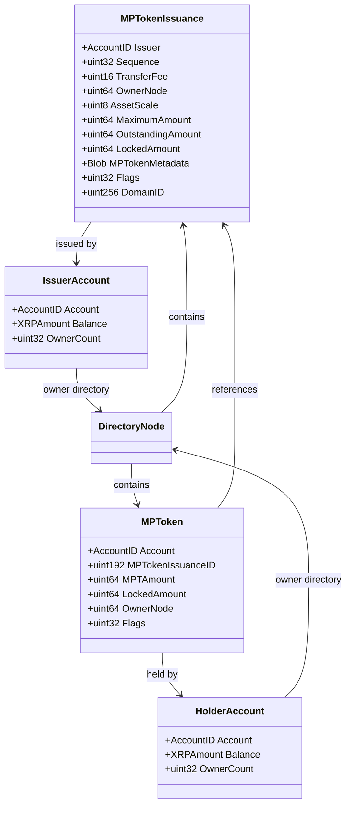
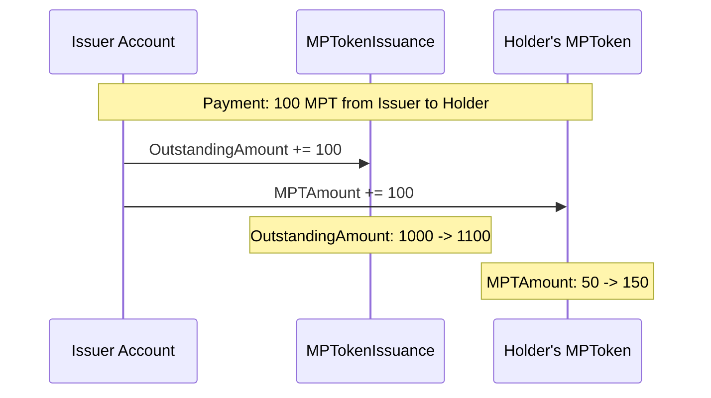
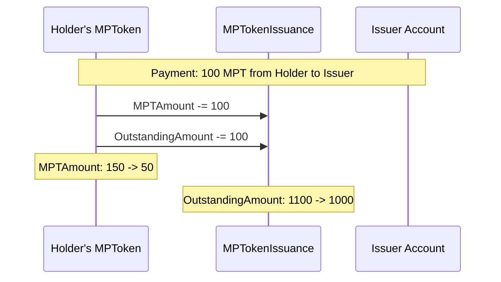
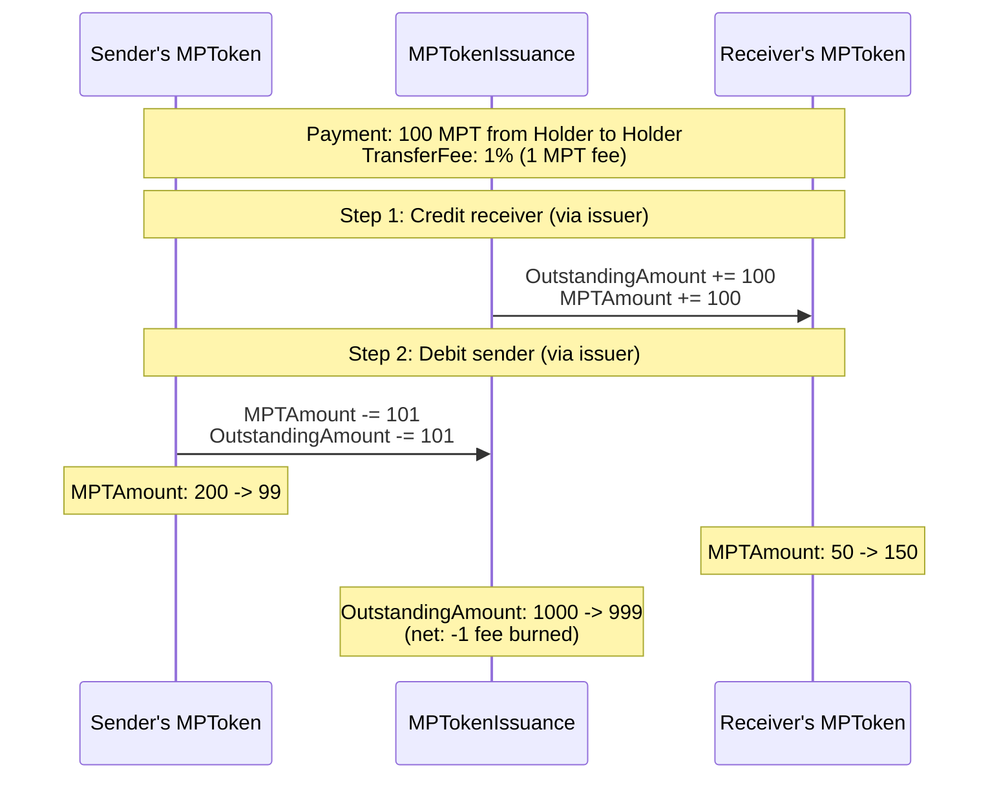

# Index

- [1. Introduction](#1-introduction)
    - [1.1. DomainID and Authorization](#11-domainid-and-authorization)
- [2. Ledger Entries](#2-ledger-entries)
    - [2.1. MPTokenIssuance Ledger Entry](#21-mptokenissuance-ledger-entry)
        - [2.1.1. Object Identifier](#211-object-identifier)
        - [2.1.2. Fields](#212-fields)
            - [2.1.2.1. Flags](#2121-flags)
        - [2.1.3. Pseudo-accounts](#213-pseudo-accounts)
        - [2.1.4. Ownership](#214-ownership)
        - [2.1.5. Reserves](#215-reserves)
    - [2.2. MPToken Ledger Entry](#22-mptoken-ledger-entry)
        - [2.2.1. Object Identifier](#221-object-identifier)
        - [2.2.2. Fields](#222-fields)
            - [2.2.2.1. Flags](#2221-flags)
        - [2.2.3. Pseudo-accounts](#223-pseudo-accounts)
        - [2.2.4. Ownership](#224-ownership)
        - [2.2.5. Reserves](#225-reserves)
- [3. Transactions](#3-transactions)
    - [3.1. MPTokenIssuanceCreate Transaction](#31-mptokenissuancecreate-transaction)
        - [3.1.1. Failure Conditions](#311-failure-conditions)
        - [3.1.2. State Changes](#312-state-changes)
    - [3.2. MPTokenIssuanceDestroy Transaction](#32-mptokenissuancedestroy-transaction)
        - [3.2.1. Failure Conditions](#321-failure-conditions)
        - [3.2.2. State Changes](#322-state-changes)
    - [3.3. MPTokenIssuanceSet Transaction](#33-mptokenissuanceset-transaction)
        - [3.3.1. Failure Conditions](#331-failure-conditions)
        - [3.3.2. State Changes](#332-state-changes)
    - [3.4. MPTokenAuthorize Transaction](#34-mptokenauthorize-transaction)
        - [3.4.1. Failure Conditions](#341-failure-conditions)
        - [3.4.2. State Changes](#342-state-changes)
    - [3.5. Clawback Transaction with MPTs](#35-clawback-transaction-with-mpts)
        - [3.5.1. Failure Conditions](#351-failure-conditions)
        - [3.5.2. State Changes](#352-state-changes)
    - [3.6. MPT Validation Functions](#36-mpt-validation-functions)
        - [3.6.1. checkMPTDEXAllowed](#361-checkmptdexallowed)
        - [3.6.2. checkMPTTxAllowed](#362-checkmptxallowed)
- [4. MPT Payment Execution](#4-mpt-payment-execution)
    - [4.1. Transfer Scenarios](#41-transfer-scenarios)
        - [4.1.1. Issuer Minting (Issuer -> Holder)](#411-issuer-minting-issuer---holder)
        - [4.1.2. Holder Burning (Holder -> Issuer)](#412-holder-burning-holder---issuer)
        - [4.1.3. Holder-to-Holder Transfer (with Transfer Fee)](#413-holder-to-holder-transfer-with-transfer-fee)

# 1. Introduction

Multi-Purpose Tokens (MPTs) are a native asset type on the XRP Ledger designed to provide an alternative to traditional trust line-based tokens. An MPT consists of an `MPTokenIssuance` that defines the MPT's properties and configuration, and individual `MPToken` entries that track each holder's balance and holder-specific settings.

The lifecycle of an MPT begins when an issuer creates an MPT issuance using the [`MPTokenIssuanceCreate` transaction](#31-mptokenissuancecreate-transaction). This transaction defines the MPT's capabilities through capability flags (such as `lsfMPTRequireAuth`, `lsfMPTCanTransfer`, and `lsfMPTCanClawback`) and optional properties like `TransferFee` and `MaximumAmount`. Capability flags are immutable by default, but the issuer can grant mutability permissions at creation time to allow changing them later via `MPTokenIssuanceSet`. See [MPTokenIssuance Fields](#212-fields) for complete details on mutable and immutable properties.

Once an issuance exists, holders acquire the ability to hold the MPT by sending an [`MPTokenAuthorize` transaction](#34-mptokenauthorize-transaction), which creates their `MPToken` entry. If the issuance has the `lsfMPTRequireAuth` flag set (on the `MPTokenIssuance`), the holder's `MPToken` entry is created but not yet authorized. The issuer must then send their own `MPTokenAuthorize` transaction specifying the holder's account to set the `lsfMPTAuthorized` flag (on the holder's `MPToken`), allowing the holder to receive MPTs. If `lsfMPTRequireAuth` is not set, holders can immediately receive MPTs after creating their `MPToken` entry. See [MPToken Fields](#222-fields) for details on holder-specific settings and [Reserves](#224-reserves) for information about reserve requirements.

After authorization (if required), MPTs can be transferred between holders via the standard `Payment` transaction. During transfers, the issuer's `TransferFee` is applied if configured. See [MPT Payment Execution](#4-mpt-payment-execution) for details on how transfer fees are calculated and applied during payments.

The issuer maintains control over the MPT through the [`MPTokenIssuanceSet` transaction](#33-mptokenissuanceset-transaction), which can toggle global locking (the `lsfMPTLocked` flag on the `MPTokenIssuance`) to freeze all operations, or toggle individual holder locking (the `lsfMPTLocked` flag on a holder's `MPToken`, requires the `lsfMPTCanLock` capability flag) to prevent a specific holder from sending or receiving MPTs. See [Flags](#2121-flags) for all lock-related capability flags and [Payment validation rules](#4-mpt-payment-execution) for how locks affect payment processing.

## 1.1. DomainID and Authorization

The `MPTokenIssuance` ledger entry has an optional `DomainID` field that controls **MPT authorization** - determining who can hold and receive the MPT. When `DomainID` is set on an `MPTokenIssuance`:
- Accounts must have valid, non-expired credentials for the specified PermissionedDomain to be authorized as MPT holders
- Authorization is verified during Payment transactions when the MPT is being received
- Requires both `lsfMPTRequireAuth` flag (see [Flags](#2121-flags)) and the `featurePermissionedDomains` and `featureSingleAssetVault` amendments

This MPT authorization mechanism is **separate and independent** from PermissionedDEX domain restrictions on offers. The `MPTokenIssuance.DomainID` controls who can hold and receive the MPT (verified during Payment transactions), while `Offer.DomainID` controls which order book an offer is placed in and restricts liquidity consumption to that domain's order book during payments and offer crossing (see [Domain Payments and AMM Exclusion](../flow/README.md#33-domain-payments)). MPTs can be traded in [domain offers](../offers/README.md#151-domain-offers), [open offers](../offers/README.md#15-permissioned-dex), and [hybrid offers](../offers/README.md#152-hybrid-offers) regardless of whether the `MPTokenIssuance` has a `DomainID` set - creating an offer with `Offer.DomainID` requires the offer creator to have domain access, but does not require the MPT itself to have a `DomainID`.

# 2. Ledger Entries

MPTs use two ledger entry types: `MPTokenIssuance` for the MPT definition and `MPToken` for individual holder balances.



## 2.1. MPTokenIssuance Ledger Entry

The `MPTokenIssuance` ledger entry (type `ltMPTOKEN_ISSUANCE = 0x007e`) represents the definition and global state of a specific MPT. An "issuance" is a single MPT type created by an issuer - it defines the token's properties (transfer fee, maximum supply, decimal places, capability flags) and tracks the token's global state (total outstanding amount, lock status). Each issuance is uniquely identified by its MPTID.

An issuer can create multiple separate MPT issuances, each with its own unique MPTID, independent configuration, and distinct set of holders. Each issuance tracks its own `OutstandingAmount` and has its own capability flags.

### 2.1.1. Object Identifier

The key of the `MPTokenIssuance` object is the result
of [SHA512-Half](https://xrpl.org/docs/references/protocol/data-types/basic-data-types#hashes) of the following values
concatenated in order:

- The `MPTokenIssuance` space key `0x007E`
- The MPTID (192-bit identifier)

The MPTID is calculated as:
```
MPTID = sequence (32 bits, big-endian) || issuer AccountID (160 bits)
```

Where `sequence` is the issuer's sequence number at creation time and `issuer` is the 160-bit AccountID

### 2.1.2. Fields

| Field               | Type      | Required | Description                                                                                                             |
|---------------------|-----------|----------|-------------------------------------------------------------------------------------------------------------------------|
| `Issuer`            | AccountID | Yes      | The account that created this MPT issuance                                                                              |
| `Sequence`          | UInt32    | Yes      | The issuer's sequence number at creation (used in MPTID calculation)                                                    |
| `TransferFee`       | UInt16    | Default  | Transfer fee in 1/10 of basis points (0-50000, representing 0%-50%)                                                     |
| `OwnerNode`         | UInt64    | Yes      | Index of the owner directory page for this issuance                                                                     |
| `AssetScale`        | UInt8     | Default  | Number of decimal places for display (0-19). Display hint only; does not affect on-ledger integer arithmetic.           |
| `MaximumAmount`     | UInt64    | Optional | Maximum supply cap (must be > 0, cannot exceed 0x7FFFFFFFFFFFFFFF)                                                      |
| `OutstandingAmount` | UInt64    | Yes      | Current total amount held across all holders                                                                            |
| `LockedAmount`      | UInt64    | Optional | Amount currently locked in escrows                                                                                      |
| `MPTokenMetadata`   | Blob      | Optional | Arbitrary metadata (1-1024 bytes)                                                                                       |
| `MutableFlags`      | UInt32    | Default  | Mutability permissions for capability flags (see [Flags](#2121-flags))                                                  |
| `DomainID`          | UInt256   | Optional | Permissioned domain identifier for MPT authorization (see [DomainID and Authorization](#11-domainid-and-authorization)) |
| `PreviousTxnID`     | UInt256   | Yes      | Transaction hash that most recently modified this entry                                                                 |
| `PreviousTxnLgrSeq` | UInt32    | Yes      | Ledger sequence of the transaction that most recently modified this entry                                               |

**Field constraints**:
- `TransferFee`: If non-zero, requires `lsfMPTCanTransfer` flag
- `MaximumAmount`: If set, `OutstandingAmount` cannot exceed it
- `MPTokenMetadata`: Maximum 1024 bytes
- `DomainID`: If set, requires `lsfMPTRequireAuth` and both `featurePermissionedDomains` and `featureSingleAssetVault` amendments

#### 2.1.2.1. Flags

| Flag Name           | Hex Value    | Description                                              |
|---------------------|--------------|----------------------------------------------------------|
| `lsfMPTLocked`      | `0x00000001` | Global lock (freezes all MPT operations for all holders) |
| `lsfMPTCanLock`     | `0x00000002` | Issuer can lock individual `MPToken` entries             |
| `lsfMPTRequireAuth` | `0x00000004` | Holders must be authorized by issuer before transacting  |
| `lsfMPTCanEscrow`   | `0x00000008` | MPT can be held in escrow                                |
| `lsfMPTCanTrade`    | `0x00000010` | MPT can be traded on the decentralized exchange          |
| `lsfMPTCanTransfer` | `0x00000020` | MPT can be transferred between accounts                  |
| `lsfMPTCanClawback` | `0x00000040` | Issuer can claw back MPTs from holders                   |

**Flag Mutability**:

- The `lsfMPTLocked` flag is always mutable and can be set/cleared by the issuer via the `MPTokenIssuanceSet` transaction.

- All capability flags (`lsfMPTCanLock`, `lsfMPTRequireAuth`, `lsfMPTCanEscrow`, `lsfMPTCanTrade`, `lsfMPTCanTransfer`, `lsfMPTCanClawback`) are immutable by default but can be made mutable at creation time. When creating an issuance via `MPTokenIssuanceCreate`, the issuer can set mutability flags (`tmfMPTCanMutateCanLock`, `tmfMPTCanMutateRequireAuth`, `tmfMPTCanMutateCanEscrow`, `tmfMPTCanMutateCanTrade`, `tmfMPTCanMutateCanTransfer`, `tmfMPTCanMutateCanClawback`) that allow the corresponding capability flag to be set or cleared later via `MPTokenIssuanceSet`. These mutability permissions are stored in the `MutableFlags` field on the `MPTokenIssuance` ledger entry and cannot be changed after creation.

**`lsfMPTCanTrade` and `lsfMPTCanTransfer` distinction**:

These flags control different, independent aspects of MPT movement:

- **`lsfMPTCanTrade`**: Required for all DEX operations. When set, the MPT can be listed in offers via [OfferCreate](../offers/README.md) (MPT/XRP, MPT/IOU, MPT/MPT pairs), deposited into [AMM pools](../amms/README.md), and used in [cross-currency payments](../payments/README.md#423-mpt-integration-in-cross-currency-payments) through order books and AMMs. Without this flag, all DEX operations fail with `tecNO_PERMISSION`, regardless of whether `lsfMPTCanTransfer` is set. DEX operations validate this flag through `checkMPTDEXAllowed()`, which also checks lock status and holder authorization. See [Section 3.6](#36-mpt-trading-on-dex) for complete DEX integration details.

- **`lsfMPTCanTransfer`**: Required for direct holder-to-holder transfers without DEX involvement. When set, holders can send MPTs directly to other holders via Payment transactions using direct balance update logic (no pathfinding, no order books). This flag is only required when neither the sender nor the receiver is the issuer. Transfers involving the issuer (minting from issuer to holder, or burning from holder to issuer) do not require this flag. See [MPT Payment Execution](#4-mpt-payment-execution) for transfer mechanics.

| `lsfMPTCanTrade` | `lsfMPTCanTransfer` | Allowed Operations                                                                                                                                                          |
|------------------|---------------------|-----------------------------------------------------------------------------------------------------------------------------------------------------------------------------|
| ✅ Set            | ✅ Set               | All operations: DEX operations (offers, AMMs, cross-currency payments) AND direct holder-to-holder transfers                                                                |
| ✅ Set            | ❌ Not set           | DEX operations only when destination is the issuer (burning); issuer minting to holders; no holder-to-holder transfers or DEX operations that deliver to non-issuer holders |
| ❌ Not set        | ✅ Set               | Direct holder-to-holder transfers only; issuer-involved transfers (minting/burning); all DEX operations fail                                                                |
| ❌ Not set        | ❌ Not set           | Only issuer-involved transfers (minting/burning); no holder-to-holder transfers, no DEX operations                                                                          |

### 2.1.3. Pseudo-accounts

MPTokenIssuance entries do not require pseudo-accounts. The issuer is always a regular account on the ledger.

### 2.1.4. Ownership

The `MPTokenIssuance` entry is owned by the issuer account and linked to the issuer's owner directory. The `OwnerNode` field stores the directory page index where this issuance appears.

The owner directory is calculated as:
```
OwnerDirectory Key = SHA512-Half(0x004F, Issuer AccountID)
```

Where `0x004F` is the OwnerDirectory space key (uppercase 'O').

### 2.1.5. Reserves

Creating an `MPTokenIssuance` always requires one owner reserve. The issuer's `OwnerCount` is incremented when the issuance is created and decremented when it is destroyed.

## 2.2. MPToken Ledger Entry

The `MPToken` ledger entry (type `ltMPTOKEN = 0x007f`) tracks an individual holder's balance and settings for a specific MPT issuance.

### 2.2.1. Object Identifier

The key of the `MPToken` object is the result
of [SHA512-Half](https://xrpl.org/docs/references/protocol/data-types/basic-data-types#hashes) of the following values
concatenated in order:

- The `MPToken` space key `0x0074`
- The `MPTokenIssuance` key
- The holder's `AccountID`

The `MPTokenIssuance` key is calculated as `SHA512-Half(0x007E, MPTID)` where `0x007E` is the `MPTokenIssuance` space key and `MPTID` is the 192-bit issuance identifier.

### 2.2.2. Fields

| Field               | Type      | Required | Description                                                               |
|---------------------|-----------|----------|---------------------------------------------------------------------------|
| `Account`           | AccountID | Yes      | The holder's account                                                      |
| `MPTokenIssuanceID` | UInt192   | Yes      | Reference to the MPT issuance (MPTID)                                     |
| `MPTAmount`         | UInt64    | Default  | Amount held by this account (max 0x7FFFFFFFFFFFFFFF)                      |
| `LockedAmount`      | UInt64    | Optional | Amount locked in escrows                                                  |
| `OwnerNode`         | UInt64    | Yes      | Index of the owner directory page for this holder                         |
| `PreviousTxnID`     | UInt256   | Yes      | Transaction hash that most recently modified this entry                   |
| `PreviousTxnLgrSeq` | UInt32    | Yes      | Ledger sequence of the transaction that most recently modified this entry |

**Field constraints**:
- `MPTAmount`: Must not exceed `MaximumAmount` on the issuance (if set)
- `LockedAmount`: If present, requires `lsfMPTCanEscrow` on the issuance

#### 2.2.2.1. Flags

| Flag Name          | Hex Value    | Description                                              |
|--------------------|--------------|----------------------------------------------------------|
| `lsfMPTLocked`     | `0x00000001` | Individual lock (holder cannot send or receive)          |
| `lsfMPTAuthorized` | `0x00000002` | Authorized by issuer (for `lsfMPTRequireAuth` issuances) |
| `lsfMPTAMM`        | `0x00000004` | MPToken is held by an AMM pseudo-account                 |

The `lsfMPTLocked` flag can only be set if the issuance has `lsfMPTCanLock` flag set.

The `lsfMPTAuthorized` flag is only relevant when the issuance has `lsfMPTRequireAuth` flag set.

The `lsfMPTAMM` flag is automatically set when an AMM creates an MPToken entry for an MPT asset in its pool. See [AMM documentation](../amms/README.md) for details on AMM pseudo-account behavior.

### 2.2.3. Pseudo-accounts

MPToken entries do not require pseudo-accounts. 

### 2.2.4. Ownership

The `MPToken` entry is owned by the holder account and linked to the holder's owner directory. The `OwnerNode` field stores the directory page index where this entry appears.

### 2.2.5. Reserves

MPToken reserves are determined by the account's total `OwnerCount`:

- **OwnerCount < 2**: No reserve required for creating `MPToken`
- **OwnerCount >= 2**: One owner reserve per `MPToken`

The holder's `OwnerCount` is always incremented when an `MPToken` is created and decremented when deleted. This differs from trust lines, which only increment `OwnerCount` when in non-default state.

# 3. Transactions

## 3.1. MPTokenIssuanceCreate Transaction

The `MPTokenIssuanceCreate` transaction creates a new MPT issuance with specified properties and capabilities.

| Field Name        |     Required?      | Modifiable? |       JSON Type        | Internal Type | Default Value | Description                                                                                                                          |
|-------------------|:------------------:|:-----------:|:----------------------:|:-------------:|:-------------:|:-------------------------------------------------------------------------------------------------------------------------------------|
| `TransactionType` | :heavy_check_mark: |    `No`     |        `String`        |   `UInt16`    |               | Must be `"MPTokenIssuanceCreate"`                                                                                                    |
| `Account`         | :heavy_check_mark: |    `No`     |        `String`        |  `AccountID`  |               | Account creating the issuance (becomes the issuer)                                                                                   |
| `AssetScale`      |                    |    `No`     |        `Number`        |    `UInt8`    |      `0`      | Number of decimal places for display (0-19). Specifies how many decimal places the MPT can be subdivided.                            |
| `TransferFee`     |                    |    `No`     |        `Number`        |   `UInt16`    |      `0`      | Transfer fee in tenths of a basis point (0-50000 inclusive, representing 0%-50%). Must not be present if `tfMPTCanTransfer` is not set. |
| `MaximumAmount`   |                    |    `No`     |   `String - Number`    |   `UInt64`    |               | Maximum supply cap. Valid range: 1 to 2^63-1.                                                                                        |
| `MPTokenMetadata` |                    |    `No`     | `String - Hexadecimal` |    `Blob`     |               | Arbitrary metadata (1-1024 bytes). By convention, should decode to JSON describing what the MPT represents.                          |
| `DomainID`        |                    |    `No`     | `String - Hexadecimal` |   `UInt256`   |               | Permissioned domain identifier (requires amendments)                                                                                 |
| `Flags`           |                    |    `No`     |        `Number`        |   `UInt32`    |      `0`      | Capability flags                                                                                                                     |
| `MutableFlags`    |                    |    `No`     |        `Number`        |   `UInt32`    |      `0`      | Mutability flags. Requires [DynamicMPT](https://github.com/XRPLF/XRPL-Standards/tree/master/XLS-0094-dynamic-MPT) amendment.         |

**Transaction Flags (Capability Flags)**:

| Flag Name          | Hex Value    | Description                                       |
|--------------------|--------------|---------------------------------------------------|
| `tfMPTCanLock`     | `0x00000002` | Enable individual holder locking                  |
| `tfMPTRequireAuth` | `0x00000004` | Require authorization before holders can transact |
| `tfMPTCanEscrow`   | `0x00000008` | Enable escrow functionality                       |
| `tfMPTCanTrade`    | `0x00000010` | Enable trading on DEX                             |
| `tfMPTCanTransfer` | `0x00000020` | Enable transfers between accounts                 |
| `tfMPTCanClawback` | `0x00000040` | Enable issuer clawback                            |

**MutableFlags (Mutability Flags)**:

These flags control whether the corresponding capability flags can be changed after creation via `MPTokenIssuanceSet`:

| Flag Name                    | Hex Value    | Description                                   |
|------------------------------|--------------|-----------------------------------------------|
| `tmfMPTCanMutateCanLock`     | `0x00000002` | Allow changing `lsfMPTCanLock` flag later     |
| `tmfMPTCanMutateRequireAuth` | `0x00000004` | Allow changing `lsfMPTRequireAuth` flag later |
| `tmfMPTCanMutateCanEscrow`   | `0x00000008` | Allow changing `lsfMPTCanEscrow` flag later   |
| `tmfMPTCanMutateCanTrade`    | `0x00000010` | Allow changing `lsfMPTCanTrade` flag later    |
| `tmfMPTCanMutateCanTransfer` | `0x00000020` | Allow changing `lsfMPTCanTransfer` flag later |
| `tmfMPTCanMutateCanClawback` | `0x00000040` | Allow changing `lsfMPTCanClawback` flag later |
| `tmfMPTCanMutateMetadata`    | `0x00010000` | Allow changing `MPTokenMetadata` field later  |
| `tmfMPTCanMutateTransferFee` | `0x00020000` | Allow changing `TransferFee` field later      |

### 3.1.1. Failure Conditions

**Static validation**[^mptissuancecreate-static-validation]

[^mptissuancecreate-static-validation]: Static validation (preflight): [`checkExtraFeatures`](https://github.com/gregtatcam/rippled/blob/a72c3438eb0591a76ac829305fcbcd0ed3b8c325/src/xrpld/app/tx/detail/MPTokenIssuanceCreate.cpp#L10-L22), [`getFlagsMask`](https://github.com/gregtatcam/rippled/blob/a72c3438eb0591a76ac829305fcbcd0ed3b8c325/src/xrpld/app/tx/detail/MPTokenIssuanceCreate.cpp#L25-L29), [`preflight`](https://github.com/gregtatcam/rippled/blob/a72c3438eb0591a76ac829305fcbcd0ed3b8c325/src/xrpld/app/tx/detail/MPTokenIssuanceCreate.cpp#L32-L78)

- `temDISABLED`: 
  - [MPTokensV1](https://xrpl.org/resources/known-amendments#mptokensv1) amendment is not enabled
  - `DomainID` is specified but amendments not enabled (requires both [PermissionedDomains](https://xrpl.org/resources/known-amendments#permissioneddomains) and [SingleAssetVault](https://xrpl.org/resources/known-amendments#singleassetvault))
  - `MutableFlags` is specified but [DynamicMPT](https://xrpl.org/resources/known-amendments#dynamicmpt) amendment is not enabled
- `temINVALID_FLAG`: Invalid flags or `MutableFlags` specified
- `temBAD_TRANSFER_FEE`: `TransferFee` exceeds 50000 (50%)
- `temMALFORMED`:
  - `TransferFee` is non-zero but `tfMPTCanTransfer` is not set
  - `DomainID` is specified but is zero (must omit field if not using domains)
  - `DomainID` is specified but `tfMPTRequireAuth` is not set
  - `MPTokenMetadata` length is not between 1 and 1024 bytes
  - `MaximumAmount` is zero or exceeds `0x7FFFFFFFFFFFFFFF`

**Validation during doApply**[^mptissuancecreate-doapply-validation]

[^mptissuancecreate-doapply-validation]: Validation during doApply: [`MPTokenIssuanceCreate.cpp`](https://github.com/gregtatcam/rippled/blob/a72c3438eb0591a76ac829305fcbcd0ed3b8c325/src/xrpld/app/tx/detail/MPTokenIssuanceCreate.cpp#L143-L162)

- `tecINSUFFICIENT_RESERVE`: Account has insufficient XRP balance to cover the reserve for creating the issuance (one owner reserve required)
- `tecDIR_FULL`: Owner directory is full and cannot accommodate the new issuance
- `tecINTERNAL`: Signing account does not exist

### 3.1.2. State Changes

- `MPTokenIssuance` object is **created**:
  - `Issuer`: Set to signing account
  - `Sequence`: Set to account's current sequence (before increment)
  - `OutstandingAmount`: Set to 0
  - `OwnerNode`: Set to directory page index
  - `Flags`: Set to transaction flags (excluding universal flags)
  - `MutableFlags`: Set if provided (default 0)
  - `AssetScale`: Set if provided (default 0)
  - `TransferFee`: Set if provided (default 0)
  - `MaximumAmount`: Set if provided
  - `MPTokenMetadata`: Set if provided
  - `DomainID`: Set if provided

- Issuer's `AccountRoot` is **modified**:
  - `OwnerCount`: Incremented by 1

- `DirectoryNode` is **created or modified**:
  - Issuance is added to issuer's owner directory
  - If issuer has no owner directory, one is created

## 3.2. MPTokenIssuanceDestroy Transaction

The `MPTokenIssuanceDestroy` transaction deletes an MPT issuance. This can only be done when no MPTs are outstanding (all holders have zero balances and no MPTs are locked in escrow).

| Field Name          |     Required?      | Modifiable? | JSON Type | Internal Type | Default Value | Description                                             |
|---------------------|:------------------:|:-----------:|:---------:|:-------------:|:-------------:|:--------------------------------------------------------|
| `TransactionType`   | :heavy_check_mark: |    `No`     | `String`  |   `UInt16`    |               | Must be `"MPTokenIssuanceDestroy"`                      |
| `Account`           | :heavy_check_mark: |    `No`     | `String`  |  `AccountID`  |               | Account submitting the transaction (must be the issuer) |
| `MPTokenIssuanceID` | :heavy_check_mark: |    `No`     | `String`  |   `UInt192`   |               | The MPTID of the issuance to destroy                    |
| `Flags`             |                    |    `No`     | `Number`  |   `UInt32`    |      `0`      | Must be 0 (only universal flags allowed)                |

### 3.2.1. Failure Conditions

**Static validation**[^mptissuancedestroy-static-validation]

[^mptissuancedestroy-static-validation]: Static validation (preflight): [`getFlagsMask`](https://github.com/gregtatcam/rippled/blob/a72c3438eb0591a76ac829305fcbcd0ed3b8c325/src/xrpld/app/tx/detail/MPTokenIssuanceDestroy.cpp#L10-L13), [`preflight`](https://github.com/gregtatcam/rippled/blob/a72c3438eb0591a76ac829305fcbcd0ed3b8c325/src/xrpld/app/tx/detail/MPTokenIssuanceDestroy.cpp#L16-L19)

- `temDISABLED`: [MPTokensV1](https://xrpl.org/resources/known-amendments#mptokensv1) amendment is not enabled
- `temINVALID_FLAG`: Any non-universal flags specified

**Validation against the ledger view**[^mptissuancedestroy-preclaim-validation]

[^mptissuancedestroy-preclaim-validation]: Validation against ledger view (preclaim): [`MPTokenIssuanceDestroy.cpp`](https://github.com/gregtatcam/rippled/blob/a72c3438eb0591a76ac829305fcbcd0ed3b8c325/src/xrpld/app/tx/detail/MPTokenIssuanceDestroy.cpp#L22-L42)

- `tecOBJECT_NOT_FOUND`: `MPTokenIssuance` with specified MPTID does not exist
- `tecNO_PERMISSION`: Signing account is not the issuer
- `tecHAS_OBLIGATIONS`: 
  - `OutstandingAmount` is non-zero (tokens still held by holders)
  - `LockedAmount` is non-zero (tokens locked in escrow)

**Validation during doApply**[^mptissuancedestroy-doapply-validation]

[^mptissuancedestroy-doapply-validation]: Validation during doApply: [`MPTokenIssuanceDestroy.cpp`](https://github.com/gregtatcam/rippled/blob/a72c3438eb0591a76ac829305fcbcd0ed3b8c325/src/xrpld/app/tx/detail/MPTokenIssuanceDestroy.cpp#L45-L61)

- `tecINTERNAL`: Signing account is not the issuer
- `tefBAD_LEDGER`: Failed to remove issuance from owner directory (indicates ledger corruption)

### 3.2.2. State Changes

- `MPTokenIssuance` object is **deleted**:
  - Issuance is removed from the ledger

- Issuer's `AccountRoot` is **modified**:
  - `OwnerCount`: Decremented by 1

- `DirectoryNode` is **modified**:
  - Issuance is removed from issuer's owner directory
  - If owner directory becomes empty, it may be deleted

## 3.3. MPTokenIssuanceSet Transaction

The `MPTokenIssuanceSet` transaction is **sent by the issuer only** to modify mutable properties of an MPT issuance or individual `MPToken` entries. It can:
- Lock/unlock the entire issuance (global lock)
- Lock/unlock individual holders
- Set/clear the `DomainID` field

| Field Name          |     Required?      | Modifiable? |       JSON Type        | Internal Type | Default Value | Description                                                                                                      |
|---------------------|:------------------:|:-----------:|:----------------------:|:-------------:|:-------------:|:-----------------------------------------------------------------------------------------------------------------|
| `TransactionType`   | :heavy_check_mark: |    `No`     |        `String`        |   `UInt16`    |               | Must be `"MPTokenIssuanceSet"`                                                                                   |
| `Account`           | :heavy_check_mark: |    `No`     |        `String`        |  `AccountID`  |               | Account submitting the transaction (must be the issuer)                                                          |
| `MPTokenIssuanceID` | :heavy_check_mark: |    `No`     |        `String`        |   `UInt192`   |               | The MPTID of the issuance to modify                                                                              |
| `Holder`            |                    |    `No`     |        `String`        |  `AccountID`  |               | If present, modifies holder's `MPToken`; otherwise modifies `MPTokenIssuance`                                    |
| `DomainID`          |                    |    `Yes`    |        `String`        |   `UInt256`   |               | Set/clear domain (only when `Holder` not present, set to zero to clear)                                          |
| `MPTokenMetadata`   |                    |    `Yes`    | `String - Hexadecimal` |    `Blob`     |               | Change metadata (requires `tmfMPTCanMutateMetadata` permission)                                                  |
| `TransferFee`       |                    |    `Yes`    |        `Number`        |   `UInt16`    |               | Change transfer fee (requires `tmfMPTCanMutateTransferFee` permission, requires `lsfMPTCanTransfer` if non-zero) |
| `MutableFlags`      |                    |    `No`     |        `Number`        |   `UInt32`    |      `0`      | Set/clear capability flags (see below, requires corresponding mutability permissions)                            |
| `Flags`             |                    |    `No`     |        `Number`        |   `UInt32`    |      `0`      | Lock/unlock flags (see below)                                                                                    |

**Transaction Flags**:

| Flag Name     | Hex Value    | Description                   |
|---------------|--------------|-------------------------------|
| `tfMPTLock`   | `0x00000001` | Lock the issuance or holder   |
| `tfMPTUnlock` | `0x00000002` | Unlock the issuance or holder |

**MutableFlags (Set/Clear Capability Flags)**:

These flags are used in the `MutableFlags` field to set or clear capability flags. Each capability requires the corresponding mutability permission (set during issuance creation):

| Flag Name                | Hex Value    | Description                                                                       |
|--------------------------|--------------|-----------------------------------------------------------------------------------|
| `tmfMPTSetCanLock`       | `0x00000001` | Set `lsfMPTCanLock` flag (requires `tmfMPTCanMutateCanLock` permission)           |
| `tmfMPTClearCanLock`     | `0x00000002` | Clear `lsfMPTCanLock` flag (requires `tmfMPTCanMutateCanLock` permission)         |
| `tmfMPTSetRequireAuth`   | `0x00000004` | Set `lsfMPTRequireAuth` flag (requires `tmfMPTCanMutateRequireAuth` permission)   |
| `tmfMPTClearRequireAuth` | `0x00000008` | Clear `lsfMPTRequireAuth` flag (requires `tmfMPTCanMutateRequireAuth` permission) |
| `tmfMPTSetCanEscrow`     | `0x00000010` | Set `lsfMPTCanEscrow` flag (requires `tmfMPTCanMutateCanEscrow` permission)       |
| `tmfMPTClearCanEscrow`   | `0x00000020` | Clear `lsfMPTCanEscrow` flag (requires `tmfMPTCanMutateCanEscrow` permission)     |
| `tmfMPTSetCanTrade`      | `0x00000040` | Set `lsfMPTCanTrade` flag (requires `tmfMPTCanMutateCanTrade` permission)         |
| `tmfMPTClearCanTrade`    | `0x00000080` | Clear `lsfMPTCanTrade` flag (requires `tmfMPTCanMutateCanTrade` permission)       |
| `tmfMPTSetCanTransfer`   | `0x00000100` | Set `lsfMPTCanTransfer` flag (requires `tmfMPTCanMutateCanTransfer` permission)   |
| `tmfMPTClearCanTransfer` | `0x00000200` | Clear `lsfMPTCanTransfer` flag (requires `tmfMPTCanMutateCanTransfer` permission) |
| `tmfMPTSetCanClawback`   | `0x00000400` | Set `lsfMPTCanClawback` flag (requires `tmfMPTCanMutateCanClawback` permission)   |
| `tmfMPTClearCanClawback` | `0x00000800` | Clear `lsfMPTCanClawback` flag (requires `tmfMPTCanMutateCanClawback` permission) |

**Behavior**:

- **When `Holder` is NOT specified**: Modifies `MPTokenIssuance` (global lock or DomainID)
- **When `Holder` is specified**: Modifies holder's `MPToken` (individual lock only)

**Lock requirements**:

- Individual lock: Requires `lsfMPTCanLock` on issuance (after SingleAssetVault)

### 3.3.1. Failure Conditions

**Static validation**[^mptissuanceset-static-validation]

[^mptissuanceset-static-validation]: Static validation (preflight): [`checkExtraFeatures`](https://github.com/gregtatcam/rippled/blob/a72c3438eb0591a76ac829305fcbcd0ed3b8c325/src/xrpld/app/tx/detail/MPTokenIssuanceSet.cpp#L11-L16), [`getFlagsMask`](https://github.com/gregtatcam/rippled/blob/a72c3438eb0591a76ac829305fcbcd0ed3b8c325/src/xrpld/app/tx/detail/MPTokenIssuanceSet.cpp#L19-L22), [`preflight`](https://github.com/gregtatcam/rippled/blob/a72c3438eb0591a76ac829305fcbcd0ed3b8c325/src/xrpld/app/tx/detail/MPTokenIssuanceSet.cpp#L49-L122)

- `temDISABLED`:
  - [MPTokensV1](https://xrpl.org/resources/known-amendments#mptokensv1) amendment is not enabled
  - `DomainID` specified but amendments not enabled (requires [PermissionedDomains](https://xrpl.org/resources/known-amendments#permissioneddomains) and [SingleAssetVault](https://xrpl.org/resources/known-amendments#singleassetvault))
  - Mutation fields (`MutableFlags`, `MPTokenMetadata`, or `TransferFee`) specified but [DynamicMPT](https://xrpl.org/resources/known-amendments#dynamicmpt) amendment is not enabled
- `temMALFORMED`:
  - Both `DomainID` and `Holder` specified (mutually exclusive)
  - `Account` equals `Holder` (cannot lock own MPToken)
  - With [SingleAssetVault](https://xrpl.org/resources/known-amendments#singleassetvault) or [DynamicMPT](https://xrpl.org/resources/known-amendments#dynamicmpt), must specify at least one of: `tfMPTLock`, `tfMPTUnlock`, `DomainID`, or mutation fields (transaction must change something)
  - `Holder` field present with mutation fields (mutually exclusive)
  - Transaction flags set with mutation fields (cannot lock/unlock while mutating)
  - `MPTokenMetadata` exceeds 1024 bytes
  - Non-zero `TransferFee` with `tmfMPTClearCanTransfer` in the same transaction
- `temINVALID_FLAG`:
  - Both `tfMPTLock` and `tfMPTUnlock` specified
  - Invalid flags specified
  - `MutableFlags` is zero or contains invalid flags
  - `MutableFlags` sets and clears the same capability flag
- `temBAD_TRANSFER_FEE`: `TransferFee` exceeds 50000 (50%)

**Validation against the ledger view**[^mptissuanceset-preclaim-validation]

[^mptissuanceset-preclaim-validation]: Validation against ledger view (preclaim): [`checkPermission`](https://github.com/gregtatcam/rippled/blob/a72c3438eb0591a76ac829305fcbcd0ed3b8c325/src/xrpld/app/tx/detail/MPTokenIssuanceSet.cpp#L125-L159), [`preclaim`](https://github.com/gregtatcam/rippled/blob/a72c3438eb0591a76ac829305fcbcd0ed3b8c325/src/xrpld/app/tx/detail/MPTokenIssuanceSet.cpp#L162-L249)

- `terNO_ACCOUNT`: Signing account does not exist
- `tecOBJECT_NOT_FOUND`:
  - `MPTokenIssuance` does not exist
  - `Holder` specified but `MPToken` does not exist
  - `DomainID` specified (non-zero) but domain does not exist
- `tecNO_PERMISSION`:
  - Signing account is not the issuer
  - Attempting to lock/unlock without `lsfMPTCanLock` (when [SingleAssetVault](https://xrpl.org/resources/known-amendments#singleassetvault) is enabled)
  - `DomainID` specified but issuance does not have `lsfMPTRequireAuth`
  - Attempting to change a capability flag (via `MutableFlags`) without the corresponding mutability permission set during issuance creation
  - Attempting to change `MPTokenMetadata` without `tmfMPTCanMutateMetadata` permission
  - Attempting to change `TransferFee` without `tmfMPTCanMutateTransferFee` permission
  - Setting non-zero `TransferFee` when `lsfMPTCanTransfer` flag is not set
- `tecNO_DST`: `Holder` account does not exist

**Validation during doApply**[^mptissuanceset-doapply-validation]

[^mptissuanceset-doapply-validation]: Validation during doApply: [`MPTokenIssuanceSet.cpp`](https://github.com/gregtatcam/rippled/blob/a72c3438eb0591a76ac829305fcbcd0ed3b8c325/src/xrpld/app/tx/detail/MPTokenIssuanceSet.cpp#L252-L338)

- `tecINTERNAL`: `MPTokenIssuance` does not exist

### 3.3.2. State Changes

**When `Holder` is NOT specified** (modifying `MPTokenIssuance`):

- `MPTokenIssuance` object is **modified**:
  - If `tfMPTLock`: Set `lsfMPTLocked` flag (global lock)
  - If `tfMPTUnlock`: Clear `lsfMPTLocked` flag (global unlock)
  - If `DomainID` non-zero: Set `DomainID` field
  - If `DomainID` zero: Clear `DomainID` field (remove from entry)
  - If `MPTokenMetadata` present: Update `MPTokenMetadata` field
  - If `TransferFee` present: Update `TransferFee` field
  - If `MutableFlags` present with set flags: Set corresponding capability flags (e.g., `tmfMPTSetCanTrade` sets `lsfMPTCanTrade`)
  - If `MutableFlags` present with clear flags: Clear corresponding capability flags (e.g., `tmfMPTClearCanTrade` clears `lsfMPTCanTrade`). Clearing `lsfMPTCanTransfer` via `tmfMPTClearCanTransfer` also clears the `TransferFee` field.[^clear-cantransfer-clears-transferfee]

[^clear-cantransfer-clears-transferfee]: Clearing `lsfMPTCanTransfer` clears `TransferFee`: [`MPTokenIssuanceSet.cpp`](https://github.com/gregtatcam/rippled/blob/a72c3438eb0591a76ac829305fcbcd0ed3b8c325/src/xrpld/app/tx/detail/MPTokenIssuanceSet.cpp#L286-L291)

**When `Holder` is specified** (modifying `MPToken`):

- `MPToken` object is **modified**:
  - If `tfMPTLock`: Set `lsfMPTLocked` flag (individual lock)
  - If `tfMPTUnlock`: Clear `lsfMPTLocked` flag (individual unlock)

## 3.4. MPTokenAuthorize Transaction

The `MPTokenAuthorize` transaction manages `MPToken` entries and authorization. It has different behaviors depending on who submits it and which fields are specified:

**Holder-initiated** (no `Holder` field):
- Create an `MPToken` entry (opt-in to holding the MPT)
- Delete an `MPToken` entry (opt-out, requires zero balance)

**Issuer-initiated** (`Holder` field present):
- Authorize a holder by setting `lsfMPTAuthorized` flag
- Unauthorize a holder by clearing `lsfMPTAuthorized` flag

| Field Name | Required? | Modifiable? | JSON Type | Internal Type | Default Value | Description |
|------------|:---------:|:-----------:|:---------:|:-------------:|:-------------:|:------------|
| `TransactionType` | :heavy_check_mark: | `No` | `String` | `UInt16` | | Must be `"MPTokenAuthorize"` |
| `Account` | :heavy_check_mark: | `No` | `String` | `AccountID` | | Account submitting the transaction |
| `MPTokenIssuanceID` | :heavy_check_mark: | `No` | `String` | `UInt192` | | The MPTID to authorize for |
| `Holder` | | `No` | `String` | `AccountID` | | If present, issuer is authorizing this holder |
| `Flags` | | `No` | `Number` | `UInt32` | `0` | Unauthorize flag (see below) |

**Transaction Flags**:

| Flag Name | Hex Value | Description |
|-----------|-----------|-------------|
| `tfMPTUnauthorize` | `0x00000001` | Delete MPToken entry (holder-initiated only) |

**Behavioral Matrix**:

| Holder Field | `tfMPTUnauthorize` | Who Submits | Action |
|--------------|------------------|-------------|---------|
| Not present | Not set | Holder | Create `MPToken` entry |
| Not present | Set | Holder | Delete `MPToken` entry (requires zero balance) |
| Present | Not set | Issuer | Set `lsfMPTAuthorized` flag |
| Present | Set | Issuer | Clear `lsfMPTAuthorized` flag |

### 3.4.1. Failure Conditions

**Static validation**[^mptokenauthorize-static-validation]

[^mptokenauthorize-static-validation]: Static validation (preflight): [`getFlagsMask`](https://github.com/gregtatcam/rippled/blob/a72c3438eb0591a76ac829305fcbcd0ed3b8c325/src/xrpld/app/tx/detail/MPTokenAuthorize.cpp#L11-L14), [`preflight`](https://github.com/gregtatcam/rippled/blob/a72c3438eb0591a76ac829305fcbcd0ed3b8c325/src/xrpld/app/tx/detail/MPTokenAuthorize.cpp#L17-L23)

- `temDISABLED`: [MPTokensV1](https://xrpl.org/resources/known-amendments#mptokensv1) amendment is not enabled
- `temINVALID_FLAG`: Invalid flags specified
- `temMALFORMED`: `Account` equals `Holder` (issuer cannot create/authorize their own `MPToken`)

**Validation against the ledger view**[^mptokenauthorize-preclaim-validation]

[^mptokenauthorize-preclaim-validation]: Validation against ledger view (preclaim): [`MPTokenAuthorize.cpp`](https://github.com/gregtatcam/rippled/blob/a72c3438eb0591a76ac829305fcbcd0ed3b8c325/src/xrpld/app/tx/detail/MPTokenAuthorize.cpp#L26-L128)

**When Holder NOT specified (holder-initiated)**:

- If `tfMPTUnauthorize`:
  - `tecOBJECT_NOT_FOUND`: `MPToken` does not exist
  - `tefINTERNAL`: `MPTokenIssuance` does not exist (and `MPToken` has a positive balance or locked amount)
  - `tecHAS_OBLIGATIONS`: 
    - `MPTAmount` is non-zero (cannot delete with balance)
    - `LockedAmount` is non-zero (cannot delete with locked MPTs)
  - With [SingleAssetVault](https://xrpl.org/resources/known-amendments#singleassetvault): `tecNO_PERMISSION`: `MPToken` is individually locked
- If NOT `tfMPTUnauthorize`:
  - `tecOBJECT_NOT_FOUND`: `MPTokenIssuance` does not exist 
  - `tecDUPLICATE`: `MPToken` already exists
  - `tecNO_PERMISSION`: Signing account is the issuer (issuer cannot create own `MPToken`)

**When Holder specified (issuer-initiated)**:

- `tecNO_DST`: Holder account does not exist
- `tecOBJECT_NOT_FOUND`: 
  - `MPTokenIssuance` does not exist
  - `MPToken` does not exist (must be created by holder first)
- `tecNO_PERMISSION`: Signing account is not the issuer
- `tecNO_AUTH`: Issuance does not have `lsfMPTRequireAuth` flag (authorization not required)


**Validation during doApply**[^mptokenauthorize-doapply-validation]

[^mptokenauthorize-doapply-validation]: Validation during doApply: [`View.cpp`](https://github.com/gregtatcam/rippled/blob/a72c3438eb0591a76ac829305fcbcd0ed3b8c325/src/libxrpl/ledger/View.cpp#L1297-L1402)

- `tecINTERNAL`: Signing account does not exist

**When creating MPToken (holder-initiated, no flags)**:

- `tecINSUFFICIENT_RESERVE`: Account has insufficient XRP balance to cover reserve for creating `MPToken` (waived if OwnerCount < 2)
- `tecDIR_FULL`: Owner directory is full and cannot accommodate the new `MPToken`

**When deleting MPToken (holder-initiated, `tfMPTUnauthorize`)**:

- `tecINTERNAL`: 
  - Failed to remove `MPToken` from owner directory (indicates ledger corruption)
  - `MPToken` does not exist or the balance is not 0

### 3.4.2. State Changes

**Holder creating MPToken** (no `Holder` field, no `tfMPTUnauthorize`):

- `MPToken` object is **created**:
  - `Account`: Set to signing account
  - `MPTokenIssuanceID`: Set to specified MPTID
  - `MPTAmount`: Set to 0
  - `OwnerNode`: Set to directory page index
  - `Flags`: Set to 0 (not authorized initially)

- Holder's `AccountRoot` is **modified**:
  - `OwnerCount`: Incremented by 1 (if OwnerCount >= 2)

- `DirectoryNode` is **created or modified**:
  - `MPToken` is added to holder's owner directory

**Holder deleting MPToken** (no `Holder` field, `tfMPTUnauthorize` set):

- `MPToken` object is **deleted**:
  - Entry is removed from the ledger

- Holder's `AccountRoot` is **modified**:
  - `OwnerCount`: Decremented by 1 (if it was incremented at creation)

- `DirectoryNode` is **modified**:
  - `MPToken` is removed from holder's owner directory

**Issuer authorizing holder** (`Holder` field present, no `tfMPTUnauthorize`):

- `MPToken` object is **modified**:
  - `lsfMPTAuthorized` flag: Set to 1 (authorized)

**Issuer unauthorizing holder** (`Holder` field present, `tfMPTUnauthorize` set):

- `MPToken` object is **modified**:
  - `lsfMPTAuthorized` flag: Cleared (unauthorized)

## 3.5. Clawback Transaction with MPTs

The `Clawback` transaction allows issuers to claw back MPTs from holders when the `lsfMPTCanClawback` flag is set. This is the same transaction type used for [trust line](../trust_lines/README.md#321-clawback-transaction) tokens, but with MPT-specific handling.

**Fields**:

Transaction fields are described in [Clawback Fields](https://xrpl.org/docs/references/protocol/transactions/types/clawback#clawback-fields).

**Note**: For trust line token clawback, the holder is specified in the `Amount.issuer` field. For MPT clawback, the `Holder` field is required because the MPTID identifies the issuance, not the holder.

### 3.5.1. Failure Conditions

**Static validation:**[^clawback-static-validation]

- `temDISABLED`: [MPTokensV1](https://xrpl.org/resources/known-amendments#mptokensv1) amendment is not enabled (for MPT clawback)
- `temINVALID_FLAG`: Any non-universal flags specified
- `temMALFORMED`:
  - `Holder` field is not specified (required for MPT clawback)
  - `Account` equals `Holder` (cannot claw back from self)
- `temBAD_AMOUNT`:
  - `Amount` is negative or zero

[^clawback-static-validation]: Static validation (preflight): [`getFlagsMask`](https://github.com/gregtatcam/rippled/blob/a72c3438eb0591a76ac829305fcbcd0ed3b8c325/src/xrpld/app/tx/detail/Clawback.cpp#L60-L63), [`preflight`](https://github.com/gregtatcam/rippled/blob/a72c3438eb0591a76ac829305fcbcd0ed3b8c325/src/xrpld/app/tx/detail/Clawback.cpp#L66-L75)

**Validation against the ledger view:**[^clawback-preclaim-validation]

- `terNO_ACCOUNT`: issuer's or holder's account does not exist.
- `tecAMM_ACCOUNT`: If holder's account is an AMM account, such as a SingleAssetVault or AMM account and if
  amendment [SingleAssetVault](https://xrpl.org/resources/known-amendments#singleassetvault) is not enabled.
- `tecPSEUDO_ACCOUNT`: If `SingleAssetVault` is enabled and holder's account is any pseudo-account.
- `tecOBJECT_NOT_FOUND`:
  - `MPTokenIssuance` does not exist
  - Holder's `MPToken` does not exist
- `tecNO_PERMISSION`:
  - Signing account is not the issuer
  - Issuance does not have `lsfMPTCanClawback` flag
- `tecINSUFFICIENT_FUNDS`: Holder's `MPTAmount` is zero (nothing to claw back)

[^clawback-preclaim-validation]: Validation against the ledger view (preclaim): [`preclaim`](https://github.com/gregtatcam/rippled/blob/a72c3438eb0591a76ac829305fcbcd0ed3b8c325/src/xrpld/app/tx/detail/Clawback.cpp#L176-L202)

### 3.5.2. State Changes

- Holder's `MPToken` is **modified**:[^clawback-doapply]
  - `MPTAmount`: Decreased by clawed back amount (or to zero if amount exceeds balance)
  - If `MPTAmount` becomes zero and all other fields are default, the entry may be deleted

- Holder's `MPToken` may be **deleted**:
  - If balance is zero, locked amount is zero, and no non-default flags are set
  - Holder's `OwnerCount` is decremented

- `MPTokenIssuance` is **modified**:
  - `OutstandingAmount`: Decreased by clawed back amount

[^clawback-doapply]: Validation during doApply: [`applyHelper<MPTIssue>`](https://github.com/gregtatcam/rippled/blob/a72c3438eb0591a76ac829305fcbcd0ed3b8c325/src/xrpld/app/tx/detail/Clawback.cpp#L239-L263)

**Notes**:
- The clawed back amount is removed from circulation (burned), not transferred to the issuer's balance. If the requested clawback amount exceeds the holder's balance, only the available balance is clawed back (no error).
- Transfer fees are waived during clawback. The full clawed back amount is burned from the holder's balance without deducting any transfer fee, even if a `TransferFee` is set on the issuance.

## 3.6. MPT Validation Functions

MPT operations are validated through two public functions that call a common underlying validation logic. These functions are used by various transactions (OfferCreate, Payment, AMMCreate, etc.) to ensure MPTs meet the requirements for their intended use.

### 3.6.1. checkMPTDEXAllowed

Used for DEX operations (offers, cross-currency payments).

**Transactions using this validation**:
- OfferCreate (CreateOffer::preclaim)
- CheckCash (when cashing checks with MPT amounts)
- Payment (when using paths for cross-currency conversion - validated in BookStep and MPTEndpointStep)

**Validation checks performed**:

1. **MPTokenIssuance exists**: Verifies the MPTokenIssuance object exists in the ledger
2. **Issuer account exists**: Verifies the issuer's account exists
3. **Global lock check**: Ensures `lsfMPTLocked` flag is not set on MPTokenIssuance
4. **DEX permission**: Verifies `lsfMPTCanTrade` flag is set (required for all DEX operations)
5. **Transfer permission** (when neither party is issuer): Verifies `lsfMPTCanTransfer` flag is set
6. **Individual lock check** (if holder has MPToken): Ensures `lsfMPTLocked` flag is not set on the holder's MPToken entry

**Possible error codes**:

- `tecNO_ISSUER`: Issuer account does not exist
- `tecOBJECT_NOT_FOUND`: MPTokenIssuance does not exist
- `tecLOCKED`: Global lock (`lsfMPTLocked` on MPTokenIssuance) OR individual lock (`lsfMPTLocked` on holder's MPToken)
- `tecNO_PERMISSION`: `lsfMPTCanTrade` flag not set OR `lsfMPTCanTransfer` flag not set (when neither party is issuer)

**When `lsfMPTCanTransfer` is checked**:

The `lsfMPTCanTransfer` check is only performed when the account is not the issuer AND (there is no destination account OR the destination is not the issuer). This means:
- Issuer-involved operations (minting/burning) do not require `lsfMPTCanTransfer`
- Holder-to-holder operations require both `lsfMPTCanTrade` (for DEX) and `lsfMPTCanTransfer`

### 3.6.2. checkMPTTxAllowed

Used for transactions involving MPTs that are not strictly DEX operations.

**Transactions using this validation**:
- CheckCreate (when creating checks with MPT amounts)
- AMMCreate, AMMDeposit, AMMWithdraw (when involving MPT assets)

**Validation checks performed**:

Same as `checkMPTDEXAllowed` but the validation logic uses the actual transaction type instead of treating it as a DEX operation. The key difference is:
- For DEX operations: Always treats the operation as requiring DEX permissions
- For other transactions: Validates based on the specific transaction type's requirements

**Possible error codes**:

Same as `checkMPTDEXAllowed`:
- `tecNO_ISSUER`
- `tecOBJECT_NOT_FOUND`
- `tecLOCKED`
- `tecNO_PERMISSION`

**Note**: Both functions call the same underlying `checkMPTAllowed()` function, which contains the core validation logic. The difference is in how they categorize the operation (DEX vs non-DEX) which affects whether `lsfMPTCanTrade` is required.

# 4. MPT Payment Execution

MPT payments transfer Multi-Purpose Tokens between accounts. Depending on whether the [MPTokensV2](https://xrpl.org/resources/known-amendments#mptokensv2) amendment is enabled, these payments execute through one of two paths: a direct transfer mechanism (when MPTokensV2 is not enabled) or the [Flow engine](../flow/README.md) (when MPTokensV2 is enabled). Both execution paths use the same underlying transfer logic.

**Transfer mechanics**: The three transfer scenarios described below apply regardless of which execution path is used, as both ultimately call the same `rippleCreditMPT` function to modify ledger entries. The transfer behavior depends on whether the issuer is involved in the transaction.

**Prerequisites**: Both source and destination must have `MPToken` entries (created via `MPTokenAuthorize` transaction) unless one party is the issuer. The issuer never has an `MPToken` entry.

If the `MPTokenIssuance` has a `DomainID` field set, the receiving account must have valid, non-expired credentials for that PermissionedDomain to receive the MPT (see [Domain Membership](../permissioned_domains/README.md#41-domain-membership) for credential verification details). This authorization is checked during payment preclaim:
- If the receiver has an existing `MPToken` entry with the `lsfMPTAuthorized` flag set, the payment succeeds (authorization previously granted)
- If the receiver has no `MPToken` entry or an unauthorized `MPToken` entry, the ledger checks for valid credentials matching the `MPTokenIssuance.DomainID`
- Valid credentials automatically authorize the receiver, and an `MPToken` entry is created if needed during doApply
- The sender does not need domain credentials - only the receiver's authorization is checked

This domain-based authorization is **separate** from PermissionedDEX domain restrictions on offers. The `MPTokenIssuance.DomainID` controls who can hold the MPT, while `Offer.DomainID` controls which order book an offer is placed in. See [MPT DomainID and Authorization](#11-domainid-and-authorization) and [PermissionedDomains documentation](../permissioned_domains/README.md) for detailed explanation of the distinction.

## 4.1. Transfer Scenarios

### 4.1.1. Issuer Minting (Issuer -> Holder)

When the issuer sends MPTs to a holder, new tokens are minted into circulation:



**Operations**:
1. Increase `OutstandingAmount` on `MPTokenIssuance` by sent amount
2. Increase `MPTAmount` on holder's `MPToken` by sent amount

**Net effect**: Total supply increases by the sent amount.

### 4.1.2. Holder Burning (Holder -> Issuer)

When a holder sends MPTs back to the issuer, tokens are burned from circulation:



**Operations**:
1. Decrease `MPTAmount` on holder's `MPToken` by sent amount
2. Decrease `OutstandingAmount` on `MPTokenIssuance` by sent amount

**Net effect**: Total supply decreases by the sent amount.

### 4.1.3. Holder-to-Holder Transfer (with Transfer Fee)

When neither party is the issuer, the transfer is executed through a two-step process that applies and burns the transfer fee:



1. Calculate transfer fee: `actualAmount = amount * (1 + transferFee%)`
2. **Credit step** (through issuer to receiver):
   - Increase `OutstandingAmount` on `MPTokenIssuance` by delivery amount
   - Increase `MPTAmount` on receiver's `MPToken` by delivery amount
3. **Debit step** (from sender through issuer):
   - Decrease `MPTAmount` on sender's `MPToken` by `actualAmount` (amount + fee)
   - Decrease `OutstandingAmount` on `MPTokenIssuance` by `actualAmount`

**Net effect**:
- Receiver gets: delivery amount
- Sender pays: delivery amount + fee
- Total supply decreases by: fee amount (burned from circulation)
