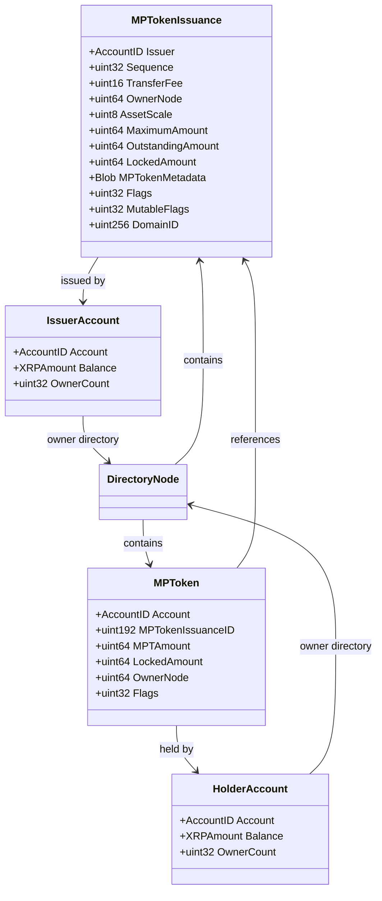
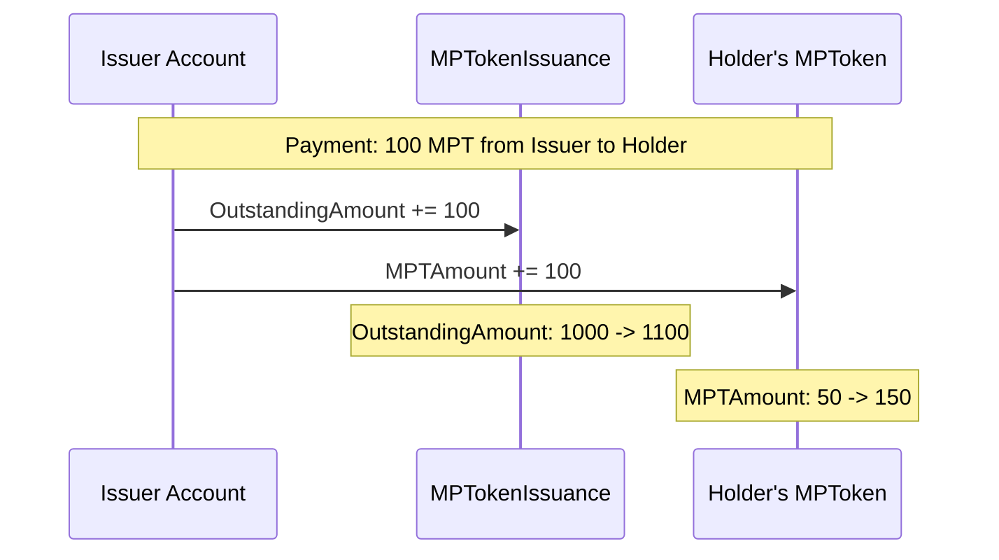
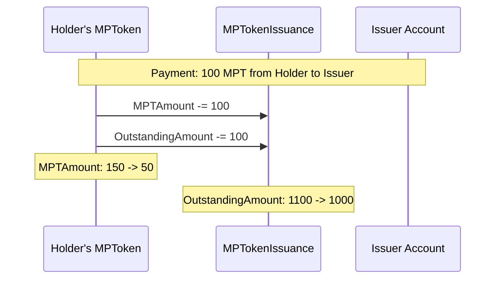
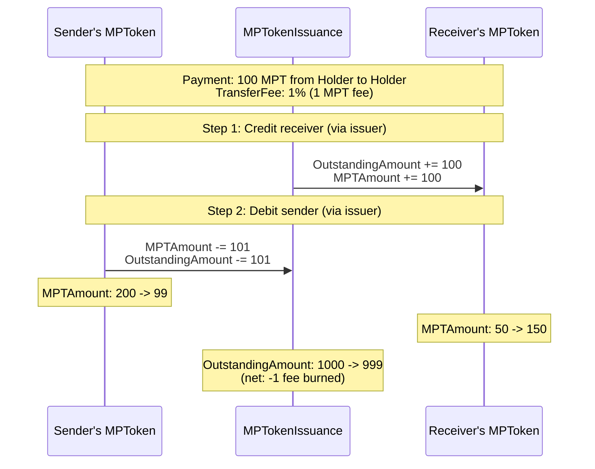

# Index

- [1. Introduction](#1-introduction)
    - [1.1. DomainID and Authorization](#11-domainid-and-authorization)
- [2. Ledger Entries](#2-ledger-entries)
    - [2.1. MPTokenIssuance Ledger Entry](#21-mptokenissuance-ledger-entry)
        - [2.1.1. Object Identifier](#211-object-identifier)
        - [2.1.2. Fields](#212-fields)
            - [2.1.2.1. Flags](#2121-flags)
        - [2.1.3. Pseudo-accounts](#213-pseudo-accounts)
        - [2.1.4. Ownership](#214-ownership)
        - [2.1.5. Reserves](#215-reserves)
    - [2.2. MPToken Ledger Entry](#22-mptoken-ledger-entry)
        - [2.2.1. Object Identifier](#221-object-identifier)
        - [2.2.2. Fields](#222-fields)
            - [2.2.2.1. Flags](#2221-flags)
        - [2.2.3. Pseudo-accounts](#223-pseudo-accounts)
        - [2.2.4. Ownership](#224-ownership)
        - [2.2.5. Reserves](#225-reserves)
- [3. Transactions](#3-transactions)
    - [3.1. MPTokenIssuanceCreate Transaction](#31-mptokenissuancecreate-transaction)
        - [3.1.1. Failure Conditions](#311-failure-conditions)
        - [3.1.2. State Changes](#312-state-changes)
    - [3.2. MPTokenIssuanceDestroy Transaction](#32-mptokenissuancedestroy-transaction)
        - [3.2.1. Failure Conditions](#321-failure-conditions)
        - [3.2.2. State Changes](#322-state-changes)
    - [3.3. MPTokenIssuanceSet Transaction](#33-mptokenissuanceset-transaction)
        - [3.3.1. Failure Conditions](#331-failure-conditions)
        - [3.3.2. State Changes](#332-state-changes)
    - [3.4. MPTokenAuthorize Transaction](#34-mptokenauthorize-transaction)
        - [3.4.1. Failure Conditions](#341-failure-conditions)
        - [3.4.2. State Changes](#342-state-changes)
    - [3.5. Clawback Transaction with MPTs](#35-clawback-transaction-with-mpts)
        - [3.5.1. Failure Conditions](#351-failure-conditions)
        - [3.5.2. State Changes](#352-state-changes)
    - [3.6. MPT Validation Functions](#36-mpt-validation-functions)
        - [3.6.1. canTrade](#361-cantrade)
        - [3.6.2. canTransfer](#362-cantransfer)
        - [3.6.3. canMPTTradeAndTransfer](#363-canmpttradeandtransfer)
- [4. MPT Payment Execution](#4-mpt-payment-execution)
    - [4.1. Transfer Scenarios](#41-transfer-scenarios)
        - [4.1.1. Issuer Minting (Issuer -> Holder)](#411-issuer-minting-issuer---holder)
        - [4.1.2. Holder Burning (Holder -> Issuer)](#412-holder-burning-holder---issuer)
        - [4.1.3. Holder-to-Holder Transfer (with Transfer Fee)](#413-holder-to-holder-transfer-with-transfer-fee)

# 1. Introduction

Multi-Purpose Tokens (MPTs) are a native asset type on the XRP Ledger designed to provide an alternative to traditional trust line-based tokens. An MPT consists of an `MPTokenIssuance` that defines the MPT's properties and configuration, and individual `MPToken` entries that track each holder's balance and holder-specific settings. The issuer does not hold an `MPToken` for its own issuance. The total amount in circulation is tracked on the `MPTokenIssuance` via `OutstandingAmount`, which is adjusted directly when the issuer mints to or burns from holders.

An MPT moves through the following lifecycle:

1. **Create the issuance.** The issuer sends an [`MPTokenIssuanceCreate` transaction](#31-mptokenissuancecreate-transaction), which defines the MPT's capability flags (such as `lsfMPTRequireAuth`, `lsfMPTCanTransfer`, and `lsfMPTCanClawback`) and optional properties like `TransferFee` and `MaximumAmount`. Capability flags are immutable by default, but the issuer can grant mutability permissions at creation time to allow changing them later via `MPTokenIssuanceSet`. See [MPTokenIssuance Fields](#212-fields).
2. **Authorize holders.** A holder sends an [`MPTokenAuthorize` transaction](#34-mptokenauthorize-transaction) to create their `MPToken` entry. If the issuance has `lsfMPTRequireAuth` set, the entry is created but not yet authorized. The issuer must then send their own `MPTokenAuthorize` naming the holder to set `lsfMPTAuthorized` (on the holder's `MPToken`) before the holder can receive MPTs. If `lsfMPTRequireAuth` is not set, the holder can receive MPTs as soon as the entry exists. See [MPToken Fields](#222-fields) and [Reserves](#224-reserves).
3. **Transfer.** Once authorized (if required), MPTs are transferred between holders via the standard `Payment` transaction, applying the issuer's `TransferFee` if configured. See [MPT Payment Execution](#4-mpt-payment-execution).

Throughout the MPT's life, the issuer retains control through the [`MPTokenIssuanceSet` transaction](#33-mptokenissuanceset-transaction): global locking (the `lsfMPTLocked` flag on the `MPTokenIssuance`) prevents all holders from transferring the MPT, and individual holder locking (the `lsfMPTLocked` flag on a holder's `MPToken`) prevents a single holder from transferring it. Both require the issuance to have the `lsfMPTCanLock` capability flag; neither prevents the issuer from minting to or redeeming from holders (issuer <-> holder transfers remain available even when locked). See [Flags](#2121-flags) and [Payment validation rules](#4-mpt-payment-execution).

## 1.1. DomainID and Authorization

The `MPTokenIssuance` ledger entry has an optional `DomainID` field that controls **MPT authorization** - determining who can hold and receive the MPT. When `DomainID` is set on an `MPTokenIssuance`:
- Accounts must have valid, non-expired credentials for the specified PermissionedDomain to be authorized as MPT holders
- Authorization is verified whenever an account would receive or acquire the MPT. This includes `Payment`, offer creation and crossing, AMM operations, escrow, and cross-currency flow steps
- Requires both `lsfMPTRequireAuth` flag (see [Flags](#2121-flags)) and the `featurePermissionedDomains` and `featureSingleAssetVault` amendments

This MPT authorization mechanism is **separate and independent** from PermissionedDEX domain restrictions on offers. The `MPTokenIssuance.DomainID` controls who can hold and receive the MPT (verified whenever an account receives the MPT), while `Offer.DomainID` controls which order book an offer is placed in and restricts liquidity consumption to that domain's order book during payments and offer crossing (see [Domain Payments](../flow/README.md#33-domain-payments)). MPTs can be traded in [domain offers](../offers/README.md#151-domain-offers), [open offers](../offers/README.md#15-permissioned-dex), and [hybrid offers](../offers/README.md#152-hybrid-offers) regardless of whether the `MPTokenIssuance` has a `DomainID` set - creating an offer with `Offer.DomainID` requires the offer creator to have domain access, but does not require the MPT itself to have a `DomainID`.

# 2. Ledger Entries

MPTs use two ledger entry types: `MPTokenIssuance` for the MPT definition and `MPToken` for individual holder balances.


```mermaid
classDiagram
    class MPTokenIssuance {
        +AccountID Issuer
        +uint32 Sequence
        +uint16 TransferFee
        +uint64 OwnerNode
        +uint8 AssetScale
        +uint64 MaximumAmount
        +uint64 OutstandingAmount
        +uint64 LockedAmount
        +Blob MPTokenMetadata
        +uint32 Flags
        +uint32 MutableFlags
        +uint256 DomainID
    }

    class MPToken {
        +AccountID Account
        +uint192 MPTokenIssuanceID
        +uint64 MPTAmount
        +uint64 LockedAmount
        +uint64 OwnerNode
        +uint32 Flags
    }

    class IssuerAccount {
        +AccountID Account
        +XRPAmount Balance
        +uint32 OwnerCount
    }

    class HolderAccount {
        +AccountID Account
        +XRPAmount Balance
        +uint32 OwnerCount
    }

    class DirectoryNode {
    }

    MPTokenIssuance --> IssuerAccount : issued by
    MPToken --> HolderAccount : held by
    MPToken --> MPTokenIssuance : references
    IssuerAccount --> DirectoryNode : owner directory
    HolderAccount --> DirectoryNode : owner directory
    DirectoryNode --> MPTokenIssuance : contains
    DirectoryNode --> MPToken : contains
```

## 2.1. MPTokenIssuance Ledger Entry

The `MPTokenIssuance` ledger entry (type `ltMPTOKEN_ISSUANCE = 0x007e`) represents the definition and global state of a specific MPT. An "issuance" is a single MPT type created by an issuer - it defines the token's properties (transfer fee, maximum supply, decimal places, capability flags) and tracks the token's global state (total outstanding amount, lock status). Each issuance is uniquely identified by its MPTID.

An issuer can create multiple separate MPT issuances, each with its own unique MPTID, independent configuration, and distinct set of holders. Each issuance tracks its own `OutstandingAmount` and has its own capability flags.

### 2.1.1. Object Identifier

The key of the `MPTokenIssuance` object is the result
of [SHA512-Half](https://xrpl.org/docs/references/protocol/data-types/basic-data-types#hashes) of the following values
concatenated in order:

- The `MPTokenIssuance` space key `0x007E`
- The MPTID (192-bit identifier)

The MPTID is calculated as:
```
MPTID = sequence (32 bits, big-endian) || issuer AccountID (160 bits)
```

Where `sequence` is the issuer's sequence number at creation time and `issuer` is the 160-bit AccountID

### 2.1.2. Fields

| Field               | Type      | Required | Description                                                                                                             |
|---------------------|-----------|----------|-------------------------------------------------------------------------------------------------------------------------|
| `Issuer`            | AccountID | Yes      | The account that created this MPT issuance                                                                              |
| `Sequence`          | UInt32    | Yes      | The issuer's sequence number at creation (used in MPTID calculation)                                                    |
| `TransferFee`       | UInt16    | Default  | Transfer fee in 1/10 of basis points (0-50000, representing 0%-50%)                                                     |
| `OwnerNode`         | UInt64    | Yes      | Index of the owner directory page for this issuance                                                                     |
| `AssetScale`        | UInt8     | Default  | Number of decimal places for display. Display hint only; does not affect on-ledger integer arithmetic. |
| `MaximumAmount`     | UInt64    | Optional | Maximum supply cap (must be > 0, cannot exceed 0x7FFFFFFFFFFFFFFF)                                                      |
| `OutstandingAmount` | UInt64    | Yes      | Total amount in circulation. Equals the sum of every holder's balance, including escrow-locked amounts.[^outstanding-balance] |
| `LockedAmount`      | UInt64    | Optional | Amount currently locked in escrows                                                                                      |
| `MPTokenMetadata`   | Blob      | Optional | Arbitrary metadata (1-1024 bytes)                                                                                       |
| `MutableFlags`      | UInt32    | Default  | Mutability permissions for capability flags (see [Flags](#2121-flags))                                                  |
| `DomainID`          | UInt256   | Optional | Permissioned domain identifier for MPT authorization (see [DomainID and Authorization](#11-domainid-and-authorization)) |
| `ReferenceHolding`  | UInt256   | Optional | Vault-share issuances only. Points to the vault pseudo-account's holding of the underlying asset (an `MPToken` or `RippleState`). Set internally by `VaultCreate`. `canTrade` and `canTransfer` follow it so the share inherits the underlying asset's tradability and transferability. |
| `PreviousTxnID`     | UInt256   | Yes      | Transaction hash that most recently modified this entry                                                                 |
| `PreviousTxnLgrSeq` | UInt32    | Yes      | Ledger sequence of the transaction that most recently modified this entry                                               |

[^outstanding-balance]: [`MPTInvariant.cpp`](https://github.com/XRPLF/rippled/blob/0fffe23abc3a42e7d8016fbbd9a0beed3c40bbc9/src/libxrpl/tx/invariants/MPTInvariant.cpp#L398-L418), [`finalize`](https://github.com/XRPLF/rippled/blob/0fffe23abc3a42e7d8016fbbd9a0beed3c40bbc9/src/libxrpl/tx/invariants/MPTInvariant.cpp#L454-L470)

**Field constraints**:
- `TransferFee`: If non-zero, requires `lsfMPTCanTransfer` flag
- `MaximumAmount`: If set, `OutstandingAmount` cannot exceed it
- `MPTokenMetadata`: Maximum 1024 bytes
- `DomainID`: If set, requires `lsfMPTRequireAuth` and both `featurePermissionedDomains` and `featureSingleAssetVault` amendments

#### 2.1.2.1. Flags

| Flag Name           | Hex Value    | Description                                              |
|---------------------|--------------|----------------------------------------------------------|
| `lsfMPTLocked`      | `0x00000001` | Global lock. Prevents all holders from transferring the MPT. Direct issuer/holder transfers still allowed. |
| `lsfMPTCanLock`     | `0x00000002` | Permits the issuer to lock the MPT, globally or per holder, via `MPTokenIssuanceSet`. |
| `lsfMPTRequireAuth` | `0x00000004` | Holders must be authorized by issuer before transacting  |
| `lsfMPTCanEscrow`   | `0x00000008` | MPT can be held in escrow                                |
| `lsfMPTCanTrade`    | `0x00000010` | MPT can be traded on the decentralized exchange          |
| `lsfMPTCanTransfer` | `0x00000020` | MPT can be transferred between accounts                  |
| `lsfMPTCanClawback` | `0x00000040` | Issuer can claw back MPTs from holders                   |

**Flag Mutability**:

- The `lsfMPTLocked` flag is always mutable and can be set/cleared by the issuer via the `MPTokenIssuanceSet` transaction.

- All capability flags (`lsfMPTCanLock`, `lsfMPTRequireAuth`, `lsfMPTCanEscrow`, `lsfMPTCanTrade`, `lsfMPTCanTransfer`, `lsfMPTCanClawback`) are immutable by default but can be made mutable at creation time. When creating an issuance via `MPTokenIssuanceCreate`, the issuer can set mutability flags (`tmfMPTCanMutateCanLock`, `tmfMPTCanMutateRequireAuth`, `tmfMPTCanMutateCanEscrow`, `tmfMPTCanMutateCanTrade`, `tmfMPTCanMutateCanTransfer`, `tmfMPTCanMutateCanClawback`) that allow the corresponding capability flag to be set or cleared later via `MPTokenIssuanceSet`. These mutability permissions are stored in the `MutableFlags` field on the `MPTokenIssuance` ledger entry and cannot be changed after creation.

**`lsfMPTCanTrade` and `lsfMPTCanTransfer` distinction**:

These flags control different, independent aspects of MPT movement:

- **`lsfMPTCanTrade`**: Required for all DEX operations. When set, the MPT can be listed in offers via [OfferCreate](../offers/README.md) (MPT/XRP, MPT/IOU, MPT/MPT pairs), deposited into [AMM pools](../amms/README.md), and used in [cross-currency payments](../payments/README.md#423-mpt-integration-in-cross-currency-payments) through order books and AMMs. Without this flag, all DEX operations fail with `tecNO_PERMISSION`, regardless of whether `lsfMPTCanTransfer` is set. DEX operations validate this flag through `canTrade()`; lock status and holder authorization are checked separately by `isFrozen` and `requireAuth`. See [Section 3.6](#36-mpt-validation-functions) for complete validation details.

- **`lsfMPTCanTransfer`**: Required for direct holder-to-holder transfers without DEX involvement. When set, holders can send MPTs directly to other holders via Payment transactions using direct balance update logic (no pathfinding, no order books). This flag is only required when neither the sender nor the receiver is the issuer. Transfers involving the issuer (minting from issuer to holder, or burning from holder to issuer) do not require this flag. See [MPT Payment Execution](#4-mpt-payment-execution) for transfer mechanics.

| `lsfMPTCanTrade` | `lsfMPTCanTransfer` | Holder-to-holder transfers | DEX operations (offers, AMMs, cross-currency) |
|------------------|---------------------|----------------------------|-----------------------------------------------|
| ✅ Set            | ✅ Set               | ✅ Allowed | ✅ Allowed |
| ✅ Set            | ❌ Not set           | ❌ Blocked (`tecNO_AUTH`) | ⚠️ Only legs delivering to the issuer (e.g. burning); delivery to a non-issuer holder fails with `tecNO_AUTH` |
| ❌ Not set        | ✅ Set               | ✅ Allowed | ❌ Blocked (`tecNO_PERMISSION`) |
| ❌ Not set        | ❌ Not set           | ❌ Blocked (`tecNO_AUTH`) | ❌ Blocked (`tecNO_PERMISSION`) |

Transfers involving the issuer (minting and burning) are always allowed and require neither flag. A DEX trade runs both checks: `canTrade` gates the trade, and `canTransfer` gates the delivery leg to a non-issuer holder.

### 2.1.3. Pseudo-accounts

MPTokenIssuance entries do not require pseudo-accounts. The issuer is always a regular account on the ledger.

### 2.1.4. Ownership

The `MPTokenIssuance` entry is owned by the issuer account and linked to the issuer's owner directory. The `OwnerNode` field stores the directory page index where this issuance appears.

The owner directory is calculated as:
```
OwnerDirectory Key = SHA512-Half(0x004F, Issuer AccountID)
```

Where `0x004F` is the OwnerDirectory space key (uppercase 'O').

### 2.1.5. Reserves

Creating an `MPTokenIssuance` always requires one owner reserve. The issuer's `OwnerCount` is incremented when the issuance is created and decremented when it is destroyed.

## 2.2. MPToken Ledger Entry

The `MPToken` ledger entry (type `ltMPTOKEN = 0x007f`)[^mpt-ledger-layout] tracks an individual holder's balance and settings for a specific MPT issuance.

[^mpt-ledger-layout]: [`ledger_entries.macro`](https://github.com/XRPLF/rippled/blob/0fffe23abc3a42e7d8016fbbd9a0beed3c40bbc9/include/xrpl/protocol/detail/ledger_entries.macro#L409-L417)

### 2.2.1. Object Identifier

The key of the `MPToken` object is the result
of [SHA512-Half](https://xrpl.org/docs/references/protocol/data-types/basic-data-types#hashes) of the following values
concatenated in order:

- The `MPToken` space key `0x0074`
- The `MPTokenIssuance` key
- The holder's `AccountID`

The `MPTokenIssuance` key is calculated as `SHA512-Half(0x007E, MPTID)` where `0x007E` is the `MPTokenIssuance` space key and `MPTID` is the 192-bit issuance identifier.[^mpt-keylet]

[^mpt-keylet]: [`Indexes.cpp`](https://github.com/XRPLF/rippled/blob/0fffe23abc3a42e7d8016fbbd9a0beed3c40bbc9/src/libxrpl/protocol/Indexes.cpp#L533-L541)

### 2.2.2. Fields

| Field               | Type      | Required | Description                                                               |
|---------------------|-----------|----------|---------------------------------------------------------------------------|
| `Account`           | AccountID | Yes      | The holder's account                                                      |
| `MPTokenIssuanceID` | UInt192   | Yes      | Reference to the MPT issuance (MPTID)                                     |
| `MPTAmount`         | UInt64    | Default  | Available (spendable) balance held by this account (max `0x7FFFFFFFFFFFFFFF`) |
| `LockedAmount`      | UInt64    | Optional | Portion of the holder's balance locked in MPT escrows, held separately from `MPTAmount` |
| `OwnerNode`         | UInt64    | Yes      | Index of the owner directory page for this holder                         |
| `PreviousTxnID`     | UInt256   | Yes      | Transaction hash that most recently modified this entry                   |
| `PreviousTxnLgrSeq` | UInt32    | Yes      | Ledger sequence of the transaction that most recently modified this entry |

**Field constraints**:
- `MPTAmount`: bounded by `kMaxMpTokenAmount` (2^63-1, `0x7FFFFFFFFFFFFFFF`). The issuance-wide `MaximumAmount` (if set) caps the issuance's total `OutstandingAmount` across all holders, not any single holder's balance.[^mpt-supply-cap]
- `LockedAmount`: only ever populated by MPT escrows. Escrow creation requires `lsfMPTCanEscrow` on the issuance, so a non-zero `LockedAmount` implies the issuance has `lsfMPTCanEscrow` set.[^mpt-locked-escrow]

[^mpt-supply-cap]: [`isMPTOverflow`](https://github.com/XRPLF/rippled/blob/0fffe23abc3a42e7d8016fbbd9a0beed3c40bbc9/src/libxrpl/ledger/helpers/MPTokenHelpers.cpp#L973-L983), [`maxMPTAmount`](https://github.com/XRPLF/rippled/blob/0fffe23abc3a42e7d8016fbbd9a0beed3c40bbc9/src/libxrpl/ledger/helpers/MPTokenHelpers.cpp#L949-L960)
[^mpt-locked-escrow]: [`EscrowCreate.cpp`](https://github.com/XRPLF/rippled/blob/0fffe23abc3a42e7d8016fbbd9a0beed3c40bbc9/src/libxrpl/tx/transactors/escrow/EscrowCreate.cpp#L279-L281)

#### 2.2.2.1. Flags

| Flag Name          | Hex Value    | Description                                              |
|--------------------|--------------|----------------------------------------------------------|
| `lsfMPTLocked`     | `0x00000001` | Individual lock (holder cannot send or receive)          |
| `lsfMPTAuthorized` | `0x00000002` | Authorized by issuer (for `lsfMPTRequireAuth` issuances) |
| `lsfMPTAMM`        | `0x00000004` | MPToken is held by an AMM pseudo-account                 |

The `lsfMPTLocked` flag can only be set if the issuance has `lsfMPTCanLock` flag set.

The `lsfMPTAuthorized` flag is only relevant when the issuance has `lsfMPTRequireAuth` flag set.

The `lsfMPTAMM` flag is automatically set when an AMM creates an `MPToken` for an MPT in its pool (which requires the MPTokensV2 amendment). The AMM's `MPToken` is created with both `lsfMPTAMM` and `lsfMPTAuthorized`, even when the issuance has `lsfMPTRequireAuth`. AMM pseudo-accounts, like Vault and LoanBroker pseudo-accounts, are implicitly authorized, so `requireAuth` succeeds for them and they can hold a require-auth MPT. This implicit authorization cannot be revoked. An `MPTokenAuthorize` transaction naming an AMM, Vault, or LoanBroker pseudo-account as `Holder` fails with `tecNO_PERMISSION`. See [AMM documentation](../amms/README.md) for AMM pseudo-account behavior.[^mpt-amm-auth]

[^mpt-amm-auth]: [`AMMCreate.cpp`](https://github.com/XRPLF/rippled/blob/0fffe23abc3a42e7d8016fbbd9a0beed3c40bbc9/src/libxrpl/tx/transactors/dex/AMMCreate.cpp#L310-L319), [`requireAuth`](https://github.com/XRPLF/rippled/blob/0fffe23abc3a42e7d8016fbbd9a0beed3c40bbc9/src/libxrpl/ledger/helpers/MPTokenHelpers.cpp#L385-L390), [`MPTokenAuthorize.cpp`](https://github.com/XRPLF/rippled/blob/0fffe23abc3a42e7d8016fbbd9a0beed3c40bbc9/src/libxrpl/tx/transactors/token/MPTokenAuthorize.cpp#L134-L139)

### 2.2.3. Pseudo-accounts

MPToken entries do not require pseudo-accounts. The holder is a regular ledger account.

### 2.2.4. Ownership

The `MPToken` entry is owned by the holder account and linked to the holder's owner directory. The `OwnerNode` field stores the directory page index where this entry appears.

### 2.2.5. Reserves

MPToken reserves are determined by the account's total `OwnerCount`:

- **OwnerCount < 2**: No reserve required for creating `MPToken`
- **OwnerCount >= 2**: One owner reserve per `MPToken`

The holder's `OwnerCount` is always incremented when an `MPToken` is created and decremented when deleted. This differs from trust lines, which only increment `OwnerCount` when in non-default state. The reserve grace for the first two owned items, however, mirrors trust-line reserve behavior: no incremental reserve is enforced while `OwnerCount` is below 2.[^mpt-reserve]

[^mpt-reserve]: [`MPTokenHelpers.cpp`](https://github.com/XRPLF/rippled/blob/0fffe23abc3a42e7d8016fbbd9a0beed3c40bbc9/src/libxrpl/ledger/helpers/MPTokenHelpers.cpp#L193-L204)

# 3. Transactions

## 3.1. MPTokenIssuanceCreate Transaction

The `MPTokenIssuanceCreate` transaction creates a new MPT issuance with specified properties and capabilities.

| Field Name        |     Required?      | Modifiable? |       JSON Type        | Internal Type | Default Value | Description                                                                                                                          |
|-------------------|:------------------:|:-----------:|:----------------------:|:-------------:|:-------------:|:-------------------------------------------------------------------------------------------------------------------------------------|
| `TransactionType` | :heavy_check_mark: |    `No`     |        `String`        |   `UInt16`    |               | Must be `"MPTokenIssuanceCreate"`                                                                                                    |
| `Account`         | :heavy_check_mark: |    `No`     |        `String`        |  `AccountID`  |               | Account creating the issuance (becomes the issuer)                                                                                   |
| `AssetScale`      |                    |    `No`     |        `Number`        |    `UInt8`    |      `0`      | Number of decimal places for display. Any `UInt8` value (0-255) is accepted.                            |
| `TransferFee`     |                    | `Conditional` |        `Number`        |   `UInt16`    |      `0`      | Transfer fee in tenths of a basis point (0-50000 inclusive, representing 0%-50%). Must not be present if `tfMPTCanTransfer` is not set. |
| `MaximumAmount`   |                    |    `No`     |   `String - Number`    |   `UInt64`    |               | Maximum supply cap. Valid range: 1 to 2^63-1.                                                                                        |
| `MPTokenMetadata` |                    | `Conditional` | `String - Hexadecimal` |    `Blob`     |               | Arbitrary metadata (1-1024 bytes). By convention, should decode to JSON describing what the MPT represents.                          |
| `DomainID`        |                    |    `No`     | `String - Hexadecimal` |   `UInt256`   |               | Permissioned domain identifier (requires amendments)                                                                                 |
| `Flags`           |                    | `Conditional` |        `Number`        |   `UInt32`    |      `0`      | Capability flags                                                                                                                     |
| `MutableFlags`    |                    |    `No`     |        `Number`        |   `UInt32`    |      `0`      | Mutability flags. Requires [DynamicMPT](https://github.com/XRPLF/XRPL-Standards/tree/master/XLS-0094-dynamic-MPT) amendment.         |

`Conditional` modifiability (in the table above) means the field or its capability flags can be changed after creation via `MPTokenIssuanceSet`, but only if the matching `tmfMPTCanMutate*` flag was set at creation (requires the DynamicMPT amendment).

**Transaction Flags (Capability Flags)**:

| Flag Name          | Hex Value    | Description                                       |
|--------------------|--------------|---------------------------------------------------|
| `tfMPTCanLock`     | `0x00000002` | Enable individual holder locking                  |
| `tfMPTRequireAuth` | `0x00000004` | Require authorization before holders can transact |
| `tfMPTCanEscrow`   | `0x00000008` | Enable escrow functionality                       |
| `tfMPTCanTrade`    | `0x00000010` | Enable trading on DEX                             |
| `tfMPTCanTransfer` | `0x00000020` | Enable transfers between accounts                 |
| `tfMPTCanClawback` | `0x00000040` | Enable issuer clawback                            |

There is no flag to lock the issuance at creation. `lsfMPTLocked` is intentionally not settable here; an issuance is always created unlocked and can be locked later via `MPTokenIssuanceSet`.

**MutableFlags (Mutability Flags)**:

These flags control whether the corresponding capability flags can be changed after creation via `MPTokenIssuanceSet`:

| Flag Name                    | Hex Value    | Description                                   |
|------------------------------|--------------|-----------------------------------------------|
| `tmfMPTCanMutateCanLock`     | `0x00000002` | Allow changing `lsfMPTCanLock` flag later     |
| `tmfMPTCanMutateRequireAuth` | `0x00000004` | Allow changing `lsfMPTRequireAuth` flag later |
| `tmfMPTCanMutateCanEscrow`   | `0x00000008` | Allow changing `lsfMPTCanEscrow` flag later   |
| `tmfMPTCanMutateCanTrade`    | `0x00000010` | Allow changing `lsfMPTCanTrade` flag later    |
| `tmfMPTCanMutateCanTransfer` | `0x00000020` | Allow changing `lsfMPTCanTransfer` flag later |
| `tmfMPTCanMutateCanClawback` | `0x00000040` | Allow changing `lsfMPTCanClawback` flag later |
| `tmfMPTCanMutateMetadata`    | `0x00010000` | Allow changing `MPTokenMetadata` field later  |
| `tmfMPTCanMutateTransferFee` | `0x00020000` | Allow changing `TransferFee` field later      |

### 3.1.1. Failure Conditions

**Static validation**[^mptissuancecreate-static-validation]

[^mptissuancecreate-static-validation]: Static validation (preflight): [`checkExtraFeatures`](https://github.com/XRPLF/rippled/blob/0fffe23abc3a42e7d8016fbbd9a0beed3c40bbc9/src/libxrpl/tx/transactors/token/MPTokenIssuanceCreate.cpp#L30-L41), [`getFlagsMask`](https://github.com/XRPLF/rippled/blob/0fffe23abc3a42e7d8016fbbd9a0beed3c40bbc9/src/libxrpl/tx/transactors/token/MPTokenIssuanceCreate.cpp#L44-L48), [`preflight`](https://github.com/XRPLF/rippled/blob/0fffe23abc3a42e7d8016fbbd9a0beed3c40bbc9/src/libxrpl/tx/transactors/token/MPTokenIssuanceCreate.cpp#L51-L101)

- `temDISABLED`: 
  - [MPTokensV1](https://xrpl.org/resources/known-amendments#mptokensv1) amendment is not enabled
  - `DomainID` is specified but amendments not enabled (requires both [PermissionedDomains](https://xrpl.org/resources/known-amendments#permissioneddomains) and [SingleAssetVault](https://xrpl.org/resources/known-amendments#singleassetvault))
  - `MutableFlags` is specified but [DynamicMPT](https://xrpl.org/resources/known-amendments#dynamicmpt) amendment is not enabled
- `temINVALID_FLAG`:
  - `Flags` contains a bit outside the allowed capability-flag set
  - `MutableFlags` is present but is zero, or contains a bit outside the allowed mutability-flag set (when `MutableFlags` is included, at least one valid mutability bit must be set)
- `temBAD_TRANSFER_FEE`: `TransferFee` exceeds 50000 (50%)
- `temMALFORMED`:
  - `TransferFee` is non-zero but `tfMPTCanTransfer` is not set
  - `DomainID` is specified but is zero (must omit field if not using domains)
  - `DomainID` is specified but `tfMPTRequireAuth` is not set
  - `MPTokenMetadata` length is not between 1 and 1024 bytes
  - `MaximumAmount` is zero or exceeds `0x7FFFFFFFFFFFFFFF`
  - `ReferenceHolding` is present (it is set internally by `VaultCreate` only and cannot be supplied by user transactions; gated on the `fixCleanup3_2_0` amendment)

**Validation during doApply**[^mptissuancecreate-doapply-validation]

[^mptissuancecreate-doapply-validation]: Validation during doApply (reserve, directory, and internal checks in `create`): [`MPTokenIssuanceCreate.cpp`](https://github.com/XRPLF/rippled/blob/0fffe23abc3a42e7d8016fbbd9a0beed3c40bbc9/src/libxrpl/tx/transactors/token/MPTokenIssuanceCreate.cpp#L104-L172)

- `tecINSUFFICIENT_RESERVE`: the account's pre-fee balance is below the reserve required for one additional owned object (base reserve plus per-owner increments)
- `tecDIR_FULL`: Owner directory is full and cannot accommodate the new issuance
- `tecINTERNAL`: Signing account does not exist

### 3.1.2. State Changes

- `MPTokenIssuance` object is **created**:
  - `Issuer`: Set to signing account
  - `Sequence`: Set to the transaction's sequence value (the account `Sequence`, or the `TicketSequence` if submitted with a Ticket). This same value feeds the MPTID derivation.
  - `OutstandingAmount`: Set to 0
  - `OwnerNode`: Set to directory page index
  - `Flags`: Set to transaction flags (excluding universal flags)
  - `MutableFlags`: Set if provided
  - `AssetScale`: Set if provided
  - `TransferFee`: Set if provided
  - `MaximumAmount`: Set if provided
  - `MPTokenMetadata`: Set if provided
  - `DomainID`: Set if provided

- Issuer's `AccountRoot` is **modified**:
  - `OwnerCount`: Incremented by 1

- `DirectoryNode` is **created or modified**:
  - Issuance is added to issuer's owner directory
  - If issuer has no owner directory, one is created

## 3.2. MPTokenIssuanceDestroy Transaction

The `MPTokenIssuanceDestroy` transaction deletes an MPT issuance. This can only be done when no MPTs are outstanding (all holders have zero balances and no MPTs are locked in escrow).

| Field Name          |     Required?      | Modifiable? | JSON Type | Internal Type | Default Value | Description                                             |
|---------------------|:------------------:|:-----------:|:---------:|:-------------:|:-------------:|:--------------------------------------------------------|
| `TransactionType`   | :heavy_check_mark: |    `No`     | `String`  |   `UInt16`    |               | Must be `"MPTokenIssuanceDestroy"`                      |
| `Account`           | :heavy_check_mark: |    `No`     | `String`  |  `AccountID`  |               | Account submitting the transaction (must be the issuer) |
| `MPTokenIssuanceID` | :heavy_check_mark: |    `No`     | `String`  |   `UInt192`   |               | The MPTID of the issuance to destroy                    |
| `Flags`             |                    |    `No`     | `Number`  |   `UInt32`    |      `0`      | No transaction-specific flags; only universal flags (e.g. `tfFullyCanonicalSig`) are permitted                |

### 3.2.1. Failure Conditions

**Static validation**[^mptissuancedestroy-static-validation]

[^mptissuancedestroy-static-validation]: Static validation (generic preflight gate): [`invokePreflight`](https://github.com/XRPLF/rippled/blob/0fffe23abc3a42e7d8016fbbd9a0beed3c40bbc9/include/xrpl/tx/Transactor.h#L460-L470)

- `temDISABLED`: [MPTokensV1](https://xrpl.org/resources/known-amendments#mptokensv1) amendment is not enabled
- `temINVALID_FLAG`: Any non-universal flags specified

**Validation against the ledger view**[^mptissuancedestroy-preclaim-validation]

[^mptissuancedestroy-preclaim-validation]: Validation against ledger view (preclaim): [`MPTokenIssuanceDestroy.cpp`](https://github.com/XRPLF/rippled/blob/0fffe23abc3a42e7d8016fbbd9a0beed3c40bbc9/src/libxrpl/tx/transactors/token/MPTokenIssuanceDestroy.cpp#L23-L42)

- `tecOBJECT_NOT_FOUND`: `MPTokenIssuance` with specified MPTID does not exist
- `tecNO_PERMISSION`: Signing account is not the issuer
- `tecHAS_OBLIGATIONS`: 
  - `OutstandingAmount` is non-zero (tokens still held by holders)
  - `LockedAmount` is non-zero (tokens locked in escrow)

The `LockedAmount` check is a defensive guard: escrow-locked tokens remain counted in `OutstandingAmount`, so the `OutstandingAmount` check already catches an issuance with locked tokens (this branch is unreachable in practice).

**Validation during doApply**[^mptissuancedestroy-doapply-validation]

[^mptissuancedestroy-doapply-validation]: Validation during doApply: [`MPTokenIssuanceDestroy.cpp`](https://github.com/XRPLF/rippled/blob/0fffe23abc3a42e7d8016fbbd9a0beed3c40bbc9/src/libxrpl/tx/transactors/token/MPTokenIssuanceDestroy.cpp#L45-L59)

- `tecINTERNAL`: Signing account is not the issuer
- `tefBAD_LEDGER`: Failed to remove issuance from owner directory (indicates ledger corruption)

Both doApply errors are defensive: preclaim already guarantees the issuer matches and the issuance exists, so neither is reachable in normal operation.

### 3.2.2. State Changes

- `MPTokenIssuance` object is **deleted**:
  - Issuance is removed from the ledger

- Issuer's `AccountRoot` is **modified**:
  - `OwnerCount`: Decremented by 1

- `DirectoryNode` is **modified**:
  - Issuance is removed from issuer's owner directory
  - If owner directory becomes empty, it may be deleted

## 3.3. MPTokenIssuanceSet Transaction

The `MPTokenIssuanceSet` transaction is **sent by the issuer only** to modify mutable properties of an MPT issuance or individual `MPToken` entries. It can:
- Lock/unlock the entire issuance (global lock)
- Lock/unlock individual holders
- Set/clear the `DomainID` field
- Mutate the metadata, transfer fee, and capability flags (requires the DynamicMPT amendment and the corresponding mutability permissions granted at creation)

| Field Name          |     Required?      | Modifiable? |       JSON Type        | Internal Type | Default Value | Description                                                                                                      |
|---------------------|:------------------:|:-----------:|:----------------------:|:-------------:|:-------------:|:-----------------------------------------------------------------------------------------------------------------|
| `TransactionType`   | :heavy_check_mark: |    `No`     |        `String`        |   `UInt16`    |               | Must be `"MPTokenIssuanceSet"`                                                                                   |
| `Account`           | :heavy_check_mark: |    `No`     |        `String`        |  `AccountID`  |               | Account submitting the transaction (must be the issuer)                                                          |
| `MPTokenIssuanceID` | :heavy_check_mark: |    `No`     |        `String`        |   `UInt192`   |               | The MPTID of the issuance to modify                                                                              |
| `Holder`            |                    |    `No`     |        `String`        |  `AccountID`  |               | If present, modifies holder's `MPToken`; otherwise modifies `MPTokenIssuance`                                    |
| `DomainID`          |                    |    `Yes`    |        `String`        |   `UInt256`   |               | Set/clear domain (only when `Holder` not present, set to zero to clear)                                          |
| `MPTokenMetadata`   |                    |    `Yes`    | `String - Hexadecimal` |    `Blob`     |               | Change metadata (requires `tmfMPTCanMutateMetadata` permission)                                                  |
| `TransferFee`       |                    |    `Yes`    |        `Number`        |   `UInt16`    |               | Change transfer fee (requires `tmfMPTCanMutateTransferFee` permission, requires `lsfMPTCanTransfer` if non-zero) |
| `MutableFlags`      |                    |    `No`     |        `Number`        |   `UInt32`    |      `0`      | Set/clear capability flags (see below, requires corresponding mutability permissions)                            |
| `Flags`             |                    |    `No`     |        `Number`        |   `UInt32`    |      `0`      | Lock/unlock flags (see below)                                                                                    |

**Transaction Flags**:

| Flag Name     | Hex Value    | Description                   |
|---------------|--------------|-------------------------------|
| `tfMPTLock`   | `0x00000001` | Lock the issuance or holder   |
| `tfMPTUnlock` | `0x00000002` | Unlock the issuance or holder |

**MutableFlags (Set/Clear Capability Flags)**:

These flags are used in the `MutableFlags` field to set or clear capability flags. Each capability requires the corresponding mutability permission (set during issuance creation):

| Flag Name                | Hex Value    | Description                                                                       |
|--------------------------|--------------|-----------------------------------------------------------------------------------|
| `tmfMPTSetCanLock`       | `0x00000001` | Set `lsfMPTCanLock` flag (requires `tmfMPTCanMutateCanLock` permission)           |
| `tmfMPTClearCanLock`     | `0x00000002` | Clear `lsfMPTCanLock` flag (requires `tmfMPTCanMutateCanLock` permission)         |
| `tmfMPTSetRequireAuth`   | `0x00000004` | Set `lsfMPTRequireAuth` flag (requires `tmfMPTCanMutateRequireAuth` permission)   |
| `tmfMPTClearRequireAuth` | `0x00000008` | Clear `lsfMPTRequireAuth` flag (requires `tmfMPTCanMutateRequireAuth` permission) |
| `tmfMPTSetCanEscrow`     | `0x00000010` | Set `lsfMPTCanEscrow` flag (requires `tmfMPTCanMutateCanEscrow` permission)       |
| `tmfMPTClearCanEscrow`   | `0x00000020` | Clear `lsfMPTCanEscrow` flag (requires `tmfMPTCanMutateCanEscrow` permission)     |
| `tmfMPTSetCanTrade`      | `0x00000040` | Set `lsfMPTCanTrade` flag (requires `tmfMPTCanMutateCanTrade` permission)         |
| `tmfMPTClearCanTrade`    | `0x00000080` | Clear `lsfMPTCanTrade` flag (requires `tmfMPTCanMutateCanTrade` permission)       |
| `tmfMPTSetCanTransfer`   | `0x00000100` | Set `lsfMPTCanTransfer` flag (requires `tmfMPTCanMutateCanTransfer` permission)   |
| `tmfMPTClearCanTransfer` | `0x00000200` | Clear `lsfMPTCanTransfer` flag (requires `tmfMPTCanMutateCanTransfer` permission) |
| `tmfMPTSetCanClawback`   | `0x00000400` | Set `lsfMPTCanClawback` flag (requires `tmfMPTCanMutateCanClawback` permission)   |
| `tmfMPTClearCanClawback` | `0x00000800` | Clear `lsfMPTCanClawback` flag (requires `tmfMPTCanMutateCanClawback` permission) |

**Behavior**:

- **When `Holder` is NOT specified**: Modifies the `MPTokenIssuance` (global lock/unlock, `DomainID`, or DynamicMPT mutations: metadata, transfer fee, capability flags)
- **When `Holder` is specified**: Modifies the holder's `MPToken` (individual lock/unlock only)

**Lock requirements**:

- Lock or unlock (global or individual) requires the issuance to have `lsfMPTCanLock`.

### 3.3.1. Failure Conditions

**Static validation**[^mptissuanceset-static-validation]

[^mptissuanceset-static-validation]: Static validation (preflight): [`checkExtraFeatures`](https://github.com/XRPLF/rippled/blob/0fffe23abc3a42e7d8016fbbd9a0beed3c40bbc9/src/libxrpl/tx/transactors/token/MPTokenIssuanceSet.cpp#L32-L37), [`getFlagsMask`](https://github.com/XRPLF/rippled/blob/0fffe23abc3a42e7d8016fbbd9a0beed3c40bbc9/src/libxrpl/tx/transactors/token/MPTokenIssuanceSet.cpp#L40-L43), [`preflight`](https://github.com/XRPLF/rippled/blob/0fffe23abc3a42e7d8016fbbd9a0beed3c40bbc9/src/libxrpl/tx/transactors/token/MPTokenIssuanceSet.cpp#L76-L140)

- `temDISABLED`:
  - [MPTokensV1](https://xrpl.org/resources/known-amendments#mptokensv1) amendment is not enabled
  - `DomainID` specified but amendments not enabled (requires [PermissionedDomains](https://xrpl.org/resources/known-amendments#permissioneddomains) and [SingleAssetVault](https://xrpl.org/resources/known-amendments#singleassetvault))
  - Mutation fields (`MutableFlags`, `MPTokenMetadata`, or `TransferFee`) specified but [DynamicMPT](https://xrpl.org/resources/known-amendments#dynamicmpt) amendment is not enabled
- `temMALFORMED`:
  - Both `DomainID` and `Holder` specified (mutually exclusive)
  - `Account` equals `Holder` (cannot lock own MPToken)
  - With [SingleAssetVault](https://xrpl.org/resources/known-amendments#singleassetvault) or [DynamicMPT](https://xrpl.org/resources/known-amendments#dynamicmpt), must specify at least one of: `tfMPTLock`, `tfMPTUnlock`, `DomainID`, or mutation fields (transaction must change something)
  - `Holder` field present with mutation fields (mutually exclusive)
  - Transaction flags set with mutation fields (cannot lock/unlock while mutating)
  - `MPTokenMetadata` exceeds 1024 bytes
  - Non-zero `TransferFee` with `tmfMPTClearCanTransfer` in the same transaction
- `temINVALID_FLAG`:
  - Both `tfMPTLock` and `tfMPTUnlock` specified
  - Invalid flags specified
  - `MutableFlags` is zero or contains invalid flags
  - `MutableFlags` sets and clears the same capability flag
- `temBAD_TRANSFER_FEE`: `TransferFee` exceeds 50000 (50%)

**Validation against the ledger view**[^mptissuanceset-preclaim-validation]

[^mptissuanceset-preclaim-validation]: Validation against ledger view (preclaim): [`checkPermission`](https://github.com/XRPLF/rippled/blob/0fffe23abc3a42e7d8016fbbd9a0beed3c40bbc9/src/libxrpl/tx/transactors/token/MPTokenIssuanceSet.cpp#L143-L173), [`preclaim`](https://github.com/XRPLF/rippled/blob/0fffe23abc3a42e7d8016fbbd9a0beed3c40bbc9/src/libxrpl/tx/transactors/token/MPTokenIssuanceSet.cpp#L176-L265)

- `terNO_ACCOUNT`: Signing account does not exist (enforced by the base transactor, before `MPTokenIssuanceSet` preclaim)
- `tecOBJECT_NOT_FOUND`:
  - `MPTokenIssuance` does not exist
  - `Holder` specified but `MPToken` does not exist
  - `DomainID` specified (non-zero) but domain does not exist
- `tecNO_PERMISSION`:
  - Signing account is not the issuer
  - Attempting to lock/unlock without `lsfMPTCanLock` (when [SingleAssetVault](https://xrpl.org/resources/known-amendments#singleassetvault) or [DynamicMPT](https://xrpl.org/resources/known-amendments#dynamicmpt) is enabled). When neither amendment is enabled, an issuance without `lsfMPTCanLock` rejects any `MPTokenIssuanceSet` with `tecNO_PERMISSION`
  - `DomainID` field is present (to set, or to clear with `DomainID` = 0) but the issuance does not have `lsfMPTRequireAuth`
  - Clearing `lsfMPTRequireAuth` (via `tmfMPTClearRequireAuth` in `MutableFlags`) while the issuance still has a `DomainID` set. A `DomainID` requires `lsfMPTRequireAuth` to remain active, so the issuer must clear the `DomainID` before clearing `RequireAuth`.
  - Attempting to change a capability flag (via `MutableFlags`) without the corresponding mutability permission set during issuance creation
  - Attempting to change `MPTokenMetadata` without `tmfMPTCanMutateMetadata` permission
  - Attempting to change `TransferFee` without `tmfMPTCanMutateTransferFee` permission
  - Setting non-zero `TransferFee` when `lsfMPTCanTransfer` flag is not set
- `tecNO_DST`: `Holder` account does not exist

**Validation during doApply**[^mptissuanceset-doapply-validation]

[^mptissuanceset-doapply-validation]: Validation during doApply: [`MPTokenIssuanceSet.cpp`](https://github.com/XRPLF/rippled/blob/0fffe23abc3a42e7d8016fbbd9a0beed3c40bbc9/src/libxrpl/tx/transactors/token/MPTokenIssuanceSet.cpp#L268-L373)

- `tecINTERNAL`: `MPTokenIssuance` does not exist

### 3.3.2. State Changes

**When `Holder` is NOT specified** (modifying `MPTokenIssuance`):

- `MPTokenIssuance` object is **modified**:
  - If `tfMPTLock`: Set `lsfMPTLocked` flag (global lock)
  - If `tfMPTUnlock`: Clear `lsfMPTLocked` flag (global unlock)
  - If `DomainID` non-zero: Set `DomainID` field
  - If `DomainID` zero: Clear `DomainID` field (remove from entry)
  - If `MPTokenMetadata` present: update the field, or clear it (remove from the entry) when the value is empty
  - If `TransferFee` present: update the field, or clear it (remove from the entry) when the value is 0 (`TransferFee` is `soeDEFAULT`, so absent means 0)
  - If `MutableFlags` present with set flags: Set corresponding capability flags (e.g., `tmfMPTSetCanTrade` sets `lsfMPTCanTrade`)
  - If `MutableFlags` present with clear flags: Clear corresponding capability flags (e.g., `tmfMPTClearCanTrade` clears `lsfMPTCanTrade`). Clearing `lsfMPTCanTransfer` via `tmfMPTClearCanTransfer` also clears the `TransferFee` field.[^clear-cantransfer-clears-transferfee]

[^clear-cantransfer-clears-transferfee]: Clearing `lsfMPTCanTransfer` clears `TransferFee`: [`MPTokenIssuanceSet.cpp`](https://github.com/XRPLF/rippled/blob/0fffe23abc3a42e7d8016fbbd9a0beed3c40bbc9/src/libxrpl/tx/transactors/token/MPTokenIssuanceSet.cpp#L313-L318)

**When `Holder` is specified** (modifying `MPToken`):

- `MPToken` object is **modified**:
  - If `tfMPTLock`: Set `lsfMPTLocked` flag (individual lock)
  - If `tfMPTUnlock`: Clear `lsfMPTLocked` flag (individual unlock)

## 3.4. MPTokenAuthorize Transaction

The `MPTokenAuthorize` transaction manages `MPToken` entries and authorization. It has different behaviors depending on who submits it and which fields are specified:

**Holder-initiated** (no `Holder` field):
- Create an `MPToken` entry (opt-in to holding the MPT)
- Delete an `MPToken` entry (opt-out, requires zero balance)

**Issuer-initiated** (`Holder` field present):
- Authorize a holder by setting `lsfMPTAuthorized` flag
- Unauthorize a holder by clearing `lsfMPTAuthorized` flag

| Field Name | Required? | Modifiable? | JSON Type | Internal Type | Default Value | Description |
|------------|:---------:|:-----------:|:---------:|:-------------:|:-------------:|:------------|
| `TransactionType` | :heavy_check_mark: | `No` | `String` | `UInt16` | | Must be `"MPTokenAuthorize"` |
| `Account` | :heavy_check_mark: | `No` | `String` | `AccountID` | | Account submitting the transaction |
| `MPTokenIssuanceID` | :heavy_check_mark: | `No` | `String` | `UInt192` | | The MPTID to authorize for |
| `Holder` | | `No` | `String` | `AccountID` | | If present, issuer is authorizing this holder |
| `Flags` | | `No` | `Number` | `UInt32` | `0` | Unauthorize flag (see below) |

**Transaction Flags**:

| Flag Name | Hex Value | Description |
|-----------|-----------|-------------|
| `tfMPTUnauthorize` | `0x00000001` | Delete MPToken entry (holder-initiated only) |

**Behavioral Matrix**:

| Holder Field | `tfMPTUnauthorize` | Who Submits | Action |
|--------------|------------------|-------------|---------|
| Not present | Not set | Holder | Create `MPToken` entry |
| Not present | Set | Holder | Delete `MPToken` entry (requires zero balance) |
| Present | Not set | Issuer | Set `lsfMPTAuthorized` flag |
| Present | Set | Issuer | Clear `lsfMPTAuthorized` flag |

Issuer-initiated authorize/unauthorize only applies when the issuance has `lsfMPTRequireAuth`; otherwise it fails with `tecNO_AUTH`.

### 3.4.1. Failure Conditions

**Static validation**[^mptokenauthorize-static-validation]

[^mptokenauthorize-static-validation]: Static validation (preflight): [`getFlagsMask`](https://github.com/XRPLF/rippled/blob/0fffe23abc3a42e7d8016fbbd9a0beed3c40bbc9/src/libxrpl/tx/transactors/token/MPTokenAuthorize.cpp#L23-L26), [`preflight`](https://github.com/XRPLF/rippled/blob/0fffe23abc3a42e7d8016fbbd9a0beed3c40bbc9/src/libxrpl/tx/transactors/token/MPTokenAuthorize.cpp#L29-L35)

- `temDISABLED`: [MPTokensV1](https://xrpl.org/resources/known-amendments#mptokensv1) amendment is not enabled
- `temINVALID_FLAG`: Invalid flags specified
- `temMALFORMED`: `Account` equals `Holder` (issuer cannot create/authorize their own `MPToken`)

**Validation against the ledger view**[^mptokenauthorize-preclaim-validation]

[^mptokenauthorize-preclaim-validation]: Validation against ledger view (preclaim): [`MPTokenAuthorize.cpp`](https://github.com/XRPLF/rippled/blob/0fffe23abc3a42e7d8016fbbd9a0beed3c40bbc9/src/libxrpl/tx/transactors/token/MPTokenAuthorize.cpp#L37-L142)

**When Holder NOT specified (holder-initiated)**:

- If `tfMPTUnauthorize`:
  - `tecOBJECT_NOT_FOUND`: `MPToken` does not exist
  - `tefINTERNAL`: `MPToken` has a non-zero balance or locked amount but its `MPTokenIssuance` cannot be found (internal inconsistency; should not occur)
  - `tecHAS_OBLIGATIONS`: 
    - `MPTAmount` is non-zero (cannot delete with balance)
    - `LockedAmount` is non-zero (cannot delete with locked MPTs)
  - With [SingleAssetVault](https://xrpl.org/resources/known-amendments#singleassetvault): `tecNO_PERMISSION`: `MPToken` is individually locked
- If NOT `tfMPTUnauthorize`:
  - `tecOBJECT_NOT_FOUND`: `MPTokenIssuance` does not exist 
  - `tecDUPLICATE`: `MPToken` already exists
  - `tecNO_PERMISSION`: Signing account is the issuer (issuer cannot create own `MPToken`)

**When Holder specified (issuer-initiated)**:

- `tecNO_DST`: Holder account does not exist
- `tecOBJECT_NOT_FOUND`: 
  - `MPTokenIssuance` does not exist
  - `MPToken` does not exist (must be created by holder first)
- `tecNO_PERMISSION`: Signing account is not the issuer
- `tecNO_PERMISSION`: `Holder` is a pseudo-account (Vault, LoanBroker, or AMM); pseudo-accounts are implicitly always authorized and cannot be unauthorized
- `tecNO_AUTH`: Issuance does not have `lsfMPTRequireAuth` flag (authorization not required)


**Validation during doApply**[^mptokenauthorize-doapply-validation]

[^mptokenauthorize-doapply-validation]: Validation during doApply: [`MPTokenHelpers.cpp`](https://github.com/XRPLF/rippled/blob/0fffe23abc3a42e7d8016fbbd9a0beed3c40bbc9/src/libxrpl/ledger/helpers/MPTokenHelpers.cpp#L148-L268)

- `tecINTERNAL`: Signing account does not exist

**When creating MPToken (holder-initiated, no flags)**:

- `tecINSUFFICIENT_RESERVE`: Account has insufficient XRP balance to cover reserve for creating `MPToken` (waived if OwnerCount < 2)
- `tecDIR_FULL`: Owner directory is full and cannot accommodate the new `MPToken`

**When deleting MPToken (holder-initiated, `tfMPTUnauthorize`)**:

- `tecINTERNAL`: 
  - Failed to remove `MPToken` from owner directory (indicates ledger corruption)
  - `MPToken` does not exist, the balance is not 0, or (with `fixCleanup3_1_3`) the locked amount is not 0

### 3.4.2. State Changes

**Holder creating MPToken** (no `Holder` field, no `tfMPTUnauthorize`):

- `MPToken` object is **created**:
  - `Account`: Set to signing account
  - `MPTokenIssuanceID`: Set to specified MPTID
  - `MPTAmount`: Set to 0
  - `OwnerNode`: Set to directory page index
  - `Flags`: Set to 0 (not authorized initially)

- Holder's `AccountRoot` is **modified**:
  - `OwnerCount`: Incremented by 1

- `DirectoryNode` is **created or modified**:
  - `MPToken` is added to holder's owner directory

**Holder deleting MPToken** (no `Holder` field, `tfMPTUnauthorize` set):

- `MPToken` object is **deleted**:
  - Entry is removed from the ledger

- Holder's `AccountRoot` is **modified**:
  - `OwnerCount`: Decremented by 1

- `DirectoryNode` is **modified**:
  - `MPToken` is removed from holder's owner directory

**Issuer authorizing holder** (`Holder` field present, no `tfMPTUnauthorize`):

- `MPToken` object is **modified**:
  - `lsfMPTAuthorized` flag: Set to 1 (authorized)

**Issuer unauthorizing holder** (`Holder` field present, `tfMPTUnauthorize` set):

- `MPToken` object is **modified**:
  - `lsfMPTAuthorized` flag: Cleared (unauthorized)

## 3.5. Clawback Transaction with MPTs

The `Clawback` transaction allows issuers to claw back MPTs from holders when the `lsfMPTCanClawback` flag is set. This is the same transaction type used for [trust line](../trust_lines/README.md#312-clawback-transaction) tokens, but with MPT-specific handling.

**Fields**:

Transaction fields are described in [Clawback Fields](https://xrpl.org/docs/references/protocol/transactions/types/clawback#clawback-fields).

**Note**: For trust line token clawback, the holder is specified in the `Amount.issuer` field. For MPT clawback, the `Holder` field is required because the MPTID identifies the issuance, not the holder.

### 3.5.1. Failure Conditions

**Static validation:**[^clawback-static-validation]

- `temDISABLED`: [MPTokensV1](https://xrpl.org/resources/known-amendments#mptokensv1) amendment is not enabled (for MPT clawback)
- `temINVALID_FLAG`: Any non-universal flags specified
- `temMALFORMED`:
  - `Holder` field is not specified (required for MPT clawback)
  - `Account` equals `Holder` (cannot claw back from self)
- `temBAD_AMOUNT`:
  - `Amount` is zero, negative, or greater than the maximum MPT amount (`kMaxMpTokenAmount` = `0x7FFFFFFFFFFFFFFF`)

[^clawback-static-validation]: Static validation (preflight): [`preflightHelper<MPTIssue>`](https://github.com/XRPLF/rippled/blob/0fffe23abc3a42e7d8016fbbd9a0beed3c40bbc9/src/libxrpl/tx/transactors/token/Clawback.cpp#L56-L76)

**Validation against the ledger view:**[^clawback-preclaim-validation]

- `terNO_ACCOUNT`: issuer's or holder's account does not exist.
- `tecAMM_ACCOUNT`: Holder account is an AMM account (has an `sfAMMID` field) and the [SingleAssetVault](https://xrpl.org/resources/known-amendments#singleassetvault) amendment is not enabled (when SingleAssetVault is enabled, this case is reported as `tecPSEUDO_ACCOUNT` instead).
- `tecPSEUDO_ACCOUNT`: If `SingleAssetVault` is enabled and holder's account is any pseudo-account.
- `tecOBJECT_NOT_FOUND`:
  - `MPTokenIssuance` does not exist
  - Holder's `MPToken` does not exist
- `tecNO_PERMISSION`:
  - Signing account is not the issuer
  - Issuance does not have `lsfMPTCanClawback` flag
- `tecINSUFFICIENT_FUNDS`: Holder's `MPTAmount` is zero (nothing to claw back)

[^clawback-preclaim-validation]: Validation against the ledger view (preclaim): [`preclaim`](https://github.com/XRPLF/rippled/blob/0fffe23abc3a42e7d8016fbbd9a0beed3c40bbc9/src/libxrpl/tx/transactors/token/Clawback.cpp#L184-L211), [`preclaimHelper<MPTIssue>`](https://github.com/XRPLF/rippled/blob/0fffe23abc3a42e7d8016fbbd9a0beed3c40bbc9/src/libxrpl/tx/transactors/token/Clawback.cpp#L150-L182)

### 3.5.2. State Changes

- Holder's `MPToken` is **modified**:[^clawback-doapply]
  - `MPTAmount`: Decreased by the clawed-back amount (capped at the holder's balance)

- `MPTokenIssuance` is **modified**:
  - `OutstandingAmount`: Decreased by the clawed-back amount

The holder's `MPToken` is **not** deleted by clawback, even when its `MPTAmount` reaches zero, and the holder's `OwnerCount` is unchanged. (This differs from trust-line clawback.)

[^clawback-doapply]: State changes during doApply: [`applyHelper<MPTIssue>`](https://github.com/XRPLF/rippled/blob/0fffe23abc3a42e7d8016fbbd9a0beed3c40bbc9/src/libxrpl/tx/transactors/token/Clawback.cpp#L243-L267)

**Notes**:
- The clawed back amount is removed from circulation (burned), not transferred to the issuer's balance. If the requested clawback amount exceeds the holder's balance, only the available balance is clawed back (no error).
- Transfer fees are waived during clawback. The full clawed back amount is burned from the holder's balance without deducting any transfer fee, even if a `TransferFee` is set on the issuance.
- Clawback ignores lock, freeze, and authorization state: the clawable balance is computed with `IgnoreFreeze` and `IgnoreAuth`, so an issuer can claw back from a locked or unauthorized holder.

## 3.6. MPT Validation Functions

MPTs are validated for DEX and transfer operations through helper functions in `MPTokenHelpers`. The two primary checks are **`canTrade`** (DEX tradability) and **`canTransfer`** (transferability between two parties), with a convenience wrapper **`canMPTTradeAndTransfer`** that runs both. All three return `tesSUCCESS` for XRP and IOU assets, they only constrain MPTs.

These checks cover *tradability* and *transferability* only. Two related concerns are validated separately: lock status by `isFrozen` (`lsfMPTLocked`), and holder authorization by `requireAuth` (`lsfMPTRequireAuth`/`lsfMPTAuthorized` and DomainID credentials). A typical call site composes them, e.g. `requireAuth(...)` together with `canTrade(...)`.

### 3.6.1. canTrade

`canTrade(view, asset)`: checks whether an asset may be traded on the DEX.[^mpt-cantrade]

[^mpt-cantrade]: [`canTrade`](https://github.com/XRPLF/rippled/blob/0fffe23abc3a42e7d8016fbbd9a0beed3c40bbc9/src/libxrpl/ledger/helpers/MPTokenHelpers.cpp#L581-L619)

**Used by**: OfferCreate (`OfferCreate::preclaim`) and cross-currency payment book steps (`BookStep`, `MPTEndpointStep`). AMM transactions reach it indirectly via `canMPTTradeAndTransfer`.

**Checks performed** (MPT assets only; IOU/XRP return `tesSUCCESS`):

1. **MPTokenIssuance exists**, else `tecOBJECT_NOT_FOUND`
2. **`lsfMPTCanTrade` flag set** on the issuance, else `tecNO_PERMISSION`
3. **Vault shares**: recurses into the underlying asset's tradability via `sfReferenceHolding` (when the `fixCleanup3_2_0` amendment is enabled)

**Possible error codes**:

- `tecOBJECT_NOT_FOUND`: MPTokenIssuance does not exist
- `tecNO_PERMISSION`: `lsfMPTCanTrade` flag not set

`canTrade` does **not** check lock status or holder authorization. Those are handled separately by `isFrozen` and `requireAuth`.

### 3.6.2. canTransfer

`canTransfer(view, mptIssue, from, to, waive = No)` checks whether `to` may receive the MPT from `from`.[^mpt-cantransfer]

[^mpt-cantransfer]: [`canTransfer`](https://github.com/XRPLF/rippled/blob/0fffe23abc3a42e7d8016fbbd9a0beed3c40bbc9/src/libxrpl/ledger/helpers/MPTokenHelpers.cpp#L524-L579)

**Used by**: holder-to-holder MPT payments (`MPTEndpointStep`, `Payment`), `CheckCash`/`CheckCreate`, `EscrowCreate`, Vault and Lending transactions, and offer-owner validation in `BookStep`.

**Passes when any of**:
- `waive` is `WaiveMPTCanTransfer::Yes` (recovery paths, e.g. unwinding vault or lending positions after transferability is revoked)
- `from` or `to` is the issuer (issuer-involved minting/burning never requires `lsfMPTCanTransfer`)
- **`lsfMPTCanTransfer` flag set** on the issuance

Otherwise returns `tecNO_AUTH`. Vault shares recurse into the underlying asset's transferability (when the `fixCleanup3_2_0` amendment is enabled).

**Possible error codes**:

- `tecOBJECT_NOT_FOUND`: MPTokenIssuance does not exist
- `tecNO_AUTH`: `lsfMPTCanTransfer` flag not set and neither party is the issuer

### 3.6.3. canMPTTradeAndTransfer

`canMPTTradeAndTransfer(view, asset, from, to)`: convenience wrapper that runs `canTrade` then `canTransfer`, returning the first failure (or `tesSUCCESS` immediately for non-MPT assets).[^mpt-canmpttradetransfer]

[^mpt-canmpttradetransfer]: [`canMPTTradeAndTransfer`](https://github.com/XRPLF/rippled/blob/0fffe23abc3a42e7d8016fbbd9a0beed3c40bbc9/src/libxrpl/ledger/helpers/MPTokenHelpers.cpp#L621-L635)

**Used by**: AMM transactions (`AMMCreate`, `AMMDeposit`, `AMMWithdraw`), which require both DEX tradability and transferability.

# 4. MPT Payment Execution

MPT payments transfer Multi-Purpose Tokens between accounts. Depending on whether the [MPTokensV2](https://xrpl.org/resources/known-amendments#mptokensv2) amendment is enabled, these payments execute through one of two paths: a direct transfer mechanism (when MPTokensV2 is not enabled) or the [Flow engine](../flow/README.md) (when MPTokensV2 is enabled). Both execution paths use the same underlying transfer logic.

**Transfer mechanics**: The three transfer scenarios described below apply regardless of which execution path is used, as both ultimately reach the same MPT transfer logic in `TokenHelpers.cpp` (`accountSendMPT`, which applies any transfer fee and then mutates the ledger entries via `directSendNoFeeMPT`). The transfer behavior depends on whether the issuer is involved in the transaction.

**Prerequisites**: Both source and destination must have `MPToken` entries (created via `MPTokenAuthorize` transaction) unless one party is the issuer. The issuer never has an `MPToken` entry.

If the `MPTokenIssuance` has a `DomainID` set, the receiving account must be authorized for that domain to receive the MPT (see [MPT DomainID and Authorization](#11-domainid-and-authorization)). Authorization is verified during payment processing via `requireAuth` (in `doApply` for the direct path, and in the strand step for the Flow path): the receiver passes if its existing `MPToken` has `lsfMPTAuthorized` set, or if it holds valid, non-expired credentials for the issuance's `DomainID`. `requireAuth` does not create an `MPToken`; the receiver must already have one (see Prerequisites above). Only the receiver's authorization is checked, not the sender's.

## 4.1. Transfer Scenarios

### 4.1.1. Issuer Minting (Issuer -> Holder)

When the issuer sends MPTs to a holder, new tokens are minted into circulation:


```mermaid
sequenceDiagram
    participant I as Issuer Account
    participant IS as MPTokenIssuance
    participant H as Holder's MPToken

    Note over I,H: Payment: 100 MPT from Issuer to Holder

    I->>IS: OutstandingAmount += 100
    I->>H: MPTAmount += 100

    Note over IS: OutstandingAmount: 1000 -> 1100
    Note over H: MPTAmount: 50 -> 150
```

**Operations**:
1. Increase `OutstandingAmount` on `MPTokenIssuance` by sent amount
2. Increase `MPTAmount` on holder's `MPToken` by sent amount

**Net effect**: Total supply increases by the sent amount.

Minting fails with `tecPATH_DRY` if it would push `OutstandingAmount` above the issuance's `MaximumAmount` (which defaults to `kMaxMpTokenAmount` when unset).[^mpt-mint-cap]

[^mpt-mint-cap]: [`directSendNoFeeMPT`](https://github.com/XRPLF/rippled/blob/0fffe23abc3a42e7d8016fbbd9a0beed3c40bbc9/src/libxrpl/ledger/helpers/TokenHelpers.cpp#L1076-L1087)

### 4.1.2. Holder Burning (Holder -> Issuer)

When a holder sends MPTs back to the issuer, tokens are burned from circulation:


```mermaid
sequenceDiagram
    participant H as Holder's MPToken
    participant IS as MPTokenIssuance
    participant I as Issuer Account

    Note over H,I: Payment: 100 MPT from Holder to Issuer

    H->>IS: MPTAmount -= 100
    H->>IS: OutstandingAmount -= 100

    Note over H: MPTAmount: 150 -> 50
    Note over IS: OutstandingAmount: 1100 -> 1000
```

**Operations**:
1. Decrease `MPTAmount` on holder's `MPToken` by sent amount
2. Decrease `OutstandingAmount` on `MPTokenIssuance` by sent amount

**Net effect**: Total supply decreases by the sent amount.

### 4.1.3. Holder-to-Holder Transfer (with Transfer Fee)

When neither party is the issuer, the transfer is executed through a two-step process that applies and burns the transfer fee:


```mermaid
sequenceDiagram
    participant S as Sender's MPToken
    participant IS as MPTokenIssuance
    participant R as Receiver's MPToken

    Note over S,R: Payment: 100 MPT from Holder to Holder<br/>TransferFee: 1% (1 MPT fee)

    Note over S,R: Step 1: Credit receiver (via issuer)
    IS->>R: OutstandingAmount += 100<br/>MPTAmount += 100

    Note over S,R: Step 2: Debit sender (via issuer)
    S->>IS: MPTAmount -= 101<br/>OutstandingAmount -= 101

    Note over S: MPTAmount: 200 -> 99
    Note over R: MPTAmount: 50 -> 150
    Note over IS: OutstandingAmount: 1000 -> 999<br/>(net: -1 fee burned)
```

1. Calculate the transfer fee: `actualAmount = amount * transferRate`, where `transferRate = 1 + sfTransferFee / 100000` (`sfTransferFee` is in tenths of a basis point: 1000 = 1%, 50000 = 50%)
2. **Credit step** (through issuer to receiver):
   - Increase `OutstandingAmount` on `MPTokenIssuance` by delivery amount
   - Increase `MPTAmount` on receiver's `MPToken` by delivery amount
3. **Debit step** (from sender through issuer):
   - Decrease `MPTAmount` on sender's `MPToken` by `actualAmount` (amount + fee)
   - Decrease `OutstandingAmount` on `MPTokenIssuance` by `actualAmount`

**Net effect**:
- Receiver gets: delivery amount
- Sender pays: delivery amount + fee
- Total supply decreases by: fee amount (burned from circulation)

## 4.2. Canonical MPT Amount Validation

Under the `fixCleanup3_2_0` amendment, every transaction is checked at preflight for canonical MPT amounts. An MPT amount is canonical only when it is non-negative, has a zero exponent, and its mantissa does not exceed `kMaxMpTokenAmount` (`0x7FFFFFFFFFFFFFFF`). A transaction carrying a non-canonical MPT amount in any field is rejected with `temBAD_AMOUNT`. This applies to every MPT-bearing transaction, not just payments.[^mpt-canonical]

A `ValidAmounts` transaction invariant provides defense in depth: it rejects any ledger entry left with a non-canonical MPT (or XRP) amount after a transaction applies.[^mpt-validamounts]

[^mpt-canonical]: [`preflightUniversal`](https://github.com/XRPLF/rippled/blob/0fffe23abc3a42e7d8016fbbd9a0beed3c40bbc9/src/libxrpl/tx/Transactor.cpp#L260-L265), [`isLegalMPT`](https://github.com/XRPLF/rippled/blob/0fffe23abc3a42e7d8016fbbd9a0beed3c40bbc9/include/xrpl/protocol/STAmount.h#L603-L614)
[^mpt-validamounts]: [`InvariantCheck.cpp`](https://github.com/XRPLF/rippled/blob/0fffe23abc3a42e7d8016fbbd9a0beed3c40bbc9/src/libxrpl/tx/invariants/InvariantCheck.cpp#L1083-L1110)

## 4.3. Locks under the Flow Path

When MPTokensV2 is enabled, MPT payments run through the Flow engine and lock/freeze is enforced per Flow step in `MPTEndpointStep`. A global lock (`lsfMPTLocked` on the `MPTokenIssuance`) is checked on the first step, and an individual lock (`lsfMPTLocked` on a holder's `MPToken`) on each step; a locked step returns `terLOCKED`. A pure issuer-side transfer (minting or burning) is a single Flow step (both first and last) and is exempt from the freeze check, so it succeeds even when the MPT is globally locked.[^mpt-flow-lock]

[^mpt-flow-lock]: [`MPTEndpointStep.cpp`](https://github.com/XRPLF/rippled/blob/0fffe23abc3a42e7d8016fbbd9a0beed3c40bbc9/src/libxrpl/tx/paths/MPTEndpointStep.cpp#L843-L856)
