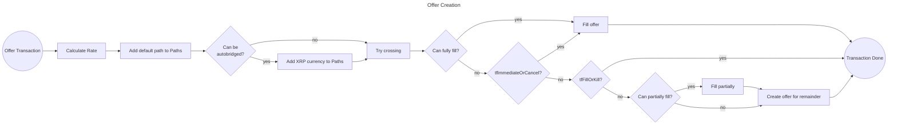

# Index

- [1. Introduction](#1-introduction)
    - [1.1. Offers](#11-offers)
    - [1.2. Offer Crossing](#12-offer-crossing)
        - [1.2.1. Sell And Buy Offers](#121-sell-and-buy-offers)
        - [1.2.2. Auto-bridging](#122-auto-bridging)
        - [1.2.3. Creating the Residual Offer](#123-creating-the-residual-offer)
    - [1.3. Rate Calculation](#13-rate-calculation)
        - [1.3.1. TickSize Rounding](#131-ticksize-rounding)
    - [1.4. Offer Deletion](#14-offer-deletion)
    - [1.5. Domain and Hybrid Offers](#15-permissioned-dex)
        - [1.5.1. Domain Offers](#151-domain-offers)
        - [1.5.2. Hybrid Offers](#152-hybrid-offers)
- [2. Ledger Entries](#2-ledger-entries)
    - [2.1. Offer Ledger Entry](#21-offer-ledger-entry)
        - [2.1.1. Object Identifier](#211-object-identifier)
        - [2.1.2. Fields](#212-fields)
            - [2.1.2.1. Flags](#2121-flags)
        - [2.1.3. Pseudo-accounts](#213-pseudo-accounts)
        - [2.1.4. Ownership](#214-ownership)
        - [2.1.5. Reserves](#215-reserves)
    - [2.2. DirectoryNode Ledger Entry](#22-directorynode-ledger-entry)
        - [2.2.1. Object Identifier](#221-object-identifier)
        - [2.2.2. Directory Pages](#222-directory-pages)
        - [2.2.3. Fields](#223-fields)
- [3. Transactions](#3-transactions)
    - [3.1. Offer Transactions](#31-offer-transactions)
        - [3.1.1. OfferCreate Transaction](#311-offercreate-transaction)
            - [3.1.1.1. Failure Conditions](#3111-failure-conditions)
            - [3.1.1.2. State Changes](#3112-state-changes)
        - [3.1.2. OfferCancel Transaction](#312-offercancel-transaction)
            - [3.1.2.1. Failure Conditions](#3121-failure-conditions)
            - [3.1.2.2. State Changes](#3122-state-changes)

# 1. Introduction

Offers are limit orders on the XRP Ledger decentralized exchange (DEX). They execute only at an exchange rate that is as favorable as, or better than, the rate the offer creator specifies.
As part of the decentralized exchange, users can submit offers between any combination of asset types: [XRP](../glossary.md#xrp), [IOUs](../glossary.md#iou), and [MPTs](../glossary.md#mpt). MPTs must have the `lsfMPTCanTrade` flag set on their MPTokenIssuance to be tradable on the DEX. See [MPT Flags](../mpts/README.md#2121-flags) for details on MPT capability flags.

The DEX supports both open order books (accessible to all accounts) and domain-specific order books (restricted to credential holders). During offer crossing and payments, domain offers only match within their domain, while hybrid offers can match in both environments. This Permissioned DEX functionality enables regulated trading for securities, institutional venues, and other scenarios requiring verified participants. See [PermissionedDomains documentation](../permissioned_domains/README.md) and [Domain and Hybrid Offers](#15-permissioned-dex) for details.

When `rippled` applies an `OfferCreate`, it first invokes the payment [flow engine](../flow/README.md) to try crossing with existing book depth; only any leftover remainder is placed as a resting order.

## 1.1. Offers

An offer is defined in terms of `takerGets` and `takerPays` parameters, which are named from the perspective of the taker - the party accepting the offer. If Alice creates an offer with `takerGets = 100 XRP` and `takerPays = 10 USD`, it means she is offering 100 XRP and wants to receive 10 USD in return.

Alice has to have a positive amount in `takerGets` currency, unless she is the issuer of that asset (IOU issuers can issue trust line tokens on demand; MPT issuers can mint MPTs into circulation). She does not have to have the full amount to cover the offer. If her balance is lower than `takerGets`, the offer may still partially fill. 

## 1.2. Offer Crossing

Keeping in mind that offers are actually limit orders, once they are placed, offers can immediately be executed, 
partially or fully. 

Crossing is done by calling the [flow engine](../flow/README.md) and passing a set of paths. All crossings will contain
the [default path](../path_finding/README.md#24-default-paths). If neither taker pays or taker gets is XRP, then an additional
`xrpCurrency` path is added to achieve auto-bridging.  

If transaction has `tfPassive` flag, it will only cross offers with strictly better quality than its own.
It will not cross offers of equal quality, making it more likely to remain on the order book.

If the offer is ImmediateOrCancel it will never be placed in the order book. It can be fully or partially filled during crossing, but `Offer` ledger entry will never be created for it.

If the offer is `tfFillOrKill` it will never be placed in the order book. It can either *fully* fill immediately or fail. 

During crossing, the new offer may be fully filled, partially filled, or not filled at all by existing offers in the order book.



**Atomicity:**

Offer crossing uses two `Sandbox` instances to ensure atomic state application:
- `sb`: Contains all state changes (fee payment, offer deletions, crossing results, new offer placement)
- `sbCancel`: Contains only fee payment and unfunded offer deletions

For `tfFillOrKill` offers that don't fully cross, `sbCancel` is applied instead of `sb`, ensuring the offer crossing is rolled back while preserving fee payment. See [Ledger
Views and Sandboxes](../transactions/README.md#5-ledger-views-and-sandboxes) for details on how sandboxes provide atomic state changes.

### 1.2.1. Sell vs Buy Offers

An offer with the `tfSell` flag set is a **sell** offer. An offer without the `tfSell` flag is a **buy** offer.

When selling, the offer will accept more than the specified `takerPays` amount to maximize the sale of `takerGets`. In the `rippled` implementation, `takerPays` is capped at `STAmount::cMaxNative` for XRP[^cMaxNative], `STAmount::cMaxValue / 2` for IOUs[^cMaxValue-iou], and `maxMPTokenAmount / 2` for MPTs[^maxMPTokenAmount-mpt].

The following examples demonstrate offer crossing behavior when a new offer is created and crosses with existing offers in the order book.

**Example 1:**

Alice is willing to sell her 20 USD for 100 XRP. She wants to sell all of her 20 USD.
Bob is willing to buy 10 USD for his 100 XRP. He does not want to buy more than 10 USD.

**Offers:**

- Alice sends a **sell** offer:
    - Taker pays 100 XRP
    - Taker gets 20 USD

- Bob sends a **buy** offer
    - Taker pays 10 USD
    - Taker gets 100 XRP

**Result:**

- Alice will get 50 XRP and pay 10 USD. This is the exchange rate that she offered. She did not manage to sell all of her 20 USD, but the offer was partially filled.
- Bob will get 10 USD and pay 50 XRP. This is a better exchange rate than he offered. He did not buy more than 10 USD that he originally wanted.

**Example 2:**

Alice is willing to buy 100 XRP for her 20 USD. Bob is willing to sell his 100 XRP for 10 USD, and he wants to sell all 100 XRP.

**Offers:**

- Alice sends a **buy** offer:
    - Taker pays 100 XRP
    - Taker gets 20 USD

- Bob sends a **sell** offer
    - Taker pays 10 USD
    - Taker gets 100 XRP

**Result:**

- Alice will get 100 XRP and pay 20 USD. This is the exchange rate that she offered.
- Bob will get 20 USD and pay 100 XRP. Because he was selling all of his 100 XRP, he got 20 USD for it. He sold his XRP for a better exchange rate than he hoped for.

[^cMaxNative]: XRP maximum native value: [`STAmount.h`](https://github.com/gregtatcam/rippled/blob/a72c3438eb0591a76ac829305fcbcd0ed3b8c325/include/xrpl/protocol/STAmount.h#L52)
[^cMaxValue-iou]: IOU maximum value halved for transfer rate: [`CreateOffer.cpp`](https://github.com/gregtatcam/rippled/blob/a72c3438eb0591a76ac829305fcbcd0ed3b8c325/src/xrpld/app/tx/detail/CreateOffer.cpp#L417-L420)
[^maxMPTokenAmount-mpt]: MPT maximum amount halved for transfer rate: [`CreateOffer.cpp`](https://github.com/gregtatcam/rippled/blob/a72c3438eb0591a76ac829305fcbcd0ed3b8c325/src/xrpld/app/tx/detail/CreateOffer.cpp#L423), maximum defined in [`Protocol.h`](https://github.com/gregtatcam/rippled/blob/a72c3438eb0591a76ac829305fcbcd0ed3b8c325/include/xrpl/protocol/Protocol.h#L99)

### 1.2.2. Auto-bridging

Auto-bridging allows offers between two non-XRP currencies to execute through XRP as an intermediate currency.

Auto-bridging is used:
- Only when both `takerPays` and `takerGets` are non-XRP currencies
- The [Flow engine](../flow/README.md) is invoked with two paths:
  1. The [default](../path_finding/README.md#24-default-paths) direct path
  2. An auto-bridging path with XRP as intermediate (e.g., USD -> XRP -> EUR)[^auto-bridging-path]

The Flow engine evaluates both paths and selects the one(s) providing the best quality, allowing offers to execute through whichever route offers better pricing.

[^auto-bridging-path]: Auto-bridging path construction: [`CreateOffer.cpp`](https://github.com/gregtatcam/rippled/blob/a72c3438eb0591a76ac829305fcbcd0ed3b8c325/src/xrpld/app/tx/detail/CreateOffer.cpp#L394-L396)

### 1.2.3. Creating the Residual Offer

Before the offer is sent to the Flow engine for crossing, a **quality threshold** is calculated from `takerPays` and `takerGets`. This represents the minimum exchange rate at which the offer can be crossed. If `takerGets` is a non-XRP asset (IOU or MPT) and the offer creator is not the issuer, `takerGets` is adjusted by multiplying it by the issuer's transfer rate to account for transfer fees. The quality threshold is then calculated as `takerPays / adjusted takerGets`.

The Flow engine returns the amount that was filled. During offer crossing, the offer owner pays transfer fees (see [BookStep transfer rates](../flow/steps.md#44-helper-functions)). The transfer fee is deducted from the owner's balance but does not reduce the offer's stated amounts. For example, if the original `takerGets` was 100 USD and 50 USD was transferred with a 2% transfer fee, the owner pays 51 USD from their balance, but the remaining offer balance is 50 USD.

The transfer rate is read from the issuer's settings (AccountRoot `TransferRate` field for IOUs, or the MPTokenIssuance `TransferFee` field for MPTs) and applied identically during offer crossing, maintaining consistent offer book semantics across all asset types.

**Calculating the residual offer after partial filling:**

**Buy offers** (no `tfSell` flag):[^buy-offer-residual]
1. Subtract consumed `takerPays` from original `takerPays`
2. Calculate remaining `takerGets` by multiplying remaining `takerPays` by the pre-crossing exchange rate
3. Round `takerGets` up

**Sell offers** (`tfSell` flag set):[^sell-offer-residual]
1. Subtract consumed `takerGets` from original `takerGets` (accounting for transfer rates)
2. Calculate remaining `takerPays` by dividing remaining `takerGets` by the pre-crossing exchange rate
3. Round `takerPays` down

**Special cases:**
- If the offer is not filled at all, the original offer is recorded on the ledger
- If, after partial filling, the signing account no longer has a positive balance in the `takerGets` currency, the remaining offer is not created[^no-balance-no-offer]

[^buy-offer-residual]: Buy offer residual calculation: [`CreateOffer.cpp`](https://github.com/gregtatcam/rippled/blob/a72c3438eb0591a76ac829305fcbcd0ed3b8c325/src/xrpld/app/tx/detail/CreateOffer.cpp#L511-L518)
[^sell-offer-residual]: Sell offer residual calculation: [`CreateOffer.cpp`](https://github.com/gregtatcam/rippled/blob/a72c3438eb0591a76ac829305fcbcd0ed3b8c325/src/xrpld/app/tx/detail/CreateOffer.cpp#L486-L504)
[^no-balance-no-offer]: No balance check after crossing: [`CreateOffer.cpp`](https://github.com/gregtatcam/rippled/blob/a72c3438eb0591a76ac829305fcbcd0ed3b8c325/src/xrpld/app/tx/detail/CreateOffer.cpp#L464-L470)

## 1.3. Rate Calculation

The exchange rate for an offer is calculated before any crossing, so that potential partial filling does not affect the
intended rate. The rate is calculated as `takerPays / takerGets` (smaller is better for the taker).

Different asset types have different internal representations: XRP (64-bit unsigned integer), IOUs (48-bit mantissa with sign and exponent), and MPTs (64-bit unsigned integer).

`rippled` implementation normalizes the rate by packing the result into a 64-bit integer:
- Upper 8 bits: exponent + 100
- Lower 56 bits: mantissa

In any case of an exception, like an overflow, it will return the rate `0` and not store the offer.

### 1.3.1. TickSize Rounding

In order to ensure that ranking of offers in order books requires a significant difference between exchange rates,
issuers can set `TickSize` field to their account.

If `TickSize` is present, all offers are rounded by truncating the rate to the specified `TickSize`. If two issuers in the offer
have different `TickSize` set, the smaller is used. If only one has `TickSize` set, that is used. XRP never has a `TickSize`. TickSize is read from the issuer's account and applies to both IOUs and MPTs.

After the rate is rounded, one side of the offer is adjusted to maintain the rounded rate:
- For **sell offers** (`tfSell` flag): `takerPays` is recalculated based on the rounded rate
- For **buy offers** (no `tfSell` flag): `takerGets` is recalculated based on the rounded rate

## 1.4. Offer deletion

When creating an offer, the `OfferSequence` field can be optionally specified to cancel an existing offer before creating the new one. This allows atomic replacement of an offer in a single transaction.

If `OfferSequence` is provided:
1. The system looks up the offer with the specified sequence number belonging to the signing account
2. If the offer is found, it is deleted via `offerDelete`
3. If the offer is not found (already consumed or removed), this is **not an error** - the transaction continues
4. Only after the cancellation (if any) does the system proceed with creating the new offer

This mechanism is useful for updating an existing offer without the risk of having both the old and new offers active simultaneously.

## 1.5. Permissioned DEX

PermissionedDomains enable credential-based access control for offers. When the `DomainID` field is specified in an OfferCreate transaction, the offer is placed in a domain-specific order book that only domain members can access. See [PermissionedDomains documentation](../permissioned_domains/README.md) for details on domain creation and access control.

**Open Offers** are not a part of any domain. 

### 1.5.1. Domain Offers

A **domain offer** is an offer created with the `DomainID` field set. Domain offers are placed exclusively in the domain's order book (separate from the open order book) and can only be created by accounts with domain access (domain owner or credential holders). Domain offers only match with other domain offers and hybrid offers within the same domain, and cannot be consumed by regular (non-domain) payments or offers.

### 1.5.2. Hybrid Offers

A **hybrid offer** is an offer created with both the `DomainID` field set AND the `tfHybrid` flag enabled. Hybrid offers exist simultaneously in both the domain order book and the open order book, with a primary entry in the domain book and a secondary entry (via the `AdditionalBooks` field) in the open book. When a hybrid offer is created, it only crosses with offers in the domain book, since the `DomainID` is passed to the flow engine which uses that domain's order book. Once the hybrid offer is resting on the books, it can be consumed by both domain payments/offers (via the domain book entry) and open payments/offers (via the open book entry).

# 2. Ledger Entries

Offers are stored on the ledger using `Offer` ledger entries, which are organized in the order book via `DirectoryNode` entries.

Offers in the order book are indexed using `DirectoryNode` ledger entries, which organize offers by trading pair and quality level. Each offer is referenced in two directories:

1. **Book Directory**: Groups all offers for a specific trading pair (e.g., USD/XRP) at a particular quality level
2. **Owner Directory**: Tracks all ledger objects owned by an account

The book directory key is calculated by hashing the trading pair (asset identifiers: currency+issuer for IOUs, MPT ID for MPTs, plus optional domain ID), then the last 8 bytes are replaced with the 64-bit quality value (exchange rate). This means each quality level gets its own directory node, allowing efficient traversal from best to worst quality.

When an offer is created, it stores references to both its book directory (`sfBookDirectory` field) and owner directory, enabling efficient order book traversal and account object enumeration.

**Order Book Segregation:**

The XRP Ledger maintains separate order book directories based on domain participation:

- **Open Order Books**: Standard directories without domain restrictions, computed as `hash(BOOK_NAMESPACE, asset_in, asset_out)`. Contains open offers and hybrid offers (via AdditionalBooks references). All accounts can create open offers.

- **Domain Order Books**: Separate directories for permissioned domains, computed as `hash(BOOK_NAMESPACE, asset_in, asset_out, domainID)`. Contains domain offers (primary entries) and hybrid offers (primary entries). Only domain members can create offers in domain order books.

- **Hybrid Offers**: Bridge both order books by maintaining a primary entry in the domain book and a secondary entry (via AdditionalBooks) in the open book. When a hybrid offer is created, it only crosses with offers in the domain book.

## 2.1. Offer Ledger Entry

### 2.1.1. Object Identifier

The key of the `Offer` object is the result
of [SHA512-Half](https://xrpl.org/docs/references/protocol/data-types/basic-data-types#hashes) of the following values
concatenated in order:

- The `Offer` space key `0x006F` (lowercase `o`)
- The `AccountID` of the signing account.
- OfferCreate transaction sequence number, or `TicketSequence`.

### 2.1.2. Fields

Fields are described
in [Offer Fields](https://xrpl.org/docs/references/protocol/ledger-data/ledger-entry-types/offer#offer-fields)

#### 2.1.2.2. Asset-Specific Fields

Offers can involve three types of assets, each using different fields for identification:

**IOU Assets**:
- `TakerPaysCurrency`, `TakerPaysIssuer` (when `TakerPays` is a IOU)
- `TakerGetsCurrency`, `TakerGetsIssuer` (when `TakerGets` is a IOU)

**MPT Assets**:
- `TakerPaysMPT` (UInt192 MPTID when `TakerPays` is an MPT)
- `TakerGetsMPT` (UInt192 MPTID when `TakerGets` is an MPT)

**XRP**: Uses `TakerPays`/`TakerGets` Amount fields directly.

An offer stores only the fields relevant to its asset types. All combinations of XRP, IOUs, and MPTs are supported.

#### 2.1.2.3. Domain-Specific Fields

**DomainID** (UInt256, optional): The domain identifier for domain offers and hybrid offers. When present, the offer is placed in the domain's order book.

**AdditionalBooks** (Array, optional): For hybrid offers only. Contains references to additional order book directories where the offer is also listed (specifically, the open order book). Each element includes:
- `BookDirectory` (UInt256): Order book directory hash for the additional book
- `BookNode` (UInt64): Page index within that directory

This field allows hybrid offers to be discovered and consumed by both domain and open order book traversals.

#### 2.1.2.1. Flags

Flags are described
in [Offer Flags](https://xrpl.org/docs/references/protocol/ledger-data/ledger-entry-types/offer#offer-flags)

### 2.1.3. Pseudo-accounts

Offer transactions (creating or canceling offers) do not create pseudo-accounts. However, offer crossing may modify pseudo-accounts such as AMMs when the offer crosses with AMM liquidity.

### 2.1.4. Ownership

The offer is stored in the ledger and tracked in an Owner Directory owned by the account submitting the OfferCreate transaction. Furthermore, the offer is also tracked in a Book Directory for the specific trading pair and quality level. The Owner Directory page is captured by the `sfOwnerNode` field. The Book Directory is identified by the `sfBookDirectory` field, and the page within that directory is captured by the `sfBookNode` field

### 2.1.5. Reserves

The `Offer` object costs one owner reserve for the account creating it.

If the account has insufficient reserve before placing the offer:
- If the offer crosses with existing offers (meaning some liquidity was consumed), the transaction succeeds even with insufficient reserve
- If the offer does not cross (nothing was consumed), the transaction fails with `tecINSUF_RESERVE_OFFER`

This special behavior allows offers to succeed if they provide immediate value through crossing, even when the account cannot afford to place a standing offer on the order book.

## 2.2. DirectoryNode Ledger Entry

### 2.2.1. Object Identifier

**Book Directory Root Page (Page 0)**:

The first 192 bits are the first 192 bits of [SHA512-Half](https://xrpl.org/docs/references/protocol/data-types/basic-data-types#hashes) of the following values, concatenated in order:

- The Book directory space key (`0x0042`)
- The `takerPays` asset identifier:
  - For IOUs: currency code + issuer account
  - For MPTs: MPT ID (192 bits)
  - For XRP: currency code (160 bits of zeros for issuer)
- The `takerGets` asset identifier:
  - For IOUs: currency code + issuer account
  - For MPTs: MPT ID (192 bits)
  - For XRP: currency code (160 bits of zeros for issuer)
- The `domainID` (if present, for permissioned domains)

The last 64 bits encode the exchange rate (`takerPays / takerGets`) as a 64-bit value in big-endian format.

**Owner Directory Root Page (Page 0)**:

The key is the result of [SHA512-Half](https://xrpl.org/docs/references/protocol/data-types/basic-data-types#hashes) of the following values, concatenated in order:

- The Owner directory space key (`0x004F`)
- The `AccountID`

**Subsequent Pages (Pages 1+)**:

The key is the result of [SHA512-Half](https://xrpl.org/docs/references/protocol/data-types/basic-data-types#hashes) of the following values, concatenated in order:

- The DirectoryNode space key (`0x0064`)
- The ID of the root DirectoryNode
- The page number (integer 1 or higher)

### 2.2.2. Directory Pages

Each directory can span multiple pages to accommodate large numbers of entries:

- **Maximum entries per page**: 32 offers
- **Maximum pages per directory**: 262,144 pages

Pages form a doubly-linked list structure:
- Root page (page 0) serves as the entry point
- `sfIndexNext`: Points to the next page in the chain
- `sfIndexPrevious`: Points to the previous page
- Last page's `sfIndexNext` points to root page (value 0)
- Root's `sfIndexPrevious` points to the last page number
- Subsequent pages have non-sequential IDs (see [2.2.1](#221-object-identifier)) and are linked to the root via `sfRootIndex` and to adjacent pages via `sfIndexNext`/`sfIndexPrevious`

**Page Creation**:
- New offers are appended to the last page of the appropriate directory
- When a page reaches 32 entries, a new page is created and linked to the chain
- If creating a new page would exceed 262,144 pages, the transaction fails with `tecDIR_FULL`

**Page Deletion**:
- When the last entry is removed from a non-root page, the page is deleted
- Empty intermediate pages cause the chain to be repaired by updating adjacent pages' links
- The root page is only deleted when the entire directory becomes empty and `keepRoot` is false

### 2.2.3. Fields

**Common Fields** (all directories):
- `sfIndexes`: Vector of up to 32 object IDs (uint256 values)
- `sfRootIndex`: Points to the root directory node's key
- `sfIndexNext`: Optional, points to next page number (omitted if no next page)
- `sfIndexPrevious`: Optional, points to previous page number (omitted on root if it's the only page)

**Book Directory Fields** (order books):
- `sfTakerPaysCurrency`: Currency code for takerPays (when asset is a IOU)
- `sfTakerPaysIssuer`: Issuer account ID for takerPays (when asset is a IOU)
- `sfTakerPaysMPT`: MPTID for takerPays (UInt192, when asset is an MPT)
- `sfTakerGetsCurrency`: Currency code for takerGets (when asset is a IOU)
- `sfTakerGetsIssuer`: Issuer account ID for takerGets (when asset is a IOU)
- `sfTakerGetsMPT`: MPTID for takerGets (UInt192, when asset is an MPT)
- `sfExchangeRate`: The quality level encoded as 64-bit integer
- `sfDomainID`: Optional, for permissioned domain offers

Book directories include either currency/issuer fields or MPT fields depending on the asset types involved in the order book. For XRP, the currency code is used without an issuer field.

**Owner Directory Fields**:
- `sfOwner`: The account that owns the objects

# 3. Transactions

## 3.1. Offer Transactions

### 3.1.1. OfferCreate Transaction

Fields are described
in [OfferCreate Fields](https://xrpl.org/docs/references/protocol/transactions/types/offercreate#offercreate-fields)

Flags are described
in [OfferCreate flags](https://xrpl.org/docs/references/protocol/transactions/types/offercreate#offercreate-flags)

Please note that when an `OfferCreate` transaction is placed, it may not necessarily create an [Offer ledger entry](#21-offer-ledger-entry).
Please refer to [offer crossing](#12-offer-crossing) for more information.

#### 3.1.1.1. Failure Conditions

Some errors are handled within [state changes](#3112-state-changes).

For example, an `ImmediateOrCancel` offer that does not immediately get filled will return error code `tecKILLED`.  
From a business logic perspective, this outcome is expected and acceptable. The `tec` prefix in the error code indicates that the transaction did not succeed, but it was still applied to a ledger and may have side effects.

For this reason, certain `tec` outcomes are covered in the [state changes](#3112-state-changes) section of this document.

**Static validation:**

- `temDISABLED`:
    - transaction contains field `DomainID` but [PermissionedDex](https://xrpl.org/resources/known-amendments#permissioneddex) amendment is not enabled
    - either `takerPays` or `takerGets` is an MPT but [MPTokensV2](https://xrpl.org/resources/known-amendments#mptokensv2) amendment is not enabled
- `temINVALID_FLAG`:
    - one of the specified flags is not one of [flags](#2121-flags).
    - flag `tfHybrid` is specified,
      but [PermissionedDex](https://xrpl.org/resources/known-amendments#permissioneddex) amendment is not enabled or
      field `DomainID` is not present in the transaction.
    - both `tfImmediateOrCancel` and `tfFillOrKill` flags are specified.
- `temBAD_EXPIRATION`: `Expiration` field is set to `0`. User should omit the field if they do not want to specify it.
- `temBAD_SEQUENCE`: `OfferSequence` is set to `0`. User should omit the field if they do not want to specify an offer to delete first.
- `temBAD_AMOUNT`: either `takerPays` or `takerGets` specifies XRP, but with mantissa bigger than `100000000000000000ull`.
- `temBAD_OFFER`:
    - both `takerPays` and `takerGets` are XRP amounts.
    - either `takerPays` or `takerGets` have value `0`.
- `temREDUNDANT`: `takerPays` and `takerGets` are the same asset
- `temBAD_CURRENCY`: `currency` field in `LimitAmount` is `XRP`. 
- `temBAD_ISSUER`: either `takerPays` or `takerGets` contain either an XRP with issuer ID, or an IOU without an issuer ID.

**Validation against the ledger view:**

- `terNO_ACCOUNT`: signing account does not exist
- `tecFROZEN`: either `takerPays` or `takerGets` involves an account with `lsfGlobalFreeze` flag, fail with `tecFROZEN`. An offer cannot be created for a frozen issuer.
- `tecUNFUNDED_OFFER`: signing account does not have a positive balance in `takerGets` currency and it is not the issuer of `takerGets` currency. Partially funding an offer is acceptable. For MPTs, unauthorized accounts (without `lsfMPTAuthorized` flag or without valid domain credentials when MPTokenIssuance has DomainID) are treated as having zero balance.
- `temBAD_SEQUENCE`: `OfferSequence` is bigger than the sequence number of the next valid transaction for the signing account.
- Transaction's `Expiration` field is before the close time of previously closed ledger:
    - `tecEXPIRED`: [DepositAuth](https://xrpl.org/resources/known-amendments#depositauth) is enabled.
    - `tesSUCCESS`: [DepositAuth](https://xrpl.org/resources/known-amendments#depositauth) is not enabled.
- **IOU-specific validations for `takerPays`** (only applies when `takerPays` is an IOU):
  - `takerPays` issuer account does not exist:
      - `terNO_ACCOUNT`: `tapRETRY` enabled
      - `tecNO_ISSUER`: `tapRETRY` is not enabled.
  - `takerPays` issuer account has a flag `lsfRequireAuth` and there is no trust line between signing account and the
    issuer account:
      - `terNO_LINE`: `tapRETRY` enabled
      - `tecNO_LINE`: `tapRETRY` is not enabled.
  - `takerPays` issuer account has a flag `lsfRequireAuth` and there a trust line between signing account and the
    issuer account, but it is not authorized:
      - `terNO_LINE`: `tapRETRY` enabled
      - `tecNO_LINE`: `tapRETRY` is not enabled.
  - `tecFROZEN`: trust line between signing account and the `takerPays` issuer account is deeply frozen, either on low or high
    side.
- `takerPays` is an MPT and the signing account is not authorized to hold the MPT:
    - `terNO_AUTH`: `tapRETRY` enabled
    - `tecNO_AUTH`: `tapRETRY` is not enabled.
    - Authorization is checked via `lsfMPTAuthorized` flag on the holder's MPToken, or through valid domain credentials if the MPTokenIssuance has a DomainID set. See [DomainID and Authorization](../mpts/README.md#11-domainid-and-authorization) for details.
- `tecNO_PERMISSION`:
    - `DomainID` is specified but one of the following domain access requirements is not met:
        - The `featurePermissionedDEX` amendment must be enabled
        - The specified domain must exist
        - The offer creator must be in the domain (either the domain owner or hold a valid accepted credential that is not expired)
    - MPT validation failure (see below)
- `tecOBJECT_NOT_FOUND`: MPT validation failure (see below)
- `tecNO_ISSUER`: MPT validation failure (see below)
- `tecLOCKED`: MPT validation failure (see below)

**MPT-specific validations**: When either `takerPays` or `takerGets` is an MPT, the transaction is validated using [`checkMPTDEXAllowed`](../mpts/README.md#361-checkmptdexallowed). See [MPT Validation Functions](../mpts/README.md#36-mpt-validation-functions) for complete details on validation logic and error conditions.

**Validation during doApply:**

- Transaction's `Expiration` field is before the close time of previously closed ledger:
    - `tecEXPIRED`: [DepositAuth](https://xrpl.org/resources/known-amendments#depositauth) is enabled.
    - `tesSUCCESS`: [DepositAuth](https://xrpl.org/resources/known-amendments#depositauth) is not enabled (fails and returns).

#### 3.1.1.2. State Changes

- `Offer` object is **deleted**:
    - If `OfferSequence` field is specified and the offer with that sequence exists, it is deleted. See [OfferCancel State Changes](#3122-state-changes) for details on the deletion process


- `Offer` object is **not created**:
    - If offer is not fully crossed and it was submitted with `tfFillOrKill` flag, fail and:
        - If [fix1578](https://xrpl.org/resources/known-amendments#fix1578) is enabled, return `tecKILLED`.
        - If [fix1578](https://xrpl.org/resources/known-amendments#fix1578) is not enabled, return `tesSUCCESS`.
    - If offer is not at all crossed and it was submitted with `tfImmediateOrCancel` flag, fail and:
        - If [ImmediateOfferKilled](https://xrpl.org/resources/known-amendments#immediateofferkilled) is enabled, return
          `tecKILLED`.
        - If [ImmediateOfferKilled](https://xrpl.org/resources/known-amendments#immediateofferkilled) is not enabled,
          return `tesSUCCESS`.
    - If offer is not fully crossed and the signing account cannot cover the reserve of creating an Offer, fail with
      `tecINSUF_RESERVE_OFFER`.
    - If offer cannot be added to the OfferDirectory because it is full, fail with `tecDIR_FULL`.
    - If the offer is partially filled at crossing, and the signing account's balance is down to 0 after partial filling.


- `Offer` object is **created**:
    - If `Offer` is not fully crossed. 


- `DirectoryNode` object is **created or modified**:
    - When an offer is created, it is added to two directories:
      - **Owner Directory**: Added via `dirInsert` to `keylet::ownerDir(account)`. The page number is stored in the offer's `sfOwnerNode` field.
      - **Book Directory**: Added via `dirAppend` to the book directory for the trading pair and quality level. The directory key is stored in `sfBookDirectory`, and the page number is stored in `sfBookNode`.
    - If the book directory root page does not exist, it is created with these fields:
      - **For IOU assets**: `sfTakerPaysCurrency` and `sfTakerPaysIssuer` (when `takerPays` is an IOU), `sfTakerGetsCurrency` and `sfTakerGetsIssuer` (when `takerGets` is an IOU)
      - **For MPT assets**: `sfTakerPaysMPT` (when `takerPays` is an MPT), `sfTakerGetsMPT` (when `takerGets` is an MPT)
      - **Always**: `sfExchangeRate` (the rate value before any crossing), and optionally `sfDomainID`
    - If a directory page is full (32 entries), a new page is created and linked to the directory chain
    - If creating a new page would exceed 262,144 pages, the transaction fails with `tecDIR_FULL`


- Order books are **registered** in `OrderBookDB` (if not already present):
    - Trading pair registered for the offer's assets and domain. See [OrderBookDB documentation](../path_finding/README.md#26-orderbookdb) for details.


- `AccountRoot` object is **modified**:
    - If `Offer` is deleted, decrement `sfOwnerCount` by 1, without going below `0`.
    - If `Offer` is created, increment `sfOwnerCount` by 1, without overflowing ```std::uint32_t```.

### 3.1.2. OfferCancel Transaction

Fields are described
in [OfferCancel Fields](https://xrpl.org/docs/references/protocol/transactions/types/offercancel#offercancel-fields)

#### 3.1.2.1. Failure Conditions

**Static validation:**

- `temINVALID_FLAG`: one of the specified flags is not one of common transaction flags
- `temBAD_SEQUENCE`: `OfferSequence` is not supplied in the transaction

**Validation against the ledger view:**

- `terNO_ACCOUNT`: signing account does not exist
- `temBAD_SEQUENCE`: `OfferSequence` is bigger than the sequence number of the next valid transaction for the signing account

#### 3.1.2.2. State Changes

- `Offer` object is **deleted**:
    - If the offer with `OfferSequence` sequence number exists.
    - Any unexecutable offers found during a crossing attempt will be deleted. Refer to [Flow](../flow/README.md) documentation for details.
    - When an offer is deleted via `offerDelete`:
      - The offer is removed from its owner directory using `dirRemove(keylet::ownerDir(owner), sfOwnerNode, offer_index, false)`
      - The offer is removed from its book directory using `dirRemove(keylet::page(book_directory), sfBookNode, offer_index, false)`
      - If the offer has `sfAdditionalBooks` (hybrid offers), it is removed from those directories as well
      - If removing the offer empties a non-root directory page, that page is deleted and the directory chain is repaired

- `AccountRoot` object is **modified**:
    - If `Offer` is deleted, decrement `sfOwnerCount` by 1, without going below `0`.
