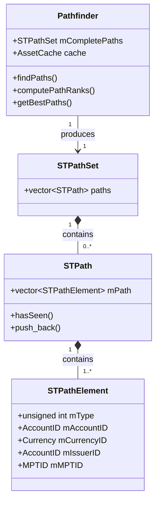
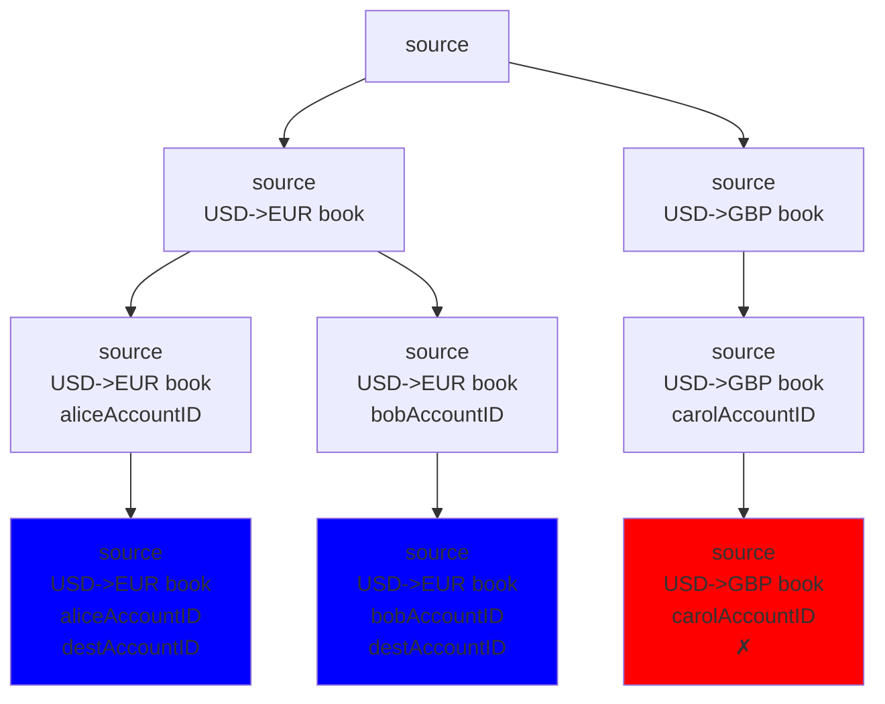

# Index

- [1. Introduction](#1-introduction)
  - [1.1. Paths](#11-paths)
    - [1.1.1. Example: Issuing IOUs](#111-example-issuing-ious)
    - [1.1.2. Example: Same Currency IOU](#112-example-same-currency-iou)
    - [1.1.3. Example: Issuing and Redeeming MPTs](#113-example-issuing-and-redeeming-mpts)
    - [1.1.4. Example: MPT Holder to Holder](#114-example-mpt-holder-to-holder)
    - [1.1.5. Example: Different Currencies](#115-example-different-currencies)
    - [1.1.6. Example: Same Currency Code, Different Issuers](#116-example-same-currency-code-different-issuers)
  - [1.2. Path Types](#12-path-types)
  - [1.3. Path Finding](#13-path-finding)
  - [1.4. Algorithm](#14-algorithm)
    - [1.4.1. Setup](#141-setup)
    - [1.4.2. Path Type Expansion](#142-path-type-expansion)
    - [1.4.3. Rank Paths](#143-rank-paths)
  - [1.5. Structure](#15-structure)
- [2. Terminology and Concepts](#2-terminology-and-concepts)
  - [2.1. Terminology](#21-terminology)
  - [2.2. Payment Types](#22-payment-types)
  - [2.3. Path Types](#23-path-types)
    - [2.3.1. Node Types](#231-node-types)
  - [2.4. Default Paths](#24-default-paths)
- [3. Pathfinder](#3-pathfinder)
  - [3.1. Pathfinder Class](#31-pathfinder-class)
  - [3.2. Path Elements](#32-path-elements)
  - [3.3. Path](#33-path)
- [4. Path Discovery](#4-path-discovery)
  - [4.1. findPaths Function](#41-findpaths-function)
  - [4.2. addPathsForType](#42-addpathsfortype)
  - [4.3. addLinks](#43-addlinks)
  - [4.4. addLink](#44-addlink)
  - [4.5. OrderBookDB](#45-orderbookdb)
  - [4.6. AssetCache](#46-assetcache)
- [5. Path Ranking](#5-path-ranking)
  - [5.1. computePathRanks](#51-computepathranks)
  - [5.2. rankPaths](#52-rankpaths)
  - [5.3. getPathLiquidity](#53-getpathliquidity)
- [6. Path Selection](#6-path-selection)
- [7. RPC Requests](#7-rpc-requests)
  - [7.1. `ripple_path_find` RPC (Legacy)](#71-ripple_path_find-rpc-legacy)
  - [7.2. `path_find` RPC](#72-path_find-rpc)
  - [7.3. Source Currency Handling](#73-source-currency-handling)

# 1. Introduction

The XRP Ledger is a network where accounts are connected via [trust lines](../trust_lines/README.md), [offers](../offers/README.md), and [MPTs](../mpts/README.md). To send non-[XRP](../glossary.md#xrp) [currencies](../glossary.md#currency) or to perform currency conversions, payments often cannot go directly from source to destination. Instead, they must find routes through:

- Direct XRP payments, trust lines and MPT payments
- Currency conversions through the decentralized exchange ([CLOBs](../glossary.md#clob) and [AMMs](../amms/README.md))
- Multi-hop paths combining both

**Path finding** discovers viable routes and returns them as **paths**. A path describes a potential route for value to flow, such as "Alice -> USD/EUR order book -> Bob" or "Alice -> USD/XRP order book -> XRP/EUR order book -> Bob". Each element in the path (an account or an order book) represents a location where value can move through. 

Path finding takes into account [domain-restricted order books](../permissioned_domains/README.md) when searching for routes. The permissioned DEX allows users to create domain-specific offers that are only accessible to accounts with valid credentials for that domain. When a domain is specified in a path finding request, the algorithm searches only within that domain's offers. 

The [**Flow engine**](../flow/README.md) then takes these paths and converts them into executable operations called **strands**. A strand is a sequence of **steps**, where each step is a concrete action that moves value between path elements.

Path finding discovers **where** payments can go, while Flow figures out **how** to execute them.

## 1.1. Paths

**Paths** are sequences of path elements that describe a complete route from source to destination. Here we provide some examples of common paths, but any combination of path elements that we describe could be used to construct a path.

### 1.1.1. Example: Issuing IOUs

For example, holder Alice has a [trust line](../trust_lines/README.md) to Issuer for USD. The payment path would be simple:

- **Path**: Issuer USD -> Alice

### 1.1.2. Example: Same Currency IOU

Alice wants to send USD issued by Issuer to Bob. Both Alice and Bob have a trust line to the Issuer for USD. The payment now has to go through the Issuer, because Alice cannot issue a currency in Issuer's name:

- **Path**: Alice -> USD Issuer -> Bob

### 1.1.3. Example: Issuing and Redeeming MPTs

Holder Alice holds an [MPT](../mpts/README.md) issued by Issuer. The issuer wants to send (mint) additional MPT to Alice:

- **Path**: Issuer MPT -> Alice

If Alice wants to send the MPT back to the issuer (redeeming):

- **Path**: Alice -> Issuer MPT

### 1.1.4. Example: MPT Holder to Holder

Alice wants to send an MPT issued by Issuer to Bob. Both Alice and Bob are holders of the MPT. The payment path goes through the issuer. See [MPT Payment Execution](../payments/README.md#43-mpt-payment-execution) for details on how holder-to-holder transfers are processed.

- **Path**: Alice -> Issuer MPT -> Bob

### 1.1.5. Example: Different Currencies

Alice wants to send her USD (an IOU) and deliver an MPT to Bob. Alice is not the issuer of USD and Bob is a holder of the MPT issued by MPT Issuer.
Since Alice is paying in a different currency than what Bob will get, the currency has to be exchanged.

There are multiple ways in which Alice can achieve this transfer. For example, if there is a USD/MPT [order book](../glossary.md#order-book) (a set of offers and AMMs that can exchange one currency for another), it could be used to complete the payment.

However, USD/MPT order book may not exist, or it may lack liquidity to perform the whole payment. In that case, two order books could be used - for example USD/XRP and then XRP/MPT - if both exist and have sufficient liquidity.

Two possible routes a payment could take would be:

- **Incomplete Path 1**: Alice -> [USD/MPT order book] -> Bob
- **Incomplete Path 2**: Alice -> [USD/XRP order book] -> [XRP/MPT order book] -> Bob

However, these are not complete paths. Each payment that Alice makes in the issuer's USD has to be reflected on the trust line between her and USD Issuer. To consume the offer, she needs to send USD to the USD issuer, who will in turn send USD to the market maker who created the offer that is consumed (or multiple market makers if multiple offers are consumed).
To make a payment, she has to go through the issuer of USD to whom she has a trust line:

- **Incomplete Path 1**: Alice -> USD Issuer -> [USD/MPT order book] -> Bob
- **Incomplete Path 2**: Alice -> USD Issuer -> [USD/XRP order book] -> [XRP/MPT order book] -> Bob

Bob is a holder (not the issuer) of the MPT, so he also has to receive the payment through the MPT Issuer:

- **Complete Path 1**: Alice -> USD Issuer -> [USD/MPT order book] -> MPT Issuer -> Bob
- **Complete Path 2**: Alice -> USD Issuer -> [USD/XRP order book] -> [XRP/MPT order book] -> MPT Issuer -> Bob

### 1.1.6. Example: Same Currency Code IOU, Different Issuers

Let's say that Alice wants to send USD to Bob. Alice has a USD trust line to Issuer A. Bob has an USD trust line to Issuer B. Issuer A and Issuer B have no trust lines between them, but there is an Exchanger who has USD trust lines to both Issuer A and Issuer B and `NoRipple` flag disabled - so their trust lines can be used to ripple payments. 

This payment can be completed via: 

- **Path**: Alice -> USD Issuer (Issuer A) -> Exchanger -> USD Issuer (Issuer B) -> Bob

The payment is [**rippling**](../glossary.md#rippling) through Exchanger. Exchanger is taking an exchange risk between Issuer A's USD and Issuer B's USD value.

## 1.2. Path Types

At the start of path finding are **path types** - recipes that describe different types of routes and that path finding uses to find actual paths.

Each type is a sequence of building blocks:

- **s** (source) - Start at the source account
- **a** (accounts) - Go through an account
- **b** (books) - Use an order book to exchange currencies
- **x** (XRP books) - Use an order book involving XRP (the special type is used to increase performance as XRP is often a currency used to bridge other offers)
- **f** (destination book) - Use an order book to get the destination currency
- **d** (destination) - Arrive at the destination account

For example, the type `"sfd"` means: *"Start at source, find an order book to exchange into the destination currency, then deliver to destination."*

A more complex type like `"saxfd"` means: *"Start at source, go through an intermediate account, use an order book to exchange to XRP, then use another order book to exchange to the destination currency, and deliver to destination."*

The XRP Ledger has countless possible payment routes, but exploring all of them would be computationally infeasible. Path types allow for a reasonable number of possible paths to be explored.

Path types are predefined for every payment type. For example, XRP->NonXRP has one set of types, while NonXRP->NonXRP has another set of types.

## 1.3. Path Finding

Given a source and a destination, path finding uses path types to create actual paths that will be used to complete a payment. For example, when expanding `"sfd"`, the `"f"` gets translated into concrete order books - path finding will create a separate path for each feasible order book that can convert to the destination currency. 

Each path represents a different way value can flow from Alice's USD to Bob's EUR, with different exchange rates and liquidity characteristics. A single payment may need multiple paths to complete, because not every path will provide full liquidity. 

It is important to note that the path finding code in `rippled` is not responsible for returning the full path. For example, in [different currencies example](#115-example-different-currencies), the path finding will only return:

Path 1:

- USD/EUR order book

Path 2:

- USD/XRP order book
- XRP/EUR order book

It is the responsibility of the Flow engine to do the [path normalization](../flow/README.md#231-path-normalization) that will decide how to connect the source to the first element and how to connect the last element to the destination.

Additionally, for IOU and MPT payments, path finding searches to the **effective destination** rather than the final destination. The effective destination is the issuer of the destination amount. 
For example, if Bob is receiving EUR issued by EUR Issuer, path finding only needs to find paths that reach EUR Issuer. Similarly, if Bob is receiving an MPT, path finding finds paths that reach the MPT Issuer. Flow handles the final hop to Bob. For XRP payments, the effective destination is simply the destination account itself.

## 1.4. Algorithm

Path finding is a graph search algorithm that explores the ledger's network to find viable payment routes. We will illustrate the algorithm using an example similar to [section 1.1.5](#115-example-different-currencies): Alice wants to send USD and Bob should receive an MPT.

### 1.4.1. Setup

- Alice has USD trust line to USD Issuer
- Bob is a holder of an MPT issued by MPT Issuer
- Available order books: USD/MPT, USD/XRP, XRP/MPT, USD/CAD, CAD/MPT, USD/JPY, JPY/CHF
- For this example, assume we only have the following path types defined for this payment type: `"safd"`,  `"sbfd"`, `"saxfd"`, `"sabfd"` (in reality, the algorithm could explore more types based on the search depth and payment type)
- The [**default path**](#24-default-paths) is always tested separately and not included in path type expansion
- This is a non-permissioned payment (no domain specified), so all open order books are available for consideration

### 1.4.2. Path Type Expansion

Path type expansion works by incrementally building paths one node at a time. For each node in the path type (like `"s"`, `"a"`, `"f"`, `"d"`), the algorithm:
1. Queries the ledger to find all possible options for that node
2. Creates a new path branch for each option found
3. Adds all branches to a list of incomplete paths
4. Continues to the next node, expanding each path in the list

When a path reaches the destination with the correct currency, it's marked as complete and added to the complete paths list.

**Step 1: Determine Payment Type and Select Path Types**

Payment type is NonXRP->NonXRP (different currencies), and the algorithm selects path types to explore based on the payment type:
- `"safd"`: source -> account -> destination book -> destination
- `"sbfd"`: source -> book -> destination book -> destination
- `"saxfd"`: source -> account -> XRP book -> destination book -> destination
- `"sabfd"`: source -> account -> book -> destination book -> destination

**Step 2: Expand Path Type `"safd"`**

Starting from Alice with USD, the algorithm will expand each node in the path type.

- `"s"`: Start at Alice (USD), creates an emtpy path: `[]`
- `"sa"`: Query AssetCache for accounts connected via trust lines holding USD, which have enough liquidity and allow rippling.
  - Finds: USD Issuer
  - Incomplete paths so far: `[USD Issuer]`
- `"saf"`: Query OrderBookDB for any order books from Issuer USD to MPT destination
  - Finds: USD/MPT
  - MPT is the destination so adds `[USD Issuer, USD/MPT Book]` to complete paths
- `"safd"`: Has no incomplete paths to examine

**Step 3: Expand Path Type `"sbfd"`**

Starting from Alice with USD:
- `"s"`: Start at Alice (USD)
- `"sb"`: Query OrderBookDB for any order books that will convert Issuer USD
  - There is no book connecting Alice's USD (hop to Issuer was never made). This path would make sense if the issuer were sending to Bob, not a holder
  - Terminates (`"sbf"` and `"sbfd"` have no incomplete paths to examine)

**Step 4: Expand Path Type: `"saxfd"`**
- `"s"`: Start at Alice (USD)
- `"sa"`: Query AssetCache for accounts connected via trust lines holding USD, which have enough liquidity and allow rippling.
    - Finds: USD Issuer
    - Incomplete paths so far: `[USD Issuer]`
- `"sax"`: Query OrderBookDB for any order book that will convert Issuer USD convert to XRP
    - Finds: Issuer USD -> XRP
    - Incomplete paths so far: `[USD Issuer, USD/XRP Book]` 
- `"saxb"`: Query OrderBookDB for any order book that will convert to MPT
    - Finds: Issuer XRP -> MPT
    - MPT is the destination so adds to complete paths: `[USD Issuer, USD/XRP Book, XRP/MPT book]`
- `"saxfd"`: Has no incomplete paths to examine

**Step 5: Expand Path Type: `"sabfd"`**
- `"s"`: Start at Alice (USD)
- `"sa"`: Finds that `"sa"` has already created an incomplete path `[USD Issuer]` (in step 4)
- `"sab"`: Query OrderBookDB for any order book that will convert from Issuer USD
    - Finds: Issuer USD -> JPY, Issuer USD -> MPT, Issuer USD -> XRP, Issuer USD -> CAD
    - Adds `[USD Issuer, USD/MPT Book]` to complete paths, as MPT is the destination
    - This step will add both the books it finds, but also the issuer account for IOUs and MPTs if the issuer is not the final destination
    - Incomplete paths so far:  `[USD Issuer, USD/XRP Book]`, `[USD Issuer, USD/JPY Book, JPY Issuer]`, `[USD Issuer, USD/CAD Book, CAD Issuer]`
- `"sabf"`: Query OrderBookDB for any order book that will convert from previous incomplete path to MPT:
  - `[USD Issuer, USD/JPY book, JPY Issuer]` branch:
    - Finds JPY/CHF Book. CHF is not the destination asset
    - Rejects this path and terminates.
  - `[USD Issuer, USD/XRP Book]` branch:
    - Finds XRP/MPT Book. While we found this in `"saxfd"` already, we have not seen it in this path type
    - MPT is the destination so tries to add `[USD Issuer, USD/XRP Book, XRP/MPT Book]` to complete paths. However, since this path is already in completed paths, it is ignored
  - `[USD Issuer, USD/CAD Book, CAD Issuer]` branch:
    - Finds CAD/MPT Book. `CAD Issuer` element is redundant, so it replicates it with `CAD/MPT Book` 
    - MPT is the destination so adds `[USD Issuer, USD/CAD Book, CAD/MPT Book]` to complete paths
- `"sabfd"`: Has no incomplete paths to examine

*Complete Path 1:* `[USD Issuer, USD/MPT Book]`
*Complete Path 2:* `[USD Issuer, USD/XRP Book, XRP/MPT book]`
*Complete Path 3:* `[USD Issuer, USD/CAD Book, CAD/MPT Book]`

### 1.4.3. Rank Paths

Now that there is a set of feasible paths, the algorithm ranks them.

The algorithm begins by testing the [default path](#24-default-paths). If the default path returns some liquidity, it will be deducted from the remaining liquidity used to test discovered paths.

The algorithm then simulates each discovered path to measure its [quality](../flow/README.md#21-quality) and liquidity:
- Simulate Path 1 `[USD Issuer, USD/MPT Book]`:
  - Quality: 1.05 (costs 105 USD to get 100 MPT)
  - Liquidity: 1000 MPT capacity
- Simulate Path 2 `[USD Issuer, USD/XRP Book, XRP/MPT book]`:
  - Quality: 1.04 (costs 104 USD to get 100 MPT)
  - Liquidity: 750 MPT capacity
- Simulate Path 3 `[USD Issuer, USD/CAD Book, CAD/MPT Book]`:
  - Quality: 1.06 (costs 106 USD to get 100 MPT)
  - Liquidity: 500 MPT capacity

Unless the user is trying to convert the entire possible amount of an asset, when it checks the liquidity of each path, the algorithm checks that each path can deliver at least 1/6th of the total amount[^min-liquidity], to prevent returning paths that can return very small liquidity. The total amount is divided by 6 because maxPaths is 4[^max-paths], and two is added.

Ranking by quality: Path 2 (best quality) is better than Path 1 (more liquidity but worse rate) which is better than Path 3.

[^min-liquidity]: Minimum liquidity calculation: [`Pathfinder.cpp`](https://github.com/gregtatcam/rippled/blob/a72c3438eb0591a76ac829305fcbcd0ed3b8c325/src/xrpld/app/paths/Pathfinder.cpp#L139-L143)

[^max-paths]: Maximum paths constant: [`TransactionSign.cpp`](https://github.com/gregtatcam/rippled/blob/a72c3438eb0591a76ac829305fcbcd0ed3b8c325/src/xrpld/rpc/detail/TransactionSign.cpp#L286-L291)

## 1.5. Structure

The algorithm executes four main phases:

**1. Path Discovery ([Section 4](#4-path-discovery))**

The [`findPaths`](#41-findpaths-function) function determines the payment type (XRP->NonXRP, NonXRP->XRP, NonXRP->NonXRP, etc.) and selects appropriate [path types](#23-path-types) to explore. Each path type is a template like `"sfd"` or `"saxfd"` that describes a routing strategy. The algorithm expands these templates into concrete paths by recursively querying the ledger through [`addPathsForType`](#42-addpathsfortype), which calls [`addLinks`](#43-addlinks) and [`addLink`](#44-addlink) to build paths step by step.

As it explores, `addLink` queries [AssetCache](#46-assetcache) to find accounts connected by trust lines and MPTs, and [OrderBookDB](#45-orderbookdb) to find available order books for currency conversion (including domain-restricted order books when a domain is specified). It filters out invalid options (loops, trust lines with insufficient liquidity, `NoRipple` violations, unauthorized MPT holders) and prioritizes promising routes by ranking accounts by their "paths out" score (how many onward connections they have). Complete paths that reach the destination currency at the effective destination account are stored in `mCompletePaths`.

**2. Path Ranking ([Section 5](#5-path-ranking))**

The [`computePathRanks`](#51-computepathranks) function evaluates discovered paths by simulating their execution through the Flow engine. It first tests the default path to determine `mRemainingAmount` - the liquidity still needed beyond what the default provides. This ensures paths are evaluated for their incremental value.

The [`rankPaths`](#52-rankpaths) function then tests each path in `mCompletePaths` by calling [`getPathLiquidity`](#53-getpathliquidity), which uses the Flow engine to simulate payment execution on a sandbox ledger. Paths are scored and sorted by quality (exchange rate), liquidity (capacity), and length (hop count). In normal mode, better quality is prioritized. In convert-all mode (when discovering maximum liquidity), quality is ignored and only liquidity matters.

**3. Path Selection ([Section 6](#6-path-selection))**

The [`getBestPaths`](#6-path-selection) function selects the optimal set of paths from the ranked results. It merges rankings from discovered paths and any extra paths provided by the caller, then iteratively selects paths by comparing quality first, then liquidity. It validates issuer constraints (ensuring non-default paths route through the correct issuer for IOUs and MPTs when needed) and applies different selection rules based on remaining slots: filling slots greedily when multiple remain, requiring the last path to cover all remaining liquidity, and optionally saving a "full liquidity path" that can handle the entire payment alone.

**4. Payment Execution**

The selected paths are returned to the caller ([RPC handler](#7-rpc-requests) or [Payment transaction](../payments/README.md)) and passed to the [Flow engine](../flow/README.md) for actual payment execution. Flow performs path normalization to add source and destination accounts, then executes the payment by processing each path as a strand of steps.


**Domain Parameter for Permissioned DEX:**

Path finding supports an optional `domain` parameter that enables permissioned DEX functionality. When a domain is specified, the pathfinder restricts order book queries to only include offers that belong to that domain's order book. This domain value is:
- Passed into the Pathfinder constructor and stored as `mDomain`[^pathfinder-domain-constructor]
- Forwarded to OrderBookDB queries in `addLink` when discovering available books[^pathfinder-domain-orderbook] (see [Section 4.4](#44-addlink))
- Passed to RippleCalc and Flow during path ranking and execution[^pathfinder-domain-flow] (see [Section 5.1](#51-computepathranks))

[^pathfinder-domain-constructor]: Pathfinder domain parameter storage: [`Pathfinder.cpp:180,192`](https://github.com/gregtatcam/rippled/blob/a72c3438eb0591a76ac829305fcbcd0ed3b8c325/src/xrpld/app/paths/Pathfinder.cpp#L180-L192)
[^pathfinder-domain-orderbook]: OrderBookDB domain filtering flow: `addLink` ([`Pathfinder.cpp:1002`](https://github.com/gregtatcam/rippled/blob/a72c3438eb0591a76ac829305fcbcd0ed3b8c325/src/xrpld/app/paths/Pathfinder.cpp#L1002)) calls `getPathsOut` ([`Pathfinder.cpp:1161`](https://github.com/gregtatcam/rippled/blob/a72c3438eb0591a76ac829305fcbcd0ed3b8c325/src/xrpld/app/paths/Pathfinder.cpp#L1161)), which queries OrderBookDB with domain parameter ([`Pathfinder.cpp:763`](https://github.com/gregtatcam/rippled/blob/a72c3438eb0591a76ac829305fcbcd0ed3b8c325/src/xrpld/app/paths/Pathfinder.cpp#L763))
[^pathfinder-domain-flow]: Domain passed to Flow: [`Pathfinder.cpp:380`](https://github.com/gregtatcam/rippled/blob/a72c3438eb0591a76ac829305fcbcd0ed3b8c325/src/xrpld/app/paths/Pathfinder.cpp#L380)

# 2. Terminology and Concepts

## 2.1. Terminology

**Path Elements** are the building blocks that describe a location in a path. Each path element can contain:
- An **account ID** (for rippling through trust lines or MPT connections)
- A **currency** (for specifying what currency flows through this point)
- An **issuer ID** (for non-XRP currencies, who issues the currency)
- An **MPTID** (for MPT currencies, identifies the specific MPT)

A path element can be either:
- An **account element** - represents an account that holds balances (has account ID set)
- An **offer element** - represents an order book for currency exchange (no account ID, just currency/issuer or MPTID)

**Paths** are sequences of path elements that describe a complete route from source to destination. For example:
- `[Alice] -> [USD IssuerA] -> [Book: USD/IssuerA -> EUR/IssuerB] -> [EUR/IssuerB] -> [Bob]`

**Steps** are the executable operations created by the Flow engine when it [converts paths into strands](../flow/README.md#52-path-to-strand-conversion). Path finding creates paths and path elements, not steps or strands, but it relies on the Flow engine to rank the paths. 

The relationship is: **Node Types** (search strategy) -> **Path Elements** (route description) -> **Steps** (executable operations)

**Liquidity** refers to the capacity of a path - how much value it can move in a single payment. Paths with higher liquidity can deliver more to the destination.

**Effective Destination** is the account where path finding actually searches to, which differs from the final destination for IOU and MPT payments. For XRP payments, effective destination equals the destination account. For IOU and MPT payments, effective destination is the issuer of the destination amount, since paths only need to reach the issuer - Flow handles the final hop to the destination through path normalization.

**Complete Path** is a path that successfully reaches the effective destination with the correct destination currency. Incomplete paths are discarded during path discovery.

**Convert-all Mode** is activated when the destination amount equals the maximum possible value for that currency. In this mode, path finding discovers maximum available liquidity rather than targeting a specific amount, and prioritizes liquidity over quality when ranking paths.

## 2.2. Payment Types

The pathfinder categorizes each payment request into one of five types:

| PaymentType | Description                  | Example                                |
|-------------|------------------------------|----------------------------------------|
| `pt_XRP_to_XRP` | XRP to XRP payment           | Alice sends XRP to Bob                 |
| `pt_XRP_to_nonXRP` | XRP to IOU or MPT payment    | Alice sends XRP, Bob receives MPT      |
| `pt_nonXRP_to_XRP` | IOU or MPT to XRP payment    | Alice sends USD or MPT, Bob receives XRP |
| `pt_nonXRP_to_same` | Same IOU or MPT payment      | Alice sends USD, Bob receives USD (same asset) |
| `pt_nonXRP_to_nonXRP` | Different IOU or MPT payment | Alice sends EUR, Bob receives USD      |

While `pt_XRP_to_XRP` is defined as a payment type and is initialized with an empty path type list, XRP->XRP payments **never actually invoke the path finding or flow system**. The Payment transactor detects XRP->XRP payments and processes them as direct balance transfers, bypassing both path finding and the Flow engine entirely.

## 2.3. Path Types

**Path types** are templates that define routing strategies by specifying sequences of [node types](#231-node-types). Each path type is a string like `"sfd"` or `"saxfd"` that tells the pathfinder which pattern to follow when building concrete paths. The pathfinder expands these templates by querying the ledger at each step - for example, `"sfd"` (source -> book -> destination) becomes multiple concrete paths, one for each order book that exists between the source and destination currencies.

For each payment type, there is a predefined table of path types at different search levels (computational costs). Higher search levels explore more complex paths.

Example types for `pt_XRP_to_nonXRP`:

| Cost | Type | Path Structure                                               |
|------|----------|--------------------------------------------------------------|
| 1 | `sfd` | Source -> Book -> Destination                                |
| 3 | `sfad` | Source -> Book -> Account -> Destination                     |
| 5 | `sfaad` | Source -> Book -> Account -> Account -> Destination          |
| 6 | `sbfd` | Source -> Book -> Destination Book -> Destination            |
| 8 | `sbafd` | Source -> Book -> Account -> Destination Book -> Destination |

The path finding algorithm searches through these types based on the requested search depth. A search level of 0 finds no paths, while higher levels (4-7 typical, 10 maximum) explore increasingly complex routing options.

For the complete list of path types for each payment type, see `Pathfinder::initPathTable()`[^init-path-table].

[^init-path-table]: Path table initialization: [`Pathfinder.cpp`](https://github.com/gregtatcam/rippled/blob/a72c3438eb0591a76ac829305fcbcd0ed3b8c325/src/xrpld/app/paths/Pathfinder.cpp#L1417-L1480)

**Configuration**

The search depth can be configured in `rippled.cfg`:

| Parameter | Description | Default | Recommended |
|-----------|-------------|---------|-------------|
| `path_search` | Default search aggressiveness | 2 | 7 (for advanced path finding) |
| `path_search_fast` | Minimum search aggressiveness | 2 | 2 (for advanced path finding) |
| `path_search_max` | Maximum search aggressiveness | 3 | 10 (for advanced path finding) |
| `path_search_old` | Search level for legacy path finding interfaces | 2 | 7 (for advanced path finding) |

Higher values can exponentially increase resource usage. Setting `path_search_max` to 0 disables path finding entirely.

### 2.3.1. Node Types

Path types are constructed from a sequence of node types. Each node type tells the path finding algorithm what kind of connection to explore at that step in the path:

**`nt_SOURCE` (code: `s`)** - The source account

This represents the starting point of the payment. The source is always the first node in any path type. When path finding expands this node, it creates a single empty path representing the starting position at the source account.

**`nt_ACCOUNTS` (code: `a`)** - Accounts connected via trust lines or MPTs

This tells the algorithm to explore accounts that are connected to the current position through [trust lines](../trust_lines/README.md) or [MPTs](../mpts/README.md). When path finding encounters an `a` node, it queries [AssetCache](#46-assetcache) to find all accounts that hold the current currency and have assets allowing value to flow (positive balance or available credit for trust lines, proper authorization for MPTs, and NoRipple flag not blocking rippling for trust lines). This enables rippling - payments flowing through intermediate accounts.

For example, in path type `"sfd"`, there are no `a` nodes, so the path goes directly through order books without rippling through any intermediate accounts.

**`nt_BOOKS` (code: `b`)** - Order books for currency conversion

This tells the algorithm to explore any [order book](../glossary.md#order-book) that can convert the current currency to another currency. When path finding encounters a `b` node, it queries [OrderBookDB](#45-orderbookdb) to find all available order books (from offers and AMMs) that accept the current currency as input. If a domain is specified for permissioned DEX, only order books within that domain are considered. This allows payments to exchange currencies at market rates.

For example, if the current position is holding USD, the algorithm will find all order books like USD/EUR, USD/XRP, USD/GBP, etc.

**`nt_XRP_BOOK` (code: `x`)** - Order book to/from XRP

This is a specialized version of `nt_BOOKS` that only considers order books involving XRP. When path finding encounters an `x` node, it only looks for order books that convert between the current currency and XRP. This is useful because XRP often serves as a bridge currency between other currencies, and limiting to XRP books reduces the search space. [OrderBookDB](#45-orderbookdb) maintains a separate `xrpBooks` cache (and `xrpDomainBooks` for permissioned DEX) for faster lookups of XRP-involving books.

**`nt_DEST_BOOK` (code: `f`)** - Order book to destination currency

This is another specialized version of `nt_BOOKS` that only considers order books that output the destination currency. The `f` stands for "final" book. When path finding encounters an `f` node, it only looks for order books that convert the current currency into whatever currency the destination wants to receive. This ensures the path ends with the correct currency.

For example, if the destination wants EUR, an `f` node will only consider order books like USD/EUR, XRP/EUR, GBP/EUR, etc.

**`nt_DESTINATION` (code: `d`)** - The destination account

This represents the end point of the payment. The destination is always the last node in any path type. When path finding encounters a `d` node, it tries to connect the previous step to the destination account.
As the effective destination is the issuer for IOUs and MPTs, this is mostly relevant to rippling through IOU account if `f` did not end at the issuer.


## 2.4. Default Paths

A **default path** is the direct route between source and destination that always exists and does not need to be explicitly specified. The default path is:

- **For same-currency IOU or MPT payments**: Direct transfer between source and destination through the issuer
- **For cross-currency payments**: Uses the order book between the source currency and the destination currency

Unless the Payment transaction contains `tfNoRippleDirect`, the Flow engine always attempts the default path, even when explicit paths are provided.

Default path is an empty path that is passed to [Path Normalization](../flow/README.md). 

# 3. Pathfinder

The Pathfinder class is responsible for orchestrating finding of paths. It creates a Path set - a vector of Paths. Paths consist of Path Elements. 
The Pathfinder uses path types to systematically explore the ledger, building STPath objects from STPathElement components and collecting them into an STPathSet.


*Figure: Key components of Pathfinder*


## 3.1. Pathfinder Class

The `Pathfinder` class is the entry point for path finding. It is constructed with:

| Parameter | Description                                                        | Required |
|-----------|--------------------------------------------------------------------|----------|
| `cache` | AssetCache containing ledger state, trust line, and MPT information | ✅ |
| `srcAccount` | Source account ID - the account sending funds                      | ✅ |
| `dstAccount` | Destination account ID - the account receiving funds               | ✅ |
| `srcCurrency` | Currency the source wants to spend                                 | ✅ |
| `srcIssuer` | Issuer for the source currency                                     | ❌ |
| `dstAmount` | The amount to be delivered to the destination                      | ✅ |
| `srcAmount` | Maximum amount the source is willing to spend                      | ❌ |
| `domain` | Domain identifier for permissioned DEX                             | ❌ |
| `app` | Application reference for accessing ledger state                   | ✅ |

The pathfinder maintains these key variables:
- `app` - Application reference which can be used to fetch `OrderBookDB`
- `convert_all_` - Boolean flag indicating "convert all" mode (find maximum liquidity instead of exact amount). Set to true when destination amount equals the maximum possible value for that currency
- `mSrcAccount` - Source account
- `mDstAccount` - Destination account (the account that will ultimately receive the payment)
- `mEffectiveDst` - The account where paths must end. For XRP destinations, this is `mDstAccount`. For IOU and MPT destinations, this is the issuer of the destination amount. Paths discovered by path finding end at this account, not at `mDstAccount`. The Flow engine later handles the final hop from `mEffectiveDst` to `mDstAccount` through path normalization.
- `mCompletePaths` - Collection of all complete paths found
- `mPathRanks` - Rankings of paths based on quality and liquidity
- `mPaths` - Cache of paths organized by PathType
- `mPathsOutCountMap` - Cache of "paths out" counts for each Issue
- `mPathTable` - Set of [path types](#23-path-types)
- `mRemainingAmount` - Amount remaining to deliver after accounting for default path contribution
- `mAssetCache` - [AssetCache](#46-assetcache) for querying trust line and MPT information

## 3.2. Path Elements

An `STPathElement`[^stpathelement] is the data structure representing a single step in a payment path. It is a struct containing:

- `mType`[^mtype] (unsigned int) - Bitmask indicating which fields are present:
    - `0x01` (typeAccount)[^typeaccount] - Has account field
    - `0x10` (typeCurrency)[^typecurrency] - Has currency field
    - `0x20` (typeIssuer)[^typeissuer] - Has issuer field
    - `0x40` (typeMPT)[^typempt] - Has MPT field
- `mAccountID` (AccountID) - The account (if typeAccount bit is set)
- `mCurrencyID` (Currency) - The currency (if typeCurrency bit is set)
- `mIssuerID` (AccountID) - The issuer (if typeIssuer bit is set)
- `mMPTID` (MPTID) - The MPT identifier (for MPT paths, alternative to currency + issuer)

[^stpathelement]: STPathElement class definition: [`STPathSet.h`](https://github.com/gregtatcam/rippled/blob/a72c3438eb0591a76ac829305fcbcd0ed3b8c325/include/xrpl/protocol/STPathSet.h#L18)
[^mtype]: mType field: [`STPathSet.h`](https://github.com/gregtatcam/rippled/blob/a72c3438eb0591a76ac829305fcbcd0ed3b8c325/include/xrpl/protocol/STPathSet.h#L29)
[^typeaccount]: typeAccount constant: [`STPathSet.h`](https://github.com/gregtatcam/rippled/blob/a72c3438eb0591a76ac829305fcbcd0ed3b8c325/include/xrpl/protocol/STPathSet.h#L31)
[^typecurrency]: typeCurrency constant: [`STPathSet.h`](https://github.com/gregtatcam/rippled/blob/a72c3438eb0591a76ac829305fcbcd0ed3b8c325/include/xrpl/protocol/STPathSet.h#L33)
[^typeissuer]: typeIssuer constant: [`STPathSet.h`](https://github.com/gregtatcam/rippled/blob/a72c3438eb0591a76ac829305fcbcd0ed3b8c325/include/xrpl/protocol/STPathSet.h#L34)
[^typempt]: typeMPT constant: [`STPathSet.h`](https://github.com/gregtatcam/rippled/blob/a72c3438eb0591a76ac829305fcbcd0ed3b8c325/include/xrpl/protocol/STPathSet.h#L35)

**Types of path elements:**

**Account element** (`type = 0x01`):
```
{type: 0x01, account: aliceAccountID}
```
Represents an account in a path - either an intermediate account for rippling or the destination account. Created during pathfinding[^account-element-creation] when adding accounts to incomplete paths.

**Offer/Book element for IOUs and XRP** (`type = 0x30`):
```
{type: 0x30, currency: "USD", issuer: issuerAccountID}
```
Represents a currency conversion via order book. Has both currency and issuer (0x10 | 0x20 = 0x30).

**Offer/Book element for MPTs** (`type = 0x60`):
```
{type: 0x60, mptid: mptID, issuer: issuerAccountID}
```
Represents an MPT order book. Has both MPT identifier and issuer (0x40 | 0x20 = 0x60).

**Account+Asset element** (`type = 0x31` for IOUs, `0x61` for MPTs):
```
{type: 0x31, account: sourceAccountID, currency: "USD", issuer: issuerAccountID}
```
Represents the source account holding a specific asset. **Always added as the first element**[^source-element-normalization] during path normalization (in the Flow engine's `toStrand` function). Has account, currency, and issuer (0x01 | 0x10 | 0x20 = 0x31) or account, MPT, and issuer (0x01 | 0x40 | 0x20 = 0x61).
The issuer in the first element is set to source, and the next element connects it to a particular issuer.

XRP is represented the same way as IOUs, except that issuer is a special XRP zero-account and currency is "XRP".

[^account-element-creation]: Account element creation during pathfinding: [`Pathfinder.cpp`](https://github.com/gregtatcam/rippled/blob/a72c3438eb0591a76ac829305fcbcd0ed3b8c325/src/xrpld/app/paths/Pathfinder.cpp#L1216-L1220)
[^source-element-normalization]: Source element added during path normalization: [`PaySteps.cpp`](https://github.com/gregtatcam/rippled/blob/a72c3438eb0591a76ac829305fcbcd0ed3b8c325/src/xrpld/app/paths/detail/PaySteps.cpp#L274-L286)


## 3.3. Path

An `STPath` represents a single payment path. It is a vector of [STPathElements](#32-path-elements).

**Key methods:**

- `size()` - Returns the number of path elements in the path
- `empty()` - Returns true if path has no elements
- `push_back(element)` - Adds an element to the end of the path
- `back()` - Returns the last element in the path
- `hasSeen(account, asset, issuer)` - Checks if this combination already appears in the path (loop detection). The asset parameter is a PathAsset which can hold either Currency (for IOUs) or MPTID (for MPTs).

For example, a normalized XRP -> USD path would look like: 

```
[0] Type=0x31 (Account Currency Issuer ) Account: sourceAccountID Currency: XRP Issuer: rrrrrrrrrrrr
[1] Type=0x1 (Account ) Account: rrrrrrrrrrrr
[2] Type=0x30 (Currency Issuer ) Currency: USD Issuer: issuerAccountID
[3] Type=0x1 (Account ) Account: issuerAccountID
[4] Type=0x1 (Account ) Account: destinationAccountId
```

An `STPathSet` is a collection of multiple `STPath` objects, representing alternative paths that can be used simultaneously for a payment.


# 4. Path Discovery

The path discovery process works by expanding **path types** into a **tree of concrete paths**.
The core algorithm takes a type like `"sfad"` and expands it step-by-step: first it builds all paths matching `"s"`, then extends those to match `"sf"`, then `"sfa"`, and finally `"sfad"`. At each step, it queries the ledger (AssetCache for trust lines and MPTs, OrderBookDB for order books) to find what's actually available, creating branches for each viable option while filtering out loops and insufficient liquidity.

Consider a payment where the source holds USD and wants to deliver EUR to the destination. The pathfinder uses type `"sfad"` (source -> book -> account -> destination):

The type `"sfad"` expands as follows:
1. **s** (source) - Start with source account
2. **f** (destination book) - Query ledger for order books from USD. Finds USD->EUR and USD->GBP books, creating two branches
3. **a** (accounts) - For each branch, query ledger for accounts holding that currency:
   - USD->EUR branch finds Alice and Bob, who hold EUR
   - USD->GBP branch finds Carol, who holds GBP
4. **d** (destination) - Try to complete each path by reaching the destination:
   - Alice and Bob paths succeed (destination accepts their EUR) -> marked as complete (blue)
   - Carol path fails (destination wants EUR, not GBP) -> filtered out (red)



The algorithm uses:
- **Filtering** - Rejects loops, insufficient liquidity, NoRipple violations before creating branches
- **Ranking** - Prioritizes destination connections and high "paths out" scores
- **Limits** - Maximum 1000 complete paths; when expanding accounts, up to 50 candidates from the source account, up to 10 candidates from any other account


**Implementation:**

1. **`findPaths`** - Entry point that:
   - Determines payment type (XRP->NonXRP, NonXRP->XRP, NonXRP->NonXRP, etc.) and iterates through all path types for that payment type
   - For each type, calls `addPathsForType` to expand it

2. **`addPathsForType`** - Recursive function that:
   - Takes a type like `"sfad"` (source -> book -> account -> destination) and builds it incrementally by first building `"s"`, then `"sf"`, then `"sfa"`, then `"sfad"`
   - For each step, calls `addLinks` to expand the last node type
   - Returns a list of paths (complete and incomplete) for that type, which is cached in `mPaths` for reuse

3. **`addLinks`** - Simple wrapper that:
   - Takes a set of incomplete paths and calls `addLink` once for each path

4. **`addLink`** - Core expansion logic that:
   - Takes one incomplete path and flags indicating what type of expansion to perform (add accounts via `a` node type, or add books via `b`/`f` node types)
   - Based on the flags:
     - If expanding accounts (`a`): queries **`AssetCache`** to find connected accounts via trust lines or MPTs
     - If expanding books (`b`/`f`): queries **`OrderBookDB`** to find available order books (from offers and AMMs)
   - For each viable option found, creates a new branch by appending path elements to `incompletePaths`
   - **When a path reaches the destination with the correct currency, adds it directly to `mCompletePaths`**
   - Filters out loops, NoRipple violations, and insufficient liquidity

The entire flow can be interrupted by using `continueCallback`. This callback allows the caller to interrupt path finding by returning `false`. It is checked at multiple points during path discovery.

- **[`path_find` subscriptions](#72-path_find-rpc)** provides a callback that checks if the WebSocket client is still connected
- **[`ripple_path_find`](#71-ripple_path_find-rpc-legacy)** and **[transaction signing with `build_path`](../payments/README.md#automatic-pathfinding-with-build_path)** do NOT provide a callback


## 4.1. findPaths Function

The `findPaths` function[^find-paths] is the main path discovery engine. It searches for paths from `mSrcAccount` to `mEffectiveDst`.

[^find-paths]: Main path discovery function: [`Pathfinder.cpp`](https://github.com/gregtatcam/rippled/blob/a72c3438eb0591a76ac829305fcbcd0ed3b8c325/src/xrpld/app/paths/Pathfinder.cpp#L203-L349)

- **For XRP payments**: `mEffectiveDst` equals `mDstAccount`, so paths go directly to the destination
- **For IOU and MPT payments**: `mEffectiveDst` is the issuer of the destination amount. Path finding only needs to reach the issuer - the Flow engine will handle the final hop from issuer to destination through path normalization.

**Parameters:**

| Parameter | Description | Required |
|-----------|-------------|----------|
| `searchLevel` | Maximum cost/depth to search | ✅ |
| `continueCallback` | Optional callback to check if search should continue | ❌ |

The function validates the payment request, determines [payment type](#22-payment-types) from source and destination currencies and iterates through path types for that payment type and calls addPathsForType, making sure not to exceed the `searchLevel`.

All found paths are stored in PathFinder object state, so this function only loops over types without much responsibility itself. 

### 4.1.1. findPaths Pseudo-Code

```python
def findPaths(searchLevel, continueCallback) -> bool:
    # Validate payment request
    if mDstAmount == 0:
        # Destination amount is 0
        return false
    
    if mSrcAccount == mDstAccount and mDstAccount == mEffectiveDst and mSrcCurrency == mDstAmount.getCurrency():
        # No need to send to same account with same currency
        return false

    if mSrcAccount == mEffectiveDst and mSrcCurrency == mDstAmount.getCurrency():
        # Default path might work, but any additional path would loop back to source
        # (since paths must end at mEffectiveDst which is the source)
        return true

    if not accountExists(mSrcAccount):
        # Source account has to exist. Destination does not if we are sending XRP to it.
        return false
    
    if mEffectiveDst != mDstAccount and not accountExists(mEffectiveDst):
        # Issuer account has to exist
        return false

    if not accountExists(mDstAccount) and (not isXRP(mDstAmount) or mDstAmount < getAccountReserve()):
        # New account must be funded with XRP meeting minimum reserve
        return false

    # Determine payment type (one of: pt_XRP_to_XRP, pt_XRP_to_nonXRP, etc.)
    paymentType = determinePaymentType(mSrcCurrency, mDstAmount.getCurrency())

    # Search for paths using types for this payment type
    for costedPath in mPathTable[paymentType]:
        if continueCallback.shouldBreak():
            return false
        if costedPath.cost <= searchLevel:
            # costedPath.type is a PathType (sequence of node types like "sfd", "sfad", etc.)
            addPathsForType(costedPath.type, continueCallback)
            if len(mCompletePaths) > PATHFINDER_MAX_COMPLETE_PATHS: # 1000
                break

    return true
```

## 4.2. addPathsForType

`addPathsForType`[^add-paths-for-type] takes a `PathType` like `"sfad"` and converts it into concrete paths by building incrementally, one node type at a time.

[^add-paths-for-type]: Incremental path building function: [`Pathfinder.cpp`](https://github.com/gregtatcam/rippled/blob/a72c3438eb0591a76ac829305fcbcd0ed3b8c325/src/xrpld/app/paths/Pathfinder.cpp#L856-L946)

**Parameters:**

| Parameter | Description | Required |
|-----------|-------------|----------|
| `pathType` | Sequence of node types (e.g., `"sfd"`, `"saxfd"`) | ✅ |
| `continueCallback` | Optional callback to check if search should continue | ❌ |

The function works recursively. When asked to build `"sfad"`, it first checks if `"sfad"` was already built and cached in `mPaths` - if so, it returns immediately. Otherwise, it recursively strips off the last character until it hits the empty string:

- `"sfad"` -> `"sfa"` -> `"sf"` -> `"s"` -> `""` (base case returns empty list)

Now the recursion unwinds and each level builds paths by extending what its parent returned. Each node type maps to a specific expansion strategy:

- **`"s"`**: Returns a single empty path (the starting point at source)
- **`"sf"`**: Takes that empty path and calls `addLinks` with flags to query OrderBookDB for all order books from the source currency. If 5 books exist, returns 5 paths.
- **`"sfa"`**: Takes those 5 paths and calls `addLinks` with flags to query AssetCache for accounts holding the book's output currency. If each book leads to 3 accounts, returns 15 paths (5 * 3).
- **`"sfad"`**: Takes those 15 paths and calls `addLinks` with flags to find the destination account. Only paths reaching the destination with the correct currency are not discarded.

The flags passed to `addLinks` tell `addLink` what to query (accounts via AssetCache or books via OrderBookDB) and what filters to apply (only XRP books, only destination currency, only destination account, etc.). Each node type (`s`, `a`, `b`, `x`, `f`, `d`) uses different flags to control this behavior.

Finally, the result is stored in `mPaths[pathType]` and returned.

### 4.2.1. addPathsForType Pseudo-Code

```python
def addPathsForType(pathType, continueCallback) -> list[STPath]:
    # pathType is a sequence of node types like "sfd" or "saxfd"

    # Check cache
    if pathType in mPaths:
        return mPaths[pathType]

    # Base case - empty path type
    if len(pathType) == 0:
        mPaths[pathType] = []
        return mPaths[pathType]

    if continueCallback.shouldBreak()
        return []

    # Recursive case - build parent paths first
    parentPathType = pathType[:-1]  # Remove last node type (e.g., "sfd" -> "sf")
    parentPaths = addPathsForType(parentPathType, continueCallback)

    # Add final node type to parent paths
    nodeType = pathType[-1]  # Get last node type (e.g., 'd' from "sfd")
    pathsOut = []

    if nodeType == nt_SOURCE:
        pathsOut = [empty_path]
    elif nodeType == nt_ACCOUNTS:
        addLinks(currentPaths=parentPaths, incompletePaths=pathsOut, addFlags=afADD_ACCOUNTS, continueCallback=continueCallback)
    elif nodeType == nt_BOOKS:
        addLinks(currentPaths=parentPaths, incompletePaths=pathsOut, addFlags=afADD_BOOKS, continueCallback=continueCallback)
    elif nodeType == nt_XRP_BOOK:
        addLinks(currentPaths=parentPaths, incompletePaths=pathsOut, addFlags=afADD_BOOKS | afOB_XRP, continueCallback=continueCallback)
    elif nodeType == nt_DEST_BOOK:
        addLinks(currentPaths=parentPaths, incompletePaths=pathsOut, addFlags=afADD_BOOKS | afOB_LAST, continueCallback=continueCallback)
    elif nodeType == nt_DESTINATION:
        addLinks(currentPaths=parentPaths, incompletePaths=pathsOut, addFlags=afADD_ACCOUNTS | afAC_LAST, continueCallback=continueCallback)

    mPaths[pathType] = pathsOut
    return pathsOut
```

## 4.3. addLinks

`addLinks`[^add-links] is a simple wrapper that calls `addLink` for each path in a set.

[^add-links]: Wrapper function for batch path extension: [`Pathfinder.cpp`](https://github.com/gregtatcam/rippled/blob/a72c3438eb0591a76ac829305fcbcd0ed3b8c325/src/xrpld/app/paths/Pathfinder.cpp#L840-L854)

**Parameters:**

| Parameter | Description | Required |
|-----------|-------------|----------|
| `currentPaths` | Set of incomplete paths to extend | ✅ |
| `incompletePaths` | Output list where new paths are added | ✅ |
| `addFlags` | Flags controlling expansion behavior (e.g., `afADD_ACCOUNTS`, `afADD_BOOKS`) | ✅ |
| `continueCallback` | Optional callback to check if search should continue | ❌ |

### 4.3.1. addLinks Pseudo-Code

```python
def addLinks(currentPaths, incompletePaths, addFlags, continueCallback):
    for path in currentPaths:
        if continueCallback.shouldBreak():
            return
        addLink(currentPath=path, incompletePaths=incompletePaths, addFlags=addFlags, continueCallback=continueCallback)
```

## 4.4. addLink

`addLink`[^add-link] is where the actual path expansion happens - it's the function that queries the ledger and creates new path branches.

[^add-link]: Core path expansion function: [`Pathfinder.cpp`](https://github.com/gregtatcam/rippled/blob/a72c3438eb0591a76ac829305fcbcd0ed3b8c325/src/xrpld/app/paths/Pathfinder.cpp#L1002-L1354)

**Parameters:**

| Parameter | Description | Required |
|-----------|-------------|----------|
| `currentPath` | Single incomplete path to extend | ✅ |
| `incompletePaths` | Output list where new paths are added | ✅ |
| `addFlags` | Flags controlling expansion behavior (e.g., `afADD_ACCOUNTS`, `afADD_BOOKS`, `afOB_XRP`, `afOB_LAST`, `afAC_LAST`) | ✅ |
| `continueCallback` | Optional callback to check if search should continue | ❌ |

The function examines the path's current endpoint (which account and currency/asset) and uses `addFlags` to determine which ledger data source to query and what filters to apply. For each viable option discovered, it creates a new path by copying `currentPath`, appending the new path element(s), and adding it to `incompletePaths`. The function modifies `incompletePaths` in place and returns nothing.

**Flag meanings:**

- **`afADD_ACCOUNTS`** - Queries AssetCache for trust lines and MPT holdings to find connected accounts
- **`afADD_BOOKS`** - Queries OrderBookDB to find order books where the current asset is the input (TakerPays)
- **`afOB_XRP`** (modifier for `afADD_BOOKS`) - Restricts books to only those outputting XRP
- **`afOB_LAST`** (modifier for `afADD_BOOKS`) - Restricts books to only those outputting the destination asset
- **`afAC_LAST`** (modifier for `afADD_ACCOUNTS`) - Restricts accounts to only the effective destination

The function's behavior varies significantly between account expansion and book expansion:

**Account expansion** (`afADD_ACCOUNTS`):

When the path's current endpoint is on XRP and the destination amount is XRP and the current path is non-empty, it adds the path to complete paths.[^xrp-endpoint-check] Empty paths are not added because they would represent XRP->XRP payments and those not require pathfinding.

[^xrp-endpoint-check]: XRP endpoint completion check: [`Pathfinder.cpp`](https://github.com/gregtatcam/rippled/blob/a72c3438eb0591a76ac829305fcbcd0ed3b8c325/src/xrpld/app/paths/Pathfinder.cpp#L1026-L1034)

For non-XRP endpoints, the function queries for trust lines or MPTs connected to the account at the path's current endpoint.

For trust lines, the function queries for trust lines connected to the current account in the current currency code. These trust lines connect to peer accounts that can be the next step in the payment path. The query is filtered based on NoRipple constraints on the previous trust line: if NoRipple is set, only trust lines where the current account also has NoRipple set are considered; otherwise, trust lines where the current account can ripple are considered.
This filtering prevents connecting NoRipple trust lines to rippling-enabled trust lines through the same account, which would allow the account to act as an intermediary despite the NoRipple constraint.

For MPTs, the function queries for MPTs associated with the current account to find potential connections to issuers (if the current account holds MPTs) or holders (if the current account is an issuer).

Each asset connection undergoes these checks in order:

1. **Currency/asset match**[^currency-match] - The asset must match the path's current currency code or MPTID
2. **Destination account bypass**[^dest-bypass] - When the destination issuer differs from the destination account, skips the destination account (pathfinding only needs to reach the issuer, not the final recipient)
3. **Destination-only filtering**[^dest-only] - When `afAC_LAST` is set, rejects all accounts except the effective destination (the issuer)
4. **Loop detection**[^loop-detection] - Rejects accounts already visited using `hasSeen(account, asset, issuer)`
5. **Liquidity and NoRipple check**[^liquidity-check]:
   - For trust lines: Rejects if (balance <= 0 AND (no peer limit OR peer limit exhausted OR unauthorized when `lsfRequireAuth` is set)) OR (both the previous link and current link have NoRipple set)
   - For MPTs: Rejects if zero balance OR maxed out OR not authorized
6. **Source loop prevention**[^source-loop] - Rejects accounts that would loop back to the source

[^currency-match]: Currency/asset match check: [`Pathfinder.cpp`](https://github.com/gregtatcam/rippled/blob/a72c3438eb0591a76ac829305fcbcd0ed3b8c325/src/xrpld/app/paths/Pathfinder.cpp#L1092-L1101)
[^dest-bypass]: Destination account bypass check: [`Pathfinder.cpp`](https://github.com/gregtatcam/rippled/blob/a72c3438eb0591a76ac829305fcbcd0ed3b8c325/src/xrpld/app/paths/Pathfinder.cpp#L1079-L1083)
[^dest-only]: Destination-only filtering check: [`Pathfinder.cpp`](https://github.com/gregtatcam/rippled/blob/a72c3438eb0591a76ac829305fcbcd0ed3b8c325/src/xrpld/app/paths/Pathfinder.cpp#L1087-L1090)
[^loop-detection]: Loop detection using hasSeen: [`Pathfinder.cpp`](https://github.com/gregtatcam/rippled/blob/a72c3438eb0591a76ac829305fcbcd0ed3b8c325/src/xrpld/app/paths/Pathfinder.cpp#L1122-L1123)
[^liquidity-check]: Liquidity and NoRipple check: [`Pathfinder.cpp`](https://github.com/gregtatcam/rippled/blob/a72c3438eb0591a76ac829305fcbcd0ed3b8c325/src/xrpld/app/paths/Pathfinder.cpp#L1102-L1120)
[^source-loop]: Source loop prevention check: [`Pathfinder.cpp`](https://github.com/gregtatcam/rippled/blob/a72c3438eb0591a76ac829305fcbcd0ed3b8c325/src/xrpld/app/paths/Pathfinder.cpp#L1154-L1157)

Accounts that pass all filters become candidates. The destination account (if present and passing filters) receives the highest priority. Other accounts are ranked by `getPathsOut()`, which scores accounts by the number of onward connections available in that asset. The function sorts candidates by priority (with the ledger sequence as a tiebreaker for determinism) and selects the top 50 if expanding from the source account, or top 10 otherwise.

**Book expansion** (`afADD_BOOKS`):

When `afOB_XRP` is set, the function checks whether an order book exists from the current asset to XRP (using domain filtering if configured). If found, it adds an XRP book element to the path.

Without `afOB_XRP`, the function queries all order books where the current asset is the input currency (TakerPays). Each book undergoes these filters:

1. **Output loop detection** - Rejects books whose output asset/issuer was already seen using `hasSeen(xrpAccount(), book.out, book.out.getIssuer())`
2. **Origin issuer check** - Rejects books that would create a loop back to the source issuer
3. **Destination asset filter** - When `afOB_LAST` is set, rejects books not outputting the destination asset

For books outputting XRP, the function adds an XRP book element. If the destination amount is XRP, this completes the path; otherwise the path is added to `incompletePaths` for further expansion.

For books outputting non-XRP assets, the function performs an additional check using `hasSeen(book.out.getIssuer(), book.out, book.out.getIssuer())` to prevent issuer loops. It then adds the book element, with an optimization: if the path already has a book→account→book pattern, it replaces the redundant intermediate account with the new book element.

After adding the book element, the function determines whether the path is complete. If the destination requires reaching a specific issuer (non-XRP destination), the function checks whether the book's output issuer matches. When the issuer matches the destination account but differs from the effective destination, the path is rejected (this indicates an issuer bypass violation). When the issuer matches the effective destination and the asset matches, the path is complete. Otherwise, the function appends the issuer's account element.

When the path has a book -> account -> book pattern, the function replaces the redundant intermediate account element with the new book element.

### 4.4.1. addLink pseudoCode

```python
def addLink(currentPath, incompletePaths, addFlags, continueCallback):
    pathEnd = currentPath.back() if currentPath else mSource
    endPathAsset = pathEnd.getPathAsset()
    endAccount = pathEnd.getAccountID()
    isOnXRP = isXRP(endPathAsset)
    hasEffectiveDst = mEffectiveDst != mDstAccount
    destOnly = afAC_LAST in addFlags

    if afADD_ACCOUNTS in addFlags:
        if isOnXRP:
            if mDstAmount.isXRP() and not currentPath.empty():
                mCompletePaths.add(currentPath)  # Complete XRP->XRP path
        elif endAccount.exists():
            # Get trust lines and MPTs from current account
            assets = mAssetCache.getRippleLines(endAccount, direction) or mAssetCache.getMPTs(endAccount)
            candidates = []

            for asset in assets:
                if continueCallback.shouldBreak():
                    return

                # Get peer account (for trust lines) or issuer account (for MPTs)
                peerAccount = asset.getAccountIDPeer() if isTrustLine(asset) else asset.getIssuer()

                # Skip if issuer bypass
                if hasEffectiveDst and peerAccount == mDstAccount:
                    continue

                # Check if this is the destination
                isDestination = peerAccount == mEffectiveDst

                # Destination-only filter
                if destOnly and not isDestination:
                    continue

                # Skip if creates loop
                if currentPath.hasSeen(peerAccount, endPathAsset, peerAccount):
                    continue

                # Skip if insufficient liquidity
                # For trust lines: check balance > 0 OR (available credit AND authorized)
                # For MPTs: check balance > 0 AND not maxed out AND authorized
                if not hasLiquidity(asset):
                    continue

                # Check NoRipple constraints (trust lines only)
                if isTrustLine(asset) and isNoRippleOut(currentPath) and asset.getNoRipple():
                    continue

                # Handle destination account
                if isDestination:
                    if endPathAsset == mDstAmount.asset():
                        mCompletePaths.add(currentPath)  # Complete path
                    else if not destOnly:
                        candidates.add({priority: HIGH_PRIORITY, account: peerAccount})
                # Skip if going back to source
                elif peerAccount == mSrcAccount:
                    continue
                else:
                    # Rank by paths out
                    pathsOut = getPathsOut(endPathAsset, peerAccount)
                    if pathsOut > 0:
                        candidates.add({priority: pathsOut, account: peerAccount})

            # Sort and select top candidates
            candidates.sort(by: priority, ledgerSeq)
            maxCandidates = 10 if endAccount != mSrcAccount else 50

            for candidate in candidates[:maxCandidates]:
                if continueCallback.shouldBreak():
                    return
                newPath = currentPath + [accountElement(candidate.account)]
                incompletePaths.add(newPath)

    if afADD_BOOKS in addFlags:
        if afOB_XRP in addFlags:
            # Only add book to XRP (includes domain filtering if mDomain is set)
            if not isOnXRP and app.orderBookDB.isBookToXRP(endPathAsset, endAccount, mDomain):
                incompletePaths.add(currentPath.append(xrpBookElement))
        else:
            # Add all viable order books (includes domain filtering if mDomain is set)
            books = app.orderBookDB.getBooksByTakerPays(endPathAsset, endAccount, mDomain)

            for book in books:
                if currentPath.hasSeen(book.out.asset, book.out.account):
                    continue
                if afOB_LAST in addFlags and book.out.asset != mDstAmount.asset():
                    continue

                newPath = currentPath.append(bookElement(book))

                if isXRP(book.out.asset):
                    if mDstAmount.isXRP():
                        mCompletePaths.add(newPath)  # Complete path
                    else:
                        incompletePaths.add(newPath)
                else:
                    if book.out.account == mEffectiveDst and book.out.asset == mDstAmount.asset():
                        mCompletePaths.add(newPath)  # Complete path
                    else:
                        incompletePaths.add(newPath.append(issuerAccount(book.out)))
```

## 4.5. OrderBookDB

`OrderBookDB` serves as an **in-memory index** that catalogs all available trading pairs (order books) on the XRP Ledger. This index enables path finding to rapidly discover which currency conversions are available without scanning the entire ledger for each query.

OrderBookDB maintains four separate indexes for both offer-based order books and AMM pools:

- **`allBooks`**: Maps each asset to all assets it can be traded for (includes both offers and AMMs in open order books)
- **`xrpBooks`**: Set of all assets that have a direct trading pair with XRP (subset of `allBooks` for fast XRP bridge lookups)
- **`domainBooks`**: Maps (asset, domainID) pairs to tradeable assets (permissioned order books with domain restrictions, offers only)
- **`xrpDomainBooks`**: Set of (asset, domainID) pairs that have direct XRP trading pairs in permissioned books (offers only)

### 4.5.1. OrderBookDB Construction

On startup, `OrderBookDB.update()` ([OrderBookDB.cpp:77-156](https://github.com/XRPLF/rippled/blob/develop/src/xrpld/app/ledger/OrderBookDB.cpp#L77)) scans the entire ledger looking for two types of entries:

**1. Order book directories (`ltDIR_NODE` with `sfExchangeRate`):**

Order book directories are created when offers are placed via `OfferCreate` transaction. Each directory represents a specific quality level (exchange rate) for a trading pair.

When OrderBookDB finds an order book directory (identified by `ltDIR_NODE` type with `sfExchangeRate` field at root), it extracts the trading pair:

- **TakerPays asset**: Retrieved from `sfTakerPaysCurrency` + `sfTakerPaysIssuer` fields (for IOUs and XRPs) or `sfTakerPaysMPT` field (for MPTs)
- **TakerGets asset**: Retrieved from `sfTakerGetsCurrency` + `sfTakerGetsIssuer` fields (for IOUs and XRPs) or `sfTakerGetsMPT` field (for MPTs)

The book is registered based on whether it has domain restrictions:

- **Without domain** (`sfDomainID` not present):
  - Registered in `allBooks`
  - If TakerGets is XRP: also registered in `xrpBooks`
- **With domain** (`sfDomainID` present):
  - Registered in `domainBooks` (indexed by asset + domainID)
  - If TakerGets is XRP: also registered in `xrpDomainBooks`

**2. AMM ledger entries (`ltAMM`):**

AMM instances are created by `AMMCreate` transaction and provide liquidity without traditional order book directories. Each AMM holds two assets and can facilitate trades in both directions.

When OrderBookDB finds an AMM (identified by `ltAMM` type), it extracts the two pool assets from `sfAsset` and `sfAsset2` fields. Both trading directions are registered:

- `asset1 -> asset2` is registered in `allBooks`
- `asset2 -> asset1` is registered in `allBooks`
- If either asset is XRP, the other asset is also registered in `xrpBooks`

Unlike offer-based order books, AMMs are discovered directly from their `ltAMM` ledger entries without needing order book directory entries (`ltDIR_NODE`). Both offer-based and AMM-based liquidity are indexed together, allowing path finding to treat them uniformly when searching for currency conversion options.

## 4.6. AssetCache

`AssetCache` is an **in-memory cache** that provides fast access to trust line and MPT information during path finding. Each AssetCache is tied to a specific ledger view. For `path_find` subscriptions, a single AssetCache is shared across all path finding operations during batch processing (when a ledger changes and there are multiple `path_find` connections open), then deallocated when the batch completes. For one-shot requests like `ripple_path_find`, a new AssetCache is created for each request.

Assets (trust lines and MPTs) are fetched and cached on-demand for specific accounts as path finding explores the network.

The AssetCache provides two query methods:
- `getRippleLines(accountID, direction)`: Returns trust lines for an account, with separate caching based on direction (whether the account is "outgoing" or "incoming" in the path)
- `getMPTs(accountID)`: Returns MPTs held by an account

# 5. Path Ranking

After path discovery completes, the pathfinder must evaluate which paths are worth using. Not all discovered paths have sufficient liquidity or good exchange rates - some may have already been consumed by the default path, while others may be too inefficient to be useful.

## 5.1. computePathRanks

The `computePathRanks` function evaluates path quality and liquidity by simulating payment execution through the Flow engine.

**Parameters:**

| Parameter          | Description                                           | Required |
|--------------------|-------------------------------------------------------|----------|
| `maxPaths`         | Maximum number of paths to rank and return            | ✅        |
| `continueCallback` | Optional callback to check if ranking should continue | ❌        |

The function performs two key steps:

**1. Account for the default path**

The default path is the direct route between source and destination that Flow always attempts first (unless the `tfNoRippleDirect` flag is set). Before ranking discovered paths, path finding must determine how much liquidity the default path provides.

To measure this, `computePathRanks` calls `RippleCalc.rippleCalculate()` with an empty path set, which in turn calls Flow and tests only the default path. RippleCalc simulates payment execution and returns:
- `actualAmountIn` - How much was consumed from the source
- `actualAmountOut` - How much was delivered to the destination
- Result code indicating success or failure

If the default path succeeds, its delivery is subtracted from the requested destination amount to calculate `mRemainingAmount`. This represents the additional liquidity still needed beyond what the default path provides.

By accounting for the default path first, path finding ensures that discovered paths are evaluated for their **incremental value** - what they contribute beyond the baseline liquidity that Flow will attempt anyway.

**2. Rank all discovered paths**

With `mRemainingAmount` calculated, `computePathRanks` calls `rankPaths` to evaluate all paths in `mCompletePaths`. Each path is tested by simulating its execution through Flow, and successful paths are scored based on quality (exchange rate), liquidity (capacity), and length (number of hops). These rankings determine which paths `getBestPaths` will ultimately select for the payment.

### 5.1.1. computePathRanks Pseudo-Code

```python
def computePathRanks(maxPaths: int, continueCallback):
    # convertAmount returns the largest possible amount if convert_all_ is true (to find max liquidity)
    # otherwise returns mDstAmount unchanged
    mRemainingAmount = convertAmount(mDstAmount, convert_all_)

    # The default path is the direct path that always exists (source -> destination)
    # We test it first to see how much it can deliver, then rank additional paths
    # based on what they add beyond the default
    sandbox = PaymentSandbox(mLedger)
    inputs = Input(partialPaymentAllowed=True)
    rc = RippleCalc.rippleCalculate(
        view=sandbox,
        maxAmountIn=mSrcAmount,
        deliver=mRemainingAmount,
        account=mDstAccount,
        issuer=mSrcAccount,
        paths=[],  # Empty path set = test default path only
        domain=mDomain,
        inputs=inputs
    )

    if rc.success():
        mRemainingAmount -= rc.actualAmountOut

    # Rank all found paths
    rankPaths(maxPaths, mCompletePaths, mPathRanks, continueCallback)
```

### 5.1.2. rippleCalculate Pseudo-Code

`RippleCalc.rippleCalculate()` is a wrapper function that calls the [Flow engine](../flow/README.md) to simulate payment execution.

**Parameters:**

| Parameter     | Description                                                                                                                                                                                                       | Required |
|---------------|-------------------------------------------------------------------------------------------------------------------------------------------------------------------------------------------------------------------|----------|
| `view`        | PaymentSandbox view of the ledger for simulation                                                                                                                                                                  | ✅        |
| `maxAmountIn` | Maximum amount willing to spend from source (SendMax)                                                                                                                                                             | ✅        |
| `deliver`     | Amount to deliver to destination                                                                                                                                                                                  | ✅        |
| `account`     | Destination account ID                                                                                                                                                                                            | ✅        |
| `issuer`      | Source account ID                                                                                                                                                                                                 | ✅        |
| `paths`       | Set of paths to test                                                                                                                                                                                              | ✅        |
| `domain`      | Optional domain ID                                                                                                                                                                                                | ❌        |
| `inputs`      | Optional Input struct containing flags: `defaultPathsAllowed` (whether to test default path), `partialPaymentAllowed` (whether partial delivery is acceptable), `limitQuality` (whether to enforce quality limit) | ❌        |

```python
def rippleCalculate(view, maxAmountIn, deliver, account, issuer, paths, domain, inputs=None):
    # Create sandbox for simulation
    sandbox = PaymentSandbox(view)

    # Extract parameters from inputs or use defaults
    defaultPaths = inputs.defaultPathsAllowed if inputs else True
    partialPayment = inputs.partialPaymentAllowed if inputs else False

    # Calculate quality limit if requested
    qualityLimit = None
    if inputs and inputs.limitQuality and maxAmountIn > 0:
        qualityLimit = Quality(maxAmountIn / deliver)

    # Determine sendMax (if different from source account's native currency)
    sendMax = maxAmountIn if (maxAmountIn >= 0 or
                               maxAmountIn.currency != deliver.currency or
                               maxAmountIn.issuer != issuer) else None

    # Call Flow engine to execute payment simulation
    flowResult = flow(
        sandbox,
        deliver,
        issuer,
        account,
        paths,
        defaultPaths=defaultPaths,
        partialPayment=partialPayment,
        limitQuality=qualityLimit,
        sendMax=sendMax,
        domain=domain
    )

    return {
        result: flowResult.result,
        actualAmountIn: flowResult.actualAmountIn,
        actualAmountOut: flowResult.actualAmountOut
    }
```

## 5.2. rankPaths

The `rankPaths` function evaluates each discovered path by testing its liquidity and quality, then sorts them to identify the best paths for the payment.

**Parameters:**

| Parameter          | Description                                                    | Required |
|--------------------|----------------------------------------------------------------|----------|
| `maxPaths`         | Maximum number of paths to rank                                | ✅        |
| `paths`            | Set of complete paths to evaluate (typically `mCompletePaths`) | ✅        |
| `rankedPaths`      | Output vector where ranked paths are stored                    | ✅        |
| `continueCallback` | Optional callback to check if ranking should continue          | ❌        |

The function first calculates a minimum liquidity threshold that each path must meet to be worth including. This threshold serves as a quality filter, preventing the pathfinder from wasting computational resources ranking paths that contribute only negligible amounts to the payment.

When not in convert-all mode, this threshold is `dstAmount / (maxPaths + 2)`, where `maxPaths` is hardcoded to **4** in the `rippled` implementation. This ensures each path can deliver at least a meaningful fraction of the destination amount. In convert-all mode, the threshold is set to the largest possible amount to find maximum available liquidity.

Convert-all mode is triggered when the destination amount equals the maximum possible value for that currency (checked via `convertAllCheck(mDstAmount)`). This mode is used when discovering maximum available liquidity rather than targeting a specific amount - for example, when a user wants to convert their entire balance of one currency to another. In convert-all mode, path finding prioritizes liquidity over quality, finding paths that can move the most value regardless of exchange rates.

For each path in the input set, `rankPaths` calls `getPathLiquidity` to simulate its execution and measure how much it can deliver. Paths that fail or cannot meet the minimum threshold are discarded. Successful paths are recorded as `PathRank` entries containing their quality (exchange rate), liquidity (capacity), length (hop count), and original index.

Finally, the function sorts all ranked paths using multiple criteria in order of importance: quality (better exchange rates first, unless in convert-all mode), liquidity (higher capacity first), length (shorter paths first), and index (as a tie breaker). This sorted ranking determines which paths `getBestPaths` will ultimately select for the payment.

### 5.2.1. rankPaths Pseudo-Code

```python
def rankPaths(maxPaths, paths, &rankedPaths, continueCallback):
    rankedPaths.clear()

    if convert_all_:
        minDstAmount = largestAmount(dstAmount)
    else:
        minDstAmount = dstAmount / (maxPaths + 2)

    for i, path in enumerate(paths):
        if continueCallback.shouldBreak():
            return
        
        ter, liquidity, quality = getPathLiquidity(path, minDstAmount)

        if ter == tesSUCCESS:
            rankedPaths.add({
                quality: quality,
                length: len(path),
                liquidity: liquidity,
                index: i
            })

    # Sort by quality, liquidity, length
    rankedPaths.sort(key=lambda rank: (
        rank.quality if not convert_all_ else 0,  # Quality first (unless convert_all_)
        -rank.liquidity,  # Higher liquidity better (negative for desc sort)
        rank.length,      # Shorter better
        -rank.index       # Tie breaker
    ))
```

## 5.3. getPathLiquidity

The `getPathLiquidity` function determines how much liquidity a single path can provide by simulating its execution through the Flow engine.

The [**Flow engine**](../flow/README.md) takes paths and converts them into executable operations called **strands**. A strand is a sequence of **steps**, where each step is a concrete action that moves value between path elements. Path finding uses Flow to simulate execution and measure how much liquidity each path can actually deliver.

**Parameters:**

| Parameter      | Description                                                  | Required |
|----------------|--------------------------------------------------------------|----------|
| `path`         | The path to test for liquidity                               | ✅        |
| `minDstAmount` | Minimum amount the path must deliver to be considered viable | ✅        |

The function calls `RippleCalc.rippleCalculate()` to simulate payment execution along the path. RippleCalc uses the Flow engine to execute a payment simulation on a sandbox ledger (a copy of the ledger that can be modified without affecting the real ledger state), returning how much was consumed from the source (`actualAmountIn`), how much was delivered to the destination (`actualAmountOut`), and whether the payment succeeded. The first call tests whether the path can deliver at least `minDstAmount`. In convert-all mode, partial payment is allowed to find the maximum available liquidity. In normal mode, the path must deliver exactly the minimum amount or it's rejected.

If the first call succeeds and we are not in convert-all mode, the function makes a second call to probe for additional liquidity beyond the minimum. This second call attempts to deliver `(dstAmount - amountOut)` with partial payment allowed, discovering how much more the path can provide beyond the minimum threshold.

The function returns the total liquidity the path can deliver and its initial quality (exchange rate), calculated as `actualAmountIn / actualAmountOut` from the first call. Paths that fail to meet the minimum threshold return an error code instead.

### 5.3.1. getPathLiquidity Pseudo-Code

```python
def getPathLiquidity(path, minDstAmount):
    pathSet = [path]
    sandbox = PaymentSandbox(ledger)

    # Test minimum liquidity
    inputs = Input(partialPaymentAllowed=convert_all_)
    rc = RippleCalc.rippleCalculate(
        view=sandbox,
        maxAmountIn=srcAmount,
        deliver=minDstAmount,
        account=dstAccount,
        issuer=srcAccount,
        paths=pathSet,
        domain=domain,
        inputs=inputs
    )

    if rc.result != tesSUCCESS:
        return rc.result

    quality = rc.actualAmountIn / rc.actualAmountOut
    amountOut = rc.actualAmountOut

    if not convert_all_:
        # Test remaining liquidity
        inputs2 = Input(partialPaymentAllowed=True)
        rc = RippleCalc.rippleCalculate(
            view=sandbox,
            maxAmountIn=srcAmount,
            deliver=dstAmount - amountOut,
            account=dstAccount,
            issuer=srcAccount,
            paths=pathSet,
            domain=domain,
            inputs=inputs2
        )

        if rc.result == tesSUCCESS:
            amountOut += rc.actualAmountOut

    return (tesSUCCESS, amountOut, quality)
```

# 6. Path Selection

After discovering and ranking paths, `getBestPaths` selects the optimal set of paths to use for the payment.

In the [RPC layer](#7-rpc-requests), path finding may be called multiple times for the same payment as the ledger state changes (e.g., in `path_find` subscriptions that continuously update). When path finding runs again, previously discovered paths are passed in as `extraPaths` so they can be merged with newly discovered paths, ensuring the best overall set is selected.

`getBestPaths` takes:

| Parameter           | Description                                                   | Required |
|---------------------|---------------------------------------------------------------|----------|
| `maxPaths`          | Maximum number of paths to return                             | ✅        |
| `fullLiquidityPath` | Output parameter for a path that can handle full amount alone | ✅        |
| `extraPaths`        | Paths from previous path finding runs (empty for first run)   | ✅        |
| `srcIssuer`         | Source issuer for validation                                  | ✅        |
| `continueCallback`  | Optional callback to check if search should continue          | ❌        |

The function works by merging two sets of ranked paths:
1. **`mPathRanks`** - Paths discovered in the current path finding run (already ranked by `computePathRanks`)
2. **`extraPathRanks`** - Paths from `extraPaths`, which are ranked by calling `rankPaths` at the start of this function

At each iteration, the function selects the best path from either set (prioritizing better quality, then better liquidity). If both quality and liquidity are identical, both paths are advanced to handle potential duplicates. Selected paths go through issuer constraint validation and slot management rules before being added to the result.

**Issuer Constraint Validation:**

During path discovery, the Pathfinder searches for paths of a specific currency (like USD) without constraining which issuer. This allows it to discover all possible USD paths efficiently. However, in the [RPC layer](#7-rpc-requests), path finding is called separately for each source asset the sender holds (USD from IssuerA, USD from IssuerB, etc.). When `getBestPaths` is called for a specific issuer's currency, it must filter the discovered paths to only include those that route through that specific issuer.

For example, when searching for paths using USD from IssuerA, the Pathfinder discovers all USD paths. But only paths that explicitly route through IssuerA should be returned - otherwise Alice might spend USD from a different issuer she doesn't hold, or the payment might fail.

To enforce this, `getBestPaths` validates paths from the discovered set (not extra paths, which are assumed already validated): if the source currency issuer is not the source account itself, discovered paths must start with the issuer account element. Paths that don't start with the issuer are skipped - this includes default paths and paths from simpler path types like `"sfd"` that go directly to books without routing through an account first. When a path does start with the issuer, that initial issuer element is removed before being added to the result, since the Flow engine will add it back during path normalization.

**Path Slot Management:**

A "path slot" refers to one position in the result set - `getBestPaths` returns up to `maxPaths` paths, so there are `maxPaths` slots available to fill.

The function applies different selection rules depending on how many path slots remain. If more than one slot is available (`pathsLeft > 1`), it adds the path to the result, subtracts its liquidity from the remaining amount needed, and continues. If only one slot remains (`pathsLeft == 1`), it only adds the path if its liquidity can cover the entire remaining amount - this ensures the last path is useful. If no slots remain (`pathsLeft == 0`) but a path can handle the full `mDstAmount` by itself, it's saved as `fullLiquidityPath` for potential use as a single-path alternative.

## 6.1. getBestPaths Pseudo-Code

```python
def getBestPaths(maxPaths, fullLiquidityPath, extraPaths, srcIssuer, continueCallback):
    # Rank extra paths
    extraPathRanks = []
    rankPaths(maxPaths, extraPaths, extraPathRanks, continueCallback)

    bestPaths = []
    remaining = mRemainingAmount
    issuerIsSender = isXRP(srcAsset) or (srcIssuer == srcAccount)

    pathsIter = mPathRanks.begin()
    extraIter = extraPathRanks.begin()

    # Merge and select best paths
    while pathsIter != mPathRanks.end() or extraIter != extraPathRanks.end():
        # Determine which path to use next
        if pathsIter == end():
            useExtra = true
        elif extraIter == end():
            usePath = true
        elif extraIter.quality < pathsIter.quality:
            useExtra = true
        elif extraIter.quality > pathsIter.quality:
            usePath = true
        elif extraIter.liquidity > pathsIter.liquidity:
            useExtra = true
        elif extraIter.liquidity < pathsIter.liquidity:
            usePath = true
        else:
            usePath = true
            useExtra = true  # Both might be same path

        rank = pathsIter if usePath else extraIter
        path = mCompletePaths[rank.index] if usePath else extraPaths[rank.index]

        if useExtra:
            extraIter++
        if usePath:
            pathsIter++

        pathsLeft = maxPaths - len(bestPaths)

        if pathsLeft == 0 and not fullLiquidityPath.empty():
            break

        # Validate issuer constraint
        if not issuerIsSender and usePath:
            if isDefaultPath(path) or path[0].getAccountID() != srcIssuer:
                continue  # Skip paths that don't start with issuer
            startsWithIssuer = true

        # Apply selection rules
        if pathsLeft > 1 or (pathsLeft > 0 and rank.liquidity >= remaining):
            # Add to best paths
            pathsLeft--
            remaining -= rank.liquidity
            bestPaths.add(removeIssuer(path) if startsWithIssuer else path)

        elif pathsLeft == 0 and rank.liquidity >= dstAmount and fullLiquidityPath.empty():
            # Found extra path that can handle full amount
            fullLiquidityPath = (removeIssuer(path) if startsWithIssuer else path)

    return bestPaths
```

# 7. RPC Requests

Both `path_find` and `ripple_path_find` RPCs support an optional `domain` parameter (256-bit hex string) for permissioned DEX functionality. When specified, path finding restricts order book queries to only include offers within the specified domain.

## 7.1. `ripple_path_find` RPC (Legacy)

The `ripple_path_find` RPC command is the legacy interface for one-shot path finding requests. It is **deprecated** but still supported.

**The request flow works as follows:**

1. Client sends a `ripple_path_find` request with source, destination, and amount
2. Server creates a path finding job and enqueues it
3. The RPC handler uses a **coroutine** that yields while waiting for path finding to complete
4. When path finding finishes, the coroutine resumes and returns the result

**continueCallback usage:**

`ripple_path_find` does NOT provide a `continueCallback` when calling `Pathfinder::findPaths()`. It runs the path finding synchronously without interruption checking. This is acceptable because:
- It's a one-shot request (not streaming updates)
- The coroutine mechanism already handles shutdown gracefully
- The search completes relatively quickly with typical search levels

## 7.2. `path_find` RPC

The `path_find` RPC command is the modern interface for path finding with three subcommands:

- `path_find create` - Creates a path finding subscription
- `path_find status` - Gets current status of an active subscription
- `path_find close` - Closes an active subscription

**The subscription flow works as follows:**

1. Client creates a subscription with `path_find create`
2. Server creates a `PathRequest` associated with the WebSocket connection
3. The `PathRequest` continuously updates as ledgers close, sending updates to the client
4. Client receives streaming path updates until they close the subscription or disconnect

**continueCallback usage:**

`path_find` subscriptions do provide a `continueCallback` to `Pathfinder::findPaths()`:

```cpp
auto continueCallback = [&getSubscriber, &request]() {
    return (bool)getSubscriber(request);
};
```

This callback:
- Returns `true` if the subscriber (WebSocket client) is still connected
- Returns `false` if the client has disconnected
- Allows path finding to abort immediately if the client is no longer listening

This is critical for subscriptions because:
- path finding can take significant time at high search levels
- Multiple subscriptions may be active simultaneously
- No point computing paths if the client disconnected

## 7.3. Source Currency Handling

Both `path_find` and `ripple_path_find` RPCs support the `source_currencies` parameter, which controls which currencies the pathfinder considers as potential sources for funding the payment.

The `source_currencies` handling happens in the `PathRequest` layer (RPC handler), **not** in the core Pathfinder algorithm. The PathRequest creates one Pathfinder instance per source asset:


**When `source_currencies` is specified:**

The client provides an array of currency/issuer pairs (up to 18 currencies):

```json
{
  "source_currencies": [
    {"currency": "USD", "issuer": "rIssuer1..."},
    {"currency": "EUR", "issuer": "rIssuer2..."},
    {"currency": "XRP"},
    {"mpt_id": "00000001B2..."}
  ]
}
```

For each source asset:
1. PathRequest creates a separate Pathfinder instance
2. The Pathfinder finds paths from that specific source asset to the destination
3. Results are collected in a hash map: `mContext[issue] = pathSet`

PathRequest will always create a PathFinder for any issuer of an IOU even if IOU currency is specified. 

**When `source_currencies` is NOT specified:**

PathRequest auto-discovers source currencies in this order:

1. **If `send_max` is provided**: Use only the `send_max` currency/issuer
2. **Otherwise, scan the source account** by calling `accountSourceAssets()`:
    - Always includes XRP
    - Scans all outgoing trust lines and MPTs from the source account
    - Includes a currency if either:
        - Account has positive balance (has asset to send), OR
        - Peer extends credit AND there's available credit remaining (can issue more)
    - Limited to 88 currencies maximum (`max_auto_src_cur`, limited at RPC layer)
    - Excludes currencies matching the destination currency (when source == destination account)
