# Index

- [1. Introduction](#1-introduction)
- [2. System Design](#2-system-design)
  - [2.1. Transaction Processing Classes](#21-transaction-processing-classes)
  - [2.2. Processing Flow](#22-processing-flow)
- [3. Transaction Processing Pipeline](#3-transaction-processing-pipeline)
  - [3.1. Preflight](#31-preflight)
  - [3.2. Preclaim](#32-preclaim)
  - [3.3. DoApply](#33-doapply)
- [4. Transaction Result Codes](#4-transaction-result-codes)
- [5. Ledger Views and Sandboxes](#5-ledger-views-and-sandboxes)
  - [5.1. Atomic Application](#51-atomic-application)
  - [5.1.1. Conditional Atomicity](#511-conditional-atomicity)

# 1. Introduction


> [!IMPORTANT]
> N.B.: Transaction processing in `rippled` is a complex system. This document presents a simplified view focused on providing sufficient context for understanding payment-related documentation. It covers the essential concepts and mechanisms without exhaustively detailing every aspect of transaction processing.

Transactions are the mechanism for modifying the XRP Ledger state. New transactions representing user intent enter the network exclusively through RPC submission - clients submit transactions via commands like `submit` or `submit_multisigned` to a `rippled` server. Once a transaction passes initial validation, it is relayed to other nodes through peer-to-peer propagation via `TMTransaction` protocol messages.

Every transaction, regardless of how it arrived at a node, goes through the same three-phase processing pipeline: preflight (static validation), preclaim (ledger-based validation), and doApply (execution). All transaction types inherit from the `Transactor` base class, which provides the common infrastructure for these validation and execution stages. Both RPC-submitted and peer-propagated transactions converge at `processTransaction`, which orchestrates the preflight, preclaim, and doApply stages.

When a ledger closes, consensus determines which transactions are included and each server independently computes the same deterministic transaction order. Transactions are then applied in multiple passes to ensure all transactions that can successfully execute are included in the ledger, with early passes allowing retries for transactions that may succeed after other transactions are applied.

# 2. System Design

## 2.1. Transaction Processing Classes

The diagram below shows the key classes involved in transaction processing. Methods shown are commonly used during transaction validation and execution, not an exhaustive list.

```mermaid
classDiagram
    class STObject {
        <<base class>>
        +getAccountID(SField)
        +isFieldPresent(SField)
        +getFieldAmount(SField)
        +isFlag(uint32_t)
    }

    class STTx {
        +getTransactionID()
        +getTxnType()
        +getSeqProxy()
        +getSigningPubKey()
        +checkSign()
    }

    class Transactor {
        <<abstract>>
        #ApplyContext ctx_
        #AccountID account_
        #XRPAmount mPriorBalance
        #XRPAmount mSourceBalance
        +operator()() ApplyResult
        +apply() TER
        +doApply()* TER
        +preclaim()$ TER
        +checkSeqProxy()$ NotTEC
        +checkFee()$ TER
        +checkSign()$ NotTEC
    }

    class Payment {
        +preflight()$ NotTEC
        +preclaim()$ TER
        +doApply() TER
    }

    class CreateOffer {
        +preflight()$ NotTEC
        +preclaim()$ TER
        +doApply() TER
    }

    class CancelOffer {
        +preflight()$ NotTEC
        +preclaim()$ TER
        +doApply() TER
    }

    class SetTrust {
        +preflight()$ NotTEC
        +preclaim()$ TER
        +doApply() TER
    }

    class AMMCreate {
        +preflight()$ NotTEC
        +preclaim()$ TER
        +doApply() TER
    }

    class AMMDeposit {
        +preflight()$ NotTEC
        +preclaim()$ TER
        +doApply() TER
    }

    class AMMWithdraw {
        +preflight()$ NotTEC
        +preclaim()$ TER
        +doApply() TER
    }

    class AMMVote {
        +preflight()$ NotTEC
        +preclaim()$ TER
        +doApply() TER
    }

    class AMMBid {
        +preflight()$ NotTEC
        +preclaim()$ TER
        +doApply() TER
    }

    class AMMDelete {
        +preflight()$ NotTEC
        +preclaim()$ TER
        +doApply() TER
    }

    class CredentialCreate {
        +preflight()$ NotTEC
        +preclaim()$ TER
        +doApply() TER
    }

    class CredentialAccept {
        +preflight()$ NotTEC
        +preclaim()$ TER
        +doApply() TER
    }

    class CredentialDelete {
        +preflight()$ NotTEC
        +preclaim()$ TER
        +doApply() TER
    }

    class PermissionedDomainSet {
        +preflight()$ NotTEC
        +preclaim()$ TER
        +doApply() TER
    }

    class PermissionedDomainDelete {
        +preflight()$ NotTEC
        +preclaim()$ TER
        +doApply() TER
    }

    class PreflightContext {
        +Application app
        +STTx tx
        +Rules rules
        +ApplyFlags flags
    }

    class PreclaimContext {
        +Application app
        +ReadView view
        +STTx tx
        +TER preflightResult
        +ApplyFlags flags
    }

    class ApplyContext {
        +Application app
        +OpenView view
        +STTx tx
        +TER preclaimResult
    }

    class PreflightResult {
        +STTx tx
        +TxConsequences consequences
        +NotTEC ter
    }

    class PreclaimResult {
        +ReadView view
        +STTx tx
        +TER ter
        +bool likelyToClaimFee
    }

    class ApplyResult {
        +TER ter
        +bool applied
        +TxMeta metadata
    }

    STTx --|> STObject : inherits
    STTx --> Transactor : processed by
    Transactor <|-- Payment
    Transactor <|-- CreateOffer
    Transactor <|-- CancelOffer
    Transactor <|-- SetTrust
    Transactor <|-- AMMCreate
    Transactor <|-- AMMDeposit
    Transactor <|-- AMMWithdraw
    Transactor <|-- AMMVote
    Transactor <|-- AMMBid
    Transactor <|-- AMMDelete
    Transactor <|-- CredentialCreate
    Transactor <|-- CredentialAccept
    Transactor <|-- CredentialDelete
    Transactor <|-- PermissionedDomainSet
    Transactor <|-- PermissionedDomainDelete

    PreflightContext --> PreflightResult : used to create
    PreclaimContext --> PreclaimResult : used to create
    ApplyContext --> ApplyResult : used to create
```


*Figure: Simplified Transaction Class Diagram showing payment-related Transactors*

## 2.2. Processing Flow

Transaction processing follows a three-phase pipeline: preflight (static validation), preclaim (ledger-based validation), and doApply (execution). Each phase can fail and return an error to the client. The `Transactor` base class coordinates this flow by calling into derived transaction classes at specific validation and execution points.

The table below shows all functions called during each phase. The "Implemented By" column indicates whether the function is implemented in `applySteps.cpp` (the top-level orchestrator for each phase), the `Transactor` base class (providing common behavior for all transactions), or the `Derived` transaction-specific class (e.g., `Payment`, `AMMCreate`). "Transactor (overridable)" means the base class provides a default implementation that derived classes may optionally override.

| Phase         | Function                      | Implemented By            | Description                                                              |
|---------------|-------------------------------|---------------------------|--------------------------------------------------------------------------|
| **Preflight** | `invokePreflight<T>()`        | Transactor                | Orchestrates preflight phase: checks tx type feature, calls other checks |
|               | `checkExtraFeatures()`        | Transactor (overridable)  | Check if optional fields require specific amendments                     |
|               | `preflight1()`                | Transactor                | Basic validation (account, fee, flags) - calls `preflight0()`            |
|               | `preflight()`                 | Derived                   | **Required override** - transaction-specific static validation           |
|               | `preflight2()`                | Transactor                | Signature validation                                                     |
|               | `preflightSigValidated()`     | Transactor (overridable)  | Optional post-signature validation                                       |
| **Preclaim**  | `invoke_preclaim()`           | applySteps.cpp            | Orchestrates preclaim phase                                              |
|               | `checkSeqProxy()`             | Transactor                | Validate sequence number or ticket                                       |
|               | `checkPriorTxAndLastLedger()` | Transactor                | Check prior transaction and last ledger sequence                         |
|               | `checkPermission()`           | Transactor                | Verify account permissions                                               |
|               | `checkSign()`                 | Transactor                | Verify signature authorization                                           |
|               | `checkFee()`                  | Transactor                | Verify sufficient balance for fee                                        |
|               | `preclaim()`                  | Derived                   | Transaction-specific ledger-based validation                             |
| **Apply**     | `doApply()`                   | applySteps.cpp | Orchestrates apply phase                                                 |
|               | `operator()()`                | Transactor     | Entry point, exception handling                                          |
|               | `apply()`                     | Transactor     | Orchestrates doApply flow                                                |
|               | `preCompute()`                | Transactor     | Initialize balances                                                      |
|               | `consumeSeqProxy()`           | Transactor     | Consume sequence or delete ticket                                        |
|               | `payFee()`                    | Transactor     | Deduct transaction fee                                                   |
|               | `doApply()`                   | Derived        | **Required override** - transaction-specific execution                   |


# 3. Transaction Processing Pipeline

Every transaction is processed through three distinct phases:

```
preflight -> preclaim -> doApply
```

## 3.1. Preflight

**Purpose**: Static validation - checks that don't require ledger state

**Context**: PreflightContext
- `app`: Application instance
- `tx`: Transaction being validated
- `rules`: Amendment rules in effect
- `flags`: Apply flags

**Validation flow**:

Preflight validation is orchestrated by `Transactor::invokePreflight<T>()` which calls the following stages in order:

1. **Transaction Type Feature Check**: Verify the transaction type itself is enabled
   - Check if transaction type requires a specific amendment (via `Permission::getInstance().getTxFeature()`)
   - Return `temDISABLED` if required amendment is not enabled

2. **checkExtraFeatures()**: Check optional field amendments (Transactor base class method)
   - Each transaction can override to check if optional fields require specific amendments
   - Called before preflight1, allows early rejection based on amendment rules
   - Example: Payment checks if `sfCredentialIDs` field requires `featureCredentials` amendment
   - Example: CreateOffer checks if `sfDomainID` field requires `featurePermissionedDEX` amendment
   - Returns `false` (causes `temDISABLED`) if required amendments are not enabled
   - Returns `true` by default (base class implementation)

3. **preflight1()**: Account and fee field validation (Transactor base class method)
   - Check `sfTicketSequence` field validity (requires `featureTicketBatch` amendment)
   - Check `sfDelegate` field validity (requires `featurePermissionDelegationV1_1` amendment)
   - Calls **preflight0()** internally for early sanity checks:
     - Verify transaction ID is not zero
     - Verify NetworkID matches (for networks > 1024)
     - Check for invalid pseudo-transaction flags
   - Verify `Account` field is present and not zero
   - Validate `Fee` field is XRP, non-negative, and within acceptable range
   - Check signing key validity via `preflightCheckSigningKey()`
   - Verify `AccountTxnID` and `TicketSequence` are not both present (incompatible)
   - Check `tfInnerBatchTxn` flag validity (requires `featureBatch` amendment)

4. **Derived::preflight()**: Transaction-specific validation (override in derived class)
   - Each transaction type implements its own preflight checks
   - Example: Payment verifies amount fields, path structure, etc.
   - Returns `NotTEC` error code or `tesSUCCESS`

5. **preflight2()**: Signature validation (Transactor base class method)
   - Check for simulation mode via `preflightCheckSimulateKeys()`
   - Verify signature appears valid (cryptographic check)
   - Validate multi-signature if present
   - Check signature authorization requirements

6. **preflightSigValidated()**: Post-signature validation (Transactor base class method, rarely overridden)
   - Optional checks after signature validation
   - Returns `tesSUCCESS` by default

**Output**: PreflightResult containing:
- Transaction result code (NotTEC)
- TxConsequences (fee, potential spend, sequences consumed)
- Original context information

Transactions that fail preflight validation are never added to the ledger. Preflight returns error codes like `tem` (malformed) that indicate fundamental problems with the transaction format. Since preflight does not access ledger state, these failures are detected before the transaction could claim a fee or consume a sequence number. If preflight fails, preclaim is not executed.[^preflight-check]

[^preflight-check]: Preflight result check before preclaim: [`applySteps.cpp`](https://github.com/gregtatcam/rippled/blob/a72c3438eb0591a76ac829305fcbcd0ed3b8c325/src/xrpld/app/tx/detail/applySteps.cpp#L375-L376)

**Transaction Consequences**:

During preflight, each transaction computes its `TxConsequences` - metadata describing the transaction's impact on the account and subsequent transactions. Transactions are classified into two categories: **normal** transactions (payments, offers, etc.) that perform standard operations, and **blocker** transactions that modify account properties affecting whether subsequent transactions can claim a fee (such as setting authorization requirements). The consequences track several properties:
- `fee_`: Transaction fee in XRP
- `potentialSpend_`: Maximum XRP that could be spent (excluding fee)
- `seqProx_`: Sequence or ticket being used
- `sequencesConsumed_`: Number of sequences consumed (usually 1)

These properties are read by TxQ (transaction queue) to determine if transactions can be queued, estimate account balance, and determine transaction ordering constraints.

## 3.2. Preclaim

**Purpose**: Ledger-based validation - determines if transaction will claim a fee

**Context**: PreclaimContext
- `app`: Application instance
- `view`: Read-only ledger view
- `tx`: Transaction being validated
- `preflightResult`: Result from preflight
- `flags`: Apply flags

**Validation checks**:

Preclaim validation is divided into two phases:

**Phase 1: Pre-signature validation** (must return NotTEC - no tec codes allowed)
1. `checkSeqProxy`: Verify sequence number or ticket exists
2. `checkPriorTxAndLastLedger`: Check PriorTxnID and LastLedgerSequence fields
3. `checkPermission`: Verify delegate permissions (if sfDelegate field present); can be overridden by specific transactions for additional permission checks
4. `checkSign`: Verify signature matches account authorization (master key, regular key, or multisig)

All checks before and including signature verification must return NotTEC codes. Allowing tec results before signature verification would risk fee theft, as the fee would be charged before confirming the signature is valid.

**Phase 2: Post-signature validation** (can return TER including tec codes)
1. `checkFee`: Verify account has sufficient balance for fee
2. **Transaction-specific checks** (from derived class):
   - Implemented in derived class `preclaim()` method
   - Example: Payment checks if destination exists, validates paths, credentials, etc.

**Output**: PreclaimResult containing:
- Transaction result code
- `likelyToClaimFee` flag (true if tesSUCCESS or tec code)
- Original context information

Transactions that fail preclaim may or may not be added to the ledger depending on the error code. The `likelyToClaimFee` flag is set to true if the preclaim result is `tesSUCCESS` or a `tec` error code (values >= 100).[^likely-to-claim-fee] Transactions with `tec` errors are added to the ledger, consume the fee, and increment the account's sequence number, even though the transaction's intended operation fails. Other error codes (`tem`, `tef`, `ter`, `tel`) result in the transaction not being added to the ledger.[^doapply-check] This distinction ensures the network is protected from spam (by charging fees for transactions that pass basic validation) while not penalizing users for transactions that fail due to malformation or other non-chargeable issues.

[^likely-to-claim-fee]: likelyToClaimFee flag calculation: [`applySteps.h`](https://github.com/gregtatcam/rippled/blob/a72c3438eb0591a76ac829305fcbcd0ed3b8c325/src/xrpld/app/tx/applySteps.h#L219)
[^doapply-check]: doApply checks likelyToClaimFee flag: [`applySteps.cpp`](https://github.com/gregtatcam/rippled/blob/a72c3438eb0591a76ac829305fcbcd0ed3b8c325/src/xrpld/app/tx/detail/applySteps.cpp#L409-L410)

## 3.3. DoApply

**Purpose**: Execute the transaction and modify ledger state

**Context**: ApplyContext
- `app`: Application instance
- `tx`: Transaction being executed
- `preclaimResult`: Result from preclaim
- `view()`: Writable ledger view (OpenView)

**Execution flow**:

1. **doApply wrapper** (in applySteps.cpp):
   - Verifies ledger sequence matches between preclaim and apply views
   - Returns `{tefEXCEPTION, false}` if sequence mismatch
   - Checks `likelyToClaimFee` flag - if false, returns preclaim result without applying
   - Creates ApplyContext and invokes the transactor
   - Catches exceptions and returns `{tefEXCEPTION, false}` on any exception

2. **Transactor::operator()** (entry point for transaction execution):
   - Checks if preclaim result is `tesSUCCESS`
   - If yes, calls `apply()` method
   - Handles various result codes (tecOVERSIZE, tecKILLED, etc.)
   - Determines if transaction should be applied to ledger

3. **Transactor::apply()** (base class execution):
   - Calls `preCompute()` to initialize mPriorBalance and mSourceBalance
   - Calls `consumeSeqProxy()` to consume sequence or delete ticket
   - Calls `payFee()` to deduct transaction fee
   - Updates AccountTxnID if present
   - Calls derived class `doApply()` for transaction-specific logic

4. **Derived class::doApply()** (transaction-specific):
   - Implements the actual transaction logic
   - Modifies ledger state through the view
   - Returns TER code indicating success/failure

**Output**: ApplyResult containing:
- Final TER code
- `applied` flag (whether transaction was applied to ledger)
- Transaction metadata (if applied)

# 4. Transaction Result Codes

Transaction result codes (TER) are categorized by prefix and meaning:

| Prefix  | Range        | Meaning                                                                            | Fee Claimed | Included in Ledger |
|---------|--------------|------------------------------------------------------------------------------------|-------------|--------------------|
| **tel** | -399 to -300 | Local error - should not be relayed                                                | No          | No                 |
| **tem** | -299 to -200 | Malformed transaction - permanent failure                                          | No          | No                 |
| **tef** | -199 to -100 | Failed to apply - not retried, but could succeed under different ledger state[^tef] | No          | No                 |
| **ter** | -99 to -1    | Temporary failure that will be retried by the server that returned the result code | No          | No                 |
| **tes** | 0            | Success                                                                            | Yes         | Yes                |
| **tec** | 100+         | Claimed fee - failed but fee charged                                               | Yes         | Yes                |

[^tef]: tef characterization from source comments: [`TER.h`](https://github.com/gregtatcam/rippled/blob/a72c3438eb0591a76ac829305fcbcd0ed3b8c325/include/xrpl/protocol/TER.h#L136-L147)

# 5. Ledger Views and Sandboxes

Ledger views provide controlled access to the ledger state during transaction processing. The view system implements a hierarchy where each layer can wrap another, allowing for staged state changes and conditional application.
Changes made to a view can be applied to its parent or discarded.

Each layer:
- Reads through to parent layers
- Writes accumulate at current layer
- apply() pushes changes to parent

**RawView**

Subclasses can modify any ledger entries. 

**ReadView**

Provides read-only access to ledger state:
- Query ledger entries via read()
- Check existence via exists()
- Access fees and amendment rules

**ApplyView**

Extends ReadView with write operations:
- peek(): Get mutable reference to ledger entry
- insert(): Create new ledger entry
- update(): Mark entry as modified
- erase(): Delete ledger entry

Changes are tracked but not committed until explicitly applied.

**Sandbox**

A writable view that batches state changes:
- Layers on top of another ApplyView or ReadView
- Accumulates all state modifications in memory
- Changes applied atomically via apply(RawView&) (the parent view implements RawView) or discarded by destructing the sandbox

Usage pattern:
```c++
// Create sandbox on top of base view
Sandbox sb(&baseView);

// Make changes
auto sle = sb.peek(keylet::account(alice));
sle->setFieldU32(sfSequence, 100);
sb.update(sle);

// Apply all changes atomically
sb.apply(ctx.rawView());

// OR: discard by letting sb go out of scope
```

**PaymentSandbox**

During a payment or offer crossing, intermediate steps transfer funds between accounts. Without special handling, credits from one step could make subsequent steps see
inflated balances, allowing more liquidity than actually exists.

PaymentSandbox maintains two tracking systems:

1. **Normal sandbox (`items_`)**: Tracks all actual ledger entry modifications:
   - AccountRoot balance changes (XRP)
   - RippleState balance changes (tokens/IOUs)
   - MPToken balance changes (MPTs)
   - AccountRoot owner count changes
   - Any other ledger entry modifications

2. **Deferred credits table (`tab_`)**: Tracks metadata for query purposes during transaction execution:
   - Credits, debits, self-debits, and original balances (for XRP, tokens, and MPTs)
   - Maximum owner count seen per account

**Hooks for Balance Management:**

Accounts in a payment are not allowed to use assets acquired during that payment. Balance hooks are virtual methods declared on ReadView and ApplyView that PaymentSandbox overrides to enforce this rule. When the flow engine queries an account's balance (e.g., via `accountHolds` or `xrpLiquid`), the balance hook subtracts newly acquired credits, so subsequent steps see only the pre-payment balance. Credit hooks record each transfer into `tab_` so the balance hooks have the data they need. There are separate hooks for IOUs (XRP and tokens) and MPTs:

**IOU Hooks (XRP and Tokens):**
- `balanceHookIOU(account, issuer, amount)`: Returns the usable balance, adjusted so that newly acquired assets are not counted[^balanceHook]
- `creditHookIOU(from, to, amount, preCreditBalance)`: Records IOU credits in `tab_` for later querying

**MPT Hooks:**
- `balanceHookMPT(account, issue, amount)`: Returns the usable MPT balance, adjusted so that newly acquired assets are not counted
- `balanceHookSelfIssueMPT(issue, amount)`: Returns issuer's self-debit balance for MPT
- `creditHookMPT(from, to, amount, preCreditBalanceHolder, preCreditBalanceIssuer)`: Records MPT credits in `tab_` for later querying
- `issuerSelfDebitHookMPT(issue, amount, preCreditBalance)`: Records issuer self-debit operations in `tab_`

**Note**: Actual balance changes are always written through `view.update()` which modifies `items_`. The credit hooks are called alongside the actual change to track metadata in `tab_` for query purposes during transaction execution.

**Hooks for Reserve Management:**

Accounts cannot use freed reserves acquired during the transaction's execution. PaymentSandbox enforces this through:

- `ownerCountHook(account, count)`: Returns the **maximum** `OwnerCount` the account has reached during the transaction's execution (tracked in `tab_`), not the current value. When calculating available balance (via `xrpLiquid`), this ensures freed reserves cannot be used mid-transaction.

- `adjustOwnerCountHook(account, cur, next)`: Records owner count changes in `tab_` to maintain the maximum value across all nested payment sandboxes.

**Example**: Account starts with OwnerCount = 3:
1. Transaction deletes a trust line -> OwnerCount becomes 2 (written to `items_`, tracked in `tab_`)
2. Reserve calculation checks available balance
3. `ownerCountHook` returns 3 (max from `tab_`)
4. Account cannot use the freed reserve until transaction completes

**Applying Changes:**

When `apply()` is called, changes are committed as follows:

- `apply(RawView& to)`: Commits all `items_` to ledger (all actual ledger entry modifications). The `tab_` metadata is not committed - it's only used during transaction execution for queries.

- `apply(PaymentSandbox& to)`: Merges both `items_` (ledger changes) and `tab_` (metadata) to parent PaymentSandbox. This allows nested sandboxes to propagate both actual changes and deferred credit metadata up the chain.

Sandboxes can be layered to create hierarchies of changes. For example:

```
RawView (actual ledger)
   ↑
Sandbox sb1 (transaction-level changes)
   ↑
PaymentSandbox psb (payment-level changes)
   ↑
PaymentSandbox nested (strand-level changes)
```

## 5.1. Atomic Application

When `apply()` is called, all accumulated changes are pushed to the parent view by iterating over modified entries and applying each one. The parent can be another Sandbox (staged commit) or a RawView (final commit).

The atomicity guarantee is RAII-based: either `apply()` is called and all buffered changes propagate to the parent, or the sandbox is destroyed without calling `apply()` and all changes are discarded.

### 5.1.1. Conditional Atomicity

Conditional atomicity allows transactions to prepare multiple potential outcomes and commit only one based on the result. By creating two parallel sandboxes on the same parent view, the transaction can work on both a success path and a failure path simultaneously, then selectively apply only the appropriate one[^conditional-atomicity].

```c++
// Create two parallel sandboxes on the same parent view
Sandbox sb(&ctx_.view());       // success path
Sandbox sbCancel(&ctx_.view()); // failure path (e.g., cleanup only)

auto const result = applyGuts(sb, sbCancel);

// Apply only the appropriate sandbox
if (result.second)
    sb.apply(ctx_.rawView());
else
    sbCancel.apply(ctx_.rawView());
```

[^conditional-atomicity]: Conditional atomicity pattern in CreateOffer: [`CreateOffer.cpp`](https://github.com/gregtatcam/rippled/blob/a72c3438eb0591a76ac829305fcbcd0ed3b8c325/src/xrpld/app/tx/detail/CreateOffer.cpp#L962-L979)

[^balanceHook]: Balance hook description from source comments: [`ReadView.h`](https://github.com/gregtatcam/rippled/blob/a72c3438eb0591a76ac829305fcbcd0ed3b8c325/include/xrpl/ledger/ReadView.h#L153-L157)
