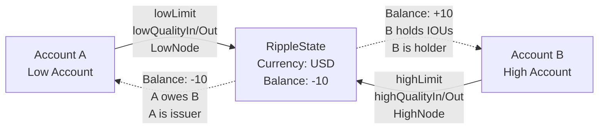

# Index

- [1. Introduction](#1-introduction)
    - [1.1. Default State](#11-default-state)
- [2. Ledger Entries](#2-ledger-entries)
    - [2.1. RippleState Ledger Entry](#21-ripplestate-ledger-entry)
        - [2.1.1. Object Identifier](#211-object-identifier)
        - [2.1.2. Fields](#212-fields)
            - [2.1.2.1. Flags](#2121-flags)
        - [2.1.3. Pseudo-accounts](#213-pseudo-accounts)
        - [2.1.4. Ownership](#214-ownership)
        - [2.1.5. Reserves](#215-reserves)
- [3. Transactions](#3-transactions)
    - [3.1. RippleState Transactions](#31-ripplestate-transactions)
        - [3.1.1. TrustSet Transaction](#311-trustset-transaction)
            - [3.1.1.1. Failure Conditions](#3111-failure-conditions)
            - [3.1.1.2. State Changes](#3112-state-changes)
        - [3.2.1. Clawback Transaction](#321-clawback-transaction)
            - [3.2.1.1. Failure Conditions](#3211-failure-conditions)
            - [3.2.1.2. State Changes](#3212-state-changes)

# 1. Introduction

Trust lines are a mechanism that enables the XRP Ledger to support user-issued [IOUs](../glossary.md#iou). They represent bilateral relationships between accounts that establish trust limits and govern the flow of value for specific IOUs.

Think of a trust line as a credit agreement: it defines how much of a particular IOU one account holds from an issuer, along with the terms of that relationship.

For example, suppose Alice is an issuer and Bob wants to hold USD issued by her. Bob would create a trust line, specifying USD as the currency code and Alice's address as the issuer. 
Alice can now send USD to Bob. 
The IOU is identified by currency code `USD` and `Alice's address`. The balance between Alice and Bob is stored on the trust line. 
If Alice sent 10 USD to Bob, her balance would be -10, while Bob's balance would be 10. Please note that `rippled` implementation may not store the balance as such, but the user will see it that way. 
Alice can keep issuing the same IOU to other parties, and her total balance would be the sum of her balance on each of the trust lines.

If Alice's account contains `RequireAuth` flag, then her trust lines have to be authorized. This means that, after Bob creates a trust line, Alice has to authorize it before Bob can receive any IOUs on that trust line. Alice authorizes the trust line by sending a TrustSet transaction with the `tfSetfAuth` flag, specifying Bob's address in the `LimitAmount.issuer` field. Alice may choose to freeze or deep freeze the trust line. She can also clawback IOUs from a trust line.

Trust lines have a concept of QualityIn and QualityOut. This is covered in [Cross Currency Payments section](../payments/README.md#42-cross-currency-payment-execution) and [trust line quality in DirectStepI](../flow/steps.md#221-quality-implementation). For the sake of manipulating `RippleState` ledger entry, it is important to know that a quality of `1,000,000,000` is the default quality (QUALITY_ONE). This represents a 1:1 transfer rate, meaning the full amount is transferred without adjustment during cross-currency payments through this trust line.

Trust line limits define the maximum amount of an IOU an account is willing to hold. The `LimitAmount` field in the `TrustSet` transaction specifies this maximum. A limit of 0 means the account will not accept any incoming IOUs on that trust line. Trust line limits are soft limits - they can be exceeded during offer crossing, as creating an offer is considered explicit consent to receive IOUs. 
See [DirectIOfferCrossingStep](../flow/steps.md#23-directioffercrossingstep-offer-crossing-specific-implementation) for implementation details.

Payments on the XRP Ledger often need to flow through intermediate accounts to reach the destination. For example, if Alice wants to pay Bob in USD and both hold trust lines to the same issuer, the payment flows through the issuer: Alice's balance on her trust line with Issuer decreases, and Bob's balance on his trust line with Issuer increases. When an account other than the issuer sits between two trust lines for the same currency, the payment can also flow through that account, entering on one trust line and exiting on another. This is called **rippling**.

The NoRipple flag (`lsfLowNoRipple` / `lsfHighNoRipple`) is a per-account, per-trust-line flag that controls whether a trust line can be used for rippling. A payment is blocked from rippling through an account only when that account has NoRipple set on **both** the trust line the payment enters on and the trust line it exits on. If the account has NoRipple cleared on at least one of the two trust lines, the payment can flow through.

An issuer who sets `DefaultRipple` (`lsfDefaultRipple`) on their account will have NoRipple cleared on their side of every new trust line. Since the issuer's side is always clear, the both-sides condition can never be met, and payments can always ripple through the issuer. A regular holder who does not set `DefaultRipple` will have NoRipple set on their side of every new trust line. If the holder has two trust lines for the same currency (e.g., USD.IssuerA and USD.IssuerB), both will have NoRipple set on the holder's side, so the both-sides condition is met and payments cannot ripple through the holder's account. This protects the holder from having their balance used as a pass-through without their consent.

NoRipple is checked during both [path finding](../path_finding/README.md) and [payment execution](../flow/steps.md#215-check-implementation). Path finding uses NoRipple as a heuristic filter to avoid exploring paths that would be rejected. The flow engine enforces it as a hard constraint, failing the strand with `terNO_RIPPLE` when violated. See [trust line creation](#3112-state-changes) for how NoRipple flags are initialized.

## 1.1. Default State

A trust line is in **default state** when both accounts have all their parameters set to default values. The default state is important because:
- Trust lines in default state are automatically deleted to reduce ledger bloat
- Default state determines whether an account must pay a reserve for its side of the trust line
- Attempting to create a trust line in default state fails with `tecNO_LINE_REDUNDANT`

**Default values for an account's side of a trust line:**

- **QualityIn**: 0 or absent (equivalent to QUALITY_ONE = 1,000,000,000)
- **QualityOut**: 0 or absent (equivalent to QUALITY_ONE = 1,000,000,000)
- **NoRipple flag**: set if the account does **not** have `lsfDefaultRipple`; cleared if it does
- **Freeze flag**: not set
- **Limit**: 0
- **Balance**: 0 or negative from the account's perspective (meaning the account owes IOUs rather than holds them) 

Both the low and high accounts must have their parameters in the default state for the trust line to be considered in the default state and eligible for deletion.

**Issuer vs Holder perspective:**

- **Issuer** (negative balance): Has limit = 0, balance <= 0. The issuer's side is typically in default state when no IOUs have been redeemed yet.
- **Holder** (positive balance): Has limit > 0, balance >= 0. The holder's side requires a non-zero limit to receive IOUs, so it's not in default state while the trust line is usable.

When a TrustSet transaction is processed and the trust line would transition to default state, the `RippleState` object is deleted, and both accounts' owner directories are updated to remove the trust line entries.

# 2. Ledger Entries



## 2.1. RippleState Ledger Entry

A single `RippleState` ledger entry represents the trust line relationship between two accounts for a specific **currency code**. `RippleState` stores two account IDs in canonical order: the first is always the account ID sorted lower (the **low account**), and the second is the account ID sorted higher (the **high account**). Please see [xrpl.org](https://xrpl.org/docs/references/protocol/ledger-data/ledger-entry-types/ripplestate#high-vs.-low-account).

**Storage vs User Perspective:**

- **What's stored**: One `RippleState` entry with a single `sfBalance` field from the low account's perspective
- **What users see**: Each account sees their own balance on the trust line, which is the inverse of their peer's balance
- **Example**: If `sfBalance = -10` (stored), low account sees `-10` and high account sees `+10`

**Issuer** is not defined by `RippleState`. The issuer is conceptually the entity that created (issued) the IOU, but nothing in `RippleState` stores that information explicitly. The issuer is determined by the balance direction: the account with a negative balance (owing IOUs) is issuing, while the account with a positive balance is holding (has
redeemed IOUs). When the balance is `0`, either party can potentially issue IOUs, limited by the other party's trust line limit. The flow engine determines the issuer contextually based on the debt direction during payment execution. See [DirectStepI debt direction](../flow/steps.md#211-revimp-implementation) for details.

The `sfBalance` field in `RippleState` is stored from the low account's perspective:

- Positive balance = Low account holds currency (owes nothing, has credit)
- Negative balance = High account holds currency (low account owes money)

### 2.1.1. Object Identifier

The key of the `RippleState` object is the result
of [SHA512-Half](https://xrpl.org/docs/references/protocol/data-types/basic-data-types#hashes) of the following values
concatenated in order:

- The `RippleState` space key `0x0072` (lowercase `r`)
- The `AccountID` of the *low* account.
- The `AccountID` of the *high* account.
- The 160-bit `Currency` code.

*Low* account is the account with a lower `ID` than the *high* account, ensuring that a trust line between any two
accounts is always represented by the same `RippleState`.

### 2.1.2. Fields

Please
see [RippleState Fields](https://xrpl.org/docs/references/protocol/ledger-data/ledger-entry-types/ripplestate#ripplestate-fields)

#### 2.1.2.1. Flags

Please
see [RippleState Flags](https://xrpl.org/docs/references/protocol/ledger-data/ledger-entry-types/ripplestate#ripplestate-flags)

### 2.1.3. Pseudo-accounts

Trust lines can be created or modified with certain pseudo-accounts as the destination:

- **AMM accounts** (has `sfAMMID`): Can create new trust lines for the AMM's LP token, or modify existing trust lines
- **Vault accounts** (has `sfVaultID`): Can only modify existing trust lines, cannot create new ones
- **Other pseudo-accounts**: Cannot create or modify trust lines (fails with `tecPSEUDO_ACCOUNT`)

The TrustSet transaction never creates, deletes, or modifies the pseudo-account itself - it only creates or modifies
the `RippleState` entry that represents the trust line relationship.

### 2.1.4. Ownership

A `RippleState` ledger entry is jointly owned by both participating accounts. When a trust line is created, it is added to the owner directory of both the low account and the high account.

The `RootIndex` of each account's owner `DirectoryNode` is the result of [SHA512-Half](https://xrpl.org/docs/references/protocol/data-types/basic-data-types#hashes) of the following values concatenated in order:

- The `OwnerDirectory` space key `0x004F` (uppercase `O`)
- The `AccountID` of the account

The `sfLowNode` and `sfHighNode` fields in the `RippleState` entry store the directory page indices where the trust line appears in each account's owner directory. These serve as deletion hints for efficient removal when the trust line is deleted.

### 2.1.5. Reserves

 An account only pays a reserve for a trust line when the account owns more than two items total. 

An account's side of a trust line requires a reserve when any of the following are in a non-default state:

- **QualityIn** is set (non-zero)
- **QualityOut** is set (non-zero)
- **NoRipple flag** differs from the account's default ripple setting
- **Freeze flag** is set
- **Limit** is non-zero
- **Balance** is positive (account holds IOUs)

When a trust line side transitions from default to non-default state, the `lsfLowReserve` or `lsfHighReserve` flag is
set and the account's `OwnerCount` is incremented. When all parameters return to default state, the reserve flag is
cleared and `OwnerCount` is decremented.

# 3. Transactions

## 3.1. RippleState Transactions

### 3.1.1. TrustSet Transaction

The `TrustSet` transaction creates, modifies or deletes a `RippleState` ledger entry and manages the corresponding `DirectoryNode` entries.

When a trust line is created or deleted, it affects the owner directories of both participating accounts. Each account maintains an owner directory that tracks all ledger objects it owns, including its trust lines. The `sfLowNode` and `sfHighNode` fields in the `RippleState` entry store the page numbers where the trust line appears in each account's owner directory

| Field Name        |     Required?     | Modifiable? | JSON Type | Internal Type | Default Value | Description                                                                                                                         |
|-------------------|:-----------------:|:-----------:|:---------:|:-------------:|:-------------:|:------------------------------------------------------------------------------------------------------------------------------------|
| `TransactionType` | :heavy_checkmark: |    `No`     | `String`  |   `UINT16`    |               | The transaction type. Must be `TrustSet`                                                                                            |
| `LimitAmount`     | :heavy_checkmark: |    `Yes`    | `Object`  |   `Amount`    |               | Object defining the currency and the peer account when manipulating a trust line                                                    |
| `QualityIn`       |                   |    `Yes`    | `Number`  |   `UINT32`    |    `None`     | Quality ratio applied when receiving IOUs on this trust line. When absent or 0, defaults to QUALITY_ONE (1,000,000,000 = 1:1 ratio) |
| `QualityOut`      |                   |    `Yes`    | `Number`  |   `UINT32`    |    `None`     | Quality ratio applied when sending IOUs on this trust line. When absent or 0, defaults to QUALITY_ONE (1,000,000,000 = 1:1 ratio)   |
| `Flags`           |                   |    `Yes`    | `String`  |   `UINT32`    |      `0`      |                                                                                                                                     |

The `LimitAmount` field specifies the maximum amount of the IOU the account is willing to hold. It is a composite field containing the currency code, the peer account, and the limit value. Setting the value to 0 means the account will not accept any incoming IOUs on that trust line.

Counterintuitively, `LimitAmount.issuer` is not always the issuer account, even in the business logic sense. For
example, if the issuer wants to authorize a trust line, they will send their account id in `account` and **holder's**
account id as the `issuer`.

For flags, please refer
to [TrustSet Flags](https://xrpl.org/docs/references/protocol/transactions/types/trustset#trustset-flags).

**Terminology in this document**

- *Source account* is the account specified as `account` in the transaction.
- *Destination account* is the account specified as `issuer` field in `LimitAmount`.

#### 3.1.1.1. Failure Conditions

**Static validation:**

- `temINVALID_FLAG`: one of the specified flags is not one of [flags](#2121-flags).
- `temINVALID_FLAG`: flags contain `tfSetDeepFreeze` or `tfClearDeepFreeze` and [DeepFreeze amendment](https://xrpl.org/resources/known-amendments#deepfreeze) is not enabled.
- `temBAD_AMOUNT`: `LimitAmount` is XRP and mantissa is bigger than `100000000000000000ull`.
- `temBAD_LIMIT`: `LimitAmount` is XRP.
- `temBAD_CURRENCY`: `currency` field in `LimitAmount` is `XRP`.
- `temBAD_LIMIT`: `value` field in `LimitAmount` is less than `0`.
- `temDST_NEEDED`: `issuer` field in `LimitAmount` is not specified or it represents a [noAccount](transactions/README.md#noAccount).

**Validation against the ledger view:**

- `terNO_ACCOUNT`: source account does not exist.
- `tefNO_AUTH_REQUIRED`: source account does not have a `lsfRequireAuth` flag set, but the transaction contains `tfSetfAuth` flag.
- `temDST_IS_SRC`: [fixTrustLinesToSelf](https://xrpl.org/resources/known-amendments#fixtrustlinestoself) amendment is enabled, or if the trust line does not already exist and the source account and destination account are the same.
- `tecNO_DST`: one of [DisallowIncoming](https://xrpl.org/resources/known-amendments#disallowincoming), [AMM](https://xrpl.org/resources/known-amendments#amm) or [SingleAssetVault](https://xrpl.org/resources/known-amendments#singleassetvault) amendments are enabled and the issuer account does not exist. 
- `tecNO_PERMISSION`: [DisallowIncoming](https://xrpl.org/resources/known-amendments#disallowincoming) is enabled and the destination account has `lsfDisallowIncomingTrustline` flag:
    - If the trust line was already created for a destination with `lsfDisallowIncomingTrustline` and amendment [fixDisallowIncomingV1](https://xrpl.org/resources/known-amendments#fixdisallowincomingv1) was enabled, do not fail.
- If the destination account is a pseudo-account:
    - `sfAMMID`: destination is an AMM account (has `sfAMMID` field), but the trust line does not already exist between source and AMM.
            - `tecAMM_EMPTY`: AMM has zero LP IOUs - cannot create trust lines to empty AMMs.
            - `tecNO_PERMISSION`: currency in the trust line request does not match the AMM's LP token currency.
            - `tecINTERNAL`: AMM ledger entry cannot be found.
    - `tecNO_PERMISSION`: destination is a Vault account (has `sfVaultID` field) and the trust line does not already exist.
    - `tecPSEUDO_ACCOUNT`: destination is any other type of pseudo-account.
- If [DeepFreeze](https://xrpl.org/resources/known-amendments#deepfreeze) amendment is enabled, validate freeze flag combinations:
    - `tecNO_PERMISSION`: source account has `lsfNoFreeze` flag set and the transaction contains `tfSetFreeze` or `tfSetDeepFreeze`
      flags.
    - `tecNO_PERMISSION`: transaction contains both freeze flags (`tfSetFreeze` or `tfSetDeepFreeze`) and unfreeze flags (
      `tfClearFreeze` or `tfClearDeepFreeze`) - user should not be able to send
      conflicting `set` and `clear` flags in the same instructions.
    - `tecNO_PERMISSION`: transaction results in a trust line having a deep freeze set but a normal freeze cleared - user should not be able to deep freeze a trust line that is not in frozen state.

**Validation during doApply:**

- `tefINTERNAL`: source account does not exist.
- `tecNO_DST`: destination account does not exist.
- `tecNO_PERMISSION`: the user is trying to set `tfSetNoRipple` and the source account's balance on the trust line is negative.
- `tecINSUF_RESERVE_LINE`: user does not have enough balance to cover the reserve and wants to modify an existing trust line, regardless
  of whether they or the counterparty have created the original trust line.
- `tecNO_LINE_INSUF_RESERVE`: user does not have enough balance to cover the reserve and wants to create a new trust line. 
- `tecNO_LINE_REDUNDANT`: trust line does not already exist, amount is `0`, and `QualityIn` and `QualityOut` are either not set, or set to their default value (`1,000,000,000`), and if `tfSetfAuth` flag is not set.

#### 3.1.1.2. State Changes

- `RippleState` object is **deleted** if an existing trust line exists when sending `TrustSet` transaction and:
    - If [fixTrustLinesToSelf](https://xrpl.org/resources/known-amendments#fixtrustlinestoself) is **not** enabled and source and destination accounts are the same (legacy cleanup for two historical self-referential trust lines).
    - If the trust line is in its [default state](#11-default-state) after updating it.
    - If the currency code of the IOU is `XRP`.
    - When deleted, the trust line is removed from both accounts' owner directories:
      - Removed from low account's owner directory via `dirRemove` using the `sfLowNode` page number.
      - Removed from high account's owner directory via `dirRemove` using the `sfHighNode` page number.
      - If removing the trust line empties a non-root directory page, that page is deleted and the directory chain is repaired.
      - If either removal fails, the transaction returns `tefBAD_LEDGER`.
 

- `RippleState` object is **modified**:
    - If `QualityIn` field was specified in the transaction:
        - If `QualityIn` != `1,000,000,000`, set the appropriate quality field (`sfLowQualityIn` for low source account,
          `sfHighQualityIn` for high source account) to the `QualityIn` value
        - If `QualityIn` = `1,000,000,000`, clear the appropriate quality field (`sfLowQualityIn` for low source
          account, `sfHighQualityIn` for high source account)
    - If `QualityOut` field was specified in the transaction:
        - If `QualityOut` != `1,000,000,000`, set the appropriate quality field (`sfLowQualityOut` for low source
          account, `sfHighQualityOut` for high source account) to the `QualityOut` value
        - If `QualityOut` = `1,000,000,000`, clear the appropriate quality field (`sfLowQualityOut` for low source
          account, `sfHighQualityOut` for high source account)
    - If the transaction contains `tfSetNoRipple` flag and not `tfClearNoRipple` flag:
        - If the source account's balance on the trust line is non-negative, set the appropriate NoRipple flag (
          `lsfLowNoRipple` for low account, `lsfHighNoRipple` for high account)
        - If the transaction contains `tfClearNoRipple` flag and not `tfSetNoRipple` flag, clear the appropriate
          NoRipple flag (`lsfLowNoRipple` for low account, `lsfHighNoRipple` for high account)
    - If the transaction contains `tfSetfAuth` flag set `lsfLowAuth` for low source account and `lsfHighAuth` for high
      source account.
    - Note: if, after applying the above modifications, the trust line is in its [default state](#11-default-state), it is deleted rather than kept as modified (see deletion conditions above)[^modify-then-delete].
    - If account's parameters in a trust line change to non-default values such that it requires reserve but did not
      before:
        - Set appropriate `lsfLowReserve` or `lsfHighReserve` flag
    - If account no longer requires reserve because its values in a trust line are now default values:
        - Clear appropriate `lsfLowReserve` or `lsfHighReserve` flag
    - If flags are provided, they will modify the currently stored flags value.


- `RippleState` object is **created**:
    - If an existing trust line for the same IOU does not exist between the two accounts.
    - When created, the trust line is added to both accounts' owner directories:
      - Added to low account's owner directory via `dirInsert`. The page number is stored in `sfLowNode`.
      - Added to high account's owner directory via `dirInsert`. The page number is stored in `sfHighNode`.
      - If either directory is full, the transaction fails with `tecDIR_FULL`.
    - NoRipple flags are initialized on both sides of the trust line[^trustcreate-noripple]:
      - The source account's NoRipple flag (`lsfLowNoRipple` or `lsfHighNoRipple`) is set if the TrustSet transaction contains `tfSetNoRipple` and not `tfClearNoRipple`[^trustcreate-noripple-src].
      - The destination account's NoRipple flag is set if the destination account does **not** have `lsfDefaultRipple` on their account[^trustcreate-noripple-dst]. `lsfDefaultRipple` is an account-level flag set via AccountSet (`asfDefaultRipple`). When an issuer sets `lsfDefaultRipple`, new trust lines are created without NoRipple on the issuer's side, allowing rippling by default.

[^modify-then-delete]: Default state check and deletion after modification: [`SetTrust.cpp`](https://github.com/gregtatcam/rippled/blob/a72c3438eb0591a76ac829305fcbcd0ed3b8c325/src/xrpld/app/tx/detail/SetTrust.cpp#L655-L661)
[^trustcreate-noripple]: NoRipple initialization in trustCreate: [`View.cpp`](https://github.com/gregtatcam/rippled/blob/a72c3438eb0591a76ac829305fcbcd0ed3b8c325/src/libxrpl/ledger/View.cpp#L1492-L1509)
[^trustcreate-noripple-src]: Source account NoRipple from transaction flags: [`View.cpp`](https://github.com/gregtatcam/rippled/blob/a72c3438eb0591a76ac829305fcbcd0ed3b8c325/src/libxrpl/ledger/View.cpp#L1492-L1495)
[^trustcreate-noripple-dst]: Destination account NoRipple from lsfDefaultRipple: [`View.cpp`](https://github.com/gregtatcam/rippled/blob/a72c3438eb0591a76ac829305fcbcd0ed3b8c325/src/libxrpl/ledger/View.cpp#L1505-L1509)


- `DirectoryNode` object is **created or modified**:
    - When a trust line is created, it is added to both participating accounts' owner directories.
    - If an owner directory page is full (32 entries), a new page is created and linked to the directory chain.
    - If creating a new page would exceed 262,144 pages, the transaction fails with `tecDIR_FULL`.


- `AccountRoot` object is **modified**:
    - If account now requires reserve but did not before:
        - Increment `sfOwnerCount` by 1, without overflowing ```std::uint32_t```.
    - If account no longer requires reserve:
        - Decrement `sfOwnerCount` by 1, without going below `0`.

### 3.2.1. Clawback Transaction

**Design note** - in `rippled`, the same transactor implementation of `Clawback` is used to clawback
both [IOUs](../glossary.md#iou) and [MPTs](../glossary.md#mpt). `rippled`'s `Clawback` implementation of
`Transactor` uses an adaptation of a visitor pattern. Any transaction containing an MPT in `Amount` field will visit
`MPTIssue` implementation, while transactions referring to IOUs in `Amount` field will visit `Issue` implementation.
This allows for the code to be sufficiently separated that even when describing `rippled` implementation of Clawback we
can discuss two implementations separately.

Transaction fields are described in [Clawback Fields](https://xrpl.org/docs/references/protocol/transactions/types/clawback#clawback-fields).

**Terminology in this document**

- *Issuer* is the account specified as `account` in the transaction.
- *Holder* is the account specified, counterintuitively, as `issuer` field in `Amount`. This is a commonly used
  pattern to use `issuer` to denote a peer's account.

#### 3.2.1.1. Failure Conditions

Static validation

- `temINVALID_FLAG`: any flags, other than universal transaction flags, are specified.
- `temMALFORMED`:
  - For IOU clawback: user provided `Holder` field in the transaction (IOUs use `Amount.issuer` to specify the holder).
  - For MPT clawback: user did NOT provide `Holder` field in the transaction (MPTs require the `Holder` field).
- `temBAD_AMOUNT`: 
  - issuer and holder are the same account.
  - `Amount` provided is XRP.
  - `Amount` is not bigger than `0`.

Validation against the ledger view

- `terNO_ACCOUNT`: issuer's or holder's account does not exist.
- `tecAMM_ACCOUNT`: If holder's account is an AMM account, such as a SingleAssetVault or AMM account and if
  amendment [SingleAssetVault](https://xrpl.org/resources/known-amendments#singleassetvault) is not enabled.
- `tecPSEUDO_ACCOUNT`: If `SingleAssetVault` is enabled and holder's account is any pseudo-account.
- `tecNO_PERMISSION`: issuer does not have `lsfAllowTrustLineClawback` or it does have `lsfNoFreeze`. Only
  trust lines of issuers that can be frozen and that allow trust line clawback can be clawed back.
- `tecNO_LINE`: there is no existing trust line between issuer and holder for the specified currency.
- `tecNO_PERMISSION`: the account specified as `account` (issuer) is not actually the issuer based on the trust line
  balance. The true issuer is the account with the negative balance (owing IOUs), not the positive balance (holding
  IOUs). This error occurs when the transaction sender has the accounts reversed.
- `tecINSUFFICIENT_FUNDS`: holder's balance is `0`.


#### 3.2.1.2. State Changes

- `RippleState` object is **modified**:
    - Amount specified in `Amount` field is transferred from holder to issuer on the trust line for specified currency
      code. This is done by subtracting the amount from holder's account and adding it to issuer's account. No limits or
      fees are enforced.
        - If the `amount` is bigger than the available balance, only the available balance is moved.
    - If account no longer requires reserve because its values in a trust line are now default values after the
      transfer:
        - Clear appropriate `lsfLowReserve` or `lsfHighReserve` flag
        - Adjust owner count for the account


- `RippleState` object is **deleted**:
    - If, after clawing back, the trust line is in its default state, `RippleState` is deleted.
    - When deleted, the trust line is removed from both accounts' owner directories:
      - Removed from low account's owner directory via `dirRemove` using the `sfLowNode` page number.
      - Removed from high account's owner directory via `dirRemove` using the `sfHighNode` page number.
      - If removing the trust line empties a non-root directory page, that page is deleted and the directory chain is repaired.


- `AccountRoot` object is **modified** (when `RippleState` is deleted):
    - If `lsfLowReserve` flag was set on the deleted trust line: decrement low account's `sfOwnerCount` by 1
    - If `lsfHighReserve` flag was set on the deleted trust line: decrement high account's `sfOwnerCount` by 1
    - Note: Due to the "first two items are free" policy (see [Reserves](#215-reserves)), an account may not have
      a reserve flag set even though the trust line exists, so OwnerCount may not be decremented for both accounts.
